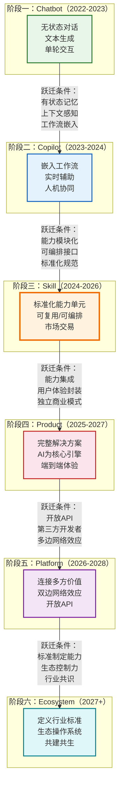
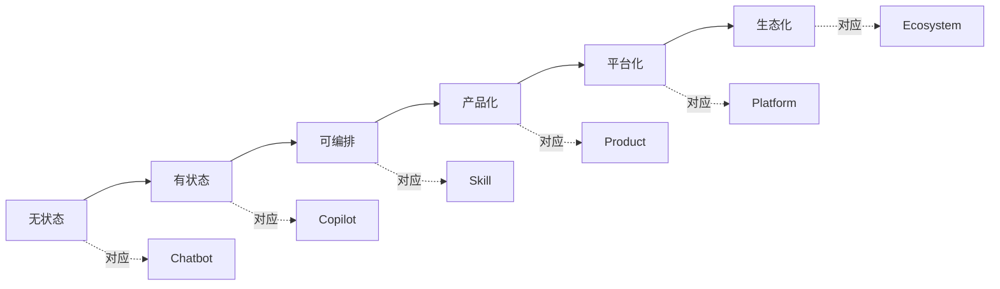
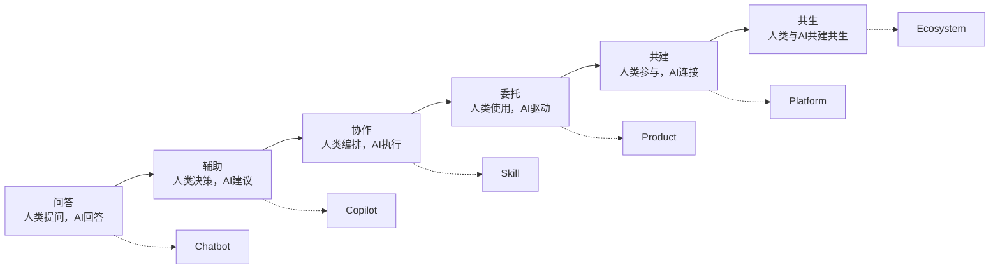
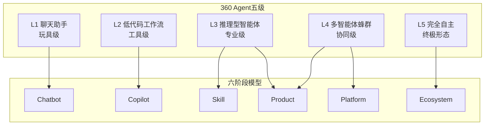
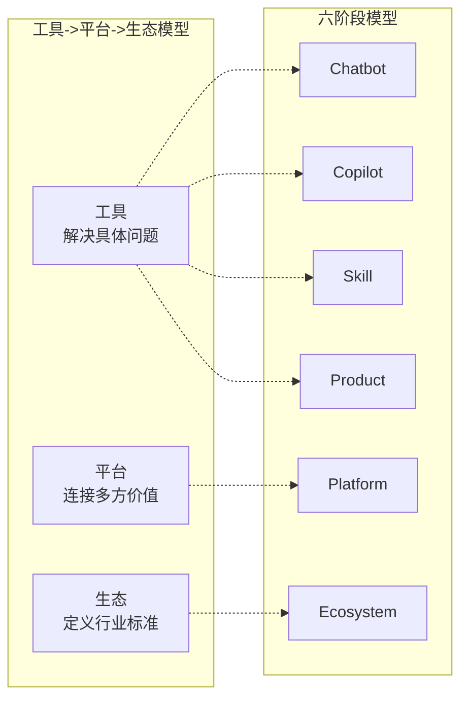

# 全貌：AI应用发展的六阶段统一模型

> [!abstract] 核心观点
> 2026年的AI行业已经涌现出多个发展阶段框架，但它们各自为政，缺乏一个覆盖"从个体使用到产业生态"的完整视角。本文提出一个统一的六阶段模型：**Chatbot -> Copilot -> Skill -> Product -> Platform -> Ecosystem**，综合了Microsoft成熟度模型、360周鸿祎Agent五级、阿里云Agent-Native、工具->平台->生态、Sam Altman三阶段等多个权威框架，并标注了每个阶段与已有知识的对应关系。

---

## 一、为什么需要一个统一的阶段模型？

### 1.1 现有框架的局限性

当前AI行业存在多个发展阶段框架，但每个框架都有其视角盲区：

| 框架 | 优势 | 盲区 |
|---|---|---|
| **360周鸿祎 Agent五级**（L1-L5） | 从技术能力角度清晰定义智能体的自主程度 | 缺乏产业维度，没有涉及Platform和Ecosystem |
| **Microsoft 成熟度模型**（L100-L500） | 从企业采用角度覆盖战略、治理、技术、文化 | 以组织视角为主，缺乏对市场层面的阶段划分 |
| **工具->平台->生态 三阶段** | 从产品战略角度清晰定义演进路径 | 忽略了Chatbot、Copilot、Skill等前置阶段 |
| **Sam Altman 三阶段** | 从宏观视角划分AI发展大周期 | 粒度太粗，不适用于产品层面的阶段判断 |
| **阿里云Agent-Native** | 从云基础设施角度定义Agent的落地形态 | 侧重基础设施层，不覆盖应用层的完整演进 |

> [!warning] 核心问题
> 这些框架各自回答了"AI发展到什么阶段"这个问题的不同侧面，但**没有一个框架能同时回答**：
> 1. 一个AI产品从0到1再到N的完整路径是什么？
> 2. 技术能力和商业形态是如何协同演进的？
> 3. 人机关系在每个阶段发生了怎样的质变？

### 1.2 统一模型的设计原则

本六阶段模型的设计遵循以下原则：

1. **完整性**：覆盖从"个体使用AI"到"产业生态共建"的全过程
2. **可追溯性**：每个阶段标注与其他框架的对应关系
3. **实战导向**：每个阶段包含跃迁条件、核心矛盾、典型产品
4. **双重维度**：同时从技术层和人机关系层两个维度分析每个阶段

---

## 二、六阶段模型全景定义

### 2.1 阶段定义总表

| 阶段 | 名称 | 核心特征 | AI角色 | 人类角色 | 典型产品 | 时间窗口 |
|---|---|---|---|---|---|---|
| 1 | **Chatbot** | 无状态对话 | 被动回答者 | 提问者 | ChatGPT早期、文心一言、通义千问、豆包 | 2022-2023 |
| 2 | **Copilot** | 嵌入工作流辅助 | 实时建议者 | 决策执行者 | GitHub Copilot、Microsoft 365 Copilot、Cursor早期 | 2023-2024 |
| 3 | **Skill** | 标准化能力单元 | 可复用能力模块 | 能力编排者 | SkillHub、扣子Bot、Dify插件、MCP Server | 2024-2026 |
| 4 | **Product** | 完整解决方案 | 产品核心引擎 | 产品使用者 | Cursor、Perplexity、Gamma、Notion AI | 2025-2027 |
| 5 | **Platform** | 连接多方价值 | 平台基础设施 | 平台参与者 | Poe、扣子平台、Dify、阿里云Agent Native Cloud | 2026-2028 |
| 6 | **Ecosystem** | 定义行业标准 | 生态操作系统 | 生态共建者 | OpenAI生态、腾讯元宝生态、飞书AI生态 | 2027+ |

### 2.2 六阶段全景图



> [!note] 当前阶段定位（2026年7月）
> 行业整体处于 **Skill阶段向Product阶段的过渡期**，头部企业已进入Platform阶段布局。Chatbot作为独立赛道已见顶，正从"终点"变为"起点"——成为更高级AI应用的基础能力层。

---

## 三、两层映射：技术层与人机关系层

### 3.1 技术层演进



| 技术层 | 阶段 | 关键技术特征 |
|---|---|---|
| 无状态 | Chatbot | 单次请求-响应，无记忆，无上下文持久化 |
| 有状态 | Copilot | 会话记忆，上下文感知，可嵌入宿主应用 |
| 可编排 | Skill | 标准化接口（MCP协议），可被Agent调度，可组合成工作流 |
| 产品化 | Product | 完整的用户体验封装，AI能力与产品功能深度融合 |
| 平台化 | Platform | 开放API，多租户架构，开发者工具链，市场机制 |
| 生态化 | Ecosystem | 标准协议体系，跨平台互操作，生态治理机制 |

### 3.2 人机关系层演进



> [!important] 关键洞察
> 人机关系的演进不是简单的"AI替代人类"，而是**决策权和控制权的渐进转移**。从Chatbot到Ecosystem，AI从"被动的信息提供者"逐步演变为"主动的价值创造者"，而人类的角色从"直接执行者"逐步演变为"目标设定者和生态治理者"。

### 3.3 双重映射全景

| 阶段 | 技术层 | 人机关系层 | 核心矛盾 |
|---|---|---|---|
| Chatbot | 无状态 | 问答 | 信息丰富度 vs 执行能力缺失 |
| Copilot | 有状态 | 辅助 | 建议质量 vs 决策自主权 |
| Skill | 可编排 | 协作 | 标准化程度 vs 灵活性需求 |
| Product | 产品化 | 委托 | 产品完整性 vs 用户控制感 |
| Platform | 平台化 | 共建 | 开放程度 vs 质量控制 |
| Ecosystem | 生态化 | 共生 | 生态控制力 vs 创新自由度 |

---

## 四、每个阶段的核心矛盾

### 阶段一 Chatbot：信息丰富度 vs 执行能力缺失

> [!info] 核心矛盾
> Chatbot能生成高质量的信息和建议，但无法执行任何实际操作。用户得到的是"知道怎么做"，而不是"事情被做成了"。这种"认知-执行鸿沟"是Chatbot阶段最根本的局限。

2026年的数据证实了这一矛盾：Chatbot赛道Top 20中9个产品Web访问量出现下滑，ChatGPT环比下降3.84%。用户已不满足于"知道答案"，而需要"拿到结果"。

### 阶段二 Copilot：建议质量 vs 决策自主权

> [!info] 核心矛盾
> Copilot能提供实时建议，但人类仍然是最终决策者。当AI的建议质量足够高时，人类的"确认"环节变成了一种效率瓶颈——用户开始质疑：如果AI的建议总是对的，我为什么还要点"确认"？

这一矛盾直接推动了从Copilot到Skill/Agent的跃迁：让AI从"建议者"变为"执行者"。

### 阶段三 Skill：标准化程度 vs 灵活性需求

> [!info] 核心矛盾
> Skill的标准化带来了可复用性和可编排性，但也带来了灵活性损失。标准化的输入/输出接口可能无法覆盖所有边缘场景，而过于灵活又会导致Skill之间的兼容性问题。

这是Skill生态建设中最核心的张力：如何在不牺牲标准化的前提下保持足够的灵活性？

### 阶段四 Product：产品完整性 vs 用户控制感

> [!info] 核心矛盾
> AI-Native产品将AI作为核心引擎，提供端到端的完整体验。但用户可能感到"AI在替我思考"，失去对过程的控制感。如何在产品完整性和用户控制感之间找到平衡，是Product阶段的核心设计挑战。

### 阶段五 Platform：开放程度 vs 质量控制

> [!info] 核心矛盾
> 平台需要开放API吸引第三方开发者，但开放意味着质量参差不齐。如何在开放生态和内容/服务质量控制之间平衡，是Platform阶段的核心治理挑战。

### 阶段六 Ecosystem：生态控制力 vs 创新自由度

> [!info] 核心矛盾
> Ecosystem的定义者需要维持生态的控制力（标准制定权），但过强的控制会抑制创新。如何让生态既保持秩序又充满活力，是Ecosystem阶段的终极挑战。

---

## 五、与行业框架的深度对照

### 5.1 360周鸿祎 Agent五级 对照



> [!note] 对照说明
> 360的五级分类从**技术自主性**角度出发，六阶段模型从**产业演进**角度出发。两者的核心差异在于：360的L1-L5侧重于"AI能做什么"的技术能力，而六阶段模型侧重于"产品/产业处于什么形态"的商业阶段。六阶段模型中的Platform和Ecosystem（阶段五和六）在360的分类中缺乏直接对应，因为360的框架主要关注Agent本身的能力，而非产业生态的构建。

### 5.2 Microsoft 成熟度模型 对照

Microsoft的Agentic AI Adoption Maturity Model从**企业采用**角度定义了五个级别（L100-L500），与六阶段模型的对比如下：

| Microsoft级别 | 六阶段对应 | 说明 |
|---|---|---|
| L100 初始 | Chatbot | 实验性、无系统规划的AI使用 |
| L200 可重复 | Copilot | 出现早期模式，但策略仍非正式 |
| L300 定义 | Skill | 正式文档化的治理和标准，与业务目标对齐 |
| L400 胜任 | Product | AI嵌入企业规划，跨团队协作 |
| L500 高效 | Platform/Ecosystem | AI优先文化，持续优化，自我改进 |

### 5.3 工具->平台->生态 三阶段 对照



> [!note] 对照说明
> 工具->平台->生态三阶段模型在"工具"阶段覆盖了六阶段模型中的Chatbot、Copilot、Skill、Product四个阶段。这恰好说明为什么六阶段模型更有价值——它将"工具"这个过于宽泛的范畴细分为四个具有质变特征的子阶段，使得产品战略判断更加精准。

---

## 六、模型的核心价值

### 6.1 解决"阶段判断"难题

> [!tip] 实战价值
> 创业者最常问的问题之一是："我的产品处于什么阶段？下一步应该做什么？"六阶段模型提供了清晰的判断框架和跃迁路径，使战略决策有据可依。

### 6.2 识别"跃迁窗口"

每个阶段到下一个阶段的跃迁都有其特定的触发条件。识别这些条件，就能够在正确的时机抓住跃迁窗口。例如：

- **2024-2025**：从Copilot到Skill的跃迁窗口（MCP协议标准化、SkillHub/SkillPay上线）
- **2026-2027**：从Skill到Product的跃迁窗口（496,626个Skill/Agent为产品集成提供了丰富的素材）
- **2026-2028**：从Product到Platform的跃迁窗口（阿里云Agent Native Cloud、腾讯WorkBuddy等平台的崛起）

### 6.3 避免"阶段错位"

> [!warning] 常见陷阱
> 在Chatbot阶段就试图做Platform（过早平台化），或在Skill阶段就试图做Ecosystem（过早生态化），是AI创业中最常见的战略错误。六阶段模型帮助创业者在正确的时间做正确的卡位。

---

## 七、2026年的特殊意义

2026年是AI应用发展史上的一个特殊节点：

1. **Chatbot见顶，Agent崛起**：从"对话"到"执行"的范式迁移正式完成，AI正在走出对话框 [$TRAE_REF](https://36kr.com/p/3866759935572612)

2. **Skill生态爆发**：Skillful.sh追踪的496,626个工具构成一个庞大的能力市场，为Product阶段的到来奠定了供给基础 [$TRAE_REF](https://skillful.sh/ecosystem-report)

3. **企业级Agent规模化落地**：Gartner预测40%的企业应用将集成AI Agent，阿里云Agent Native Cloud、腾讯WorkBuddy等平台级产品相继发布 [$TRAE_REF](https://www.alibabacloud.com/blog/alibaba-cloud-unveils-agent-native-innovations-at-waic-2026_603377)

4. **Skill商业化闭环形成**：腾讯SkillHub正式上线SkillPay支付体系，Skill从"免费分享"进入"付费交易"阶段 [$TRAE_REF](https://www.time-weekly.com/wap-article/331153)

这些信号共同指向一个结论：**2026年是AI应用从"能力建设"转向"价值交付"的关键转折年**。

---

## 八、如何使用本模型

### 8.1 产品定位

使用六阶段模型判断你的产品当前所处的阶段，明确下一步的跃迁方向。详见 [[02-AI趋势与素养/AI应用发展阶段演进/00_MOC_AI应用发展阶段演进中枢]] 中的自测清单。

### 8.2 战略规划

使用模型的跃迁条件判断你的产品是否具备向下一阶段跃迁的条件。详见 [[02-AI趋势与素养/AI应用发展阶段演进/07_跃迁动力学：阶段之间的关键跨越条件]]。

### 8.3 投资判断

使用模型判断不同赛道的投资机会。Chatbot赛道已不值得投资，Skill和Product阶段是当前最大机会窗口。详见 [[02-AI趋势与素养/AI应用发展阶段演进/09_实践指南：你的AI应用处于哪个阶段，下一步怎么走？]]。

### 8.4 技术架构

使用技术层演进路径（无状态->有状态->可编排->产品化->平台化->生态化）指导技术架构设计。详见 [[02-AI趋势与素养/AI应用发展阶段演进/08_人机关系的六次跃迁：从问答到共生]]。

---

## 九、相关文档

- [[02-AI趋势与素养/AI应用发展阶段演进/00_MOC_AI应用发展阶段演进中枢]] —— 知识库导航
- [[02-AI趋势与素养/AI应用发展阶段演进/02_阶段一二：Chatbot与Copilot——AI的嘴和手]] —— 阶段一和阶段二详解
- [[02-AI趋势与素养/AI应用发展阶段演进/03_阶段三：AI Skill——从能力到能力单元的标准化]] —— 阶段三详解
- [[02-AI趋势与素养/AI应用发展阶段演进/04_阶段四：AI Product——从功能到解决方案]] —— 阶段四详解
- [[02-AI趋势与素养/AI应用发展阶段演进/05_阶段五：Platform——连接多方价值的操作系统]] —— 阶段五详解
- [[02-AI趋势与素养/AI应用发展阶段演进/06_阶段六：Ecosystem——定义行业标准的基础设施]] —— 阶段六详解
- [[02-AI趋势与素养/AI应用发展阶段演进/07_跃迁动力学：阶段之间的关键跨越条件]] —— 跃迁条件详解
- [[02-AI趋势与素养/AI应用发展阶段演进/08_人机关系的六次跃迁：从问答到共生]] —— 两层映射深度分析
- [[02-AI趋势与素养/AI应用发展阶段演进/09_实践指南：你的AI应用处于哪个阶段，下一步怎么走？]] —— 投资机会分析

---

## 十、模型的边界与局限

### 10.1 模型适用的前提假设

> [!warning] 前提假设
> 本六阶段模型基于以下前提假设，在实际应用中需要注意：
> 1. **渐进演进假设**：模型假设AI应用按照六个阶段逐级演进。但实际上，某些产品可能跳过某些阶段（如直接从Skill跳到Platform），或同时处于多个阶段。
> 2. **技术驱动假设**：模型主要从技术能力和产品形态角度划分阶段，对政策法规、社会接受度等外部因素的考虑有限。
> 3. **通用性假设**：模型试图覆盖所有AI应用类型，但不同垂直领域（如医疗、金融、教育）的演进路径可能有所不同。
> 4. **时间窗口假设**：各阶段的时间窗口是基于2022-2026年的观察，未来可能因技术突破而加速或改变。

### 10.2 模型不适用的情况

| 场景 | 说明 |
|---|---|
| 非AI-Native产品 | 传统软件加AI功能的产品，可能不遵循此演进路径 |
| 纯硬件/嵌入式AI | 具身智能、IoT设备等"物理AI"有其独特的演进路径 |
| 科研/学术AI | 以研究为目的的AI系统，不以产品化为目标 |
| 开源社区项目 | 开源项目的演进逻辑与商业产品不同 |

### 10.3 未来可能的修正方向

1. **第七阶段的可能性**：当Ecosystem阶段成熟后，可能出现"AI Infrastructure"（基础设施层）或"AI Governance"（治理层）等新阶段
2. **阶段融合**：随着技术进步，Skill和Product阶段可能融合为"AI-Native Application"阶段
3. **去中心化生态**：Web3/区块链与AI的结合可能催生去中心化的AI生态，对Ecosystem阶段的定义提出挑战

---

## 十一、案例深度分析：三条典型的演进路径

### 11.1 OpenAI：从Chatbot到Ecosystem的完整路径

```
2022.11 - ChatGPT发布（Chatbot阶段）
2023.03 - GPT-4 + API发布（向Copilot/Skill过渡）
2023.11 - GPTs + GPT Store（向Platform过渡）
2024.05 - GPT-4o多模态（Product能力增强）
2025-2026 - Codex Agent + 生态扩展（向Ecosystem迈进）
```

OpenAI是唯一一个基本走完六阶段全路径的公司，其经验表明：**每个阶段的跃迁都需要提前布局**。GPTs的发布看似是Platform尝试，实则是为Ecosystem阶段积累开发者和生态数据。

### 11.2 Anthropic：深耕Copilot/Skill的战略选择

```
2023.03 - Claude发布（Chatbot阶段）
2024.03 - Claude 3 + Tool Use（向Skill阶段跃进）
2024.11 - MCP协议发布（Skill标准化基础设施）
2025-2026 - Claude Code + Agent View（Product/Platform并行）
```

Anthropic选择了不同于OpenAI的路径：**不急于做Platform，而是深耕Skill基础设施**。MCP协议的发布是整个Skill生态的里程碑事件，体现了"先做基础设施，再做上层应用"的战略思维。

### 11.3 Cursor：从Copilot到Product的垂直深耕

```
2023 - Cursor发布（Copilot阶段）
2024 - AI-First IDE重构（Product阶段）
2025 - Agent模式 + 插件系统（向Platform过渡）
2026 - 多Agent并行管理（Platform深化）
```

Cursor展示了在垂直领域深耕的第三条路径：从编程Copilot到AI编程Product，再到编程场景Platform。它证明了**不一定要做"大平台"，在垂直场景做"小平台"同样有价值**。

---

> [!quote] 总结
> AI应用的发展不是线性的技术升级，而是**人机关系、商业形态、产业结构的协同进化**。六阶段模型的价值不在于精确预测未来，而在于提供一个结构化的思考框架，帮助我们在混沌中找到秩序，在变化中识别不变。