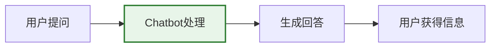
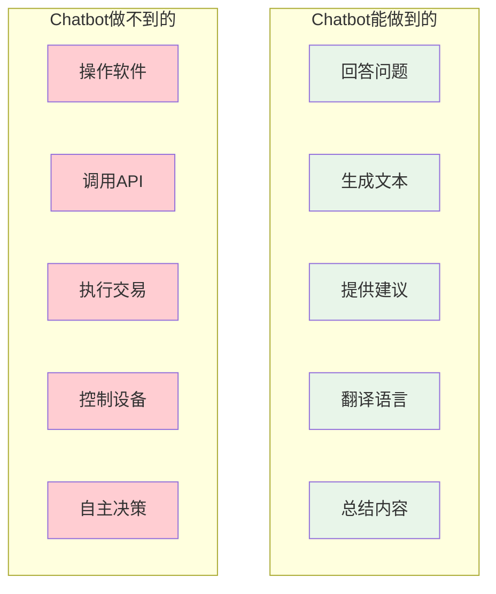
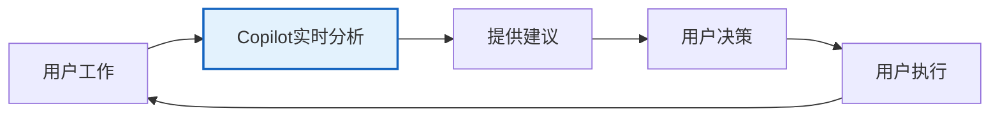
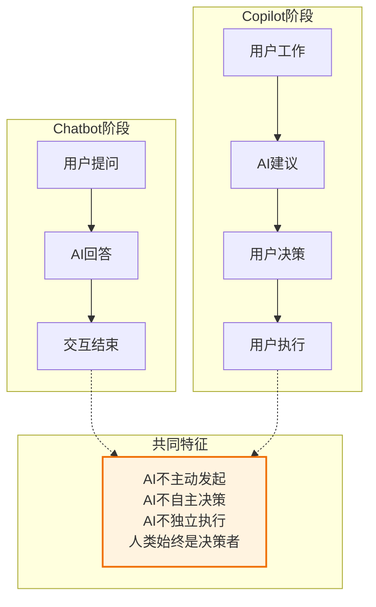
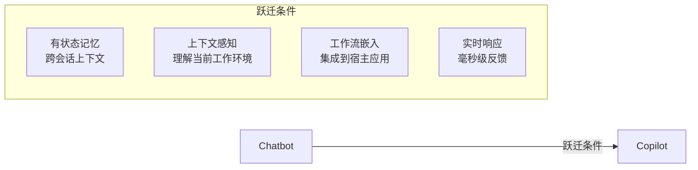
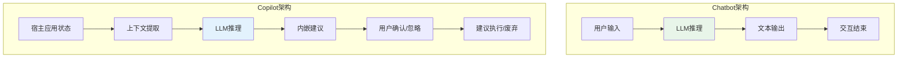

# 阶段一二：Chatbot与Copilot——AI的"嘴"和"手"

> [!abstract] 核心观点
> Chatbot和Copilot是AI应用发展的前两个阶段，它们共同的特点是**AI始终是被动响应者**，人类始终是决策者。Chatbot给了AI一张"嘴"（能说），Copilot给了AI一只"手"（能辅助做），但AI还没有获得"自主行动"的能力。2026年，Chatbot作为独立赛道已见顶，正从"终点"变为"起点"——成为更高级AI应用的基础能力层。

---

## 一、Chatbot阶段（2022-2023）：AI的"嘴"

### 1.1 核心特征

Chatbot是AI应用的最初始形态，其核心特征是**无状态、单轮交互、文本生成**。

> [!info] Chatbot的核心特征
> - **无状态**：每次交互都是独立的，AI不记忆之前的对话上下文（或仅在同一会话内记忆）
> - **单轮交互**：用户提问 -> AI回答 -> 交互结束
> - **文本生成**：核心能力是理解和生成文本，不能执行任何实际操作
> - **被动响应**：AI不会主动发起交互，完全依赖用户输入

### 1.2 代表性产品

| 产品 | 地区 | 发布时间 | 核心特点 |
|---|---|---|---|
| ChatGPT | 全球 | 2022年11月 | 首个现象级Chatbot，2个月破1亿用户 |
| Claude | 全球 | 2023年3月 | 安全对齐、长上下文 |
| 文心一言 | 中国 | 2023年3月 | 百度出品，中文理解能力强 |
| 通义千问 | 中国 | 2023年4月 | 阿里出品，多模态能力 |
| 豆包 | 中国 | 2023年8月 | 字节出品，C端体验优秀 |
| Kimi | 中国 | 2023年10月 | 月之暗面出品，超长上下文 |
| DeepSeek | 中国 | 2024年1月 | 开源模型，性能比肩GPT-4 |

### 1.3 能力边界：只能"说"，不能"做"

> [!warning] Chatbot的根本局限
> Chatbot能生成高质量的信息和建议，但存在一个根本性的"执行鸿沟"——用户得到的永远是"知道怎么做"，而不是"事情被做成了"。

### 1.4 2026年现状：Chatbot增长见顶

2026年，Chatbot赛道的增长已逼近天花板：

> [!important] 关键数据
> - 2026年4月，Chatbot Top 20中**9个产品**Web访问量出现下滑
> - ChatGPT仍以5.69亿月访问量保持领先，但环比下降**3.84%**
> - Gemini、DeepSeek、豆包等头部产品增速放缓至个位数
> - 而Claude（向Agent转型）访问量逆势增长**34.18%**
> - 数据来源：AI产品榜 2026年4月 [$TRAE_REF](https://36kr.com/p/3866759935572612)

### 1.5 投资逻辑的转变

> [!note] 资本市场转向
> 2023-2024年间，红杉、a16z、阿里、腾讯等VC/CVC争相涌入对话式AI。到了2026年，国际顶尖投资机构已基本停止以"对话"为核心的新增投资，转而投向Agent赛道：
> - a16z持续多轮押注编程Agent Cursor
> - 红杉、Tiger Global投资智能客服Agent Sierra
> - Coatue、Index Ventures投资企业客服Agent Decagon
> - Y Combinator W26批次约200家创业公司中，大量项目明确将重心放在Agent上 [$TRAE_REF](https://36kr.com/p/3866759935572612)

### 1.6 从"终点"变"起点"

Chatbot正在经历一个根本性的定位转变：

> [!tip] 范式转变
> **过去**：Chatbot是AI应用的终点——用户通过对话获取信息，交互结束。
> **现在**：Chatbot成为AI应用的起点——对话只是用户表达意图的方式，真正的价值在于后续的自动执行。

这意味着Chatbot越来越成为**平台生态中的基础能力**，而非独立的创业赛道。纯Chatbot形态的产品在2026年已几乎没有新的投资机会，但Chatbot作为"对话界面层"仍然是所有AI产品的必备能力。

---

## 二、Copilot阶段（2023-2024）：AI的"手"

### 2.1 核心特征

Copilot是AI应用发展的第二阶段，其核心特征是**嵌入工作流、实时辅助、人机协同**。

> [!info] Copilot的核心特征
> - **嵌入工作流**：AI不再是独立的对话界面，而是嵌入到用户已有的工作流程中
> - **实时辅助**：AI能基于当前上下文，在用户工作的同时提供实时建议
> - **人机协同**：AI提供建议，人类做决策和执行——"你说我写"变成"你写我帮"
> - **上下文感知**：AI能理解当前工作环境（代码编辑器、文档、设计软件等）

### 2.2 代表性产品

| 产品 | 领域 | 发布时间 | 核心特点 |
|---|---|---|---|
| GitHub Copilot | 编程 | 2021年6月 | 代码补全，首个现象级Copilot |
| Microsoft 365 Copilot | 办公 | 2023年3月 | Word/Excel/PPT/Teams全场景AI辅助 |
| Cursor（早期） | 编程 | 2023年 | AI-first IDE，比GitHub Copilot更深度集成 |
| Notion AI | 知识管理 | 2023年2月 | 文档写作辅助、内容生成 |
| Adobe Firefly | 设计 | 2023年3月 | 创意设计领域的AI辅助 |
| 通义灵码 | 编程 | 2023年10月 | 阿里出品，中文编程场景 |

### 2.3 关键变化：从"你说我答"到"你写我帮"

> [!important] 质变点
> Chatbot和Copilot之间最本质的区别在于**交互模式的转变**：
> - Chatbot：用户主动提问 -> AI被动回答（拉模式）
> - Copilot：AI主动感知上下文 -> 实时提供建议（推模式）

这种转变的技术基础是：
1. **有状态记忆**：AI能记住对话历史和项目上下文
2. **宿主应用集成**：AI能读取宿主应用的状态（代码、文档、设计稿等）
3. **实时性**：AI能在用户操作的瞬间给出反馈

### 2.4 从Copilot到Agent的过渡：企微"大圆"案例

2026年WAIC大会上，企业微信AI Agent智能助理"大圆"首次公开亮相，展示了从Copilot到Agent的过渡形态：

> [!example] 企微"大圆"：Copilot -> Agent的过渡样本
> "大圆"的核心特征体现了从Copilot到Agent的过渡：
> - **Copilot特性**：用户可在企业微信任意工作界面左滑唤起，无需切换应用即可获得AI协助
> - **Agent特性**：能自动沉淀服务记录、梳理客户跟进要点、挖掘经营数据洞察，完整打通日常办公全流程
> - **关键差异**：相比传统Copilot只提供建议，"大圆"能自主完成一些任务闭环（如群聊总结、数据复盘、话术生成）
> 
> [$TRAE_REF](https://www.gz.gov.cn/ysgz/xwdt/ysdt/content/mpost_10907304.html)

---

## 三、两个阶段的共性与演进逻辑

### 3.1 共性：AI始终是"被动响应者"

> [!note] 核心共性
> Chatbot和Copilot虽然交互方式不同，但底层逻辑一致：**AI是被动的响应者，人类是主动的决策者和执行者**。AI的"自主性"在这两个阶段为零。

### 3.2 差异：从"信息层"到"行动层"

| 维度 | Chatbot | Copilot |
|---|---|---|
| 交互模式 | 拉模式（用户主动提问） | 推模式（AI主动感知） |
| 上下文 | 单轮/会话级 | 项目/工作流级 |
| 输出形式 | 纯文本 | 内嵌建议（代码补全、文档修改等） |
| 价值定位 | 提供信息 | 提供建议 |
| 用户行为 | 切换到Chatbot界面 | 在原有工作流中自然接收 |
| 决策权 | 用户完全自主 | 用户完全自主 |
| 执行权 | 用户完全自主 | 用户完全自主（AI建议需用户确认） |

### 3.3 Chatbot到Copilot的跃迁条件

> [!tip] 跃迁标志
> 当你的Chatbot产品开始具备以下能力时，意味着你正在从Chatbot阶段向Copilot阶段跃迁：
> 1. 用户不再需要每次对话都重新描述背景（有状态记忆）
> 2. AI能理解用户当前正在做什么（上下文感知）
> 3. AI的建议以"内嵌"形式出现在用户的工作界面中（工作流嵌入）
> 4. 用户的交互不再以"提问"开始，而是由AI主动发起（实时感知）

### 3.4 为什么Chatbot和Copilot都不是"终点"？

> [!warning] 根本局限
> 两个阶段共享一个根本局限：**AI不能独立完成任何事情**。无论Chatbot提供的信息多么精准，无论Copilot的建议多么有价值，最终都需要人类来执行。"知道"和"完成"之间的鸿沟，只能通过下一个阶段——Skill（以及进一步的Product）来跨越。

---

## 四、行业数据与趋势

### 4.1 从Chatbot到Agent的范式迁移

2026年5月是一个关键转折点，三家最重要的AI公司几乎同步完成了产品线的范式切换：

| 时间 | 事件 | 信号 |
|---|---|---|
| 2026年5月12日 | Claude Code发布Agent View | 可管理多个并行Agent，从"单线程对话"到"多Agent并行指挥" |
| 2026年5月14日 | OpenAI Codex移动端上线 | 软件开发变成随时可指挥的"远程任务" |
| 2026年5月20日 | Google I/O发布Agentic Gemini | Gemini 4.0缺席，Agentic Gemini登场 |

### 4.2 Token消耗的范式转移

> [!important] 关键数据点
> 2026年5月，全球AI APP & Agent Token消耗排行榜Top 20中：
> - Agent占**9个**
> - 万亿级Token消耗的6大产品中，Agent占**5个**
> 
> 数据来源：OpenRouter 2026年5月 [$TRAE_REF](https://36kr.com/p/3866759935572612)

这个数据说明：**Agent的Token消耗量已远超Chatbot**，因为Agent在执行任务时会产生高频的后台自动化交互，而Chatbot只是单次问答。

### 4.3 行业落地案例：从"问"到"办"的升级

多个行业的落地案例验证了从Chatbot/Copilot到Agent的跃迁：

| 领域 | 案例 | Chatbot/Copilot阶段 | Agent阶段 |
|---|---|---|---|
| 电商 | 阿里AI店小蜜 | 回答售后咨询 | 直接介入售后流程，处理退差价、退定金 |
| 酒店 | 华住华小AI | 回答续住问题 | 自动生成工单并直连硬件机器人完成配送 |
| 餐饮 | 肯德基+理想汽车 | 语音点餐推荐 | A2A跨系统Agent端到端协同执行 |
| 办公 | 企业微信"大圆" | 提供信息查询 | 自动沉淀记录、梳理跟进、挖掘洞察 |

---

## 五、战略启示

### 5.1 对创业者的启示

> [!tip] 创业建议
> 1. **不要做纯Chatbot**：2026年纯Chatbot赛道已无投资价值，Chatbot能力正被大厂内化为基础功能
> 2. **Copilot也要有Agent思维**：如果你的产品是Copilot形态，要思考如何让AI从"建议者"变为"执行者"
> 3. **关注"从认知到行动"的鸿沟**：最大的机会在于填补Chatbot和Copilot都无法跨越的"执行鸿沟"

### 5.2 对产品经理的启示

> [!tip] 产品设计建议
> 1. **对话界面正在从"前台"退到"后台"**：AI产品的交互界面正在从独立的对话窗口，变为嵌入工作流的"无声辅助"
> 2. **用户不再想要"答案"，而是"结果"**：产品设计要从"帮助用户理解"转向"帮助用户完成"
> 3. **上下文是Copilot的护城河**：Copilot的价值高度依赖对用户工作场景的深度理解，这是通用Chatbot无法替代的

---

## 六、相关文档

- [[02-AI趋势与素养/AI应用发展阶段演进/00_MOC_AI应用发展阶段演进中枢]] —— 知识库导航
- [[02-AI趋势与素养/AI应用发展阶段演进/01_全貌：AI应用发展的六阶段统一模型]] —— 六阶段全景定义
- [[02-AI趋势与素养/AI应用发展阶段演进/03_阶段三：AI Skill——从能力到能力单元的标准化]] —— 下一阶段详解
- [[02-AI趋势与素养/AI应用发展阶段演进/07_跃迁动力学：阶段之间的关键跨越条件]] —— 跃迁条件详解
- [[02-AI趋势与素养/AI应用发展阶段演进/09_实践指南：你的AI应用处于哪个阶段，下一步怎么走？]] —— 投资机会分析

---

## 七、Chatbot与Copilot的深度对比分析

### 7.1 技术架构对比

### 7.2 用户体验对比

| 维度 | Chatbot | Copilot |
|---|---|---|
| 交互触发 | 用户主动打开Chatbot | 由工作上下文自动触发 |
| 交互频率 | 低频（用户有需求才打开） | 高频（伴随工作流持续运行） |
| 注意力消耗 | 高（需要切换上下文） | 低（不打断工作流） |
| 信任建立 | 慢（需要多次验证） | 快（在工作流中自然验证） |
| 学习曲线 | 低（对话是最自然的交互） | 中（需要习惯"被建议"的感觉） |
| 用户粘性 | 中（取决于回答质量） | 高（深度嵌入工作流） |

### 7.3 商业化对比

| 维度 | Chatbot | Copilot |
|---|---|---|
| 主要收入模式 | 订阅制 / Token消耗 | 订阅制 / 按席位 |
| 客单价 | 低-中（$10-30/月） | 中-高（$20-100+/月/席位） |
| 付费转化率 | 低（3-5%） | 中-高（10-30%） |
| 企业级部署 | 少（安全和合规顾虑） | 多（企业工作流场景） |
| 市场天花板 | 正在见顶（2026年数据） | 仍在增长 |
| 竞争壁垒 | 低（模型能力趋同） | 中（工作流集成深度） |

### 7.4 中国市场的特殊路径

中国市场在Chatbot和Copilot阶段的演进路径与全球市场有所不同：

| 特征 | 全球市场 | 中国市场 |
|---|---|---|
| Chatbot阶段 | ChatGPT定义范式 | 百度文心、阿里通义、字节豆包等百花齐放 |
| Copilot阶段 | GitHub Copilot、M365 Copilot | 通义灵码、企业微信"大圆"、WorkBuddy |
| 关键差异 | 以开发者工具为切入点 | 以办公场景和企业服务为切入点 |
| 生态特点 | 开源社区驱动 | 大厂生态闭环驱动 |
| 监管环境 | 相对宽松 | 备案制+内容审核 |

> [!note] 中国市场的特殊性
> 中国AI应用在Chatbot和Copilot阶段走了一条"从C到B"的路径：先通过C端Chatbot积累用户和模型能力，再通过B端Copilot实现商业变现。这与全球市场"从B到C"（GitHub Copilot -> ChatGPT）的路径形成对比。腾讯WorkBuddy的"全场景职场AI智能体"定位，以及企业微信"大圆"的"左滑唤起"交互，都是中国市场特有的创新。

### 7.5 关键教训：那些在Chatbot和Copilot阶段失败的公司

回顾2022-2026年的AI应用发展史，以下教训值得深思：

1. **"套壳"Chatbot的消亡**：那些只简单搭建对话功能、没有核心技术和行业积累的"套壳"企业，在2026年已基本退出市场。当Chatbot成为平台的基础能力，纯"套壳"产品失去了存在的价值。

2. **拒绝开放API的传统软件**：一些传统软件企业拒绝开放API，导致AI无法读取和调用其服务，最终被具备开放能力的竞品取代。在Copilot阶段，**"可被AI调用"成为了软件的基础能力**。

3. **过早追求通用性的Copilot**：一些Copilot产品试图覆盖过多场景，导致在每个场景都只是"及格"而非"出色"。成功的Copilot（如GitHub Copilot、Cursor）都选择了在特定垂直场景中做到极致。

4. **忽视用户信任的Copilot**：AI建议的准确性直接影响用户信任。一旦用户对Copilot的建议产生怀疑，使用频率会急剧下降。**信任是Copilot的"氧气"**——看不见但不可或缺。

---

> [!quote] 总结
> Chatbot给了AI一张"嘴"，Copilot给了AI一只"手"。但AI还没有"大脑"——它不能自主决策，不能独立行动。这个局限既是Chatbot和Copilot的天花板，也是下一个阶段（Skill）的起点。当AI从"被动响应者"变为"能力单元"，从"建议者"变为"执行者"，AI应用才真正进入质变阶段。