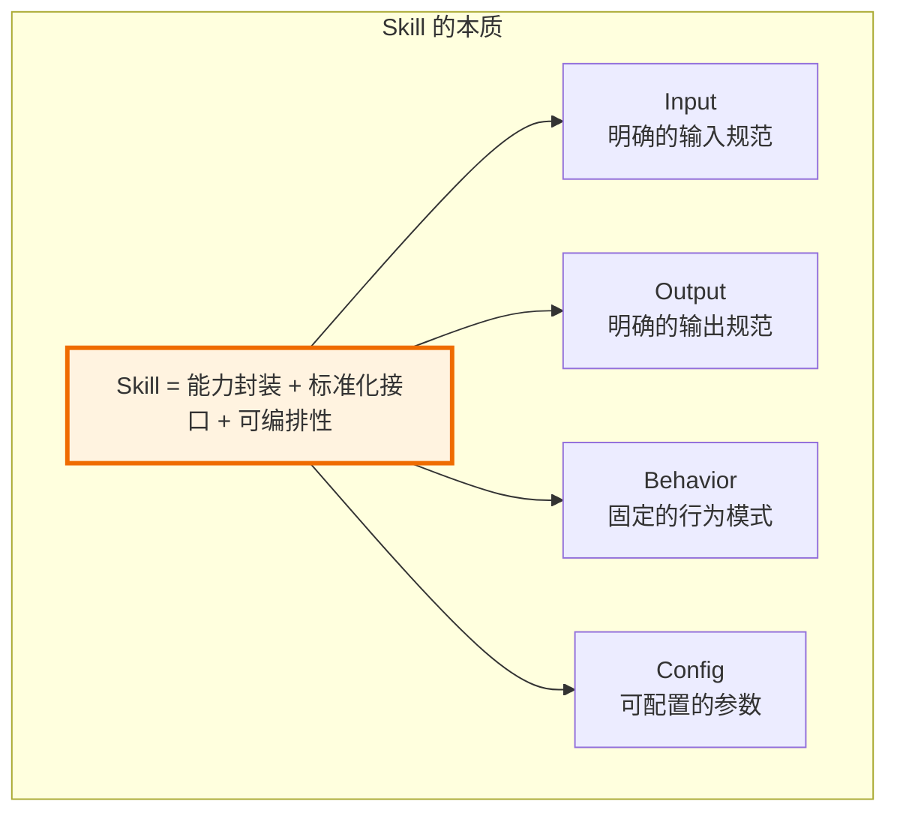
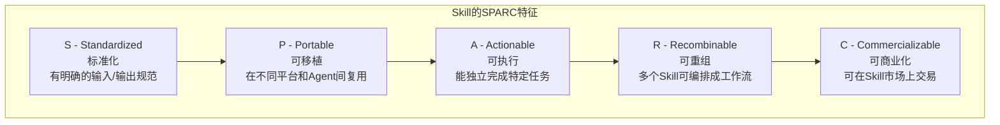
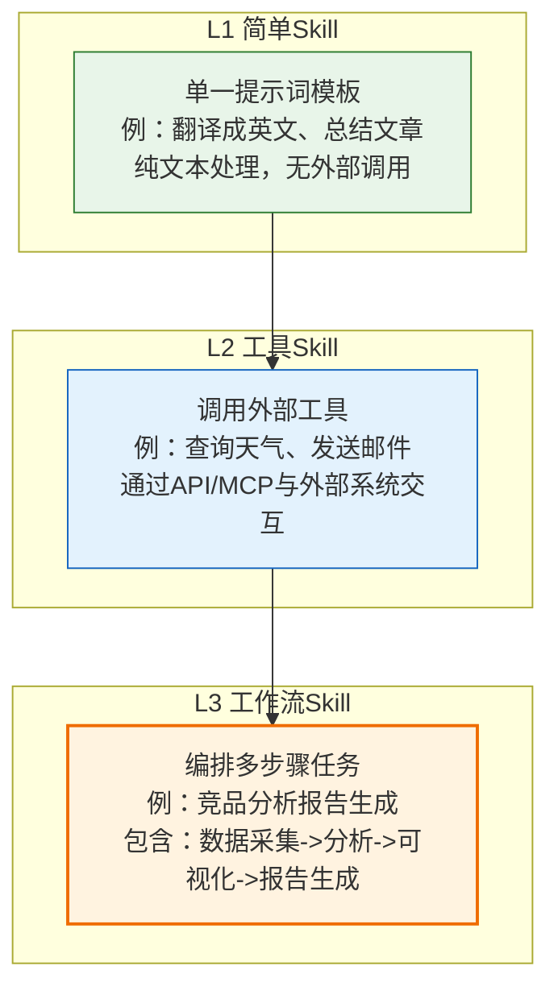
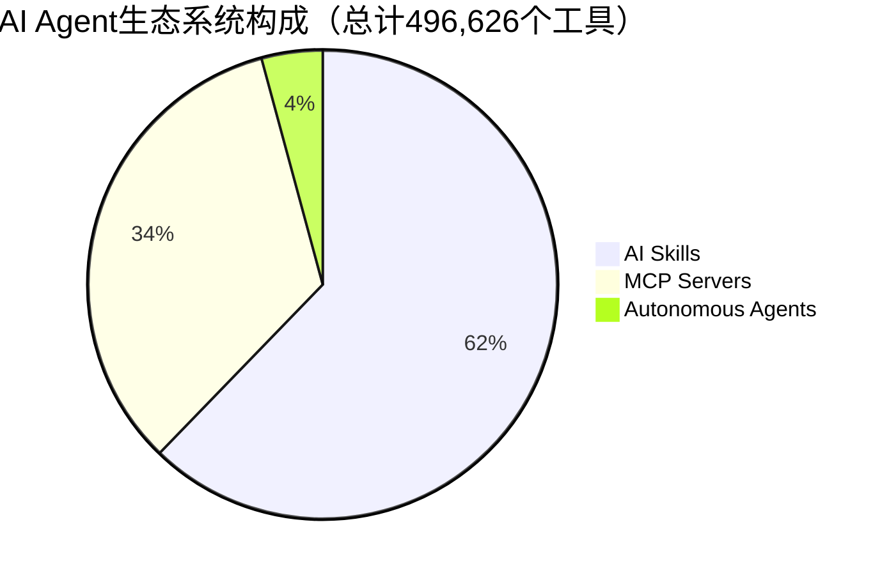
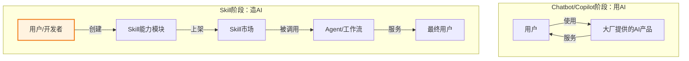
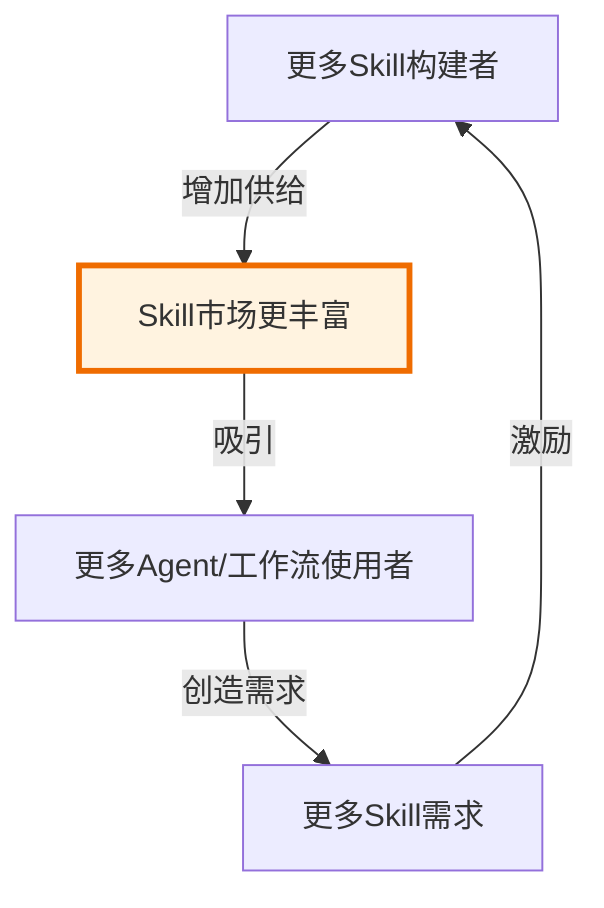
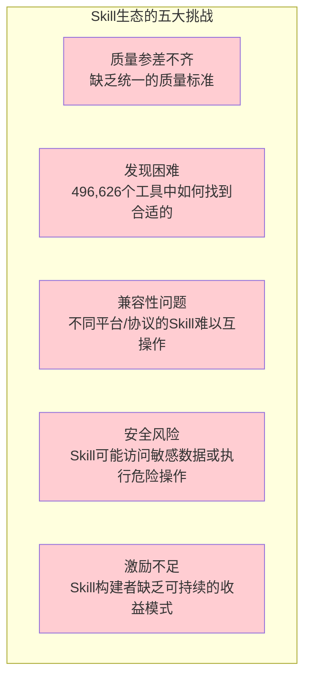
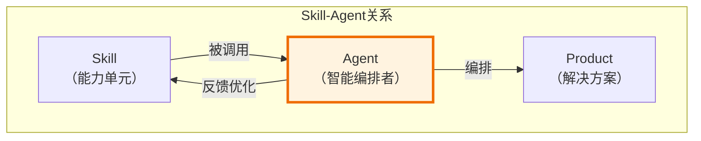

# 阶段三：AI Skill——从"能力"到"能力单元"的标准化

> [!abstract] 核心观点
> AI Skill是AI应用发展的第三阶段，也是整个六阶段模型中**第一次质变**。它标志着AI从"被使用的工具"变为"可被编排的能力单元"。Skill不是完整的AI产品，而是标准化的、可复用的AI能力模块。2026年，Skill生态正处于爆发期——496,626个AI工具构成的能力市场，正在为Product阶段的到来奠定基础。

---

## 一、Skill是什么？

### 1.1 定义

> [!important] Skill的定义
> **AI Skill** 是标准化的、可复用的 AI 能力单元。它不是完整的AI产品，而是可以被编排、组合、调用的能力模块。一个Skill通常包含：明确的输入/输出规范、固定的行为模式、可配置的参数。



### 1.2 Skill与Chatbot、Copilot、Product的本质区别

| 维度 | Chatbot | Copilot | Skill | Product |
|---|---|---|---|---|
| **形态** | 独立对话界面 | 嵌入宿主应用 | 标准化能力模块 | 完整解决方案 |
| **使用方式** | 用户直接对话 | 用户使用中被动接收 | 被Agent/工作流编排调用 | 用户直接使用 |
| **可复用性** | 无 | 低（特定场景） | 高（一次构建，多处使用） | 无（端到端产品） |
| **可组合性** | 无 | 无 | 高（多个Skill可编排） | 低（产品间集成） |
| **分发方式** | 应用商店/网页 | 插件市场 | Skill市场/注册中心 | 应用商店 |
| **构建者** | 大厂/AI公司 | 大厂/AI公司 | 开发者/非技术人员 | 产品团队 |

### 1.3 Skill的核心特征：SPARC模型



> [!note] SPARC模型说明
> SPARC是Skill五个核心特征的英文首字母缩写：
> - **S (Standardized)**：标准化是Skill的基石，没有标准化就没有可复用性
> - **P (Portable)**：可移植性让Skill脱离特定平台，在不同环境中工作
> - **A (Actionable)**：可执行性意味着Skill不只是提供信息，而是完成具体任务
> - **R (Recombinable)**：可重组性是Skill与Chatbot/Copilot最关键的区别——多个Skill可编排成复杂工作流
> - **C (Commercializable)**：可商业化是Skill生态可持续发展的经济基础

---

## 二、Skill的三个层次



### 2.1 L1：简单Skill —— 单一提示词模板

> [!info] L1 Skill特征
> - **能力范围**：纯文本处理，不涉及外部工具调用
> - **典型示例**：翻译成英文、总结文章、改写文案、生成标题
> - **构建门槛**：极低，只需编写一个高质量的提示词模板
> - **核心价值**：将"好的提示词"固化为"可复用的能力模块"，降低重复编写成本
> - **局限性**：无法执行需要外部数据或操作的复杂任务

```
L1 Skill 示例（翻译Skill）：
  输入：待翻译文本 + 目标语言
  处理：使用预定义的翻译提示词模板
  输出：翻译后的文本
  可配置参数：翻译风格（正式/口语化）、目标语言
```

### 2.2 L2：工具Skill —— 调用外部工具

> [!info] L2 Skill特征
> - **能力范围**：通过API/MCP协议调用外部工具或服务
> - **典型示例**：查询天气、发送邮件、创建日程、搜索数据库、调用Webhook
> - **构建门槛**：中等，需要了解API调用和MCP协议
> - **核心价值**：让AI突破"只能生成文本"的限制，具备与外部世界交互的能力
> - **技术基础**：MCP（Model Context Protocol）协议提供了标准化的工具调用接口

```
L2 Skill 示例（天气查询Skill）：
  输入：城市名称 + 日期
  处理：调用天气API获取实时数据
  输出：结构化天气信息（温度、湿度、风力等）
  可配置参数：温度单位（摄氏度/华氏度）、语言
```

### 2.3 L3：工作流Skill —— 编排多步骤任务

> [!info] L3 Skill特征
> - **能力范围**：编排多个L1/L2 Skill，完成复杂的多步骤任务
> - **典型示例**：竞品分析报告生成、客户入职流程自动化、日报周报自动生成
> - **构建门槛**：较高，需要理解工作流编排逻辑和错误处理
> - **核心价值**：将复杂的业务流程自动化，形成"一键式"能力
> - **技术基础**：Agent编排框架（LangChain、CrewAI、AutoGen等）

```
L3 Skill 示例（竞品分析报告生成Skill）：
  输入：竞品名称 + 分析维度
  处理流程：
    1. 调用搜索Skill收集竞品信息
    2. 调用分析Skill提取关键数据
    3. 调用对比Skill生成对比表格
    4. 调用可视化Skill生成图表
    5. 调用报告Skill整合生成最终报告
  输出：完整的竞品分析报告（含图表）
  可配置参数：分析深度、报告格式、输出语言
```

---

## 三、Skill生态现状（2026）

### 3.1 市场规模：496,626个工具

Skillful.sh追踪的AI Agent生态数据显示（截至2026年7月25日）：



> [!important] 关键数据
> - **总计**：496,626个工具（来自55个活跃目录）
> - **AI Skills**：309,078个（62.2%）—— 规模最大的类别
> - **MCP Servers**：166,653个（33.6%）—— 增速最快的类别
> - **Autonomous Agents**：20,895个（4.2%）—— 复杂度最高的类别
> - **日均新增**：1,635.8个新工具（过去30天平均）
> - **近90天新增**：136,420个
> 
> 数据来源：Skillful.sh State of the AI Agent Ecosystem Report, July 2026 [$TRAE_REF](https://skillful.sh/ecosystem-report)

### 3.2 腾讯SkillHub：Skill商业化的里程碑

> [!example] SkillHub + SkillPay体系
> 2026年WAIC大会上，腾讯正式上线SkillHub的SkillPay支付体系，这是Skill生态从"免费分享"进入"付费交易"阶段的标志性事件：
> 
> - **SkillHub**：国内最大的AI Skills社区
> - **已上线**：7.8万个AI Skills
> - **SkillPay**：首次在同一条链路上打通**技能分发 -> Agent调用 -> 技能支付**的完整闭环
> - **商业模式**：商家可上架付费技能，用户可在任务流内直接完成支付
> - **生态意义**：Skill从"爱好者的分享"变为"可经营的生意"，为Skill生态的可持续发展提供了经济基础
> 
> [$TRAE_REF](https://www.time-weekly.com/wap-article/331153)

### 3.3 MCP协议：Skill互操作的技术基础

> [!info] MCP（Model Context Protocol）
> MCP是Anthropic提出的开放协议，用于标准化AI模型与外部工具和数据源的连接方式。MCP Server是最常见的Skill实现形式之一。
> 
> - **MCP Server数量**：166,653个（占生态的33.6%）
> - **npm包**：326,173个MCP Server发布在npm上
> - **PyPI包**：44,461个发布在PyPI上
> - **日均新增**：MCP Server是新增最快的类别
> - **GitHub Stars头部**：n8n（197,971星）、Dify（133,125星）
> 
> MCP协议的成功在于它提供了一个**统一的、语言无关的**工具调用标准，使得不同平台、不同框架下的Skill可以互操作。这与本阶段模型的"标准化"核心特征高度吻合。

### 3.4 Skill分类分布

| 排名 | Skill类别 | 数量 | 占比 |
|---|---|---|---|
| 1 | AI Tool（通用AI工具） | 222,159 | 71.9% |
| 2 | 未分类 | 19,007 | 6.1% |
| 3 | LLM Tool（大模型工具） | 16,968 | 5.5% |
| 4 | AI-ML（AI/机器学习） | 10,382 | 3.4% |
| 5 | AI Automation（AI自动化） | 6,890 | 2.2% |
| 6 | Speech & Audio（语音与音频） | 5,858 | 1.9% |
| 7 | n8n Node（工作流节点） | 4,181 | 1.4% |
| 8 | Document Processing（文档处理） | 3,301 | 1.1% |

---

## 四、Skill为什么是"质变"？

### 4.1 从"用AI"到"造AI"

> [!important] 第一次质变
> Skill阶段是六阶段模型中的**第一次质变**。在Chatbot和Copilot阶段，用户是AI的**使用者**——使用大厂提供的AI产品。在Skill阶段，用户（包括非技术人员）可以成为AI能力的**构建者**——通过标准化接口创建自己的AI能力模块。



### 4.2 非技术人员的技术边界被打破

Skill的标准化特性，使得非技术人员也能构建自己的AI能力：

> [!tip] 技术民主化
> - **L1 Skill**：只需写好提示词，产品经理、运营、文案等非技术角色都能构建
> - **L2 Skill**：通过可视化配置界面（如扣子、Dify），非技术人员也能连接外部API
> - **L3 Skill**：通过拖拽式工作流编排，业务人员也能设计复杂的自动化流程

这与已有知识库 [[02-AI趋势与素养/非技术人员与技术边界/00_MOC_非技术人员与技术边界中枢]] 的核心命题直接呼应：Skill是打破"非技术人员与技术边界"的关键工具。当AI能力的构建门槛从"写代码"降低到"写提示词"和"拖拽配置"，技术边界正在被重新定义。

### 4.3 从"能力"到"能力单元"：工业化的开始

> [!note] 类比：从手工作坊到工业革命
> Skill阶段的本质是**AI能力的工业化**。类比制造业：
> - **Chatbot/Copilot阶段** = 手工作坊：每个AI产品都是独立打造的，无法复用
> - **Skill阶段** = 标准化零件：AI能力被标准化为可互换的"零件"，可以大规模生产、交易、组装
> - **Product阶段** = 工业产品：用标准化零件组装出面向用户的完整产品

### 4.4 Skill生态的网络效应



> [!tip] 网络效应
> Skill生态具有典型的双边网络效应：
> - **供给侧**：Skill构建者越多，市场上的Skill越丰富
> - **需求侧**：可用的Skill越多，Agent/工作流能完成的任务越复杂
> - **正循环**：丰富的Skill吸引更多使用者 -> 更多使用者创造更多需求 -> 更多需求激励更多构建者

---

## 五、Skill与已有知识库的深度关联

### 5.1 [[01-AI技术/Skill制作痛点/00_MOC_Skill制作痛点中枢]]

> [!important] 深度关联
> 本知识库的Skill阶段模型与"Skill制作痛点"知识库存在深度关联。当前Skill制作中的核心痛点（碎片化、重复建设、质量参差不齐、缺乏标准化），正是Skill阶段需要解决的关键问题。

| Skill制作痛点 | 六阶段模型中的解决方案 |
|---|---|
| 碎片化：每个Skill都是独立孤岛 | 标准化接口（MCP协议）让Skill可互操作 |
| 重复建设：同一个功能被反复创建 | Skill市场让可复用的Skill被发现和交易 |
| 质量参差不齐：没有统一的质量标准 | Skill评分体系和社区治理机制 |
| 缺乏商业化：Skill制作者无法获利 | SkillPay支付体系让Skill可交易 |
| 编排困难：多个Skill组合工作流复杂 | Agent编排框架（LangChain、CrewAI等） |

### 5.2 [[01-AI技术/超长项目AI跑/超长项目AI跑_知识库建设方案]]

Skill阶段的实践基础之一，就是"超长项目AI跑"中验证的AI自主执行能力。当AI能独立完成超长周期的复杂任务时，将这些能力封装为标准化Skill，才能让它们在更多场景中被复用。

### 5.3 [[02-AI趋势与素养/非技术人员与技术边界/00_MOC_非技术人员与技术边界中枢]]

Skill的L1层次（简单提示词模板）直接降低了AI能力构建的门槛，让非技术人员也能参与"造AI"。这与"非技术人员与技术边界"知识库的核心命题——"技术边界正在被AI重新定义"——形成呼应。

---

## 六、Skill阶段的战略意义

### 6.1 2026年最大机会窗口

> [!tip] 战略判断
> Skill阶段是2026年最大的创业和投资机会窗口，原因如下：
> 1. **Chatbot赛道已见顶**：纯对话产品已无增量空间
> 2. **Product阶段的门槛还高**：需要Skill生态的供给支撑
> 3. **Skill处于爆发前夜**：496,626个工具已构成庞大的供给池，但质量参差不齐，存在巨大的"精品化"机会
> 4. **商业化刚刚起步**：SkillPay等支付体系刚上线，Skill的经济模型还在探索期

### 6.2 Skill阶段的三种创业方向

| 方向 | 说明 | 代表案例 |
|---|---|---|
| **Skill构建者** | 在垂直领域构建高质量Skill并上架市场 | 法律合同审核Skill、医疗问诊Skill |
| **Skill编排者** | 将多个Skill编排成完整的解决方案 | 用多个Skill组合成"跨境电商运营自动化"方案 |
| **Skill基础设施** | 为Skill生态提供工具链和服务 | SkillHub、Dify、MCP Server托管平台 |

### 6.3 从Skill到Product的跃迁

> [!note] 跃迁路径
> Skill阶段的终局不是"有更多Skill"，而是"用Skill构建Product"。当Skill生态足够丰富时，Skill构建者将面临一个选择：
> - **路径A**：继续深耕Skill，成为某个垂直领域的"Skill之王"
> - **路径B**：将多个Skill集成为Product，从"能力模块提供商"升级为"解决方案提供商"

---

## 七、相关文档

- [[02-AI趋势与素养/AI应用发展阶段演进/00_MOC_AI应用发展阶段演进中枢]] —— 知识库导航
- [[02-AI趋势与素养/AI应用发展阶段演进/01_全貌：AI应用发展的六阶段统一模型]] —— 六阶段全景定义
- [[02-AI趋势与素养/AI应用发展阶段演进/02_阶段一二：Chatbot与Copilot——AI的嘴和手]] —— 前一阶段详解
- [[02-AI趋势与素养/AI应用发展阶段演进/04_阶段四：AI Product——从功能到解决方案]] —— 下一阶段详解
- [[02-AI趋势与素养/AI应用发展阶段演进/07_跃迁动力学：阶段之间的关键跨越条件]] —— 跃迁条件详解
- [[02-AI趋势与素养/AI应用发展阶段演进/08_人机关系的六次跃迁：从问答到共生]] —— 两层映射深度分析
- [[01-AI技术/Skill制作痛点/00_MOC_Skill制作痛点中枢]] —— 与已有知识库的关联
- [[02-AI趋势与素养/非技术人员与技术边界/00_MOC_非技术人员与技术边界中枢]] —— 与已有知识库的关联

---

## 八、Skill阶段的关键挑战与应对

### 8.1 当前Skill生态的五大挑战



### 8.2 应对策略

| 挑战 | 当前应对 | 未来方向 |
|---|---|---|
| 质量参差不齐 | Skillful.sh安全评分（平均A级） | 建立行业公认的Skill质量认证体系 |
| 发现困难 | 目录聚合（55个活跃目录） | AI驱动的Skill推荐和匹配引擎 |
| 兼容性问题 | MCP协议标准化 | 统一Skill描述规范（类似OpenAPI的SkillAPI） |
| 安全风险 | 沙箱执行、权限控制 | Skill安全审计标准、沙箱即服务 |
| 激励不足 | SkillPay支付体系（腾讯） | Skill版权保护、Skill保险、Skill投资基金 |

### 8.3 Skill安全：一个被低估的挑战

> [!warning] 安全警示
> Skillful.sh的数据显示，在496,626个已索引工具中，**100%的评分工具安全等级为A或B**，但这并不意味着没有安全风险。Skill的安全挑战包括：
> 
> 1. **沙箱逃逸**：Skill在沙箱中执行，但可能存在沙箱逃逸漏洞
> 2. **数据泄露**：Skill可能将敏感数据发送到外部服务
> 3. **权限滥用**：Skill可能请求超出实际需要的权限
> 4. **供应链攻击**：Skill依赖的第三方库可能被植入恶意代码
> 5. **提示词注入**：通过精心构造的输入绕过Skill的安全限制
> 
> 随着Skill从"业余爱好"进入"商业经营"，安全将成为Skill生态的"生死线"。一个重大安全事件可能摧毁整个Skill生态的信任基础。

### 8.4 Skill的"质量鸿沟"问题

> [!note] 质量鸿沟
> Skill生态面临一个"质量鸿沟"：数量爆发（496,626个）但精品稀缺。大部分Skill是L1级别的简单提示词模板，L2/L3级别的高质量Skill占比很小。这创造了一个机会：**在垂直领域构建高质量L2/L3 Skill的创业者，将拥有巨大的先发优势**。

---

## 九、Skill的未来：2027年展望

### 9.1 三个可能的方向

1. **Skill即服务（SaaS）**：Skill不再是一次性下载，而是持续运行的云端服务，按调用量计费
2. **Skill联邦**：跨平台的Skill互操作协议，让Skill可以在不同平台间无缝迁移
3. **Skill AI**：用AI来构建Skill——AI根据用户需求自动生成Skill（类似GPTs但更标准化）

### 9.2 Skill与Agent的关系



> [!important] 关键关系
> Skill和Agent是"能力"和"智能"的分工：
> - **Skill** = 标准化的能力单元（"能做什么"）
> - **Agent** = 智能的任务编排者（"知道什么时候用什么Skill"）
> - **Product** = Skill + Agent + 用户体验封装的最终产物

---

> [!quote] 总结
> Skill是AI应用发展中的第一次质变。它标志着AI从"被使用的工具"变为"可被编排的能力单元"，从"用AI"变为"造AI"。Skill的标准化和可复用性，为AI能力的工业化生产奠定了基础。2026年，496,626个AI工具构成的能力市场，正在为Product阶段的到来积蓄力量。而SkillPay支付体系的正式上线，则标志着Skill生态从"业余爱好"进入"商业经营"的新阶段。