# 阶段四：AI Product——从"功能"到"解决方案"

> [!abstract] 本文定位
> 本文是"AI应用发展阶段演进"知识库的第四篇文档，详细阐述六阶段模型中的**第四阶段——AI Product**。建议按照 [[02-AI趋势与素养/AI应用发展阶段演进/02_阶段一二：Chatbot与Copilot——AI的嘴和手|阶段一：Chatbot]] → [[02-AI趋势与素养/AI应用发展阶段演进/02_阶段一二：Chatbot与Copilot——AI的嘴和手|阶段二：Copilot]] → [[02-AI趋势与素养/AI应用发展阶段演进/03_阶段三：AI Skill——从能力到能力单元的标准化|阶段三：AI Skill]] → **阶段四：AI Product** → [[02-AI趋势与素养/AI应用发展阶段演进/05_阶段五：Platform——连接多方价值的操作系统|阶段五：Platform]] → [[02-AI趋势与素养/AI应用发展阶段演进/06_阶段六：Ecosystem——定义行业标准的基础设施|阶段六：Ecosystem]] 的顺序阅读。

---

## 一、六阶段全景回顾

在进入第四阶段之前，让我们先回顾整个演进模型的全貌：

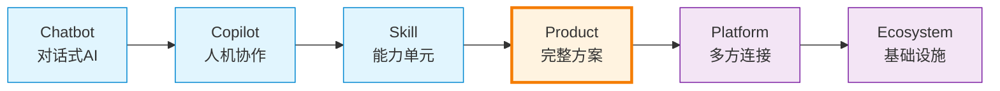

> [!info] 前三个阶段回顾
> - **Chatbot**：AI 能"听懂并回答"，但仅限对话，价值在信息层面
> - **Copilot**：AI 嵌入既有工作流，在人类操作中提供辅助建议
> - **Skill**：AI 能力被拆解为可组合、可调用的独立单元
>
> 前三个阶段有一个共同特点：**AI 仍然是"附加"到某个产品上的能力**。无论是聊天窗口、IDE 插件，还是 API 调用，AI 都是服务于已有流程的。而 AI Product 阶段打破了这个范式。

---

## 二、AI Product 的定义

### 2.1 核心定义

> [!important] AI Product 的定义
> **AI Product（AI 原生产品）**是指 AI 不再是嵌入到现有产品中的"功能"，而是成为产品的**核心引擎**。整个产品围绕 AI 能力设计，AI 不是 add-on，而是产品的 DNA。

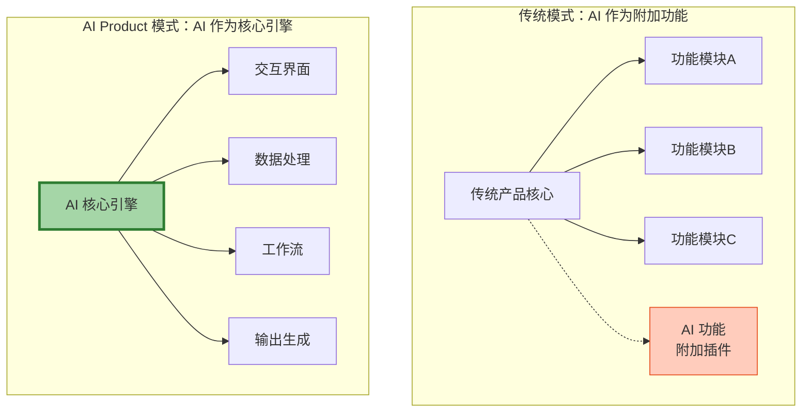

### 2.2 关键区分

| 维度 | AI 作为功能（前三个阶段） | AI 作为产品（第四阶段） |
|---|---|---|
| **AI 的位置** | 附加到现有产品上 | 是产品的核心引擎 |
| **产品设计逻辑** | 功能+AI 增强 | 以 AI 能力为起点设计 |
| **用户认知** | "XX 产品有了 AI 功能" | "这是一个 AI 产品" |
| **竞争壁垒** | 原有产品体验 + AI 能力 | AI 引擎 + 数据飞轮 |
| **商业模式** | 已有模式的增值 | 独立的 AI 原生商业模式 |
| **典型案例** | Notion AI、Office Copilot | Cursor、Perplexity、Gamma |

---

## 三、AI Product 的核心特征

### 3.1 完整闭环：从输入到输出，一站式完成

> [!tip] 什么是"完整闭环"
> 用户进入 AI Product 后，从需求输入到最终输出，无需切换到其他工具。产品内部完成所有中间环节。

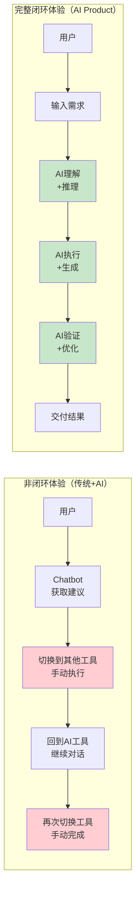

> [!example] 闭环体验的实例
> - **Cursor**：用户描述需求 → AI 理解项目上下文 → 生成代码 → 预览效果 → 用户确认 → 完成。整个过程不离开 IDE
> - **Gamma**：用户输入主题 → AI 生成大纲 → 自动排版 → 生成完整演示文稿 → 用户微调 → 导出。无需在多个工具间切换
> - **Perplexity**：用户提问 → AI 实时搜索 → 多源综合 → 给出带引用的答案 → 追问 → 深入。搜索和分析一体化

### 3.2 AI 原生体验：交互方式被 AI 重塑

> [!important] AI 原生体验 vs 传统产品+AI 聊天窗口
> AI Product 的核心差异化在于：**不是"传统产品界面 + 一个 AI 聊天窗口"**，而是从底层交互逻辑上，围绕 AI 能力重新设计整个用户体验。

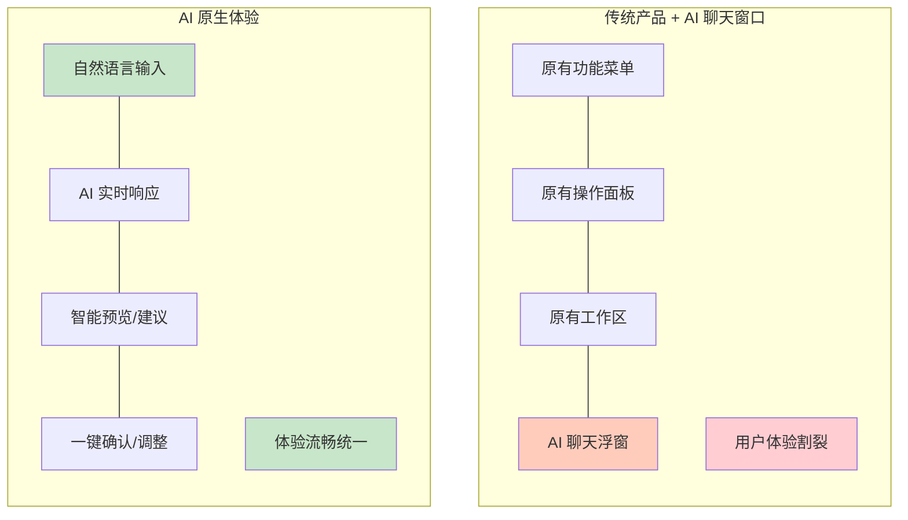

AI 原生体验的关键特征：

- **意图驱动交互**：用户表达意图，AI 理解并执行，而非用户一步步操作功能菜单
- **动态界面**：界面根据 AI 所处的任务阶段动态变化，而非固定布局
- **渐进式披露**：AI 根据当前需求展示相关信息，而非一次性展示所有功能
- **对话+操作融合**：自然语言对话与直接操作无缝衔接，不是两者割裂

> [!quote] 2026年的趋势观察
> 2026年，AI 正在走出对话框。正如霞光AI实验室指出的：Chatbot 增长见顶，Agent 时代开启。AI 不再被动等待用户的下一句话，而是具备了独立闭环的执行能力。[^1]

### 3.3 独立商业模式：能够独立收费

> [!important] 商业模式独立性的判断标准
> AI Product 必须有独立于母产品或其他产品的商业模式。它不是一个"大产品的附属功能"，而是用户愿意为之付费的独立产品。

| 商业模式类型 | 说明 | 代表产品 |
|---|---|---|
| **订阅制** | 按月/年付费，提供不同等级的功能 | Cursor Pro ($20/月) |
| **按量付费** | 按使用量（Token/次数）计费 | Perplexity Pro |
| **Freemium** | 基础免费 + 高级功能付费 | Gamma |
| **企业许可** | 面向企业级的定制化收费 | 通义听悟企业版 |

> [!warning] 判断标准：用户是否愿意为"AI 本身"付费
> 如果一个产品的用户付费意愿主要来自"非 AI 功能"（如存储空间、协作功能），那它就不是真正的 AI Product。真正的 AI Product 中，**用户付费的核心原因是 AI 能力本身**。

### 3.4 数据飞轮：使用越多，产品越智能

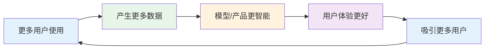

> [!tip] 数据飞轮的三个层次
> 1. **使用数据飞轮**：用户行为数据 → 优化产品体验 → 更好用 → 更多用户
> 2. **模型飞轮**：用户反馈 → 微调模型 → 更准确 → 更多使用
> 3. **知识飞轮**：用户场景 → 沉淀领域知识 → 更懂行业 → 更高价值

数据飞轮是 AI Product 最核心的竞争壁垒之一。与传统产品不同，AI Product 在使用过程中不断进化，而传统产品的功能在发布后基本固定。

---

## 四、代表性 AI Product 深度分析

### 4.1 Cursor：AI 原生 IDE

> [!example] Cursor 为什么是 AI Product 而非"IDE + AI 插件"
> Cursor 不是在 VS Code 上加一个 AI 插件，而是从零开始，**以 AI 为设计核心重新构建了编程体验**。

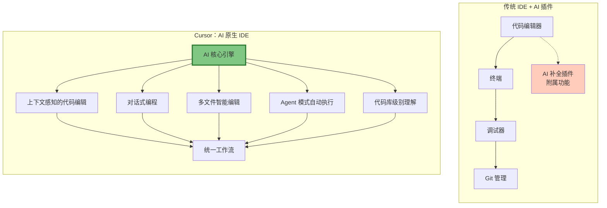

Cursor 的 AI Product 特征：

- **完整闭环**：从需求描述到代码生成到调试到部署，全流程在 Cursor 内完成
- **AI 原生体验**：Tab 补全、Cmd+K 编辑、Composer 对话式编程，交互围绕 AI 设计
- **独立商业模式**：Pro 版 $20/月，Business 版 $40/月，用户愿意为 AI 编程能力付费
- **数据飞轮**：用户编码习惯和偏好持续优化 AI 建议质量

### 4.2 Perplexity：AI 原生搜索引擎

> [!example] Perplexity vs Google
> Perplexity 不是"搜索引擎 + AI 总结"，而是以 AI 的理解和推理能力为核心，重新定义了"搜索"的体验。

```mermaid
graph TB
    subgraph 传统搜索["传统搜索引擎"]
        U1[用户输入关键词] --> S1[返回链接列表]
        S1 --> U1a[用户逐个点击]
        U1a --> U1b[用户阅读多个网页]
        U1b --> U1c[用户自己综合信息]
        style U1a fill:#ffcdd2
        style U1b fill:#ffcdd2
        style U1c fill:#ffcdd2
    end

    subgraph AI原生搜索["Perplexity：AI 原生搜索"]
        U2[用户输入问题] --> S2[AI 理解意图]
        S2 --> S3[实时多源搜索]
        S3 --> S4[AI 综合+引用]
        S4 --> S5[直接给出答案+来源]
        S5 --> S6[追问深入]
        style S2 fill:#c8e6c9
        style S4 fill:#c8e6c9
        style S6 fill:#c8e6c9
    end
```

Perplexity 的 AI Product 特征：

- **完整闭环**：提问 → 搜索 → 综合 → 回答 → 追问，全流程不离开 Perplexity
- **AI 原生体验**：以自然语言对话替代关键词搜索，自动整合多源信息
- **独立商业模式**：Pro 版 $20/月，提供无限 Pro Search 和高级模型选择
- **数据飞轮**：用户搜索行为帮助改进搜索意图理解和信息排序

### 4.3 Gamma：AI 原生演示文稿工具

> [!example] Gamma 为什么不是"PPT + AI"
> Gamma 的核心设计理念是：**用 AI 来生成和组织内容，用户只需提供想法和方向**。它不以幻灯片为最小单位，而是以"卡片"为基本构建块，AI 自动完成布局和设计。

Gamma 的 AI Product 特征：

- **完整闭环**：从主题输入到内容生成到设计排版到导出分享，一站式完成
- **AI 原生体验**：不模仿传统 PPT 的"空白幻灯片"模式，而是以 AI 生成内容为起点
- **独立商业模式**：Plus 版 $10/月，Business 版 $20/月
- **数据飞轮**：用户偏好和设计选择持续优化 AI 的排版和内容生成能力

### 4.4 妙记 / 通义听悟：AI 原生会议纪要

AI Product 特征：

- **完整闭环**：录音 → 转写 → 摘要 → 待办 → 分享，全流程自动化
- **AI 原生体验**：不需要用户手动标记重点，AI 自动识别关键讨论和决策
- **独立商业模式**：通义听悟有独立会员体系
- **数据飞轮**：用户对摘要的修正反馈帮助 AI 持续提升识别准确度

---

## 五、AI Product 与传统产品的本质区别

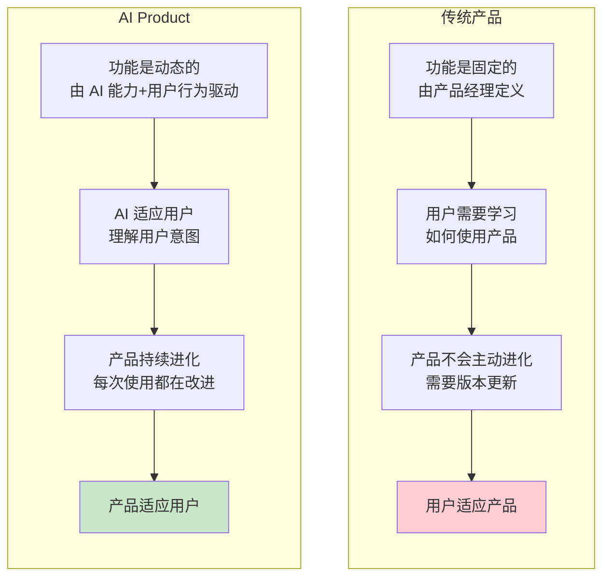

> [!important] 本质差异一览

| 对比维度 | 传统产品 | AI Product |
|---|---|---|
| **功能定义** | 静态的，由产品经理预先设计 | 动态的，AI 根据上下文生成 |
| **用户学习成本** | 高，需要学习功能和操作流程 | 低，自然语言表达意图即可 |
| **产品进化方式** | 离散的版本发布 | 持续的使用反馈优化 |
| **个性化程度** | 有限的配置选项 | 深度个性化，AI 理解每个用户 |
| **边际成本** | 接近零（软件复制） | 非零（每次推理消耗算力） |
| **核心壁垒** | 功能完整性、用户体验 | AI 模型能力、数据飞轮 |
| **用户的角色** | 使用者（User） | 协作者（Collaborator） |

---

## 六、从 AI Skill 到 AI Product 的跃迁

### 6.1 跃迁的三个条件

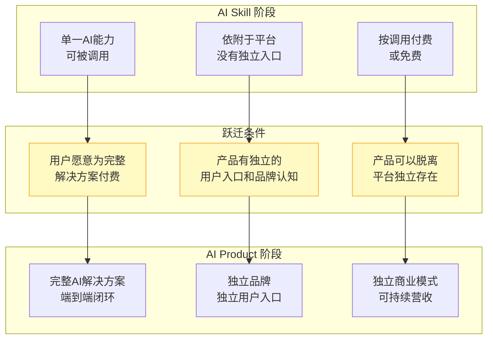

> [!tip] 跃迁条件详解

**条件一：用户愿意为完整解决方案付费**

从 Skill 到 Product 的关键差异在于"完整性"。Skill 解决的是"一个环节"的问题（如"帮我翻译这段话"），而 Product 解决的是"一个完整场景"的问题（如"帮我完成这篇英文文档的撰写、翻译、排版和校对"）。用户是否愿意为这种"完整性"付费，是跃迁的试金石。

**条件二：产品有独立的用户入口和品牌认知**

Skill 通常依附于平台（如 ChatGPT 插件、微信小程序），用户通过平台使用 Skill。而 Product 需要有独立的品牌认知——用户会说"我用 Cursor 写代码"，而不是"我用 ChatGPT 的编程功能写代码"。

**条件三：产品可以脱离平台独立存在**

如果关闭某个平台，你的产品是否还能存活？如果答案是"否"，那它还只是一个 Skill。真正的 AI Product 应该有自己的用户获取渠道和留存机制。

### 6.2 跃迁路径图

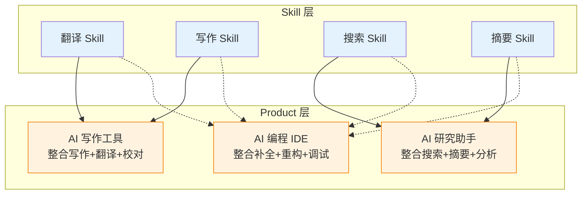

### 6.3 跃迁风险管理

> [!warning] 跃迁过程中的常见陷阱

**陷阱一：伪闭环**

产品看起来有完整流程，但实际上核心环节依赖人工或第三方工具，用户体验割裂。

```
伪闭环的信号：
├── 用户需要频繁切换到其他工具
├── 关键步骤需要手动操作
├── AI 只能处理"简单情况"，复杂情况需要人工介入
└── 结果：用户留存率低，付费意愿弱
```

**陷阱二：过度依赖底层模型**

产品核心能力完全依赖第三方大模型 API，没有自己的模型微调或工作流优化。

```
过度依赖的信号：
├── 切换模型后产品体验大幅下降
├── 没有积累自己的训练数据
├── 竞争对手可以轻易复制产品体验
└── 结果：沦为"套壳产品"，缺乏护城河
```

**陷阱三：忽视非 AI 体验**

沉迷于 AI 能力，忽略了产品的基础体验（如加载速度、UI 设计、稳定性）。

```
忽视非AI体验的信号：
├── AI 很强但产品很慢
├── AI 很强但界面很难用
├── AI 很强但经常崩溃
└── 结果：用户用 AI 功能但不用你的产品
```

---

## 七、2026年趋势：AI 正在走出对话框

> [!quote] 2026年的关键转折
> 2026年，AI 正在走出对话框。Chatbot 增长见顶，Agent 时代开启。AI 不再被动等待用户的下一句话，而是具备了独立闭环的执行能力。这正是 AI Product 阶段的核心驱动力。[^1]

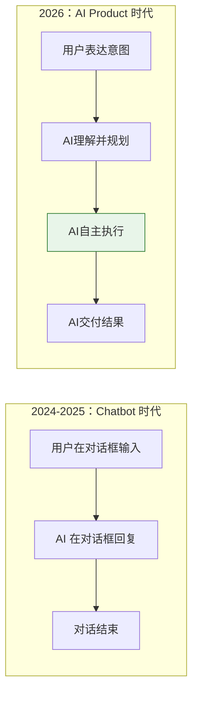

从数据层面看，Chatbot 赛道的增量空间已逼近天花板。2026年4月，Chatbot 榜单 Top 20 的产品中，有9大产品网站 Web 访问量出现下滑。而 Agent 类产品（AI Product 的主要形态）逆势增长，Claude 的访问量增长了 34.18%，主要原因就在于它完成了从"被动问答的 Chatbot"向"主动代劳的 Agent"的范式转移。[^1]

2026年5月，全球 AI APP & Agent Token 消耗排行榜 Top 20 中，Agent 占 9 个；万亿级 Token 消耗的 6 大产品中，Agent 占 5 个。这标志着 AI Product 正在成为 AI 应用的主流形态。[^1]

---

## 八、AI Product 的能力评估矩阵

> [!tip] 评估一个产品是否达到 AI Product 阶段

| 评估维度 | 未达标（Skill 阶段） | 达标（Product 阶段） | 卓越（成熟 Product） |
|---|---|---|---|
| **闭环完整性** | 解决单一环节 | 覆盖端到端流程 | 流程内自适应优化 |
| **AI 原生程度** | 传统界面+AI 窗口 | 交互围绕 AI 设计 | 每次交互都个性化 |
| **商业模式** | 免费或依附平台 | 独立收费 | 高留存+高客单价 |
| **数据飞轮** | 无数据积累 | 使用数据优化产品 | 数据驱动产品进化 |
| **品牌认知** | 用户想到的是平台 | 用户想到的是产品 | 产品成为品类代名词 |
| **用户留存** | 次日留存 < 30% | 次日留存 > 40% | 次日留存 > 60% |

---

## 九、从 AI Product 到 Platform 的展望

AI Product 是六阶段模型中的关键转折点。在此之前，AI 只是增强现有产品的能力；在此之后，AI 开始构建自己的生态。

> [!note] 下一阶段的预告
> 当一个 AI Product 积累了足够多的用户，并且这些用户的需求开始多样化到单一产品无法满足时，就进入了 [[02-AI趋势与素养/AI应用发展阶段演进/05_阶段五：Platform——连接多方价值的操作系统|阶段五：Platform]]。平台阶段的核心不再是"做好一个产品"，而是"连接多方价值"。

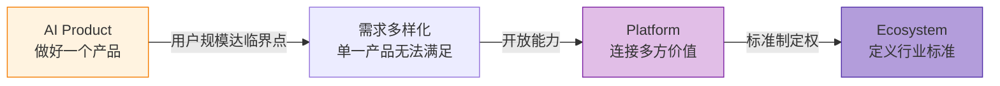

---

## 十、本章小结

> [!summary] 核心要点
> 1. **AI Product 的定义**：AI 是产品的核心引擎，不是附加功能，AI 是产品的 DNA
> 2. **四大核心特征**：完整闭环、AI 原生体验、独立商业模式、数据飞轮
> 3. **与传统产品的本质区别**：传统产品让用户适应产品，AI Product 让产品适应用户
> 4. **从 Skill 到 Product 的跃迁条件**：用户付费意愿、独立品牌认知、独立生存能力
> 5. **2026年趋势**：AI 正在走出对话框，Agent 成为 AI Product 的主流形态

> [!question] 思考题
> - 你正在使用的 AI 工具中，哪些已经达到了 AI Product 阶段？哪些还停留在 Skill 或 Copilot 阶段？
> - 一个 AI Product 如何避免"套壳"的陷阱？如何建立真正的护城河？
> - 如果 ChatGPT 自身是一个 AI Product，那 GPT Store 上的 GPTs 是 Product 还是 Skill？

---

## 参考资料

[^1]: 霞光AI实验室，"2026，AI正在走出对话框"，36氪，2026年6月24日。[$TRAE_REF](https://36kr.com/p/3866759935572612)

---

## 相关文档

- [[02-AI趋势与素养/AI应用发展阶段演进/03_阶段三：AI Skill——从能力到能力单元的标准化|阶段三：AI Skill]] —— 理解 AI Product 的上游阶段
- [[02-AI趋势与素养/AI应用发展阶段演进/05_阶段五：Platform——连接多方价值的操作系统|阶段五：Platform]] —— 理解 AI Product 的下一个演进阶段
- [[02-AI趋势与素养/AI应用发展阶段演进/06_阶段六：Ecosystem——定义行业标准的基础设施|阶段六：Ecosystem]] —— 理解 AI 演进的终极形态