# 阶段五：Platform——连接多方价值的"操作系统"

> [!abstract] 本文定位
> 本文是"AI应用发展阶段演进"知识库的第五篇文档，详细阐述六阶段模型中的**第五阶段——Platform**。建议按照 [[02-AI趋势与素养/AI应用发展阶段演进/02_阶段一二：Chatbot与Copilot——AI的嘴和手|阶段一：Chatbot]] → [[02-AI趋势与素养/AI应用发展阶段演进/02_阶段一二：Chatbot与Copilot——AI的嘴和手|阶段二：Copilot]] → [[02-AI趋势与素养/AI应用发展阶段演进/03_阶段三：AI Skill——从能力到能力单元的标准化|阶段三：AI Skill]] → [[02-AI趋势与素养/AI应用发展阶段演进/04_阶段四：AI Product——从功能到解决方案|阶段四：AI Product]] → **阶段五：Platform** → [[02-AI趋势与素养/AI应用发展阶段演进/06_阶段六：Ecosystem——定义行业标准的基础设施|阶段六：Ecosystem]] 的顺序阅读。

---

## 一、六阶段全景回顾

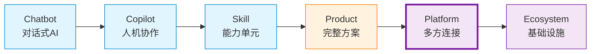

> [!info] 前四个阶段回顾
> - **Chatbot**：AI 能对话，但仅限信息层面
> - **Copilot**：AI 辅助人类工作，嵌入现有流程
> - **Skill**：AI 能力被拆解为可组合的独立单元
> - **Product**：AI 成为产品核心引擎，提供完整解决方案
>
> 前四个阶段有一个共同点：**价值由单一主体创造**。无论是 Chatbot、Copilot、Skill 还是 Product，都是"自己创造价值，自己服务用户"。而 Platform 阶段的核心变化是：**从"自己创造价值"到"连接多方创造价值"**。

---

## 二、Platform 的定义

### 2.1 核心定义

> [!important] Platform 的定义
> **AI Platform（AI 平台）**不仅提供服务，还**连接服务的提供者和使用者**。平台的核心是双边或多边网络效应——平台自身不直接创造所有价值，而是让价值在生态参与者之间流动。

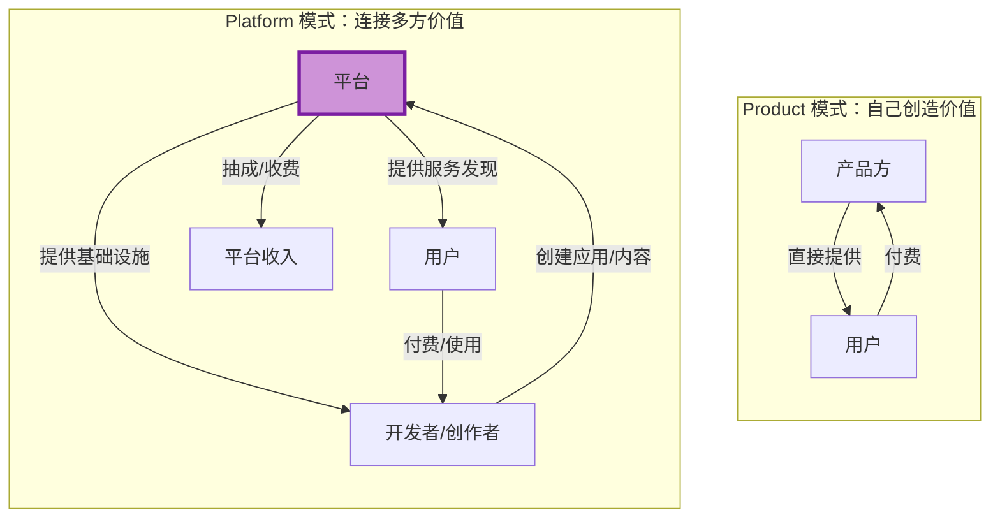

### 2.2 关键区分

| 维度 | AI Product（第四阶段） | AI Platform（第五阶段） |
|---|---|---|
| **价值创造者** | 单一主体（产品方） | 多方参与（开发者+用户+平台） |
| **用户关系** | 直接服务最终用户 | 服务用户 + 赋能开发者 |
| **增长引擎** | 产品体验驱动 | 网络效应驱动 |
| **收入模式** | 订阅/按量付费 | 订阅 + 平台抽成 + 交易手续费 |
| **竞争壁垒** | 数据飞轮 + 产品体验 | 网络效应 + 转换成本 |
| **核心能力** | 做好产品 | 做好连接 + 治理 |

---

## 三、Platform 的核心特征

### 3.1 多边参与：不只是"平台→用户"

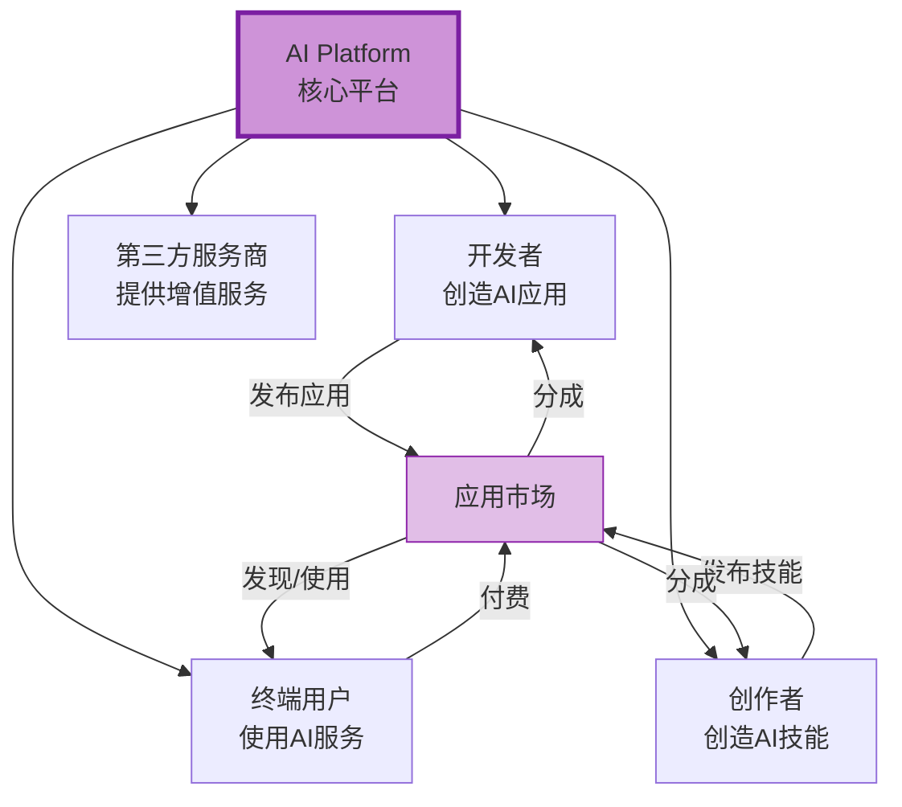

> [!tip] 平台参与者的角色
> - **平台方**：提供基础设施、制定规则、治理生态
> - **开发者**：基于平台 API/SDK 创建应用和服务
> - **创作者**：创建 AI 技能、模板、工作流
> - **终端用户**：消费平台上的 AI 服务
> - **第三方服务商**：提供支付、数据分析、合规等增值服务

### 3.2 开放能力：通过 API/SDK 释放平台价值

> [!important] 开放是平台化的第一步
> 没有开放，就没有平台。平台必须通过 API/SDK/Plugin 等方式，让外部开发者能够基于平台能力构建应用。

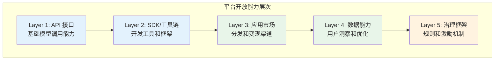

开放能力的关键决策：

| 开放层级 | 开放内容 | 典型范例 | 风险 |
|---|---|---|---|
| **API** | 模型调用、数据接口 | OpenAI API | 被竞争对手调用 |
| **SDK/工具链** | 开发框架、调试工具 | 扣子(Coze) Bot SDK | 维护成本高 |
| **应用市场** | 分发渠道、用户触达 | GPT Store | 质量管控难 |
| **数据能力** | 用户画像、使用分析 | Poe 创作者后台 | 隐私合规 |
| **治理框架** | 审核规则、激励机制 | SkillHub 支付体系 | 规则设计复杂 |

### 3.3 网络效应：平台增长的核心引擎

> [!important] 双边网络效应
> 平台的增长不是线性的，而是**自我强化的正循环**：用户越多 → 开发者越多 → 应用越多 → 用户越多。这就是双边网络效应。

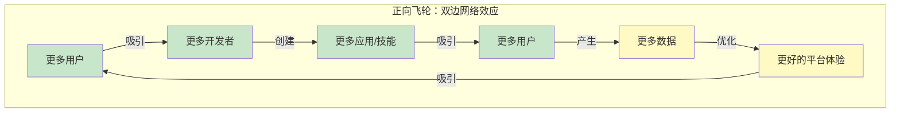

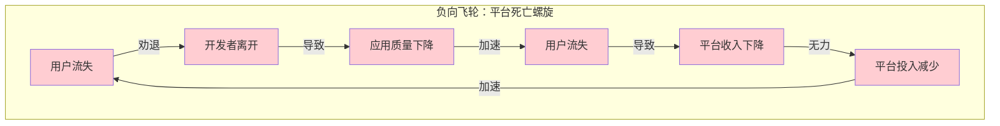

### 3.4 价值分配：平台如何从生态中获益

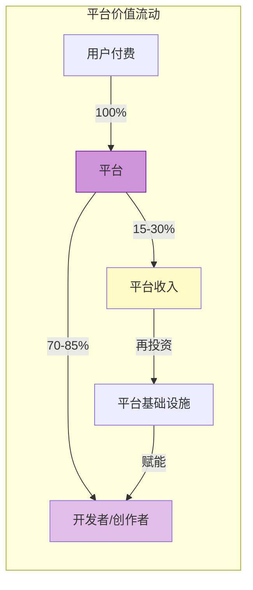

| 平台 | 抽成比例 | 收费模式 |
|---|---|---|
| **GPT Store** | 未公开分成 | 基于使用量 |
| **Poe** | 创作者获得订阅分成 | 订阅制 |
| **扣子 (Coze)** | 免费开放 | 增值服务收费 |
| **SkillHub (腾讯)** | SkillPay 支付体系 | 技能付费+平台抽成 [^1] |

---

## 四、代表性 AI Platform 深度分析

### 4.1 Poe：AI 机器人平台

> [!example] Poe 的平台化路径
> Poe 从 Quora 旗下的 AI 对话工具起步，逐步演化为连接模型开发者和用户的 AI 机器人平台。

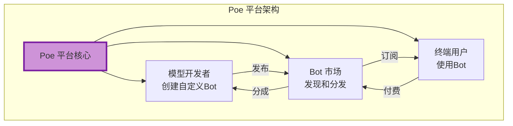

Poe 的平台特征：

- **多边参与**：模型开发者（Anthropic、OpenAI 等）+ 独立 Bot 创作者 + 终端用户
- **开放能力**：提供 Bot 创建 API，支持自定义 Prompt 和模型配置
- **网络效应**：用户越多 → 创作者激励越大 → Bot 越丰富 → 用户越多
- **价值分配**：订阅制，创作者按使用量获得分成

### 4.2 扣子（Coze）：AI Bot 构建和分发平台

> [!example] 扣子的平台化策略
> 扣子（字节跳动旗下）是一个 AI Bot 构建平台，让开发者和非开发者都能创建和部署 AI 机器人。

扣子的平台特征：

- **多边参与**：Bot 开发者 + 企业用户 + 终端用户 + 插件生态
- **开放能力**：可视化 Bot 构建器、插件系统、知识库、工作流编排
- **网络效应**：插件生态越丰富 → Bot 功能越强 → 用户越多 → 开发者越多
- **价值分配**：免费开放 + 企业级增值服务

### 4.3 Dify：AI 应用开发平台

> [!example] Dify 的平台化定位
> Dify 是一个开源的 LLM 应用开发平台，连接了模型提供商、应用开发者和企业用户。

Dify 的平台特征：

- **多边参与**：模型提供商（集成多个 LLM）+ 应用开发者 + 企业用户
- **开放能力**：可视化编排、RAG 管道、Agent 框架、API 发布
- **网络效应**：开源社区驱动，模板和插件生态持续丰富
- **价值分配**：开源核心 + 企业版付费

### 4.4 腾讯元宝生态：SkillHub + SkillPay

> [!example] 腾讯的 AI 平台化布局
> 腾讯在 WAIC 2026 上展示了其 AI 平台化战略。SkillHub 是国内最大的 AI Skills 社区，已上线 7.8 万个 AI Skills。SkillPay 支付体系首次在同一条链路上打通技能分发、Agent 调用与技能支付，商家可上架付费技能，用户可在任务流内直接完成支付。[^1]

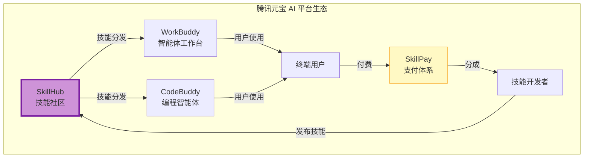

---

## 五、平台化的两种路径

### 5.1 横向平台化 vs 纵向平台化

> [!important] 平台化的战略选择
> 平台化不是只有一条路。根据 CSDN 作者 sunneo 提出的"工具→平台→生态"三阶段模型，平台化有两种截然不同的路径。[^2]

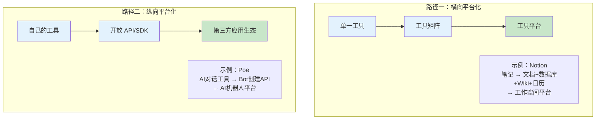

### 5.2 横向平台化详解

> [!tip] 横向平台化：从"一个工具"到"工具矩阵"

横向平台化的核心逻辑是**自己先做出多个好用的工具，形成工具矩阵，然后让这些工具之间产生协同效应**。

**代表性案例：Notion**

```
Notion 的横向平台化路径：
┌─────────────────────────────────────────────────────────────┐
│ 阶段一：笔记工具（2016-2018）                                │
│ ├── 核心功能：灵活的文本文档编辑器                            │
│ └── 用户心智："好用的笔记工具"                                │
│                                                              │
│ 阶段二：多功能工具（2019-2021）                              │
│ ├── 扩展：数据库、Wiki、项目管理、日历                        │
│ └── 用户心智："一站式工作空间"                                │
│                                                              │
│ 阶段三：工具平台（2022-）                                    │
│ ├── 开放：Notion API、Marketplace、模板市场                   │
│ └── 用户心智："可以搭建任何工作流"                            │
└─────────────────────────────────────────────────────────────┘
```

横向平台化的关键特征：

| 方面 | 描述 |
|---|---|
| **核心能力** | 自己做出多个好用的工具 |
| **协同效应** | 工具之间数据互通、体验一致 |
| **开放方式** | API + 模板市场 + 第三方集成 |
| **风险** | 战线过长，每个工具都可能被垂直玩家挑战 |
| **适合场景** | 有强品牌和用户基础，能带动多产品线 |

### 5.3 纵向平台化详解

> [!tip] 纵向平台化：让第三方在你的基础上构建

纵向平台化的核心逻辑是**开放自己的核心能力，让第三方开发者基于你的平台创造价值**。

**代表性案例：Poe**

```
Poe 的纵向平台化路径：
┌─────────────────────────────────────────────────────────────┐
│ 阶段一：AI 对话工具（2022-2023）                             │
│ ├── 核心功能：聚合多个 AI 模型，提供对话界面                   │
│ └── 用户心智："一个地方用所有 AI"                             │
│                                                              │
│ 阶段二：Bot 创建平台（2023-2024）                            │
│ ├── 开放：Bot 创建 API、自定义 Prompt                         │
│ └── 用户心智："创建自己的 AI 助手"                            │
│                                                              │
│ 阶段三：AI 机器人平台（2024-）                               │
│ ├── 生态：创作者经济、订阅分成、Bot 市场                       │
│ └── 用户心智："AI 应用商店"                                   │
└─────────────────────────────────────────────────────────────┘
```

纵向平台化的关键特征：

| 方面 | 描述 |
|---|---|
| **核心能力** | 提供强大的基础设施和 API |
| **协同效应** | 第三方应用丰富平台生态 |
| **开放方式** | API + SDK + 应用市场 + 分成机制 |
| **风险** | 与开发者竞争、质量管控、生态治理 |
| **适合场景** | 有核心技术能力，但难以覆盖所有场景 |

### 5.4 两种路径的对比

| 对比维度 | 横向平台化 | 纵向平台化 |
|---|---|---|
| **核心逻辑** | 自己做工具，形成矩阵 | 让别人做应用，自己提供平台 |
| **增长模式** | 产品线扩展 | 生态扩展 |
| **控制力** | 强（所有工具自己控制） | 弱（依赖第三方开发者） |
| **创新速度** | 受限于自身资源 | 生态驱动，创新更快 |
| **风险** | 战线过长 | 生态失控 |
| **典型案例** | Notion、飞书 | Poe、扣子、Dify |
| **AI 领域适用性** | 适合有强大产品力的公司 | 适合有强大技术能力的公司 |

---

## 六、平台阶段的关键决策

### 6.1 决策一：开放什么？

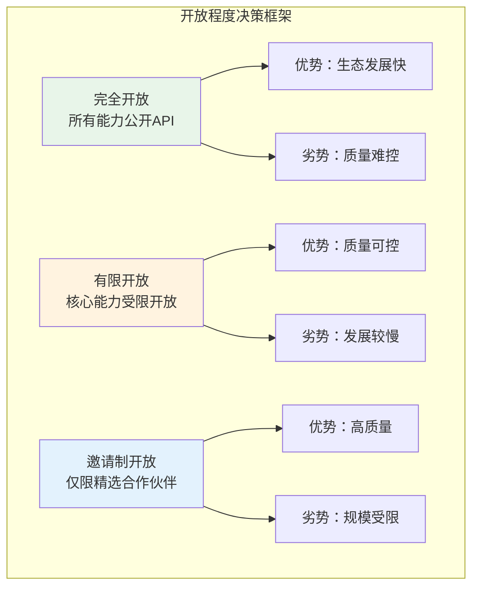

| 开放程度 | 适用场景 | 代表平台 |
|---|---|---|
| **完全开放** | 基础设施型平台，需要快速扩展生态 | OpenAI API |
| **有限开放** | 垂直领域平台，需要质量控制 | 扣子 (Coze) |
| **邀请制开放** | 高端市场，需要保证服务水平 | 企业级 AI 平台 |

### 6.2 决策二：如何收费？

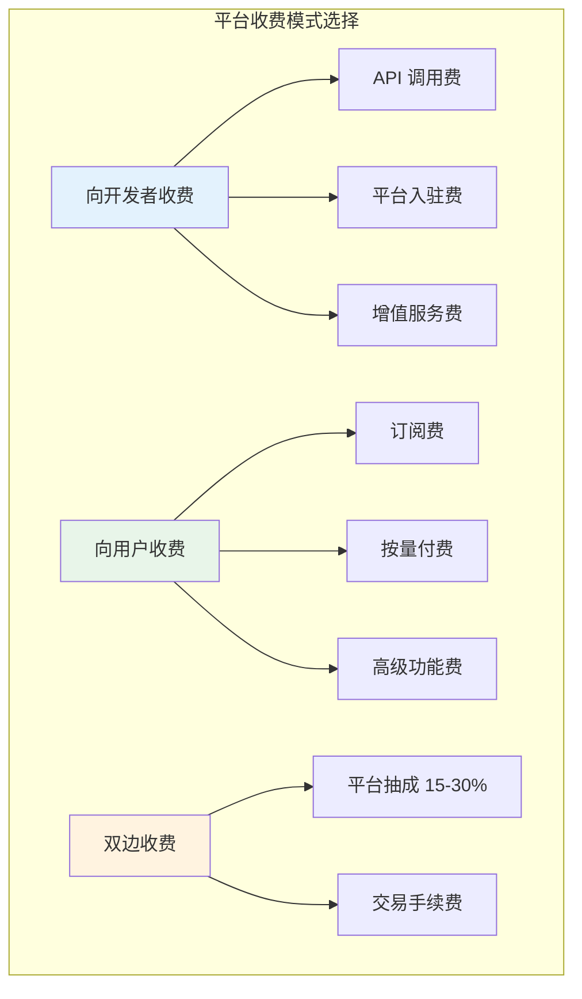

> [!tip] 收费策略建议
> - **早期**：偏向免费或低费率，降低开发者入驻门槛，追求生态规模
> - **成长期**：引入分层定价，对高价值开发者提供更好的服务
> - **成熟期**：逐步提高抽成比例，但需确保生态参与者仍有利可图

### 6.3 决策三：如何平衡竞争与合作？

> [!warning] 平台化的核心矛盾
> 平台自己也在做产品，第三方开发者也在做产品。两者之间如何平衡？这是平台阶段最棘手的问题。

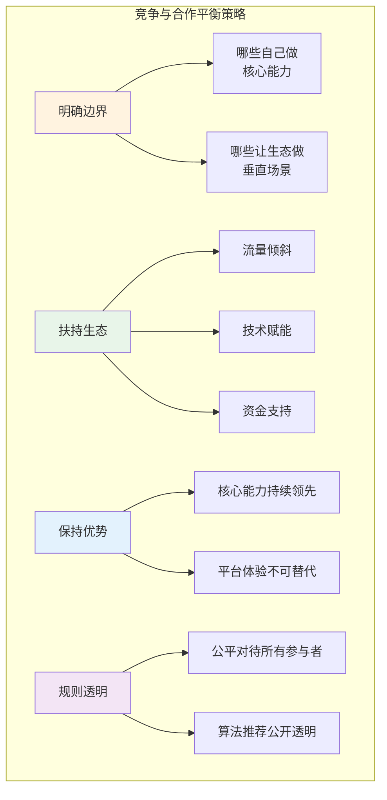

---

## 七、过早平台化的风险

> [!danger] 过早平台化：AI 产品最常见的战略错误
> 在核心功能体验还不佳时就做平台，是目前 AI 领域最常见的战略失误。结果是：**平台无人问津，工具也做不好**。[^2]

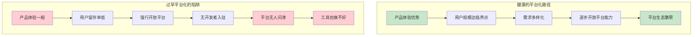

> [!warning] 过早平台化的症状
> - 核心功能体验不佳，用户留存率低
> - 没有用户愿意为工具付费
> - 却投入大量资源做开放平台、开发者文档、SDK
> - 结果：开发者因没有用户基础而不愿入驻，平台冷启动失败

**典型案例对比**：

| 平台 | 平台化时机 | 结果 |
|---|---|---|
| **OpenAI GPT Store** | 已有 1 亿+ 用户基础后 | 数百万 GPTs 创建，生态初具规模 |
| **某过早平台化的 AI 工具** | 核心产品 DAU 不到 1 万 | 几乎无开发者入驻，平台形同虚设 |

---

## 八、Platform 阶段的能力评估矩阵

> [!tip] 评估一个产品是否达到了 Platform 阶段

| 评估维度 | 未达标（Product 阶段） | 达标（Platform 阶段） | 卓越（成熟 Platform） |
|---|---|---|---|
| **多边参与** | 只有平台方和用户 | 有开发者/创作者参与 | 多角色生态繁荣 |
| **开放能力** | 无或仅内部 API | 有公开 API/SDK | 完善的开发者工具链 |
| **网络效应** | 线性增长 | 双边网络效应显现 | 正向飞轮自运转 |
| **价值分配** | 平台自己赚钱 | 有分成机制 | 生态参与者普遍盈利 |
| **生态治理** | 无治理机制 | 有基本审核规则 | 完善的治理体系 |
| **开发者数量** | < 100 | 100 - 10,000 | > 10,000 |

---

## 九、从 Platform 到 Ecosystem 的展望

> [!note] 下一阶段的预告
> 当平台积累了足够多的开发者和用户，并且平台的 API/协议/标准开始被行业广泛接受时，就进入了 [[02-AI趋势与素养/AI应用发展阶段演进/06_阶段六：Ecosystem——定义行业标准的基础设施|阶段六：Ecosystem]]。生态阶段的核心不再是"连接多方价值"，而是"定义行业标准"。

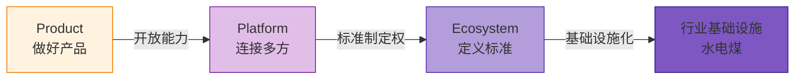

---

## 十、本章小结

> [!summary] 核心要点
> 1. **Platform 的定义**：AI 平台不仅提供服务，还连接服务的提供者和使用者，核心是双边网络效应
> 2. **四大核心特征**：多边参与、开放能力、网络效应、价值分配
> 3. **平台化的两种路径**：横向平台化（自己做工具矩阵）和纵向平台化（让第三方构建）
> 4. **关键决策**：开放什么、如何收费、如何平衡竞争与合作
> 5. **最大风险**：过早平台化——核心产品体验不佳时做平台，两头落空

> [!question] 思考题
> - OpenAI 的 GPT Store 是否成功实现了平台化？它的核心挑战是什么？
> - 腾讯的 SkillHub + SkillPay 模式能否解决 AI 技能变现的难题？
> - 一个 AI Product 团队如何判断自己是否做好了平台化的准备？

---

## 参考资料

[^1]: 唐洛，"腾讯WAIC亮出全栈AI成果：智能体落地千行百业，具身智能打破'缸中之脑'"，时代在线，2026年7月20日。[$TRAE_REF](https://www.time-weekly.com/wap-article/331153)

[^2]: sunneo，"从工具到平台：AI产品的演进路径与战略卡位"，CSDN，2026年5月24日。[$TRAE_REF](https://blog.csdn.net/sunneo/article/details/161347144)

---

## 相关文档

- [[02-AI趋势与素养/AI应用发展阶段演进/04_阶段四：AI Product——从功能到解决方案|阶段四：AI Product]] —— 理解 Platform 的上游阶段
- [[02-AI趋势与素养/AI应用发展阶段演进/06_阶段六：Ecosystem——定义行业标准的基础设施|阶段六：Ecosystem]] —— 理解 Platform 的下一个演进阶段
- [[02-AI趋势与素养/AI应用发展阶段演进/03_阶段三：AI Skill——从能力到能力单元的标准化|阶段三：AI Skill]] —— 平台上的核心价值单元