# 阶段六：Ecosystem——定义行业标准的基础设施

> [!abstract] 本文定位
> 本文是"AI应用发展阶段演进"知识库的第六篇文档，也是六阶段模型的**终极阶段**。详细阐述 AI 生态的核心逻辑、护城河构建和战略陷阱。建议按照 [[02-AI趋势与素养/AI应用发展阶段演进/02_阶段一二：Chatbot与Copilot——AI的嘴和手|阶段一：Chatbot]] → [[02-AI趋势与素养/AI应用发展阶段演进/02_阶段一二：Chatbot与Copilot——AI的嘴和手|阶段二：Copilot]] → [[02-AI趋势与素养/AI应用发展阶段演进/03_阶段三：AI Skill——从能力到能力单元的标准化|阶段三：AI Skill]] → [[02-AI趋势与素养/AI应用发展阶段演进/04_阶段四：AI Product——从功能到解决方案|阶段四：AI Product]] → [[02-AI趋势与素养/AI应用发展阶段演进/05_阶段五：Platform——连接多方价值的操作系统|阶段五：Platform]] → **阶段六：Ecosystem** 的顺序阅读。

---

## 一、六阶段全景回顾

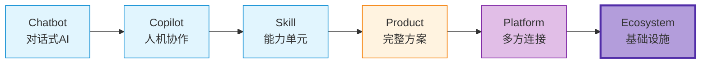

> [!info] 前五个阶段回顾
> - **Chatbot**：AI 能对话，价值在信息层面
> - **Copilot**：AI 辅助人类，嵌入现有流程
> - **Skill**：AI 能力单元化，可组合调用
> - **Product**：AI 成为产品核心引擎，提供完整解决方案
> - **Platform**：AI 连接多方价值，构建网络效应
>
> 前五个阶段有一个共同点：**你仍然在经营一个"产品"或"平台"**。而 Ecosystem 阶段的本质变化是：**你不再经营一个产品，你经营的是整个行业的基础设施**。

---

## 二、Ecosystem 的定义

### 2.1 核心定义

> [!important] Ecosystem 的定义
> **AI Ecosystem（AI 生态）**不再是"一个公司的产品"，而是**行业的基础设施**。生态的制定者定义了游戏规则，其他人必须兼容。生态参与者离开你的成本极高，因为你提供的不是产品，而是"水电煤"。

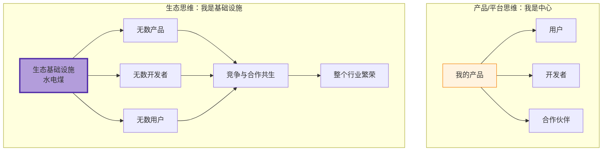

### 2.2 关键区分

| 维度 | Platform（第五阶段） | Ecosystem（第六阶段） |
|---|---|---|
| **核心逻辑** | 连接多方价值 | 定义行业标准 |
| **用户心智** | "这里什么都有" | "这是基础设施" |
| **竞争壁垒** | 网络效应 | 标准锁定 + 生态锁定 |
| **收入模式** | 平台抽成 + 产品收费 | 生态税收 + 基础设施费 |
| **战略重心** | 做大规模 | 制定规则 |
| **典型代表** | Poe、扣子、Dify | OpenAI 生态、微软 Copilot 生态 |

---

## 三、Ecosystem 的核心特征

### 3.1 标准制定权：你的 API/协议/格式成为行业标准

> [!important] 标准制定权是生态阶段的最高权力
> 在生态阶段，谁制定标准，谁就掌握话语权。你的 API 接口、数据格式、通信协议被行业广泛采用，竞争对手必须兼容你的标准。

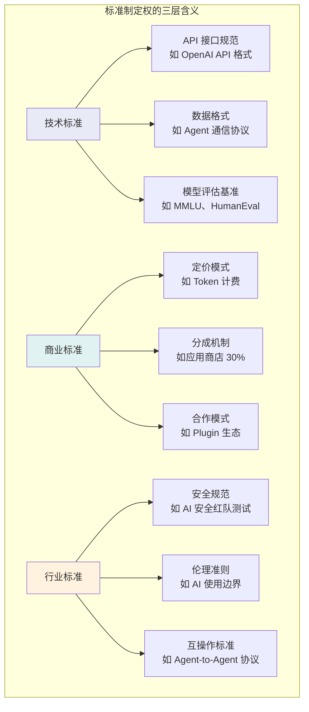

> [!example] 标准制定的经典案例
> - **OpenAI API 格式**：已成为行业事实标准，几乎所有第三方模型都提供了 OpenAI 兼容的 API 接口
> - **Agent2Agent (A2A) 协议**：Google 提出的 Agent 间通信协议，正在成为多 Agent 协作的行业标准
> - **GPT Store 的 Plugin 规范**：定义了 AI 应用如何接入外部工具的标准方式

### 3.2 生态控制力：离开成本极高

> [!important] 生态控制力的本质
> 生态控制力不是通过强制手段实现的，而是通过**让生态参与者离不开你**来实现的。当离开你的生态意味着放弃巨大利益时，你就拥有了真正的生态控制力。

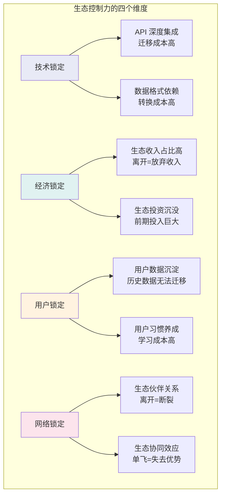

### 3.3 基础设施化：你不是产品，你是"水电煤"

> [!tip] 基础设施化的含义
> 当你的服务像水电煤一样，成为行业运行的基础条件时，你就完成了基础设施化。用户不再讨论"要不要用"，而是讨论"怎么用"。

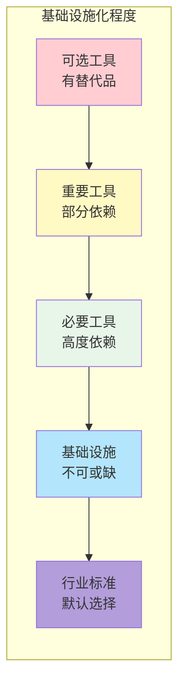

基础设施化的标志：

| 标志 | 说明 | 案例 |
|---|---|---|
| **默认选择** | 新项目/新用户默认使用 | 新 AI 应用默认用 OpenAI API |
| **不可替代** | 没有同等替代品 | GPT-4 级别的模型能力 |
| **行业依赖** | 行业运行依赖你的服务 | 大量 AI 应用基于 OpenAI 构建 |
| **定价权** | 你有定价主导权 | Token 定价由你定义 |
| **生态税收** | 从生态整体价值中获益 | 生态中每笔交易都与你相关 |

### 3.4 生态税收：从生态整体价值中持续获益

> [!important] 生态税收 vs 产品收入
> 产品收入是"你卖什么赚什么"，生态税收是"生态中产生的每一笔价值，你都能从中获益"。

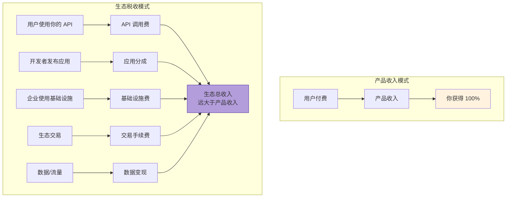

---

## 四、代表性 AI Ecosystem 深度分析

### 4.1 OpenAI 生态：API 成为行业标准的典范

> [!example] OpenAI 的生态构建
> OpenAI 从 ChatGPT 这个产品起步，逐步构建了以 API 为核心、GPT Store 为分发渠道的完整 AI 生态。

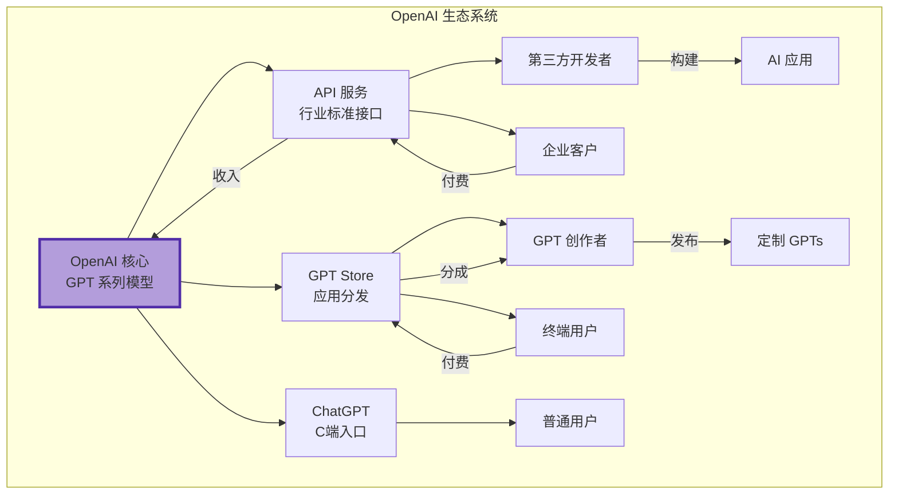

OpenAI 的生态特征：

- **标准制定权**：API 格式成为行业事实标准，几乎所有第三方模型都提供 OpenAI 兼容接口
- **生态控制力**：大量企业深度集成 OpenAI API，迁移成本极高
- **基础设施化**：GPT 系列模型是 AI 应用开发的默认选择
- **生态税收**：API 调用费 + GPT Store 分成 + ChatGPT 订阅

> [!quote] 生态阶段的规模
> 2026年，OpenAI 的生态影响力已经远超单一产品范畴。尽管 ChatGPT 出现环比负增长，但 OpenAI API 的调用量持续增长，因为大量 AI 应用和 Agent 都在底层调用 OpenAI 的模型。[^3]

### 4.2 阿里云 Agent-Native 生态：从云计算到 AI 基础设施

> [!example] 阿里云的 Agent-Native 战略
> 在 WAIC 2026 上，阿里云发布了 Agent-Native 技术栈，包括 AgentLoop、AgentTeams 和 AgentRun，标志着阿里云从"AI-Native"向"Agent-Native"的架构升级。[^1]

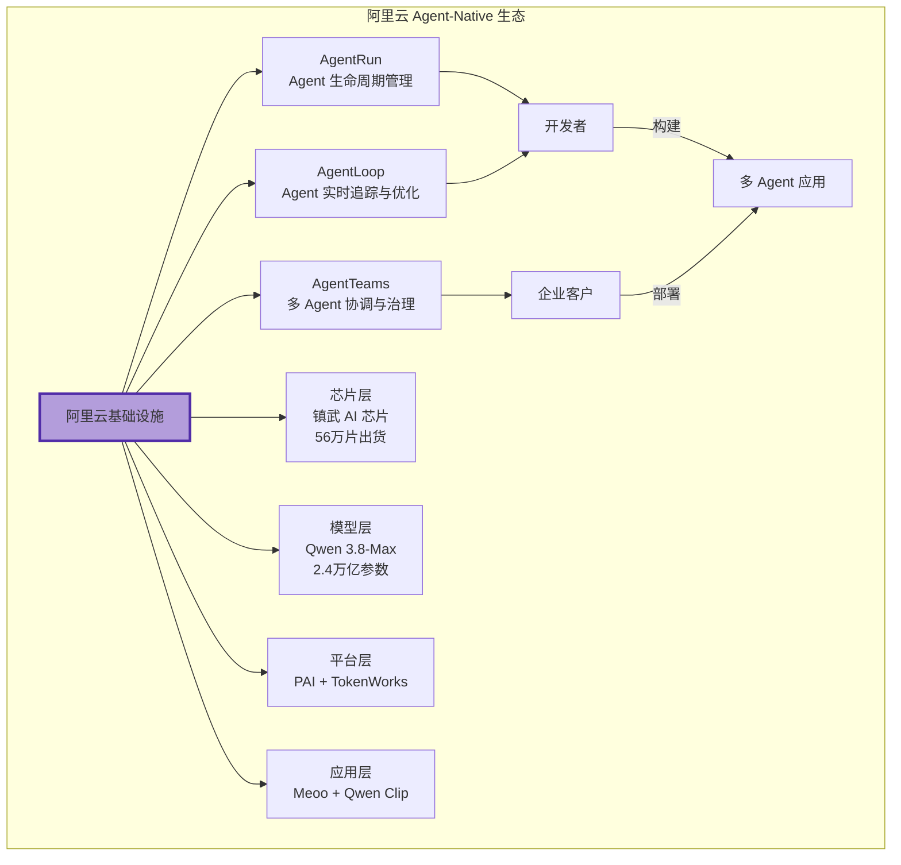

阿里云 Agent-Native 生态特征：

- **标准制定权**：Agent-Native 架构正在定义企业级 AI Agent 的部署和管理标准
- **生态控制力**：从芯片到应用到开发工具的全栈锁定
- **基础设施化**：将 Agent 开发、部署、运维变成像云计算一样的基础服务
- **生态税收**：芯片 + 云服务 + 模型调用 + 平台服务费

### 4.3 飞书 AI 生态：企业级 AI 应用生态

> [!example] 飞书的 AI 生态构建
> 飞书通过 SkillHub 构建企业级 AI 应用生态，将 AI 能力深度嵌入企业协作场景。

飞书 AI 生态特征：

- **标准制定权**：企业协作场景中的 AI 交互标准
- **生态控制力**：企业已将工作流和数据沉淀在飞书平台
- **基础设施化**：AI 成为企业协作的基础能力
- **生态税收**：飞书订阅 + AI 增值服务

### 4.4 Microsoft Copilot 生态：Agent 365 + Copilot Chat

> [!example] 微软的 AI 生态布局
> 微软通过 Agent 365 + Copilot Chat 构建企业级 AI Agent 生态。2026年8月，Microsoft 365 Copilot Chat 将连接 Agent 365 中的 Agent，支持多 Agent 协作。[^2]

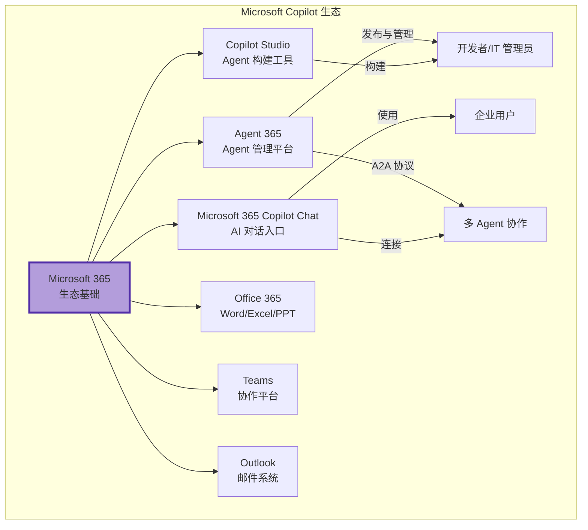

微软的生态特征：

- **标准制定权**：A2A (Agent-to-Agent) 协议正在成为多 Agent 协作的行业标准
- **生态控制力**：企业已将 Office 365 作为核心生产力工具，迁移成本极高
- **基础设施化**：Microsoft 365 已是企业办公的基础设施，AI 是自然延伸
- **生态税收**：Microsoft 365 订阅 + Copilot 增值 + Azure AI 服务

---

## 五、生态阶段的护城河

> [!important] 四重护城河
> 生态阶段的护城河是所有阶段中最深的，它由四重防线构成。

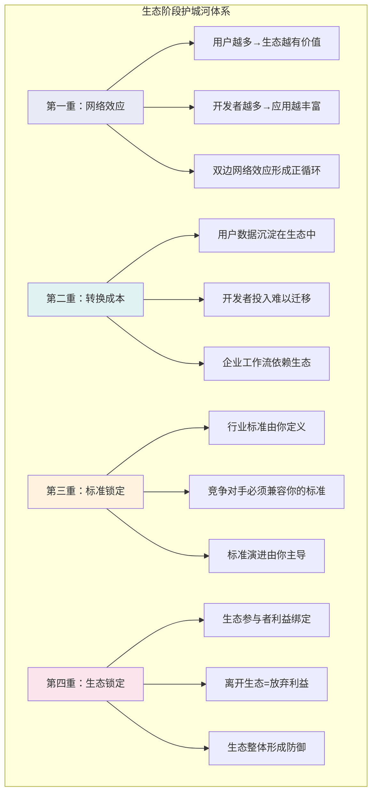

### 5.1 网络效应

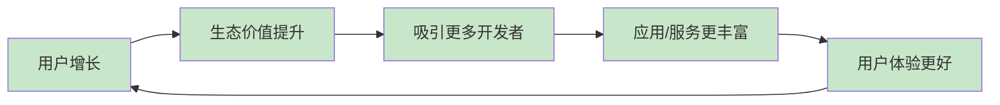

### 5.2 转换成本

| 转换成本类型 | 具体表现 | 估算 |
|---|---|---|
| **数据迁移成本** | 历史对话、用户数据、使用记录 | 数月到数年 |
| **技术重构成本** | API 重新集成、代码重写 | 数周到数月 |
| **团队学习成本** | 新工具培训、流程重建 | 数周到数月 |
| **业务中断成本** | 切换期间的业务停滞 | 不可估量 |
| **生态关系损失** | 失去生态伙伴和用户 | 不可逆 |

### 5.3 标准锁定

> [!tip] 标准锁定的威力
> 一旦你的 API/协议/格式成为行业标准，竞争对手就处于两难境地：要么兼容你的标准（承认你的主导地位），要么另起炉灶（面临巨大的兼容性成本）。

### 5.4 生态锁定

> [!tip] 生态锁定的本质
> 生态锁定不是技术锁定，而是**利益绑定**。当生态参与者的利益与你的生态深度捆绑时，他们自然会维护生态的稳定。

---

## 六、生态阶段的陷阱

> [!danger] 生态阶段的四个陷阱
> 生态阶段虽然是最高阶段，但也面临着独特的战略风险。

### 6.1 陷阱一：垄断

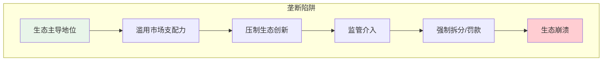

> [!warning] 垄断的警示信号
> - 生态参与者没有选择余地
> - 定价权完全由生态主导者掌握
> - 生态主导者随意更改规则
> - 新兴竞争者被系统性排除

### 6.2 陷阱二：封闭

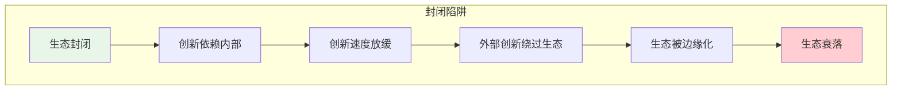

> [!warning] 封闭的警示信号
> - 不允许第三方接入核心能力
> - 数据不对外开放
> - 排斥外部创新
> - 生态参与者没有议价权

### 6.3 陷阱三：创新停滞

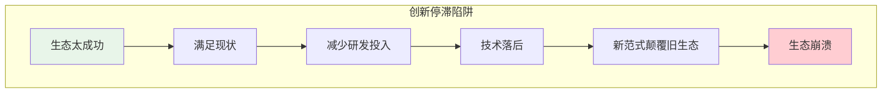

### 6.4 陷阱四：生态过度扩张

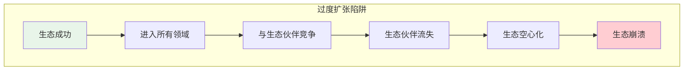

---

## 七、2026年趋势：全域 AI 生态成为主流

> [!quote] 2026年的关键趋势
> 2026年，全域 AI 生态成为主流。从单点工具到闭环服务，AI 赋能实体经济迈入新阶段。行业普遍预判：全域互联互通的 AI 生态闭环，将成为下一阶段 AIGC 落地实体经济的核心发展方向。[^5]

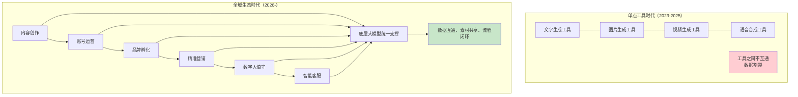

过去企业使用多款独立 AI 工具会产生诸多弊端：各个软件账号相互独立，创作素材无法共享；运营数据分散沉淀，无法形成完整用户资产；内容生产完毕后，分发、营销、客服环节无法衔接。[^5]

全域 AI 生态的核心价值：**覆盖经营全流程的一体化生态体系**——从内容创作到客户复购留存全部依托生态完成，中间衔接人力完全砍掉，运营效率大幅提升。

---

## 八、生态的网络结构

> [!important] 生态的网络拓扑
> 与 Platform 的"星型结构"（平台是中心）不同，Ecosystem 的网络结构更加复杂和去中心化。

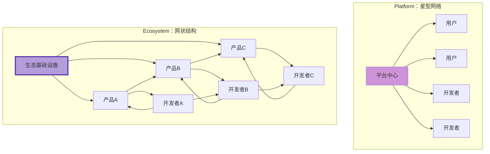

> [!tip] 生态网络 vs 平台网络
> - **平台网络**：中心化，平台是唯一枢纽，所有连接都经过平台
> - **生态网络**：去中心化/多中心化，基础设施层提供底层能力，生态参与者之间可以自由连接

---

## 九、从 Platform 到 Ecosystem 的跃迁条件

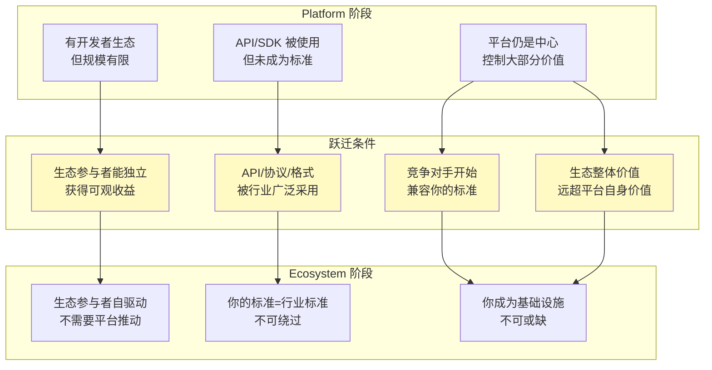

---

## 十、Ecosystem 阶段的能力评估矩阵

> [!tip] 评估一个生态是否达到了 Ecosystem 阶段

| 评估维度 | 未达标（Platform 阶段） | 达标（Ecosystem 阶段） | 卓越（成熟 Ecosystem） |
|---|---|---|---|
| **标准制定权** | 标准仅限于自身平台 | 标准被行业部分采用 | 标准=行业默认规范 |
| **生态控制力** | 靠规则和合同控制 | 靠利益绑定控制 | 离开生态=不可承受之重 |
| **基础设施化程度** | 重要工具 | 必要工具 | 像水电煤一样不可或缺 |
| **生态参与者收益** | 少数头部获利 | 多数参与者获利 | 生态经济自循环 |
| **创新来源** | 主要来自平台方 | 平台+生态共同创新 | 生态创新远超平台创新 |
| **去中心化程度** | 高度中心化 | 多中心化 | 生态可脱离主导者运行 |

---

## 十一、六阶段模型的完整总结

### 11.1 六阶段全景对比

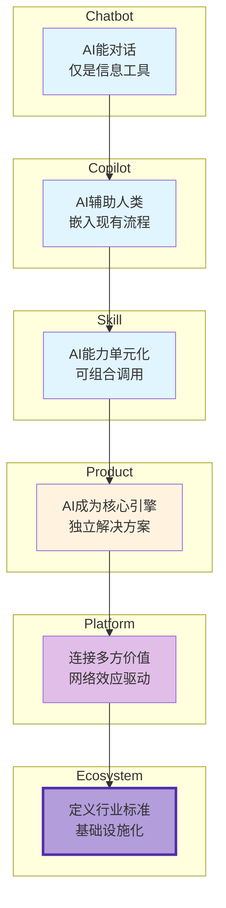

| 阶段 | 核心变化 | 价值创造 | 竞争壁垒 | 代表案例 |
|---|---|---|---|---|
| **Chatbot** | 从"不说话"到"会说话" | 信息提供 | 模型能力 | ChatGPT |
| **Copilot** | 从"会说话"到"会帮忙" | 流程辅助 | 场景集成 | GitHub Copilot |
| **Skill** | 从"会帮忙"到"可组合" | 能力单元 | 平台生态 | GPTs |
| **Product** | 从"功能"到"解决方案" | 完整闭环 | 数据飞轮 | Cursor, Perplexity |
| **Platform** | 从"自己做"到"连接多方" | 多方共创 | 网络效应 | Poe, 扣子 |
| **Ecosystem** | 从"平台"到"基础设施" | 标准制定 | 生态锁定 | OpenAI, 微软 |

### 11.2 演进的核心逻辑

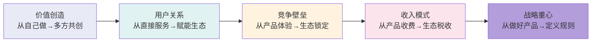

---

## 十二、本章小结

> [!summary] 核心要点
> 1. **Ecosystem 的定义**：AI 生态不再是"一个公司的产品"，而是行业的基础设施，生态制定者定义了游戏规则
> 2. **四大核心特征**：标准制定权、生态控制力、基础设施化、生态税收
> 3. **四重护城河**：网络效应、转换成本、标准锁定、生态锁定
> 4. **四大陷阱**：垄断、封闭、创新停滞、生态过度扩张
> 5. **2026年趋势**：全域 AI 生态成为主流，从单点工具到闭环服务

> [!question] 思考题
> - 当前的 AI 行业中，哪些公司已经真正达到了 Ecosystem 阶段？哪些还停留在 Platform 甚至 Product 阶段？
> - OpenAI 的生态是否面临"过度扩张"的风险？GPT Store 与第三方开发者的关系如何平衡？
> - 中国的 AI 生态格局与全球有何不同？阿里云、腾讯、字节的生态策略各有什么特点？
> - 生态阶段是否意味着垄断？监管机构应该如何平衡生态发展和反垄断？

---

## 参考资料

[^1]: Alibaba Cloud, "Alibaba Cloud Unveils Agent-Native Innovations at WAIC 2026", 2026年7月20日。[$TRAE_REF](https://www.alibabagroup.com/en-US/document-2016703577908576256)

[^2]: WindowsForum, "Microsoft 365 Copilot Chat Connects Agent 365 Agents in August 2026", 2026年7月17日。[$TRAE_REF](https://windowsforum.com/windows-news.4/microsoft-365-copilot-chat-connects-agent-365-agents-in-august-2026.439100/)

[^3]: 霞光AI实验室，"2026，AI正在走出对话框"，36氪，2026年6月24日。[$TRAE_REF](https://36kr.com/p/3866759935572612)

[^4]: 唐洛，"腾讯WAIC亮出全栈AI成果：智能体落地千行百业，具身智能打破'缸中之脑'"，时代在线，2026年7月20日。[$TRAE_REF](https://www.time-weekly.com/wap-article/331153)

[^5]: 数字化创实践基地，"2026 全域 AI 生态成主流：从单点工具到闭环服务，AI 赋能实体经济迈入新阶段"，搜狐，2026年7月24日。[$TRAE_REF](https://m.sohu.com/a/1054317273_121873872/)

---

## 相关文档

- [[02-AI趋势与素养/AI应用发展阶段演进/05_阶段五：Platform——连接多方价值的操作系统|阶段五：Platform]] —— 理解 Ecosystem 的上游阶段
- [[02-AI趋势与素养/AI应用发展阶段演进/04_阶段四：AI Product——从功能到解决方案|阶段四：AI Product]] —— 理解生态中价值单元的产品形态
- [[02-AI趋势与素养/AI应用发展阶段演进/02_阶段一二：Chatbot与Copilot——AI的嘴和手|阶段一：Chatbot]] —— 回顾六阶段模型的起点