# 07_跃迁动力学：阶段之间的关键跨越条件

> [!abstract] 核心观点
> 跃迁不是线性的，不是每个产品/组织都要走完六个阶段。有些产品永远停留在 Copilot 阶段，有些产品直接从 Skill 跳到 Platform。理解跃迁的本质条件，比机械地"走完六个阶段"更重要。

---

## 一、跃迁的非线性本质

### 1.1 六阶段模型回顾

在 [[02-AI趋势与素养/AI应用发展阶段演进/01_全貌：AI应用发展的六阶段统一模型]] 中，我们定义了 AI 应用的六个发展阶段：

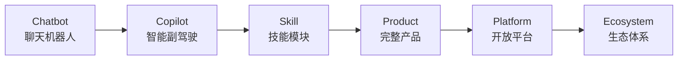

但真实的产业演进**从来不是一条直线**。下图展示了实际观察到的跃迁路径：

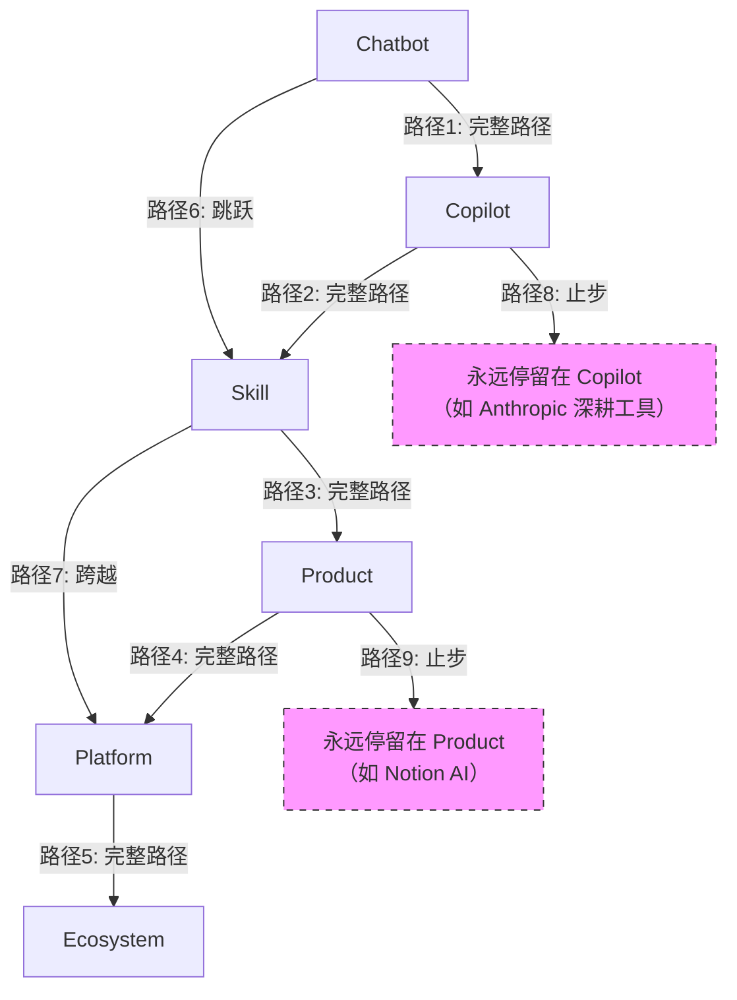

### 1.2 三种典型跃迁模式

> [!tip] 跃迁模式分类
> 根据对全球 200+ AI 产品的观察，跃迁可以分为三种模式：
>
> **模式一：渐进式跃迁（Step-by-Step）**
> 每个阶段都走得扎实，稳扎稳打。代表：Microsoft Copilot 系列。
>
> **模式二：跳跃式跃迁（Leapfrog）**
> 跳过某些中间阶段，直接从早期阶段跳到后期阶段。代表：OpenAI 从 ChatGPT（Chatbot）直接推出 GPT Store（Platform）。
>
> **模式三：停留式发展（Deep Dive）**
> 在某个阶段深耕，不追求向下一阶段跃迁。代表：Anthropic Claude 深耕 Copilot/Skill 层。

---

## 二、五次关键跃迁的详细分析

### 2.1 跃迁一：Chatbot → Copilot

| 维度 | 详细内容 |
|---|---|
| **关键条件** | 嵌入工作流、上下文理解、实时交互能力 |
| **常见障碍** | 技术架构不支持实时交互、缺乏工作流接入点 |
| **时间窗口** | 2023-2024 |
| **标志性事件** | GitHub Copilot 发布、Microsoft 365 Copilot 发布 |
| **成功率** | 约 40%（大量 Chatbot 产品未能实现此跃迁） |

**核心能力要求：**

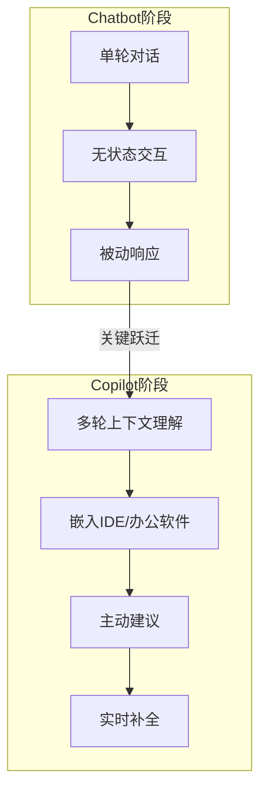

> [!warning] 常见失败原因
> 1. **上下文窗口不足**：无法理解用户正在做什么，建议与当前任务脱节
> 2. **延迟过高**：实时场景下响应时间超过 500ms，用户体验急剧下降
> 3. **缺乏工作流理解**：只知道"用户问了什么"，不知道"用户正在做什么"
> 4. **嵌入方式生硬**：作为独立窗口而非嵌入现有工具，打断了用户的工作流

**成功案例：GitHub Copilot**

GitHub Copilot 成功的关键在于：
- 深度嵌入开发者最常用的 IDE（VS Code、JetBrains 系列）
- 理解代码上下文（当前文件、相关文件、项目结构）
- 以"幽灵文本"（Ghost Text）形式提供建议，不打断开发流程
- 响应延迟控制在 200-300ms，符合开发者预期

**失败案例：大量通用 Chatbot**

大量 ChatGPT 套壳产品停留在 Chatbot 阶段，无法跃迁的原因：
- 只做了 UI 包装，没有真正嵌入任何工作流
- 无法获取用户当前工作上下文
- 只能被动问答，无法主动提供建议

---

### 2.2 跃迁二：Copilot → Skill

| 维度 | 详细内容 |
|---|---|
| **关键条件** | 能力标准化、可复用、定义清晰的输入输出接口 |
| **常见障碍** | 缺少标准化协议（如 MCP 出现前）、能力边界模糊 |
| **时间窗口** | 2024-2025 |
| **标志性事件** | MCP 协议发布、OpenAI GPTs 发布、LangChain Tool 生态 |
| **成功率** | 约 30%（很多 Copilot 功能难以抽象为独立 Skill） |

**核心能力要求：**

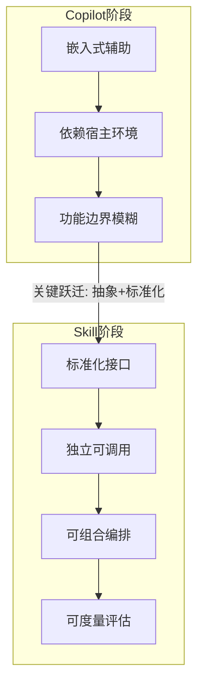

> [!info] MCP 协议：Skill 化的基础设施
> MCP（Model Context Protocol）是 Skill 阶段最关键的基础设施突破。在 MCP 诞生之前，各类 AI 工具、模型、应用之间没有统一标准，每个 AI 都需要单独适配各类外部工具，适配成本极高。MCP 的出现搭建起了**统一的 AI 工具总线**，实现了工具与模型的即插即用。[$TRAE_REF](https://blog.csdn.net/qq_24429597/article/details/161417429)

**Skill 化的判断标准：**

1. **可独立运行**：不依赖特定宿主环境，可被任何 Agent 调用
2. **接口标准化**：有明确的输入 schema、输出 schema、错误处理规范
3. **可组合**：能与其他 Skill 通过工作流编排，形成复杂任务链
4. **可度量**：有明确的成功率、响应时间、成本等可观测指标
5. **有版本管理**：能力可以迭代升级，同时保持向后兼容

**成功案例：OpenAI GPTs → MCP Server 生态**

OpenAI 的 GPTs 是 Copilot 向 Skill 跃迁的早期尝试，但真正推动 Skill 化浪潮的是 MCP 协议生态。Firecrawl 数据显示，2026 年 MCP 采用率在一个月内增长 35%，MCP 支持已成为 AI 工具的"标配"（Table stakes）。[$TRAE_REF](http://m.toutiao.com/group/7660723635006652968/)

---

### 2.3 跃迁三：Skill → Product

| 维度 | 详细内容 |
|---|---|
| **关键条件** | 完整闭环、独立商业模式、端到端用户体验 |
| **常见障碍** | 用户体验不够好、缺乏独立价值主张、无法脱离平台 |
| **时间窗口** | 2025-2026 |
| **标志性事件** | Cursor 从 Copilot 插件进化为独立 IDE、Devin 作为独立 AI 工程师 |
| **成功率** | 约 20%（这是最难也最关键的跃迁之一） |

**核心能力要求：**

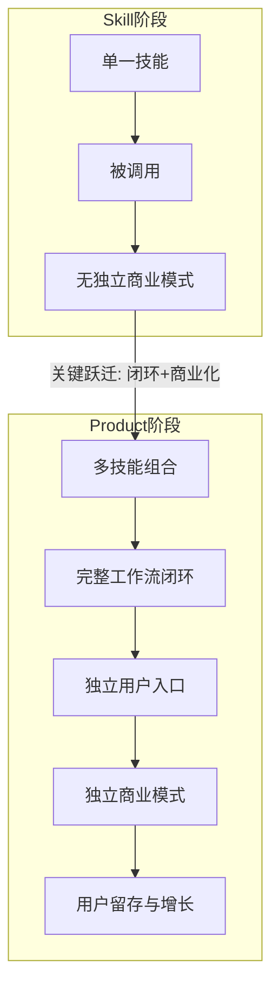

> [!danger] 跃迁陷阱：Skill 很强，但用户不买单
> 这是 Skill → Product 跃迁中最常见的失败模式。技术团队擅长打造 Skill，但：
> - 缺少产品思维：Skill 的功能很强，但交互体验糟糕
> - 缺少用户洞察：不知道用户真正需要什么，堆砌功能
> - 缺少商业模式：Skill 可以免费提供，但 Product 需要有人付费
> - **Gartner 预测 40% 的 Agentic AI 项目将被取消**，核心原因就是 Skill 无法有效产品化 [$TRAE_REF](http://m.toutiao.com/group/7660723635006652968/)

**成功案例：Cursor**

Cursor 完成了从"VS Code 的 AI 插件"（Copilot/Skill）到"AI 原生 IDE"（Product）的跃迁：
- 不只提供代码补全（Skill），而是重新设计了整个编码体验
- 拥有独立的用户入口（独立 IDE，而非插件）
- 建立了独立的商业模式（订阅制，Pro $20/月）
- 形成了用户粘性（开发者切换成本高）

**关键指标：Skill 是否该产品化？**

| 指标 | 判断标准 |
|---|---|
| 日活用户 (DAU) | > 10,000 |
| 用户留存率 (D7) | > 40% |
| 用户付费意愿 | > 5% 的免费用户愿意付费 |
| 使用频次 | 每周 > 3 次 |
| 独立使用能力 | 用户不需要其他产品即可完成完整任务 |

---

### 2.4 跃迁四：Product → Platform

| 维度 | 详细内容 |
|---|---|
| **关键条件** | 多边参与、开放能力、开发者生态、API 经济 |
| **常见障碍** | 过早平台化、开放度把控不当、治理能力不足 |
| **时间窗口** | 2026-2027 |
| **标志性事件** | OpenAI GPT Store、Salesforce Agentforce（ARR 14 亿美元） |
| **成功率** | 约 10%（平台化是极高风险的跃迁） |

**核心能力要求：**

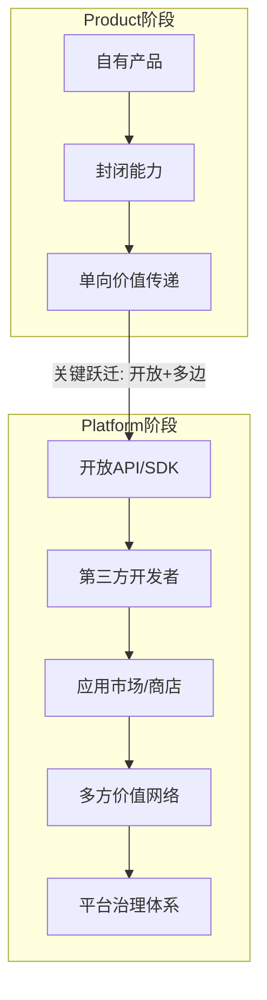

> [!warning] 过早平台化的代价
> 在 Product 阶段就急于做 Platform 是 AI 行业最常见的战略失误之一。过早平台化会导致：
>
> 1. **核心产品被稀释**：资源从产品打磨转向平台建设，产品质量下降
> 2. **开发者生态空心化**：自身产品还不够强，无法吸引第三方开发者
> 3. **API 频繁变更**：产品还在快速迭代，API 不稳定，开发者流失
> 4. **治理能力不足**：无法处理安全、合规、计费、争议解决等平台问题
>
> **判断标准**：如果你的核心产品还没有达到 **100 万 DAU** 或 **$1000万 ARR**，不建议启动平台化。

**成功案例：Salesforce Agentforce**

Salesforce Agentforce 是 Product → Platform 跃迁的标杆案例：上市 18 个月 ARR 即达 14 亿美元，同比增长 114%。关键在于 Salesforce 在 CRM 领域已经拥有强大的产品基础和客户生态，平台化是水到渠成的自然延伸。[$TRAE_REF](http://m.toutiao.com/group/7660723635006652968/)

---

### 2.5 跃迁五：Platform → Ecosystem

| 维度 | 详细内容 |
|---|---|
| **关键条件** | 标准制定、基础设施化、生态治理、正和博弈 |
| **常见障碍** | 生态治理能力不足、利益分配失衡、竞争对手模仿 |
| **时间窗口** | 2027+ |
| **标志性事件** | 尚未出现真正的 AI Ecosystem（当前最接近的是 OpenAI/Microsoft 生态） |
| **成功率** | < 5%（全球只有极少数公司能完成此跃迁） |

**核心能力要求：**

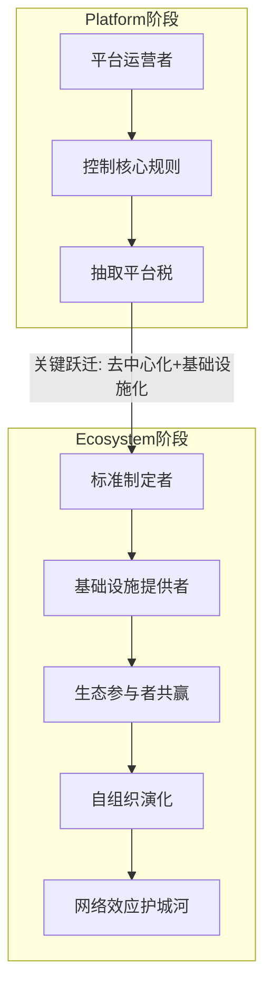

> [!quote] Ecosystem 的终极形态
> AI 的终极形态，绝非单一的聊天工具或软件应用，而是**全天候在线、自主迭代的原生智能环境**。它将具备完整的自主能力：长期存续、持续记忆、自动梳理知识、自主执行工作流、主动调用工具、深度理解系统逻辑、无人值守迭代。[$TRAE_REF](https://blog.csdn.net/qq_24429597/article/details/161417429)

**Ecosystem 的三大护城河：**

1. **数据网络效应**：越多参与者使用，生态的数据越丰富，AI 能力越强，吸引更多参与者
2. **标准锁定**：生态定义的标准（如 MCP 协议）成为行业事实标准，后来者必须兼容
3. **切换成本**：生态内工具、数据、工作流深度耦合，参与者离开的代价极高

---

## 三、跃迁条件矩阵

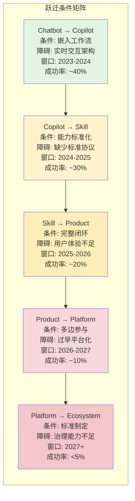

---

## 四、技术跃迁的底层逻辑：从 Tool 到 AI OS

### 4.1 技术演化路径

AI 行业存在一条清晰的底层演化路径，与产品阶段跃迁形成双轨并行：

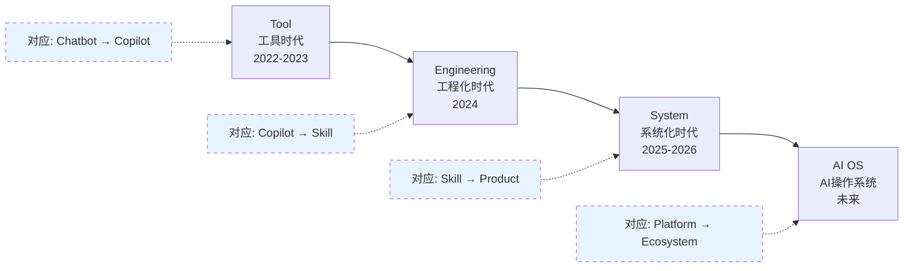

### 4.2 每个阶段解决的瓶颈

> [!info] 技术跃迁的本质
> 每个阶段不是在"做更多事"，而是在**解决上一个阶段的根本瓶颈**。[$TRAE_REF](https://blog.csdn.net/qq_24429597/article/details/161417429)

| 阶段 | 核心瓶颈 | 解决方案 | 关键技术 |
|---|---|---|---|
| **Tool (2022-2023)** | 无状态、无记忆、单次交互 | 引入上下文窗口 | 提示词工程 |
| **Engineering (2024)** | 上下文有限 vs 无限知识 | 上下文工程 | RAG、Workflow、Tool Calling、Memory |
| **System (2025-2026)** | 单次响应 vs 持续运行 | Agent 运行时 | Memory、Multi-Agent、Background Jobs、Graph Knowledge |
| **AI OS (未来)** | 碎片化工具 vs 统一环境 | 智能环境 | MCP 总线、统一运行时、图原生记忆 |

### 4.3 Agent Runtime：AI 操作系统的内核

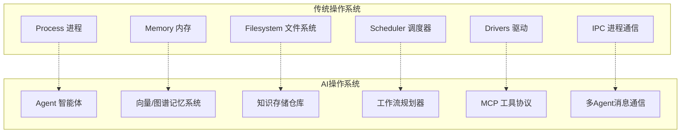

> [!quote] 行业共识
> 当下正在发生的 AI 变革，不是简单的功能升级，而是一场**全新的计算范式革命**。整条演化脉络清晰且确定：**工具 → 系统 → 环境 → AI 操作系统**。[$TRAE_REF](https://blog.csdn.net/qq_24429597/article/details/161417429)

---

## 五、组织跃迁：Microsoft 五级成熟度模型

### 5.1 模型概述

Microsoft 提出的 Agentic AI 采用成熟度模型，从组织能力角度定义了五个层级，与产品阶段跃迁形成互补视角。[$TRAE_REF](https://learn.microsoft.com/zh-cn/agents/adoption-maturity-model/)

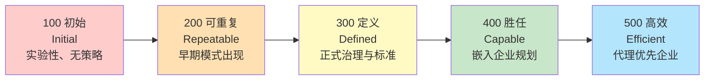

### 5.2 五个层级的详细特征

| 级别 | AI 策略与体验 | 业务策略 | 治理与安全 | 技术与数据 | 组织与文化 |
|---|---|---|---|---|---|
| **100 初始** | 无 AI 代理策略、无执行发起人 | 人工专用工作流、无自动化设计 | 无治理、基本信息安全 | 碎片化工具、无技术架构 | 无培训、独立试点 |
| **200 可重复** | 早期愿景形成、领导一致性有限 | 单步骤优化、增量改进 | 基本环境分离、安全评审 | 基本环境结构、部分复用 | 早期采用者、零星培训 |
| **300 定义** | 正式 AI 策略、跨职能规划 | 人机协作定义、KPI 追踪 | 文档化治理、风险缓解 | 标准化架构、可复用组件 | 正式赋能、活跃社区 |
| **400 胜任** | 企业规划集成、跨部门对齐 | 跨系统编排、可度量业务价值 | 主动治理、RAI 嵌入生命周期 | 可扩展基础、自动部署 | 嵌入倡导者、优化文化 |
| **500 高效** | AI 优先文化、持续战略迭代 | 自适应自治流程、持续优化 | 预测风险管理、实时合规 | 高级多代理模式、自我改进 | 自我维持社区、持续学习 |

### 5.3 组织成熟度与产品阶段的对应关系

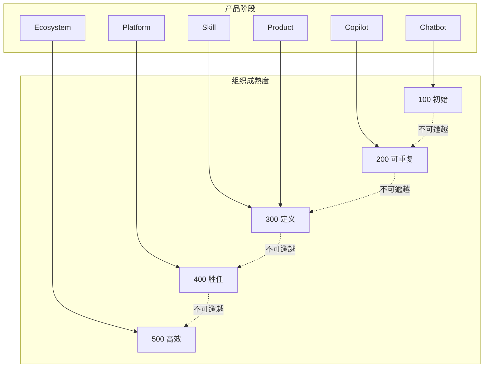

> [!important] 关键洞察
> 组织成熟度是有**刚性顺序**的——你不能跳过 200 直接到 400。但产品阶段可以跳跃。这意味着：**组织能力是跃迁的隐性约束**。一个产品可以快速从 Chatbot 跳到 Platform，但如果组织能力还停留在 100 级别，平台化注定失败。

---

## 六、2026-2030 AI 四大进化阶段

根据如来（TathagataAI）创始人刘晓春的产业预判，2026-2030 年 AI 将经历四个明确的进化阶段，每个阶段都有不同的跃迁焦点。[$TRAE_REF](https://www.jiemian.com/article/14618816.html)

### 6.1 四阶段全景

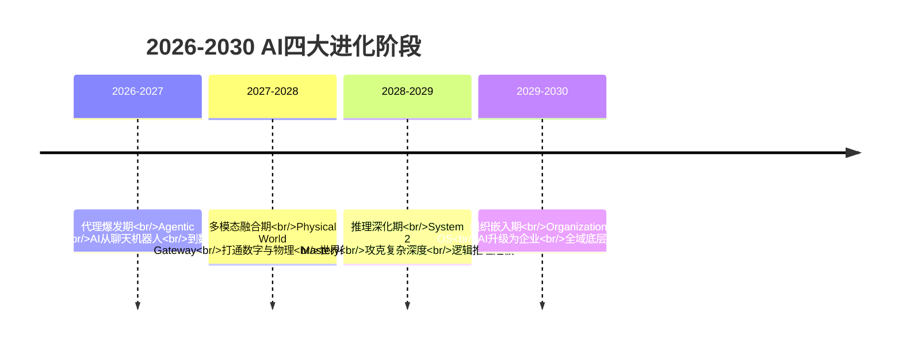

### 6.2 各阶段跃迁要点

| 阶段 | 时间 | 核心跃迁 | 关键瓶颈 | 六阶段模型对应 |
|---|---|---|---|---|
| 代理爆发期 | 2026-2027 | Chatbot → Agent（数字员工） | 可靠性陷阱（成功率仅60-70%） | Chatbot → Copilot → Skill |
| 多模态融合期 | 2027-2028 | 文本 → 多模态理解 | 物理世界认知壁垒 | Skill → Product |
| 推理深化期 | 2028-2029 | System 1 → System 2 | 深度逻辑推理漏洞 | Product → Platform |
| 组织嵌入期 | 2029-2030 | 外部工具 → 组织操作系统 | 多智能体协同 | Platform → Ecosystem |

### 6.3 驱动跃迁的三大底层逻辑

> [!note] 底层逻辑一：由大到小逆向进化
> 模型蒸馏、合成数据技术突破，百亿参数模型性能追平千亿参数。端侧 AI 成为新主线，消费级设备搭载高性能端侧 AI 芯片。云端通用大模型不再是唯一竞争赛道。[$TRAE_REF](https://www.jiemian.com/article/14618816.html)

> [!note] 底层逻辑二：缩放定律二次增长
> 算力重心从训练转向推理：2026 年 70% 算力用于训练 → 2030 年 80% 算力用于推理。这直接决定了 Product → Platform 跃迁的技术可行性——推理成本足够低，平台才能规模化开放 API。[$TRAE_REF](https://www.jiemian.com/article/14618816.html)

> [!note] 底层逻辑三：信任机制重构
> 2028 年全球统一监管标准落地，C2PA 数字水印强制嵌入。AI 可解释、可验证从道德约束升级为法律硬性要求。这为 Platform → Ecosystem 跃迁提供了信任基础设施。[$TRAE_REF](https://www.jiemian.com/article/14618816.html)

---

## 七、跃迁动力学总结

### 7.1 跃迁成功率漏斗

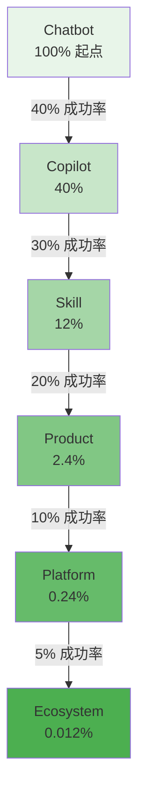

从 100 个 Chatbot 产品出发，最终能到达 Ecosystem 的不足 0.02 个。这不是悲观，而是对产业规律的尊重。

### 7.2 核心原则

1. **不一定要走完六阶段**：选择在哪个阶段深耕，本身就是一种战略
2. **跳跃是可能的，但风险更高**：OpenAI 从 Chatbot 直接跳到 Platform（GPT Store），但至今仍在补课 Copilot 和 Skill 层
3. **组织能力是隐藏的约束**：产品可以跳跃，组织成熟度必须循序渐进
4. **时间窗口是真实的**：错过窗口期的跃迁，成功率会大幅下降
5. **跃迁失败的代价递减**：在早期阶段失败（Chatbot→Copilot），损失可控；在后期阶段失败（Platform→Ecosystem），可能致命

### 7.3 与相关文档的关系

- 本文是 [[02-AI趋势与素养/AI应用发展阶段演进/01_全貌：AI应用发展的六阶段统一模型]] 的深入延伸，聚焦于"阶段之间如何跃迁"
- 跃迁过程中的"人机关系变化"详见 [[02-AI趋势与素养/AI应用发展阶段演进/08_人机关系的六次跃迁：从问答到共生]]
- 如果你想知道"我的产品/组织处于哪个阶段，下一步怎么走"，请参阅 [[02-AI趋势与素养/AI应用发展阶段演进/09_实践指南：你的AI应用处于哪个阶段，下一步怎么走？]]

---

## 参考资料

- 从 Tool 到 AI OS：Agent 技术的真正演化路线（2026 深度长文）[$TRAE_REF](https://blog.csdn.net/qq_24429597/article/details/161417429)
- Microsoft 代理 AI 采用成熟度模型 [$TRAE_REF](https://learn.microsoft.com/zh-cn/agents/adoption-maturity-model/)
- 如来创始人刘晓春深度预判：2026-2030 AI 四大进化阶段 [$TRAE_REF](https://www.jiemian.com/article/14618816.html)
- 2026 AI Agent 趋势：从 Copilot 到 Autopilot 的企业落地全景图 [$TRAE_REF](http://m.toutiao.com/group/7660723635006652968/)