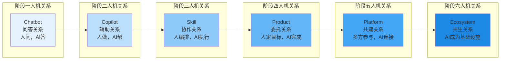
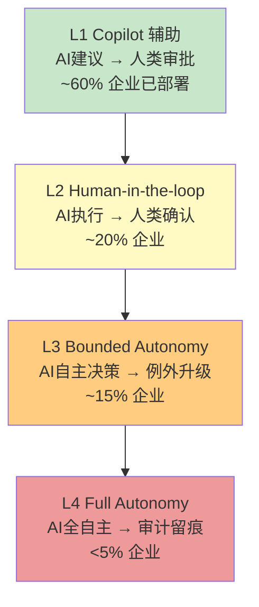
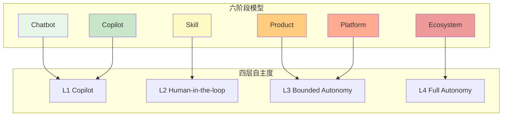
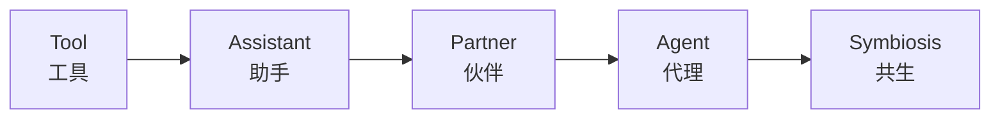
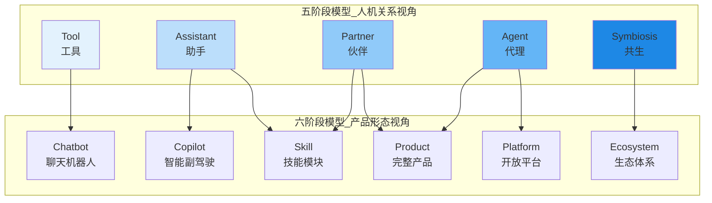
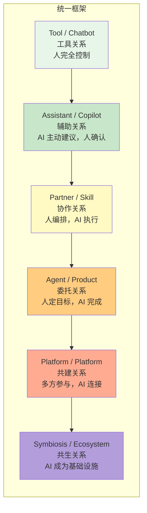
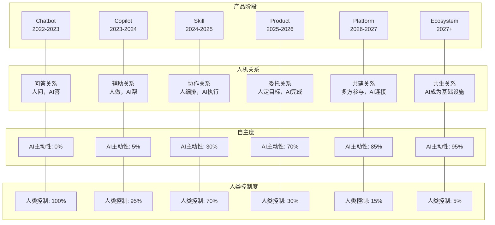
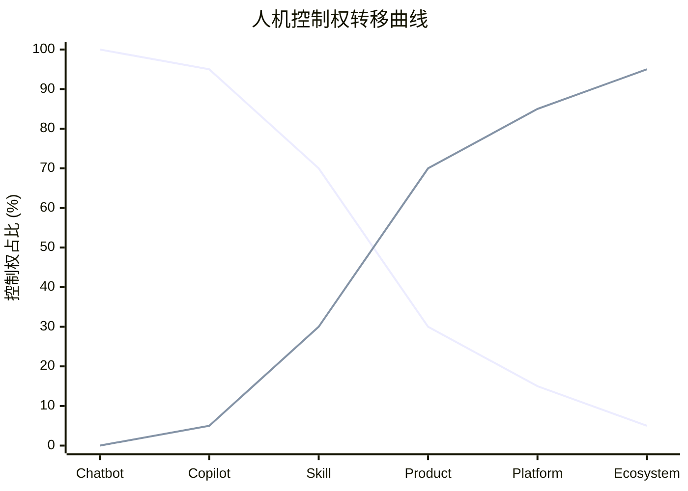
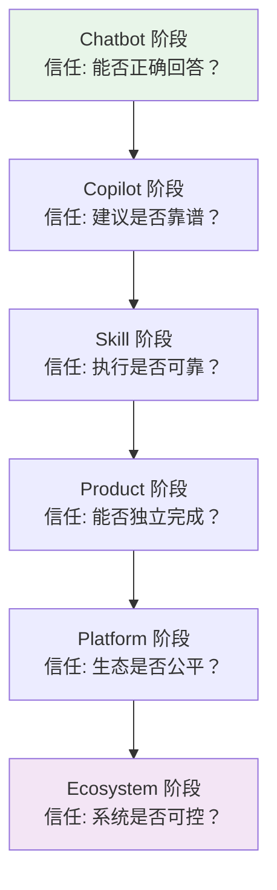

# 08_人机关系的六次跃迁：从"问答"到"共生"

> [!abstract] 核心观点
> AI 应用发展的六个阶段，本质上也是人机关系的六次跃迁。每一次产品阶段的升级，都伴随着人类角色的重新定义——从"提问者"到"监督者"再到"共生者"。理解人机关系的变化，是理解 AI 应用发展底层逻辑的钥匙。

---

## 一、六阶段对应的人机关系全景

### 1.1 人机关系跃迁总览

### 1.2 六阶段人机关系详细对照

| 阶段 | 人机关系 | 谁主导 | 人类角色 | AI 角色 | 典型场景 |
|---|---|---|---|---|---|
| **Chatbot** | 问答关系 | 人问，AI答 | 提问者 | 回答者 | "帮我写一封邮件" |
| **Copilot** | 辅助关系 | 人做，AI帮 | 操作者 | 辅助者 | "帮我补全这段代码" |
| **Skill** | 协作关系 | 人编排，AI执行 | 编排者 | 执行者 | "用这个技能分析简历" |
| **Product** | 委托关系 | 人定目标，AI完成 | 委托人 | 完成者 | "帮我做一个市场分析报告" |
| **Platform** | 共建关系 | 多方参与，AI连接 | 参与者 | 连接者 | "在我的平台上发布你的AI应用" |
| **Ecosystem** | 共生关系 | AI成为基础设施 | 共生者 | 基础设施 | "AI原生企业日常运营" |

---

## 二、每一次人机关系跃迁的深度解析

### 2.1 第一次跃迁：从"问答"到"辅助"

> [!note] 关系变化
> **Chatbot 阶段**：人类是主动的提问者，AI 是被动的回答者。交互模式是"触发-响应"式的——人问了，AI 才答。AI 没有自主性，完全依赖人类的指令。
>
> **Copilot 阶段**：AI 开始"主动观察"。它不再等待人类提问，而是持续关注人类正在做什么，在合适的时机主动提供建议。人类依然是操作的主宰者，但 AI 从"被动等问"变成了"主动帮忙"。

**关键转变要素：**

| 维度 | Chatbot（问答） | Copilot（辅助） |
|---|---|---|
| 交互触发 | 人类主动提问 | AI 主动感知 + 人类触发 |
| AI 主动性 | 零 | 低（建议式） |
| 上下文理解 | 单次对话 | 持续工作流 |
| 人类控制度 | 100% | 95% |
| 典型体验 | "我能帮你什么？" | "我注意到你可能需要..." |

**案例：GitHub Copilot 的人机关系**

GitHub Copilot 是第一次人机关系跃迁的经典案例。在传统 Chatbot 模式下，开发者需要明确描述需求："帮我写一个 Python 函数，输入是列表，返回排序后的结果"。而在 Copilot 模式下，开发者只需开始写 `def sort_list(`，AI 就会自动理解上下文并提供完整的函数体建议。人类从"描述需求"变成了"确认建议"。

---

### 2.2 第二次跃迁：从"辅助"到"协作"

> [!note] 关系变化
> **Copilot 阶段**：AI 在人类的"身边"工作，提供建议，但每个建议都需要人类确认。AI 是"副驾驶"，人类是"主驾驶"。
>
> **Skill 阶段**：AI 的能力被封装成独立的、可调用的"技能模块"。人类不再需要时刻盯着 AI，而是像"编排员"一样，将多个技能组合成工作流。AI 获得了有限的自主执行权。

**关键转变要素：**

| 维度 | Copilot（辅助） | Skill（协作） |
|---|---|---|
| 交互模式 | 建议-确认 | 编排-执行 |
| AI 自主性 | 低（建议） | 中（执行） |
| 人类角色 | 操作者 | 编排者 |
| 工作单元 | 单个建议 | 独立技能模块 |
| 人类控制度 | 95% | 80% |

**案例：从"AI 帮我写代码"到"AI 帮我跑测试"**

在 Copilot 阶段，AI 帮助开发者写代码，但每行代码最终由人类决定。在 Skill 阶段，一个"代码审查 Skill"可以独立运行：它自动拉取 PR、分析代码变更、检查安全漏洞、生成审查报告，最终将结果交给人类复审。人类从"逐行确认"升级为"批量审查"。

---

### 2.3 第三次跃迁：从"协作"到"委托"

> [!note] 关系变化
> **Skill 阶段**：人类需要知道"有哪些技能可用"，并主动编排它们。AI 是"被调用的工具集"。
>
> **Product 阶段**：AI 产品封装了完整的端到端能力。人类只需要下达目标，AI 自主完成从规划到执行的整个过程。这是人机关系中最关键的一次跃迁——人类从"过程控制"转向"目标管理"。

**关键转变要素：**

| 维度 | Skill（协作） | Product（委托） |
|---|---|---|
| 交互模式 | 人编排流程 | 人设定目标 |
| AI 自主性 | 中（执行） | 高（规划+执行） |
| 人类角色 | 编排者 | 委托人 |
| 工作单元 | 技能组合 | 端到端任务 |
| 人类控制度 | 80% | 50% |

**案例：Devin —— 从"AI 辅助编程"到"AI 工程师"**

Devin 是一个标志性的 Product 阶段 AI 应用。用户不需要告诉它"先做什么再做什么"，只需要说"帮我修复这个 Bug"或"帮我实现这个功能"。Devin 自主完成代码理解、方案设计、实现、测试、提交的全流程。人类从"写代码"变成了"审代码"，从"做"变成了"验"。

---

### 2.4 第四次跃迁：从"委托"到"共建"

> [!note] 关系变化
> **Product 阶段**：人与 AI 是"一对一"的关系——一个用户使用一个 AI 产品。价值单向流动：AI 产品为用户创造价值。
>
> **Platform 阶段**：AI 产品开放为平台，吸引了第三方开发者、企业客户、终端用户等多方参与。AI 的角色从"完成者"升级为"连接者"——它连接不同参与者的需求和能力，促成多方价值交换。

**关键转变要素：**

| 维度 | Product（委托） | Platform（共建） |
|---|---|---|
| 参与者 | 用户 + AI 产品 | 开发者 + 用户 + 平台 + AI |
| 价值流动 | 单向（产品→用户） | 多向（网络效应） |
| AI 角色 | 完成者 | 连接者 |
| 人类角色 | 委托人 | 参与者/共建者 |
| 人类控制度 | 50% | 30%（平台规则） |

**案例：OpenAI GPT Store**

GPT Store 是典型的 Platform 阶段人机关系。OpenAI 不再只是提供 AI 产品，而是搭建了一个"AI 应用市场"。任何人都可以创建和发布自己的 GPTs，其他用户可以使用和付费。AI 在这里扮演"连接者"角色——连接创作者和消费者，连接需求和能力。

---

### 2.5 第五次跃迁：从"共建"到"共生"

> [!note] 关系变化
> **Platform 阶段**：平台运营者仍然控制着核心规则，参与者在平台框架内活动。AI 是平台的"连接组织"。
>
> **Ecosystem 阶段**：AI 不再是某个平台的专属能力，而是成为像电力、互联网一样的**基础设施**。人类不再"使用 AI"，而是"生活在 AI 环境中"。AI 像空气一样无处不在，时刻在线，自主运行。

**关键转变要素：**

| 维度 | Platform（共建） | Ecosystem（共生） |
|---|---|---|
| AI 定位 | 平台能力 | 基础设施 |
| 人类角色 | 参与者 | 共生者 |
| 依赖关系 | 人类依赖平台 | 相互依存 |
| AI 可见性 | 显性（App 形态） | 隐性（环境形态） |
| 人类控制度 | 30% | 10%（治理框架） |

> [!quote] 共生的终极形态
> AI 的终极形态，绝非单一的聊天工具或软件应用，而是**全天候在线、自主迭代的原生智能环境**。以往我们需要主动打开 AI、主动提问、主动触发任务；未来的形态将完全不同：我们将持续处于 AI 环境中，AI 会后台常驻运行，自动完成记忆沉淀、知识整理、工作流执行、问题修复与自主学习。[$TRAE_REF](https://blog.csdn.net/qq_24429597/article/details/161417429)

---

## 三、人机关系的"自主度"光谱

### 3.1 从 Copilot 到 Autopilot 的四层成熟度模型

2026 年，行业从实践出发，总结出从 Copilot 到 Autopilot 的四层自主度成熟度模型。[$TRAE_REF](http://m.toutiao.com/group/7660723635006652968/)

### 3.2 四层模型的详细对比

| 层级 | 名称 | Agent 自主度 | 人类角色 | 典型场景 | 控制权分配 |
|---|---|---|---|---|---|
| **L1** | Copilot 辅助 | 建议 → 人类审批 | 审批者 | 智能客服建议回复、代码补全 | 人 95% : AI 5% |
| **L2** | Human-in-the-loop | 执行 → 人类确认 | 确认者 | 工单初筛、数据抽取 | 人 70% : AI 30% |
| **L3** | Bounded Autonomy | 自主决策 → 例外升级 | 监督者 | 报表生成、常规合规检查 | 人 30% : AI 70% |
| **L4** | Full Autonomy | 全自主 → 审计留痕 | 审计者 | 动态定价（限定区间）、库存自动补货 | 人 5% : AI 95% |

### 3.3 自主度与六阶段模型的对应关系

> [!warning] 企业落地警示
> 绝大多数企业跳过了 L2/L3，结果要么在 L1 徘徊不前，要么在 L3 以上翻车。Bounded Autonomy（L3）才是当前最务实的目标——在明确边界内给 AI 充分自主权，边界外升级给人类。[$TRAE_REF](http://m.toutiao.com/group/7660723635006652968/)

### 3.4 如何判断你的组织该升级到哪个层级

| 升级条件 | L1 → L2 | L2 → L3 | L3 → L4 |
|---|---|---|---|
| 错误率 | - | < 5% | < 1% |
| 人工干预率 | - | < 10% | < 1% |
| 治理模型 | 基本 | 成熟 | 完善 |
| 审计能力 | 无 | 有 | 完整 |
| 影子模式验证 | - | 1-2 周 | 4-8 周 |

---

## 四、与已有"人机协作阶段演进"知识库的整合

### 4.1 五阶段模型回顾

在已有的 [[02-AI趋势与素养/人机协作阶段演进/00_MOC_人机协作阶段演进中枢]] 知识库中，提出了经典的五阶段模型：

### 4.2 五阶段模型与六阶段模型的对应关系

> [!important] 整合框架
> 五阶段模型（Tool → Assistant → Partner → Agent → Symbiosis）从**人机关系**的视角描述演化，而六阶段模型（Chatbot → Copilot → Skill → Product → Platform → Ecosystem）从**产品形态**的视角描述演化。两者是互补的，可以精确定位对应关系。

### 4.3 六阶段模型如何补充和细化五阶段模型

| 五阶段 | 六阶段细化 | 补充内容 |
|---|---|---|
| **Tool** | Chatbot | 五阶段将 Chatbot 归为"工具"，六阶段进一步区分了 Chatbot 和 Copilot 的差异——前者被动问答，后者主动辅助 |
| **Assistant** | Copilot + Skill（部分） | 六阶段将"助手"拆分为两个层次：嵌入工作流的 Copilot 和可独立调用的 Skill |
| **Partner** | Skill（部分）+ Product（部分） | 六阶段明确了"伙伴"关系的两个子阶段：从协作编排到目标委托 |
| **Agent** | Product（部分）+ Platform（部分） | 六阶段区分了"代理"的两种形态：封闭产品 vs 开放平台 |
| **Symbiosis** | Ecosystem | 六阶段对"共生"的定义更具体：AI 成为基础设施，而非仅仅是"合作伙伴" |

### 4.4 整合后的统一人机关系框架

---

## 五、人机关系跃迁全景图

### 5.1 综合跃迁图谱

### 5.2 控制权转移曲线

---

## 六、人机关系的深层思考

### 6.1 人类角色的演变轨迹

> [!note] 从"操作者"到"共生者"
> 在六次跃迁中，人类角色经历了从"操作者 → 审批者 → 编排者 → 委托人 → 共建者 → 共生者"的演变。每一次演变，人类都从"执行层面"向上迁移到"决策层面"。
>
> 这不是"人被替代"的故事，而是"人被解放"的故事——从重复性劳动中解放出来，专注于只有人类能做的事情：定义目标、做出判断、建立关系、创造意义。

### 6.2 AI 角色的演变轨迹

> [!note] 从"工具"到"环境"
> AI 的角色经历了从"回答者 → 辅助者 → 执行者 → 完成者 → 连接者 → 基础设施"的演变。AI 从"被使用的工具"变成"我们生活在其中的环境"。
>
> 这与互联网的演变惊人地相似：互联网最初是"用来查信息的工具"，如今已成为"我们生活的基础设施"。AI 正在遵循同样的路径。[$TRAE_REF](https://blog.csdn.net/qq_24429597/article/details/161417429)

### 6.3 信任的演变

### 6.4 2026-2030 人机关系的前瞻

根据 2026-2030 AI 四大进化阶段的预判，未来五年人机关系将经历更深刻的变革：[$TRAE_REF](https://www.jiemian.com/article/14618816.html)

| 时间 | 阶段 | 人机关系变化 |
|---|---|---|
| 2026-2027 | 代理爆发期 | AI 从"辅助工具"变为"数字员工"，人类从"操作者"变为"管理者" |
| 2027-2028 | 多模态融合期 | AI 获得物理世界感知，人机交互从"屏幕"扩展到"空间" |
| 2028-2029 | 推理深化期 | AI 具备深度推理，人类将"思考"的部分工作委托给 AI |
| 2029-2030 | 组织嵌入期 | AI 成为组织操作系统，人类从"使用 AI"变为"与 AI 共治" |

---

## 七、总结

### 7.1 核心结论

1. **人机关系的六次跃迁是 AI 应用发展六阶段的"另一面"**：产品阶段定义了"AI 能做什么"，人机关系定义了"人类和 AI 如何相处"

2. **控制权的转移是渐进且不可逆的**：从 100% 人类控制到 5% 人类控制，每一次转移都伴随着信任的建立和验证

3. **人类的角色在"升级"而非"被替代"**：从执行者到决策者，从操作者到监督者，人类的独特价值（判断、创造、关系）在每一次跃迁中变得更加宝贵

4. **信任是跃迁的前提条件**：没有信任，就没有自主权的授予；没有自主权的授予，就没有人机关系的跃迁

5. **五阶段模型和六阶段模型是互补的**：前者从关系视角，后者从产品视角，共同构成完整的 AI 应用发展理论框架

### 7.2 与相关文档的关系

- 本文是人机关系视角的专题分析，与 [[02-AI趋势与素养/AI应用发展阶段演进/07_跃迁动力学：阶段之间的关键跨越条件]]（技术/组织视角）形成互补
- 六阶段模型的基础定义详见 [[02-AI趋势与素养/AI应用发展阶段演进/01_全貌：AI应用发展的六阶段统一模型]]
- 如果你想知道你的产品/组织处于哪个阶段，请参阅 [[02-AI趋势与素养/AI应用发展阶段演进/09_实践指南：你的AI应用处于哪个阶段，下一步怎么走？]]
- 五阶段人机关系模型详见 [[02-AI趋势与素养/人机协作阶段演进/00_MOC_人机协作阶段演进中枢]]

---

## 参考资料

- 从 Tool 到 AI OS：Agent 技术的真正演化路线（2026 深度长文）[$TRAE_REF](https://blog.csdn.net/qq_24429597/article/details/161417429)
- 2026 AI Agent 趋势：从 Copilot 到 Autopilot 的企业落地全景图 [$TRAE_REF](http://m.toutiao.com/group/7660723635006652968/)
- 如来创始人刘晓春深度预判：2026-2030 AI 四大进化阶段 [$TRAE_REF](https://www.jiemian.com/article/14618816.html)
- Microsoft 代理 AI 采用成熟度模型 [$TRAE_REF](https://learn.microsoft.com/zh-cn/agents/adoption-maturity-model/)