# 09_实践指南：你的AI应用处于哪个阶段，下一步怎么走？

> [!abstract] 核心观点
> 理论的价值在于指导实践。本文提供一套完整的"阶段诊断 + 行动指南"工具，帮助你判断自己的产品、能力或组织当前处于 AI 应用发展的哪个阶段，以及下一步应该如何行动。无论你是非技术个人、技术开发者、创业团队还是大厂管理者，都能找到适合自己的路径。

---

## 一、阶段自测工具：12 个问题精准定位

### 1.1 自测问卷

请对以下每个问题选择最符合你实际情况的选项。每个选项对应一个阶段，最后统计各阶段的出现次数，出现最多的阶段就是你当前所处的位置。

**问题 1：你的 AI 应用如何与用户交互？**
- A. 用户输入问题，AI 返回答案（Chatbot）
- B. AI 在用户工作时实时提供建议（Copilot）
- C. 用户调用特定的 AI 能力完成某个任务（Skill）
- D. 用户设定目标，AI 自主完成端到端任务（Product）
- E. 第三方可以在你的 AI 能力基础上构建应用（Platform）
- F. 你的 AI 能力已经成为行业的基础设施（Ecosystem）

**问题 2：你的 AI 应用的核心价值是什么？**
- A. 回答问题和生成内容（Chatbot）
- B. 提高用户的工作效率（Copilot）
- C. 提供可复用的标准化能力（Skill）
- D. 解决完整的业务问题（Product）
- E. 连接多方创造网络效应（Platform）
- F. 定义行业标准和基础设施（Ecosystem）

**问题 3：你的 AI 应用有独立的商业模式吗？**
- A. 免费或依赖其他产品变现（Chatbot）
- B. 作为现有产品的增值功能（Copilot）
- C. 按调用量计费或 API 收费（Skill）
- D. 有独立的订阅/付费模式（Product）
- E. 平台抽成 + 流量变现（Platform）
- F. 生态税收 + 基础设施服务费（Ecosystem）

**问题 4：你的用户如何描述你的 AI 应用？**
- A. "一个可以聊天的 AI"（Chatbot）
- B. "一个帮我提高效率的 AI 助手"（Copilot）
- C. "一个可以做某件事的 AI 工具"（Skill）
- D. "一个完整解决我问题的 AI 产品"（Product）
- E. "一个我可以发布 AI 应用的平台"（Platform）
- F. "一个 AI 基础设施"（Ecosystem）

**问题 5：你的 AI 应用需要多少人类参与？**
- A. 每一步都需要人类输入（Chatbot）
- B. AI 建议，人类确认每一步（Copilot）
- C. AI 执行子任务，人类编排流程（Skill）
- D. AI 自主完成，人类设定目标和验收（Product）
- E. 多方参与，AI 连接协调（Platform）
- F. AI 自主运行，人类仅做治理监督（Ecosystem）

**问题 6：你的 AI 应用的开放程度如何？**
- A. 完全封闭，仅内部使用（Chatbot）
- B. 嵌入特定平台/工具中（Copilot）
- C. 提供 API 接口供调用（Skill）
- D. 有独立的用户界面和体验（Product）
- E. 有开发者平台和应用市场（Platform）
- F. 开放标准，行业共建（Ecosystem）

**问题 7：你的 AI 应用的技术栈成熟度？**
- A. 基础模型 + 简单 Prompt（Chatbot）
- B. 模型 + 上下文工程 + 嵌入式集成（Copilot）
- C. 模型 + 标准化接口 + 工具调用（Skill）
- D. 多技能组合 + 工作流引擎 + 记忆系统（Product）
- E. 开放 API + 多租户 + 开发者工具（Platform）
- F. 统一运行时 + 标准协议 + 图原生记忆（Ecosystem）

**问题 8：你的团队规模和组织结构？**
- A. 个人或小团队，无明确分工（Chatbot）
- B. 有技术团队，但 AI 是辅助角色（Copilot）
- C. 有专门的 AI 工程师，维护技能模块（Skill）
- D. 有完整的产品团队（PM + 开发 + 设计 + 运营）（Product）
- E. 有平台运营 + 开发者关系 + 生态团队（Platform）
- F. 有行业标准制定 + 生态治理 + 研究团队（Ecosystem）

**问题 9：你的用户规模？**
- A. < 1,000 用户（Chatbot）
- B. 1,000 - 10,000 用户（Copilot）
- C. 10,000 - 100,000 用户（Skill）
- D. 100,000 - 1,000,000 用户（Product）
- E. 1,000,000+ 用户 + 第三方开发者（Platform）
- F. 行业级覆盖（Ecosystem）

**问题 10：你的 AI 应用的可复制性？**
- A. 高度定制，难以复制（Chatbot）
- B. 与特定平台绑定，部分可复制（Copilot）
- C. 标准化接口，可以在不同场景复用（Skill）
- D. 完整产品，可以直接复制到新市场（Product）
- E. 平台模式，可以通过合作伙伴扩展（Platform）
- F. 标准协议，行业自发扩散（Ecosystem）

**问题 11：你的 AI 应用面临的最大挑战是什么？**
- A. 如何让用户从"试用"变成"常用"（Chatbot）
- B. 如何将 AI 能力嵌入更多工作流（Copilot）
- C. 如何让技能更标准化、更可靠（Skill）
- D. 如何建立独立的商业模式和用户粘性（Product）
- E. 如何吸引第三方开发者和治理生态（Platform）
- F. 如何平衡开放与控制、制定行业标准（Ecosystem）

**问题 12：你的 AI 应用的"护城河"是什么？**
- A. 几乎没有护城河（Chatbot）
- B. 与特定平台的深度集成（Copilot）
- C. 技能的专业性和可靠性（Skill）
- D. 完整的用户体验和品牌认知（Product）
- E. 网络效应和开发者生态（Platform）
- F. 行业标准和基础设施锁定（Ecosystem）

### 1.2 结果解读

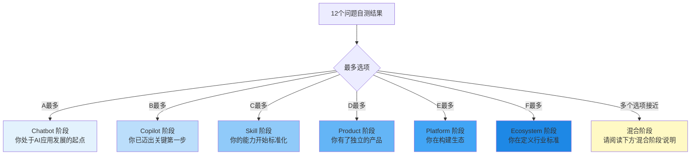

> [!tip] 混合阶段说明
> 如果你的答案分布在 2-3 个阶段，说明你正处于**跃迁过程中**。例如：
> - A 和 B 各占一半 → 你正在从 Chatbot 向 Copilot 跃迁
> - B 和 C 各占一半 → 你正在从 Copilot 向 Skill 跃迁
> - 此时应参考两个阶段的行动指南，优先完成较低阶段的基础建设

---

## 二、每个阶段的"下一步行动指南"

### 2.1 如果你在 Chatbot 阶段 → 如何迈入 Copilot

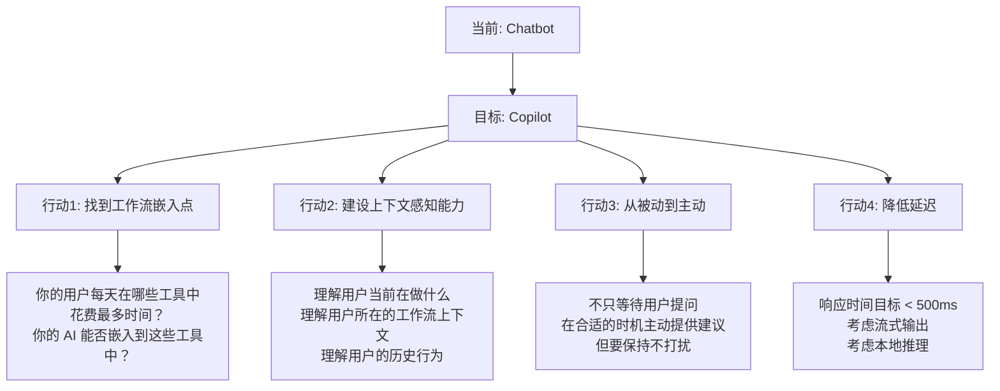

> [!example] 行动清单
> - [ ] 识别你的用户每天花费最多时间的 3 个工具/平台
> - [ ] 调研这些工具是否有插件/扩展/API 接入点
> - [ ] 设计一个"不打扰"的交互方式（如 Ghost Text、侧边栏建议）
> - [ ] 建立用户工作流上下文的数据模型
> - [ ] 将响应延迟优化到 500ms 以内
> - [ ] 做一次 A/B 测试：主动建议 vs 被动问答，哪个留存更高？

**关键指标：**
- 用户在 AI 辅助下的任务完成时间 vs 无 AI 辅助
- AI 建议的采纳率（目标 > 30%）
- 用户的日活跃率（目标 > 20%）

**常见陷阱：**
- 过度建议：AI 太"热情"，频繁打断用户，反而降低效率
- 上下文不足：对用户的工作流理解不够，建议与任务无关
- 集成太浅：只是加了一个聊天窗口，没有真正嵌入工作流

---

### 2.2 如果你在 Copilot 阶段 → 哪些能力值得 Skill 化

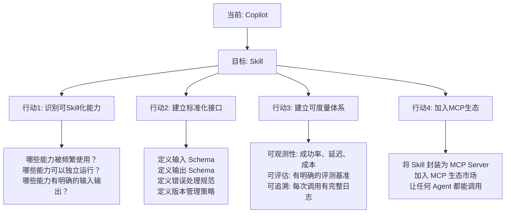

> [!example] 行动清单
> - [ ] 统计你的 Copilot 功能中，哪些被用户使用最频繁（Top 5）
> - [ ] 对每个高频功能，评估其"独立运行潜力"（是否能脱离宿主环境？）
> - [ ] 为最有潜力的 2-3 个功能设计标准化接口（输入/输出 schema）
> - [ ] 建立 Skill 的可观测性仪表盘（成功率、延迟、调用量、成本）
> - [ ] 研究 MCP 协议，将至少 1 个 Skill 封装为 MCP Server
> - [ ] 在 MCP 生态市场中发布你的 Skill

**关键指标：**
- Skill 调用成功率（目标 > 95%）
- Skill 平均响应时间（目标 < 2s）
- Skill 被外部 Agent 调用的比例（目标 > 20%）
- Skill 的版本迭代频率

**常见陷阱：**
- 过早 Skill 化：功能还不够成熟就抽象为 Skill，接口频繁变更
- 过度抽象：把不适合标准化的工作也硬塞进 Skill 框架
- 忽视文档：Skill 的接口文档不清晰，外部开发者无法使用

> [!info] MCP 协议：Skill 化的关键基础设施
> MCP（Model Context Protocol）是当前 AI 生态最关键的底层标准之一，核心价值是解决 AI 如何标准化连接真实世界的问题。Firecrawl 数据显示，2026 年 MCP 采用率在一个月内增长 35%，MCP 支持已成为 AI 工具的"标配"。[$TRAE_REF](http://m.toutiao.com/group/7660723635006652968/)

---

### 2.3 如果你在 Skill 阶段 → 什么时候该产品化

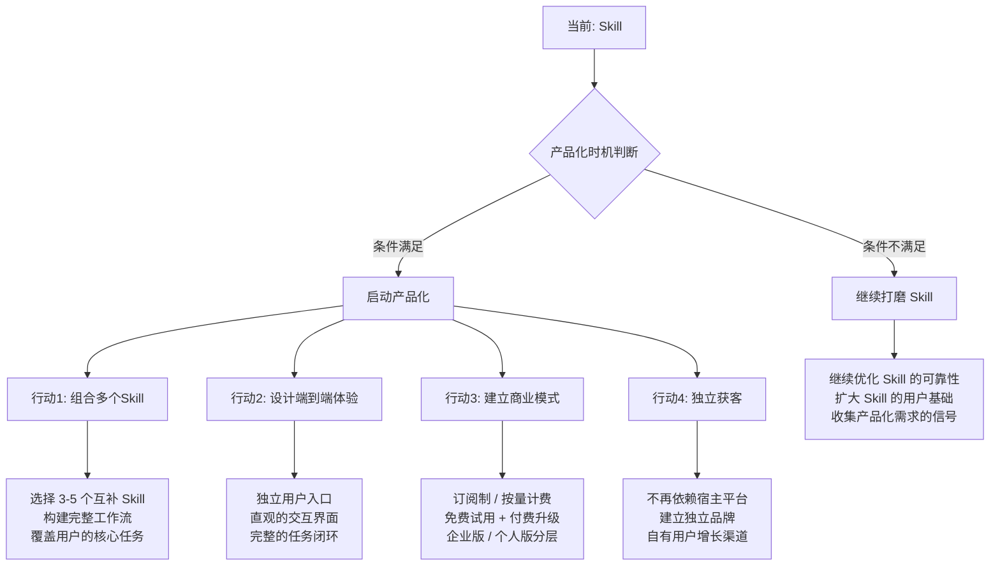

> [!example] 行动清单
> - [ ] 检查你的 Skill 是否满足产品化条件（DAU > 10,000 / D7 留存 > 40% / 付费意愿 > 5%）
> - [ ] 选择 3-5 个互补的 Skill，设计一个完整的端到端工作流
> - [ ] 设计独立的产品界面和用户体验（不是 API 控制台，而是真正的产品）
> - [ ] 确定商业模式：订阅？按量？免费增值？企业版？
> - [ ] 制定独立获客策略：SEO、内容营销、社区、合作伙伴
> - [ ] 建立用户反馈闭环：NPS 调查、用户访谈、使用数据分析

**产品化时机判断矩阵：**

| 指标 | 绿灯（可以产品化） | 黄灯（再观察） | 红灯（暂缓） |
|---|---|---|---|
| DAU | > 10,000 | 1,000 - 10,000 | < 1,000 |
| D7 留存 | > 40% | 20% - 40% | < 20% |
| 付费意愿 | > 5% | 2% - 5% | < 2% |
| 使用频次 | 每周 > 3 次 | 每周 1-3 次 | 每周 < 1 次 |
| 独立使用 | 可独立完成核心任务 | 部分独立 | 高度依赖宿主 |
| Skill 可靠性 | > 95% 成功率 | 85% - 95% | < 85% |

**常见陷阱：**
- **Gartner 预测 40% 的 Agentic AI 项目将被取消**，核心原因就是 Skill 无法有效产品化 [$TRAE_REF](http://m.toutiao.com/group/7660723635006652968/)
- 技术思维替代产品思维：功能很强但用户不买单
- 过早收费：用户基础还不够时就开始收费，扼杀增长
- 忽视用户体验：API 很好用，但产品界面很糟糕

---

### 2.4 如果你在 Product 阶段 → 平台化的时机判断

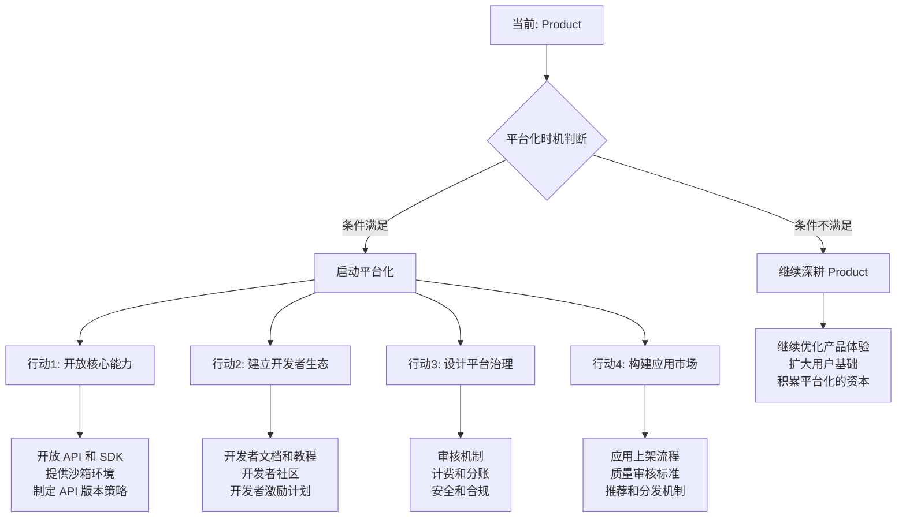

> [!example] 行动清单
> - [ ] 检查是否满足平台化条件（DAU > 100万 或 ARR > $1000万）
> - [ ] 确定平台化的核心能力：哪些 API 先开放？哪些能力保留为自有产品？
> - [ ] 建立开发者入驻流程：注册、认证、API Key 管理、沙箱环境
> - [ ] 制定平台规则：审核标准、计费模式、分账比例、数据隐私
> - [ ] 设计开发者激励：早期开发者优惠、优秀应用推荐、收入分成
> - [ ] 建立平台运营团队：技术支持、开发者关系、内容审核、安全合规

> [!warning] 过早平台化的警示信号
> 如果你的产品出现以下情况，说明你**还没有准备好**平台化：
>
> 1. 核心产品还在快速迭代，API 一个月改 3 次
> 2. 自有产品的用户留存率还不到 30%
> 3. 团队没有多余的人力做开发者支持
> 4. 没有明确的平台治理机制（审核、计费、合规）
> 5. 你的产品还没有形成"自然吸引开发者"的引力
>
> **金标准**：Salesforce Agentforce 在平台化之前，已经在 CRM 领域拥有强大的产品基础和客户生态。平台化是水到渠成的自然延伸，而不是"强行开放"。[$TRAE_REF](http://m.toutiao.com/group/7660723635006652968/)

**平台化时机判断矩阵：**

| 指标 | 绿灯（可以平台化） | 黄灯（再观察） | 红灯（暂缓） |
|---|---|---|---|
| DAU | > 100万 | 10万 - 100万 | < 10万 |
| ARR | > $1000万 | $100万 - $1000万 | < $100万 |
| 产品稳定性 | API 变更 < 1次/季度 | 1-3次/季度 | > 3次/季度 |
| 团队规模 | > 50人 | 20-50人 | < 20人 |
| 外部需求 | 已有第三方主动请求接入 | 偶尔有询问 | 无外部需求 |
| 治理能力 | 有专门的安全/合规团队 | 有兼职负责 | 无治理能力 |

---

### 2.5 如果你在 Platform 阶段 → 如何构建生态护城河

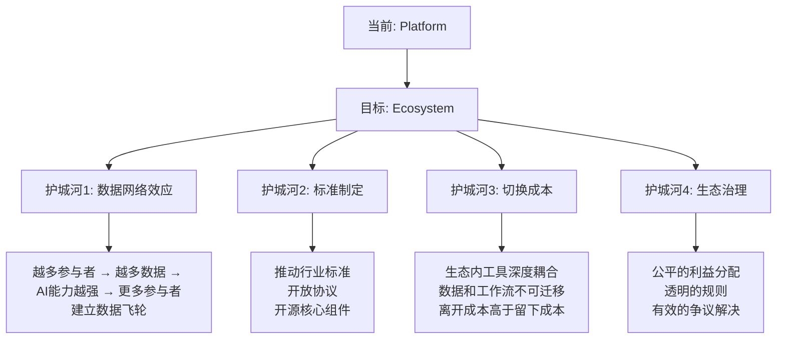

> [!example] 行动清单
> - [ ] 识别你的生态中正在形成的数据网络效应，加速它
> - [ ] 将平台的核心协议标准化、开放化（如 MCP、A2A）
> - [ ] 投资生态内工具之间的深度集成，提高切换成本
> - [ ] 建立透明的生态治理框架：规则公开、争议仲裁、利益分配
> - [ ] 推动行业标准制定，让你的协议成为事实标准
> - [ ] 关注 EU AI Act 等全球监管，确保合规 [$TRAE_REF](http://m.toutiao.com/group/7660723635006652968/)

**生态护城河的三层结构：**

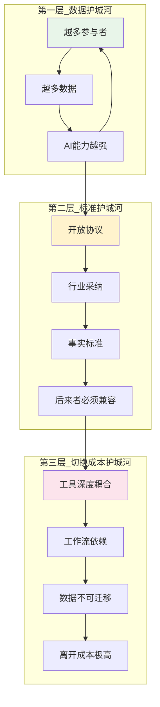

---

## 三、不同角色的路径选择

### 3.1 角色路径全景图

```mermaid
graph TD
    subgraph 非技术个人
        NP1["Chatbot<br/>使用AI工具"] --> NP2["Copilot<br/>AI辅助日常工作"]
        NP2 --> NP3["Skill<br/>掌握AI技能编排"]
        NP3 --> NP4["止步或与技术合作<br/>个人能力天花板"]
    end
    
    subgraph 技术个人
        TP1["Chatbot<br/>理解AI能力边界"] --> TP2["Copilot<br/>AI辅助开发"]
        TP2 --> TP3["Skill<br/>构建AI技能"]
        TP3 --> TP4["Product<br/>打造独立产品"]
        TP4 --> TP5["可能止步或继续"]
    end
    
    subgraph 创业团队
        ST1["Skill<br/>从这里起步"] --> ST2["Product<br/>核心目标"]
        ST2 --> ST3["Platform<br/>选择性跃迁"]
        ST3 --> ST4["Ecosystem<br/>极少数能到达"]
    end
    
    subgraph 大厂
        BP1["Platform<br/>核心战场"] --> BP2["Ecosystem<br/>终极目标"]
    end
    
    style NP4 fill:#f9f,stroke-dasharray: 5 5
    style TP5 fill:#f9f,stroke-dasharray: 5 5
    style ST4 fill:#ffcccc
```

### 3.2 非技术个人（HR/运营/市场/销售）

**典型路径：Chatbot → Copilot → Skill（止步于此或与技术合作）**

> [!tip] 你的优势
> 你不需要成为 AI 技术专家。你的价值在于：**深刻理解业务场景，知道什么问题值得用 AI 解决**。

**阶段一：Chatbot 阶段（当前大多数非技术个人）**
- 熟练使用 ChatGPT、Claude、Kimi 等 AI 对话工具
- 掌握 Prompt Engineering 基础
- 能够用 AI 完成写作、翻译、总结等日常任务

**阶段二：Copilot 阶段（下一步目标）**
- 将 AI 嵌入日常工作流：使用 Copilot for Microsoft 365、Notion AI 等
- 学会"让 AI 在旁边帮你"而非"遇到问题才问 AI"
- 建立个人的 AI 工作流：自动化的日报、周报、会议纪要

**阶段三：Skill 阶段（高级目标）**
- 学习使用低代码/无代码 AI 工具（如 GPTs、Coze、Dify）
- 将你领域内的重复性工作封装为 Skill
- 例如：HR 创建"简历筛选 Skill"、运营创建"竞品分析 Skill"

**天花板与出路：**
- 非技术个人的自然天花板在 Skill 阶段
- 要继续前进，有两个选择：
  1. 与技术合伙人合作，将你的领域知识产品化
  2. 成为"AI 原生管理者"，负责 AI 工作流的编排和优化

**关键技能树：**
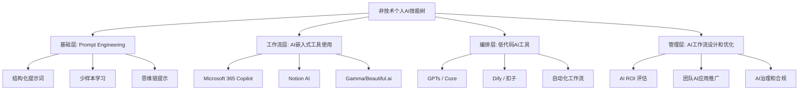

---

### 3.3 技术个人（开发者/工程师）

**典型路径：Chatbot → Copilot → Skill → Product（可能止步或继续）**

> [!tip] 你的优势
> 你有技术能力将 AI 从一个"想法"变成"产品"。你的挑战不是技术，而是**产品思维、商业意识和用户洞察**。

**阶段一：Chatbot 阶段**
- 理解大模型的能力边界和局限性
- 掌握 API 调用、Prompt 设计
- 能够搭建基于 LLM 的简单应用

**阶段二：Copilot 阶段**
- 使用 AI 编码工具（GitHub Copilot、Cursor、Claude Code）提升开发效率
- 理解"AI 辅助开发"的最佳实践：什么该让 AI 写，什么该自己写
- 据 Anthropic 2026 报告，使用 Agentic 编码工具的团队工程代码交付提速 30% [$TRAE_REF](http://m.toutiao.com/group/7660723635006652968/)

**阶段三：Skill 阶段**
- 将可复用的 AI 能力封装为标准化 Skill
- 掌握 MCP 协议，构建 MCP Server
- 学会 Skill 的版本管理、错误处理、可观测性

**阶段四：Product 阶段**
- 从"做 Skill"转向"做产品"
- 学习产品思维：用户研究、交互设计、增长策略
- 建立独立的商业模式
- 关键挑战：从技术思维转向产品思维

**天花板与出路：**
- 技术个人的自然天花板在 Product 阶段
- 要继续向 Platform 跃迁，需要：
  1. 组建团队（一个人做不了平台）
  2. 融资或找到商业合伙人
  3. 建立开发者生态运营能力

**关键技能树：**
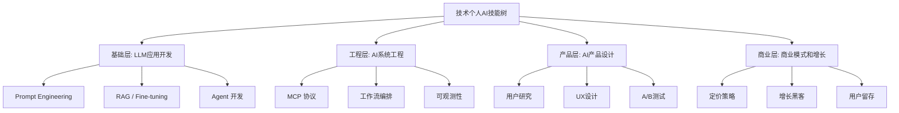

---

### 3.4 创业团队

**典型路径：Skill → Product → Platform（选择性跃迁）**

> [!tip] 创业团队的独特路径
> 创业团队通常不会从 Chatbot 或 Copilot 开始——那些是大厂的游戏。创业团队的核心机会在 **Skill 到 Product** 的跃迁中：找到一个被大厂忽视的垂直场景，用 AI 重新定义产品体验。

**为什么从 Skill 起步？**
- Chatbot 阶段门槛太低，没有护城河
- Copilot 阶段需要嵌入大厂平台，容易被"平台税"扼杀
- Skill 阶段：在垂直领域建立专业壁垒，大厂不会为每个垂直场景都做深

**关键策略：**
1. **选对场景**：选一个"大厂看不上、小团队做不了、用户确实需要"的垂直场景
2. **快速验证**：用 Skill 形态快速验证 PMF（Product-Market Fit），不要一上来就做重产品
3. **产品化临界点**：当 DAU > 10,000 且 D7 留存 > 40% 时，启动产品化
4. **平台化决策**：只有当你的产品 DAU 达到 100 万级别，才考虑平台化

**创业团队的常见陷阱：**
- 技术驱动而非需求驱动：做了一个很酷的 AI 功能，但没人需要
- 过早扩张：产品还没验证就急着招人、融资、做平台
- 与大厂正面竞争：在 Copilot 层面与大厂竞争，几乎没有胜算

---

### 3.5 大厂（科技巨头/平台型企业）

**典型路径：Platform → Ecosystem**

> [!tip] 大厂的游戏
> 大厂的核心战场在 Platform 和 Ecosystem 阶段。Chatbot 和 Copilot 只是生态的"入口产品"，Product 是生态的"锚点应用"，真正的目标是构建 Ecosystem。

**大厂的阶段策略：**

| 阶段 | 大厂的策略 | 案例 |
|---|---|---|
| Chatbot | 作为生态入口，免费或低价提供 | ChatGPT、Gemini、Copilot |
| Copilot | 嵌入自有生态（Office、Search、Cloud） | Microsoft 365 Copilot、Google Workspace AI |
| Skill | 通过 MCP 等标准协议开放能力 | OpenAI MCP Server、Google Agent Development Kit |
| Product | 打造标杆应用，证明平台价值 | Salesforce Agentforce |
| Platform | 核心战场：开发者生态、应用市场 | OpenAI GPT Store、Microsoft Copilot Studio |
| Ecosystem | 终极目标：行业标准、基础设施 | 正在形成中 |

**大厂的核心竞争维度：**
1. **标准制定权**：谁能定义行业协议（MCP、A2A、ACP），谁就掌握生态话语权
2. **开发者生态**：谁能吸引最多的第三方开发者，谁就拥有最强的网络效应
3. **数据飞轮**：谁能建立"越多使用→越多数据→越好体验→越多使用"的飞轮
4. **合规先发优势**：谁能率先满足 EU AI Act 等监管要求，谁就能抢占企业市场

---

## 四、常见错误

### 4.1 三大典型错误

```mermaid
graph TD
    subgraph 错误1_跳过Copilot直接做Product
        E1["问题: 基础不牢"] --> E1A["不理解用户工作流"]
        E1A --> E1B["产品与用户需求脱节"]
        E1B --> E1C["用户留存率低"]
    end
    
    subgraph 错误2_在Skill阶段就想做Platform
        E2["问题: 过早平台化"] --> E2A["核心能力不够强"]
        E2A --> E2B["无法吸引开发者"]
        E2B --> E2C["平台空心化"]
    end
    
    subgraph 错误3_在Chatbot阶段就谈Ecosystem
        E3["问题: 空中楼阁"] --> E3A["没有产品基础"]
        E3A --> E3B["没有用户基础"]
        E3B --> E3C["没有开发者基础"]
        E3C --> E3D["生态只是PPT上的概念"]
    end
    
    style E1 fill:#ffcdd2
    style E2 fill:#ffcdd2
    style E3 fill:#ffcdd2
```

> [!danger] 错误一：跳过 Copilot 直接做 Product
> 很多团队看到 ChatGPT 的成功，就想直接做一个"AI 原生产品"。但他们忽略了：ChatGPT 本身也是从 Chatbot 开始，经过大量用户反馈和迭代才走到今天的。
>
> **跳过 Copilot 阶段的代价：**
> - 不理解用户真实的工作流，产品功能"看起来很酷，但用不起来"
> - 缺少用户反馈的积累，产品方向容易跑偏
> - 没有验证过的 AI 交互模式，用户学习成本高
>
> **正确的做法：** 先以 Copilot 形态嵌入用户现有的工作流，验证 AI 能力的价值，积累用户反馈，再逐步产品化。

> [!danger] 错误二：在 Skill 阶段就想做 Platform
> 这是 AI 行业最常见的战略失误。团队刚做出几个不错的 Skill，就想着"开放平台、吸引开发者、构建生态"。
>
> **过早平台化的代价：**
> - 核心能力还不够强，API 频繁变更，开发者流失
> - 自身产品还在打磨，资源被平台建设稀释
> - 没有足够的用户基础，开发者没有入驻动力
> - 平台规则不成熟，容易出现安全、合规问题
>
> **正确的做法：** 先做到 Product 阶段的极致，当你的产品 DAU 达到 100 万级别，自然会有开发者主动请求接入，此时再考虑平台化。

> [!danger] 错误三：在 Chatbot 阶段就谈 Ecosystem
> 有些团队刚做了一个 Chatbot，就开始画"生态蓝图"：我们要做 AI 时代的操作系统，我们要构建万亿级生态。
>
> **空中楼阁的代价：**
> - 资源分散：团队精力花在"生态规划"上，而不是"产品打磨"上
> - 信任透支：对外讲的故事太大，实际交付的太少
> - 方向迷失：在"生态愿景"中迷失了"第一步该做什么"
>
> **正确的做法：** 专注做好当前阶段的事情。Ecosystem 是结果，不是目标。当你把前面每个阶段都做好了，Ecosystem 自然会出现。

### 4.2 错误预防清单

| 错误 | 预防措施 | 检查信号 |
|---|---|---|
| 跳过 Copilot 做 Product | 先在现有工作流中验证 AI 价值 | 用户是否说"你的产品很好，但我不知道怎么用"？ |
| Skill 阶段做 Platform | 等到 DAU 100万 或 ARR $1000万 | 是否有第三方主动请求接入？如果没有，说明时机未到 |
| Chatbot 谈 Ecosystem | 专注做好当前阶段 | 你的产品有 1000 个日活用户了吗？如果没有，先别谈生态 |

---

## 五、综合路线图

### 5.1 不同角色的路径选择图

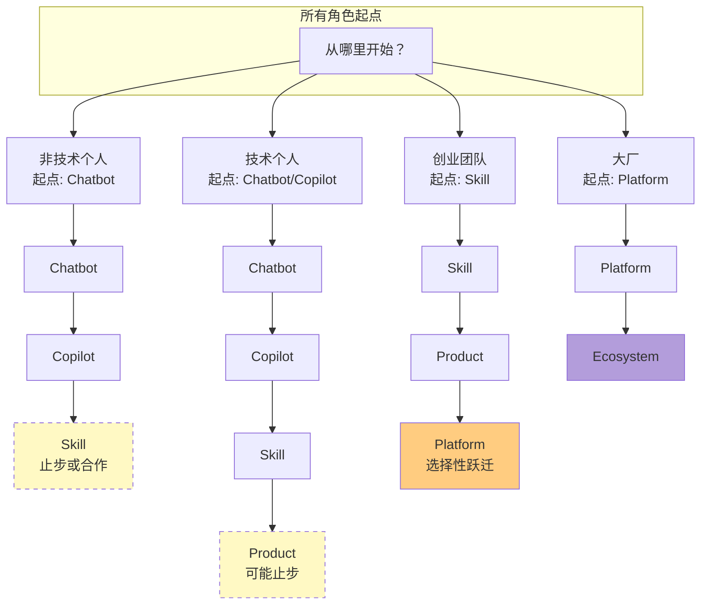

### 5.2 时间线预估

| 角色 | Chatbot → Copilot | Copilot → Skill | Skill → Product | Product → Platform | Platform → Ecosystem |
|---|---|---|---|---|---|
| 非技术个人 | 1-3 个月 | 3-6 个月 | 不建议独立完成 | N/A | N/A |
| 技术个人 | 1-2 个月 | 3-6 个月 | 6-12 个月 | 不建议独立完成 | N/A |
| 创业团队 | N/A（起点不同） | N/A | 6-18 个月 | 12-24 个月（如有） | 极少 |
| 大厂 | N/A（起点不同） | N/A | N/A | 持续进行 | 3-5 年 |

---

## 六、总结

### 6.1 核心要点

1. **先诊断，再行动**：用 12 个问题精准定位你的阶段，不要凭感觉判断
2. **每个阶段有明确的行动指南**：不要在 Chatbot 阶段想 Platform 的事，也不要在 Skill 阶段停留在 Copilot 的思维
3. **不同角色有不同的路径**：非技术个人、技术个人、创业团队、大厂，最优路径各不相同
4. **避免三大典型错误**：跳过 Copilot、过早平台化、空中楼阁
5. **跃迁时机比速度更重要**：在正确的时间做正确的跃迁，比快速走完所有阶段更重要

### 6.2 下一步行动

- 如果你还不确定自己的阶段，请先完成 [[#一、阶段自测工具：12 个问题精准定位]]
- 如果你想了解跃迁的深层条件，请参阅 [[02-AI趋势与素养/AI应用发展阶段演进/07_跃迁动力学：阶段之间的关键跨越条件]]
- 如果你想理解人机关系的变化，请参阅 [[02-AI趋势与素养/AI应用发展阶段演进/08_人机关系的六次跃迁：从问答到共生]]
- 六阶段模型的基础定义详见 [[02-AI趋势与素养/AI应用发展阶段演进/01_全貌：AI应用发展的六阶段统一模型]]

---

## 参考资料

- 从 Tool 到 AI OS：Agent 技术的真正演化路线（2026 深度长文）[$TRAE_REF](https://blog.csdn.net/qq_24429597/article/details/161417429)
- Microsoft 代理 AI 采用成熟度模型 [$TRAE_REF](https://learn.microsoft.com/zh-cn/agents/adoption-maturity-model/)
- 如来创始人刘晓春深度预判：2026-2030 AI 四大进化阶段 [$TRAE_REF](https://www.jiemian.com/article/14618816.html)
- 2026 AI Agent 趋势：从 Copilot 到 Autopilot 的企业落地全景图 [$TRAE_REF](http://m.toutiao.com/group/7660723635006652968/)