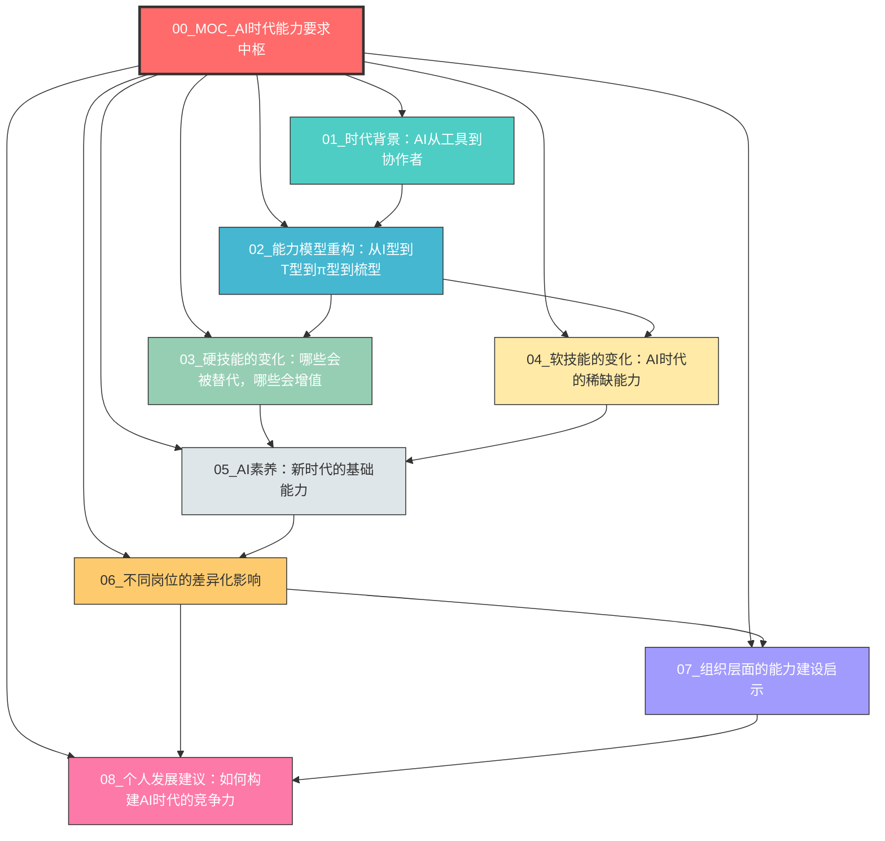
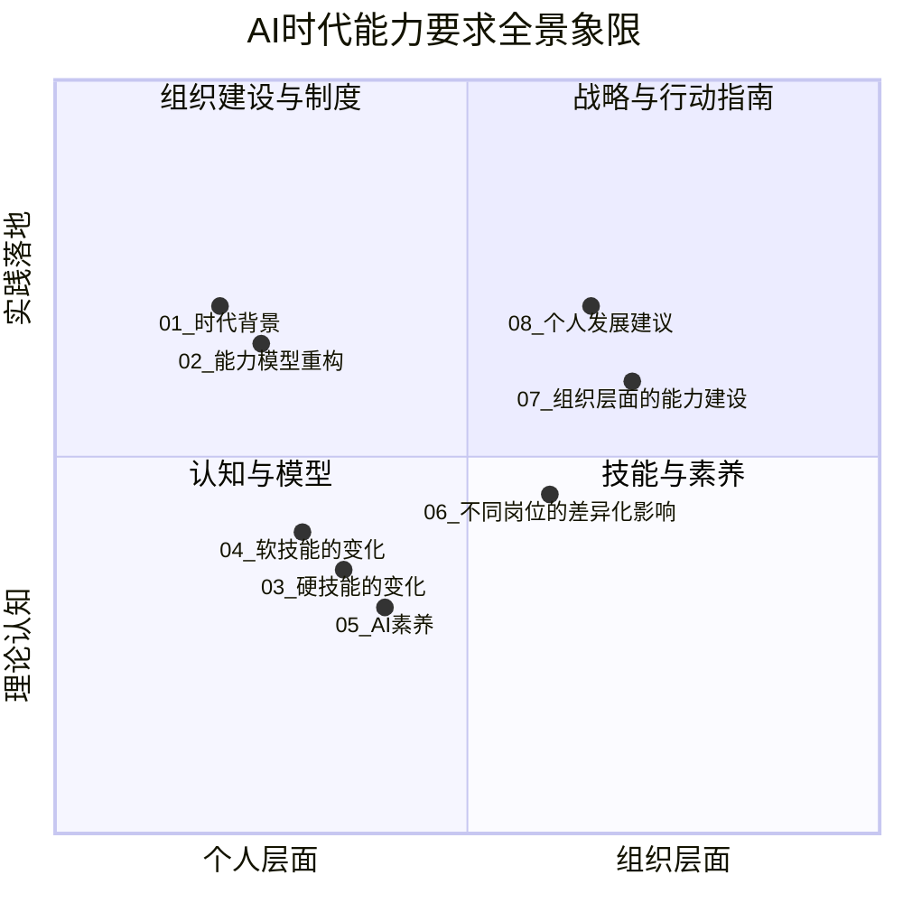
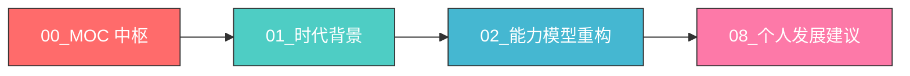
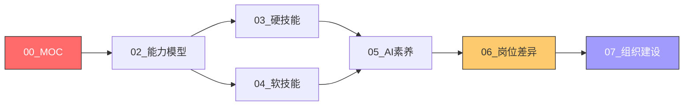
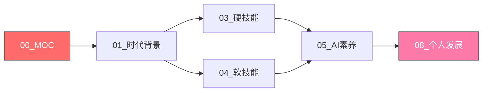
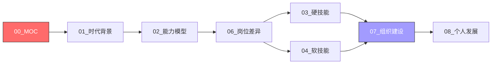
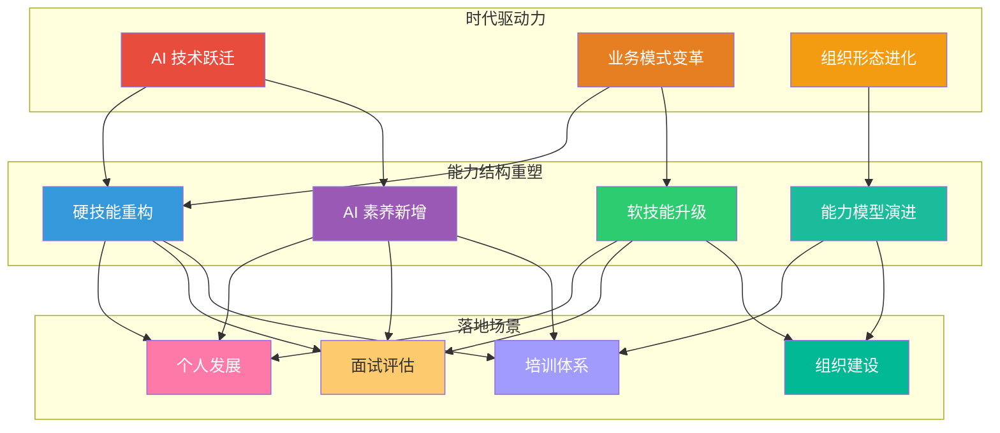
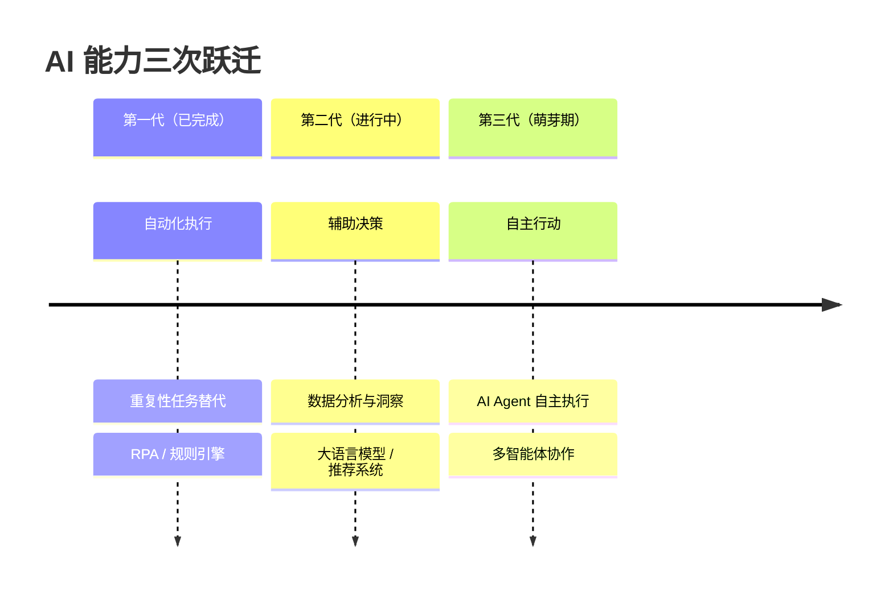
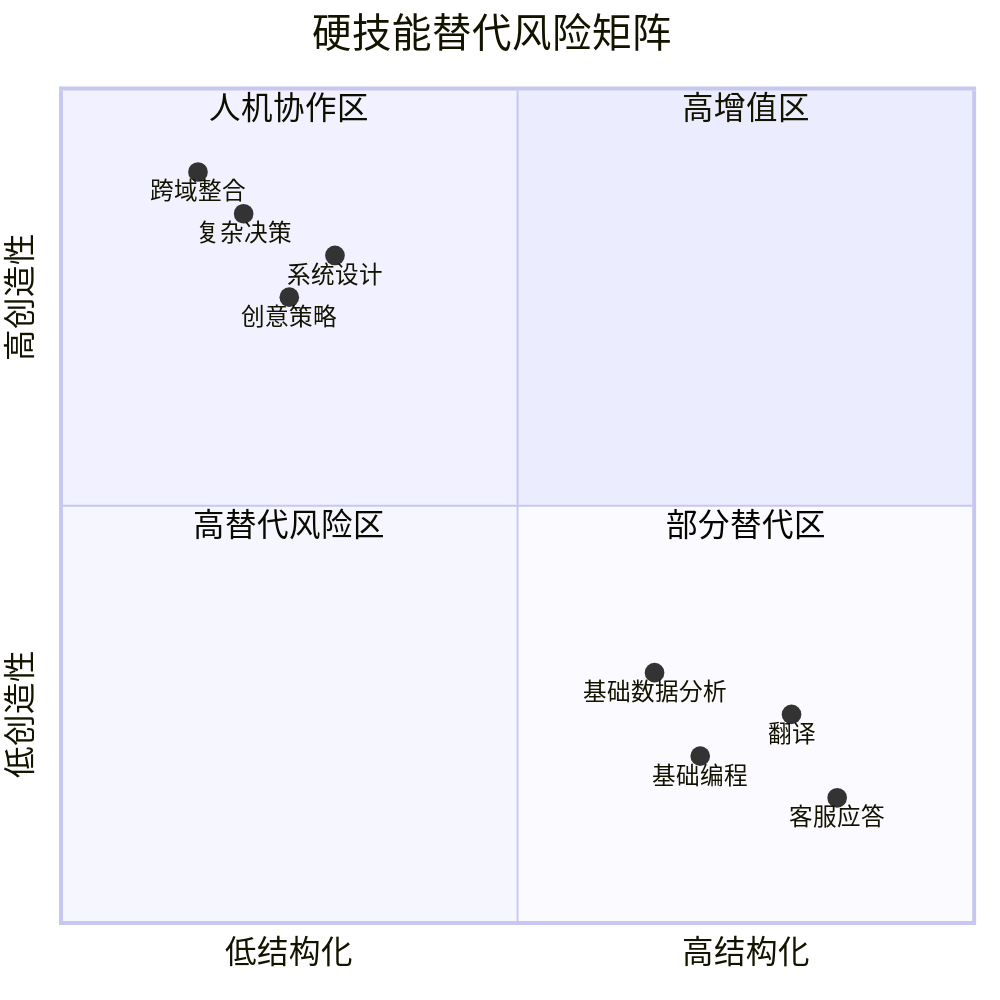
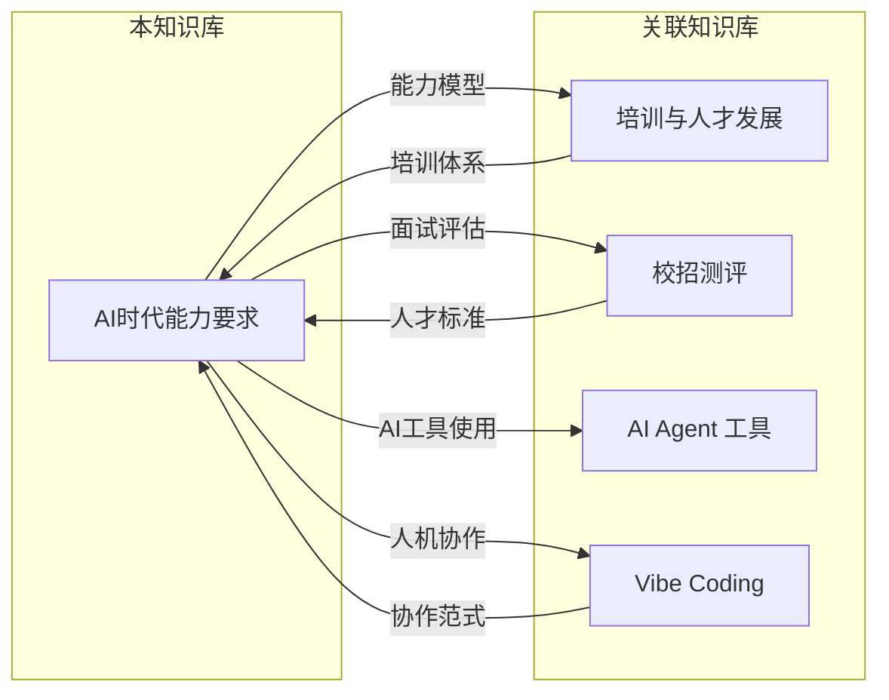

# AI时代能力要求知识库 - MOC中枢

> [!note] 知识库定位
> 本知识库从「战略+人力+AI」的复合视角出发，系统梳理未来 AI+业务时代下，一个人的能力要求会发生怎样的变化。核心逻辑：**不是「AI 会取代什么技能」，而是「AI 会重塑什么能力结构」**。
>
> 面向读者：HR 从业者（面试官视角）、职场人（个人发展视角）、组织管理者（能力建设视角）。

---

## 一、知识库导航图

---

## 二、知识库全景象限

---

## 三、文档索引表

| 编号 | 文档名称 | 核心主题 | 核心读者 | 关键概念 | 关联外部知识库 |
|:---:|:---|:---|:---|:---|:---|
| 01 | [[02-AI趋势与素养/AI时代能力要求/01_时代背景：AI从工具到协作者]] | AI 能力的三次跃迁、当前 AI 能力的边界与天花板 | 全员 | 自动化→辅助决策→自主行动、协作者范式 | [[05-产品与开发/Vibe Coder/05-思想与思维/人机协作的边界]] |
| 02 | [[02-AI趋势与素养/AI时代能力要求/02_能力模型重构：从I型到T型到π型到梳型]] | 传统能力模型回顾与"梳型人才"模型的提出 | 全员 | I型→T型→π型→梳型、AI 横杆、多深度 | [[03-HR人事/培训与人才发展/02-核心理论/04_成人学习理论]] |
| 03 | [[02-AI趋势与素养/AI时代能力要求/03_硬技能的变化：哪些会被替代，哪些会增值]] | 编程/翻译/数据分析的替代趋势、系统设计/跨域整合的增值趋势 | 职场人、面试官 | 替代风险矩阵、增值能力象限、半衰期分析 | [[03-HR人事/培训与人才发展/06-前沿趋势/19_AI在培训中的应用]] |
| 04 | [[02-AI趋势与素养/AI时代能力要求/04_软技能的变化：AI时代的稀缺能力]] | 批判性思维、提问能力、审美与判断力、跨域沟通 | 职场人、面试官 | Prompt 即新编程语言、AI 协作软技能、判断力溢价 | [[05-产品与开发/Vibe Coder/05-思想与思维/面试回答_人与AI协作的边界]] |
| 05 | [[02-AI趋势与素养/AI时代能力要求/05_AI素养：新时代的基础能力]] | AI 工具使用、输出评估、伦理意识、数据素养 | 职场人、培训负责人 | AI 素养四维模型、评估框架、伦理边界 | [[03-HR人事/培训与人才发展/06-前沿趋势/19_AI在培训中的应用]]、[[03-HR人事/培训与人才发展/06-前沿趋势/20_微学习与移动学习]] |
| 06 | [[02-AI趋势与素养/AI时代能力要求/06_不同岗位的差异化影响]] | 按职能维度（HR/研发/市场/运营/战略）分析能力变化 | 面试官、HRBP | 职能能力矩阵、面试评估框架、差异化影响因子 | [[03-HR人事/培训与人才发展/07-面试实战/22_面试常见问题]]、[[03-HR人事/培训与人才发展/04-人才发展/12_人才盘点九宫格]] |
| 07 | [[02-AI趋势与素养/AI时代能力要求/07_组织层面的能力建设启示]] | 企业应对能力结构变化、培训体系调整、招聘标准更新 | HRD、OD、培训负责人 | 能力建设路线图、培训体系重构、招聘标准迭代 | [[03-HR人事/培训与人才发展/01-战略视角/01_企业生命周期与人才战略]]、[[03-HR人事/培训与人才发展/03-培训体系/11_培训预算与ROI]]、[[03-HR人事/培训与人才发展/03-培训体系/09_课程体系搭建]] |
| 08 | [[02-AI趋势与素养/AI时代能力要求/08_个人发展建议：如何构建AI时代的竞争力]] | 面向个人的行动指南、学习路径、实践项目、能力组合 | 职场人 | 个人能力组合、学习路径图、实践项目矩阵、动态迭代 | [[03-HR人事/培训与人才发展/04-人才发展/14_IDP个人发展计划]]、[[03-HR人事/培训与人才发展/04-人才发展/15_轮岗与导师制]] |

---

## 四、阅读路径

### 路径一：快速概览（30分钟）

> [!tip] 适合人群
> 希望快速建立 AI 时代能力认知框架的职场人。跳过细节，先理解"时代背景→模型变化→行动建议"的主线逻辑。

### 路径二：面试官深度路径（2小时）

> [!tip] 适合人群
> HR 面试官、HRBP、招聘负责人。重点理解能力模型的变化，掌握不同岗位的差异化评估方法，并将能力标准融入面试和招聘流程。

### 路径三：个人发展路径（1.5小时）

> [!tip] 适合人群
> 希望系统规划个人职业发展的职场人。从时代背景出发，理解硬技能和软技能的变化趋势，建立 AI 素养，最终形成个人发展行动计划。

### 路径四：组织建设者路径（2小时）

> [!tip] 适合人群
> HRD、OD 负责人、企业大学负责人。从战略高度理解能力结构变化，掌握不同岗位的影响差异，制定组织层面的能力建设方案。

---

## 五、核心逻辑框架

---

## 六、关键概念速查

### 6.1 梳型人才模型

> [!important] 核心定义
> 梳型人才（Comb-Shaped Talent）是 AI 时代的新型能力模型。在传统 T 型（一专多能）和 π 型（双专多能）的基础上，梳型人才拥有**多个深度领域**（梳齿），并由**AI 协作能力**作为横杆连接，形成"多深度 + AI 横杆"的能力结构。

详见 [[02-AI趋势与素养/AI时代能力要求/02_能力模型重构：从I型到T型到π型到梳型]]

### 6.2 AI 能力的三个代际

详见 [[02-AI趋势与素养/AI时代能力要求/01_时代背景：AI从工具到协作者]]

### 6.3 硬技能替代风险矩阵

详见 [[02-AI趋势与素养/AI时代能力要求/03_硬技能的变化：哪些会被替代，哪些会增值]]

### 6.4 AI 素养四维模型

| 维度 | 核心能力 | 关键词 |
|:---|:---|:---|
| **工具使用力** | 熟练使用 AI 工具进行日常工作 | Prompt 工程、工具选择、工作流集成 |
| **输出评估力** | 批判性评估 AI 输出的质量与可靠性 | 事实核查、偏见识别、幻觉检测 |
| **伦理意识** | 理解 AI 伦理边界并负责任地使用 | 数据隐私、公平性、可解释性 |
| **数据素养** | 理解和运用数据驱动决策 | 数据思维、基础统计、可视化 |

详见 [[02-AI趋势与素养/AI时代能力要求/05_AI素养：新时代的基础能力]]

---

## 七、知识库关联图谱

---

## 八、使用建议

### 8.1 如果你是面试官

> [!tip] 面试官行动清单
> 1. 先阅读 [[02-AI趋势与素养/AI时代能力要求/02_能力模型重构：从I型到T型到π型到梳型]]，理解"梳型人才"模型
> 2. 重点阅读 [[02-AI趋势与素养/AI时代能力要求/06_不同岗位的差异化影响]]，了解不同岗位的评估维度
> 3. 参考 [[02-AI趋势与素养/AI时代能力要求/03_硬技能的变化：哪些会被替代，哪些会增值]] 和 [[02-AI趋势与素养/AI时代能力要求/04_软技能的变化：AI时代的稀缺能力]]，更新面试题库
> 4. 结合 [[02-AI趋势与素养/AI时代能力要求/05_AI素养：新时代的基础能力]]，在面试中增加 AI 素养评估维度

### 8.2 如果你是职场人

> [!tip] 个人发展行动清单
> 1. 先阅读 [[02-AI趋势与素养/AI时代能力要求/01_时代背景：AI从工具到协作者]]，建立对 AI 时代的基本认知
> 2. 对照 [[02-AI趋势与素养/AI时代能力要求/03_硬技能的变化：哪些会被替代，哪些会增值]] 审视自己的技能组合
> 3. 刻意练习 [[02-AI趋势与素养/AI时代能力要求/04_软技能的变化：AI时代的稀缺能力]] 中提到的稀缺能力
> 4. 系统提升 [[02-AI趋势与素养/AI时代能力要求/05_AI素养：新时代的基础能力]]
> 5. 最后参考 [[02-AI趋势与素养/AI时代能力要求/08_个人发展建议：如何构建AI时代的竞争力]] 制定个人发展计划

### 8.3 如果你是组织管理者

> [!tip] 组织建设行动清单
> 1. 从 [[02-AI趋势与素养/AI时代能力要求/01_时代背景：AI从工具到协作者]] 和 [[02-AI趋势与素养/AI时代能力要求/02_能力模型重构：从I型到T型到π型到梳型]] 建立战略认知
> 2. 阅读 [[02-AI趋势与素养/AI时代能力要求/07_组织层面的能力建设启示]] 制定组织级能力建设方案
> 3. 结合 [[02-AI趋势与素养/AI时代能力要求/06_不同岗位的差异化影响]] 调整招聘和人才盘点标准
> 4. 参考 [[03-HR人事/培训与人才发展/00_MOC_培训与人才发展中枢]] 中的 [[03-HR人事/培训与人才发展/02-核心理论/07_ADDIE教学设计模型]] 和 [[03-HR人事/培训与人才发展/03-培训体系/09_课程体系搭建]] 重构培训体系

---

## 九、知识库更新日志

| 日期 | 版本 | 更新内容 |
|:---|:---|:---|
| 2026-07-27 | v1.0 | 知识库初始创建，包含 MOC 中枢及 8 篇内容文档 |

---

## 十、核心金句

> [!quote] 本知识库的核心观点
> 不是「AI 会取代什么技能」，而是「AI 会重塑什么能力结构」。
>
> 不是「人会被 AI 替代」，而是「不会用 AI 的人会被会用 AI 的人替代」。
>
> 不是「学什么技能才能不被淘汰」，而是「建立什么样的能力结构才能持续进化」。

---

*本 MOC 中枢由 [[02-AI趋势与素养/AI时代能力要求/00_MOC_AI时代能力要求中枢]] 自身维护，随知识库扩展同步更新。*