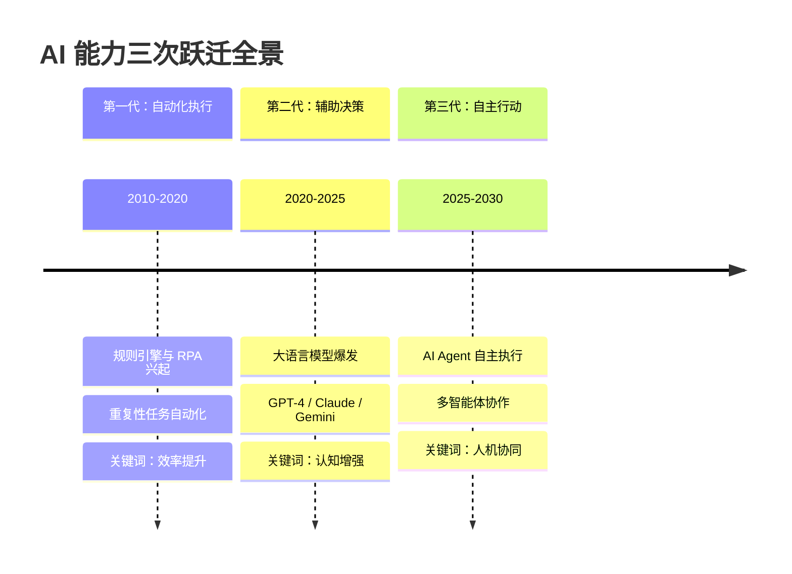
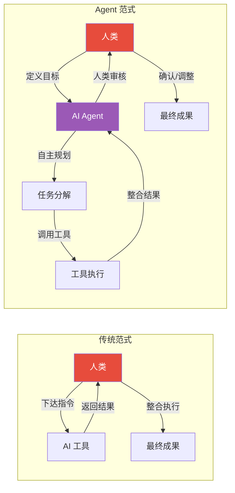
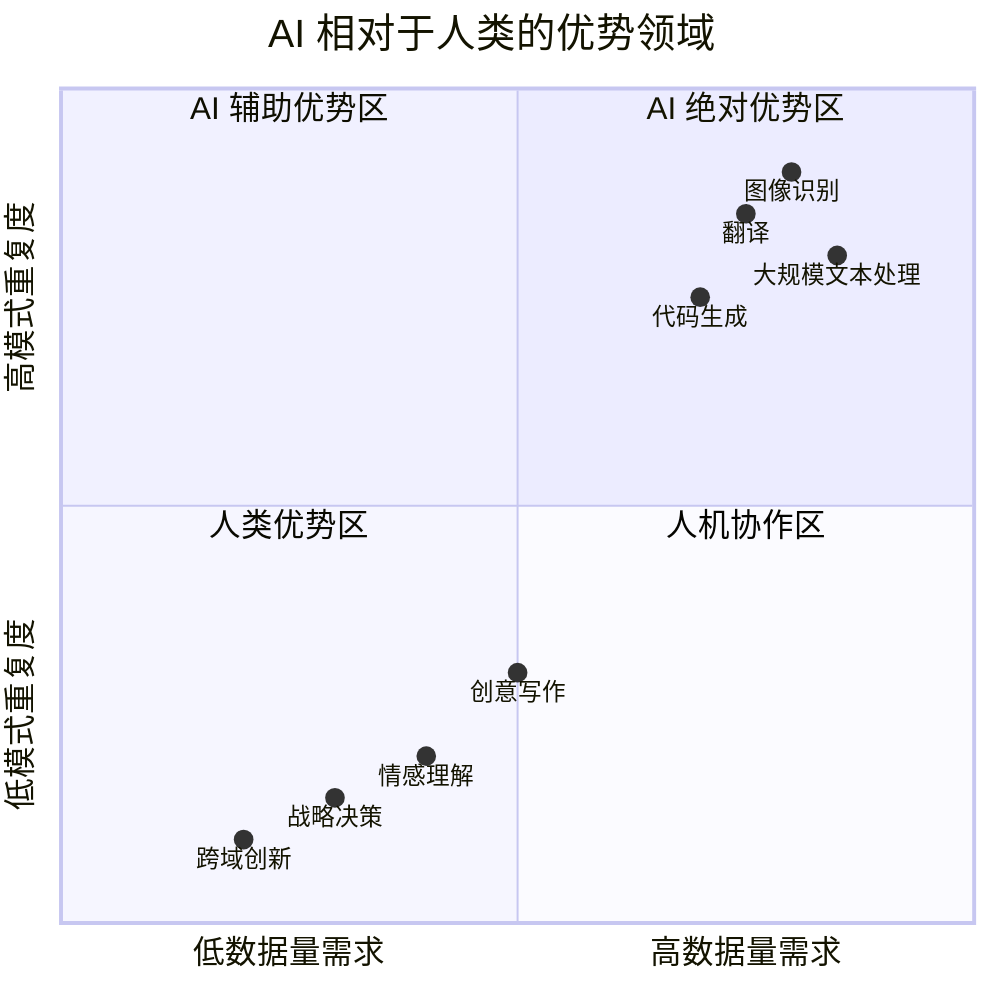
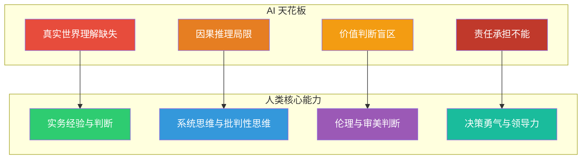
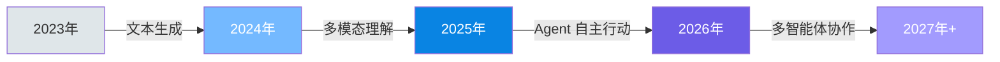
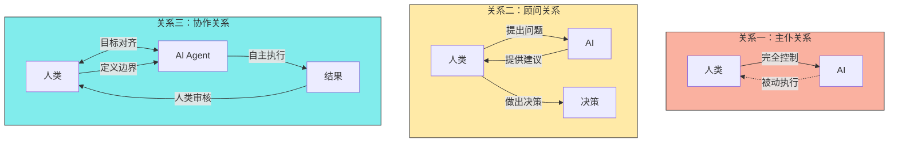
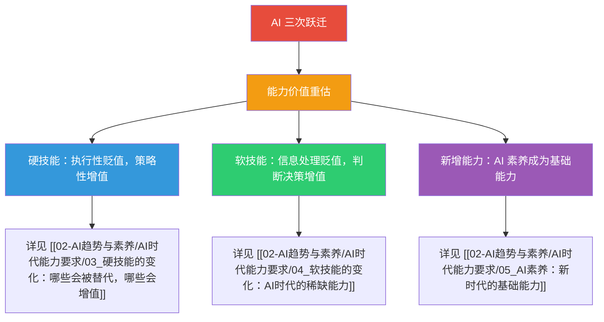

# 01 时代背景：AI从工具到协作者

> [!note] 本文定位
> 本文是知识库的「时代背景」篇，回答一个根本问题：**AI 已经发展到了什么阶段？为什么我们需要重新思考人的能力要求？** 理解 AI 能力的三次跃迁，是理解后续所有能力变化的前提。

---

## 一、AI 能力的三次跃迁

### 1.1 第一代：自动化执行（2010-2020）

> [!note] 核心特征
> AI 作为**工具**，在预设规则下自动完成明确任务。

这一阶段的 AI 本质上是一个**高效率的执行工具**。它的核心能力是：

- **规则驱动**：基于预设的 if-then 逻辑，在明确边界内运行
- **任务明确**：输入和输出精确定义，没有歧义空间
- **人类主导**：人类做出所有决策，AI 只负责执行

典型应用场景：
- RPA（机器人流程自动化）处理报销、对账等重复性工作
- 语音助手执行"播放音乐""设置闹钟"等简单指令
- 工业机器人按照预编程路径完成焊接、组装

> [!warning] 对能力要求的启示
> 在这一阶段，人类的**执行效率**开始贬值。会做「能被规则化的事情」不再是核心竞争力。但人类的**定义规则的能力**和**处理异常的能力**依然不可或缺。

### 1.2 第二代：辅助决策（2020-2025）

> [!note] 核心特征
> AI 作为**顾问**，基于数据和模型提供分析和建议，人类做出最终决策。

这一阶段的标志性事件是**大语言模型（LLM）的爆发**。AI 从"执行工具"升级为"认知增强器"，核心能力变化如下：

| 维度 | 第一代（工具） | 第二代（顾问） |
|:---|:---|:---|
| **输入** | 结构化数据 | 自然语言、图像、代码 |
| **推理** | 规则引擎 | 概率推理、模式识别 |
| **输出** | 确定性结果 | 建议性方案（需人类判断） |
| **交互** | 命令行/API | 自然对话 |
| **边界** | 封闭系统 | 开放世界 |

典型应用场景：
- 用 ChatGPT/Claude 辅助写作、编程、翻译
- 用 AI 分析市场数据并生成策略建议
- 用 AI 辅助面试评估（如 [[03-HR人事/校招测评/AI面试/AI面试_评分逻辑]]）
- 用 AI 辅助培训需求分析（如 [[03-HR人事/培训与人才发展/03-培训体系/08_培训需求分析TNA]]）

> [!important] 对能力要求的核心影响
> 这一阶段出现了**能力价值重估**：
> - **信息检索能力**贬值：以前「知道在哪里找答案」是核心竞争力，现在 AI 可以瞬间检索海量信息
> - **模式执行能力**贬值：按照固定模板完成工作（如标准财务报表、常规代码）被 AI 快速替代
> - **判断与决策能力**增值：当 AI 提供了多个选项，选择哪个、为什么选择，成为关键能力
> - **提问能力**增值：能否提出好问题，决定了能否从 AI 获得好答案

### 1.3 第三代：自主行动（2025-2030）

> [!note] 核心特征
> AI 作为**协作者**，能够自主理解目标、规划路径、执行任务，并在过程中与人类协作。

这一阶段的核心突破在于 **AI Agent** 的成熟。AI 不再只是「回答问题」，而是能够「完成工作」：

> [!important] 关键变化
> 在 Agent 范式下，人类角色从**执行者**转变为**目标定义者 + 结果审核者**。AI Agent 承担了中间的规划、执行、整合工作。这意味着：
> - 「如何做」的能力大幅贬值
> - 「做什么」和「为什么做」的能力大幅增值

典型 Agent 应用场景：
- **Cursor/Codex**：AI Agent 自主编写、调试、部署代码（参见 [[01-AI技术/AI Agent 工具/AI_Agent_赛道一_终端CLI编程Agent]]）
- **AutoGPT/BabyAGI**：多步骤任务自主完成
- **AI 招聘 Agent**：自主筛选简历、安排面试、生成评估报告
- **AI 培训 Agent**：自主分析学习需求、生成课程内容、追踪学习效果

---

## 二、当前 AI 能力的边界与天花板

> [!warning] 核心认知
> 理解 AI 的「能」与「不能」，是判断哪些能力会增值、哪些会贬值的基础。

### 2.1 AI 的当前优势

| 优势领域 | 具体表现 | 对人类能力的影响 |
|:---|:---|:---|
| **海量信息处理** | 瞬间阅读和分析数百万字文档 | 信息检索能力贬值，信息整合与判断能力增值 |
| **模式识别** | 在复杂数据中识别人类难以发现的规律 | 基础数据分析能力贬值，提出分析假设的能力增值 |
| **多语言能力** | 实时翻译、多语言内容生成 | 纯翻译能力大幅贬值，跨文化理解与沟通能力增值 |
| **代码生成** | 从自然语言描述生成高质量代码 | 基础编程能力贬值，系统设计与架构能力增值 |
| **内容生成** | 快速产生大量文本、图像、视频 | 执行性创作贬值，策略性创意与审美判断增值 |

### 2.2 AI 的当前天花板

> [!important] AI 的四大天花板
> 这些天花板定义了「人类不可替代的能力」的核心区域。

| 天花板 | 具体表现 | 对应的人类核心能力 |
|:---|:---|:---|
| **真实世界理解** | AI 缺乏具身经验，无法真正理解物理世界 | 实务经验、现场判断、动手能力 |
| **因果推理** | AI 擅长相关性分析，但不擅长因果推断 | 系统思维、批判性思维、理论构建 |
| **价值判断** | AI 无法理解道德、伦理、审美的深层含义 | 价值观、伦理判断、审美判断 |
| **责任承担** | AI 不能为决策后果负责 | 决策勇气、责任意识、领导力 |

### 2.3 能力边界是动态的

> [!warning] 关键提醒
> AI 的能力边界不是固定的，它在持续扩展。今天 AI 做不到的事情，明天可能就能做到。因此，**能力评估不能基于静态的 AI 能力，而应该基于动态的 TREND 分析**。

---

## 三、从「工具」到「协作者」的范式转变

### 3.1 三种人机关系的演进

### 3.2 协作关系下的人类新角色

在 AI 作为协作者的时代，人类的工作角色发生了根本性转变：

| 传统角色 | AI 时代新角色 | 核心能力要求 |
|:---|:---|:---|
| 程序员 | AI 协作者（AI Collaborator） | 系统设计、代码审查、AI 输出去向判断 |
| 分析师 | 分析策略师（Analysis Strategist） | 提出分析框架、解读 AI 洞察、做出决策 |
| 写作者 | 内容策展人（Content Curator） | 定义内容策略、判断内容质量、赋予独特视角 |
| 招聘官 | 人才策略师（Talent Strategist） | 定义人才标准、评估 AI 无法评估的软素质 |
| 培训师 | 学习体验设计师（Learning Experience Designer） | 设计学习路径、创造互动体验、激发学习动机 |

> [!tip] 核心变化
> 人类角色从「做事的人」变成「定义做什么事、判断做得好不好的人」。详见 [[05-产品与开发/Vibe Coder/05-思想与思维/人机协作的边界]]。

---

## 四、对各职能领域的影响预判

### 4.1 HR 领域

> [!important] HR 从业者需要关注的变化
> - **招聘**：AI 可以完成简历筛选、初步面试、评估报告生成，但最终的人才判断、文化匹配评估仍需人类
> - **培训**：AI 可以生成个性化学习内容、追踪学习效果，但培训策略设计、学习体验创造仍需人类（参见 [[03-HR人事/培训与人才发展/06-前沿趋势/19_AI在培训中的应用]]）
> - **人才发展**：AI 可以辅助人才盘点、继任者分析，但人才发展策略制定、高潜人才判断仍需人类（参见 [[03-HR人事/培训与人才发展/04-人才发展/12_人才盘点九宫格]]）

### 4.2 研发领域

> [!important] 研发人员需要关注的变化
> - 基础编程能力快速贬值，系统设计能力持续增值
> - AI 可以生成代码，但不能替代架构决策
> - 代码审查能力（判断 AI 生成代码的质量）成为新的核心能力
> - 参见 [[01-AI技术/AI Agent 工具/AI_Agent_工具全景对比]]

---

## 五、总结：理解时代，才能理解能力

> [!quote] 核心结论
> AI 从工具到协作者的演变，不是简单的「技术升级」，而是**人机关系的根本性重构**。这种重构必然带来能力要求的变化：不是某些技能被替代，而是整个能力结构被重塑。理解这一点，是阅读本知识库后续内容的基础。

---

*下一篇：[[02-AI趋势与素养/AI时代能力要求/02_能力模型重构：从I型到T型到π型到梳型]]*