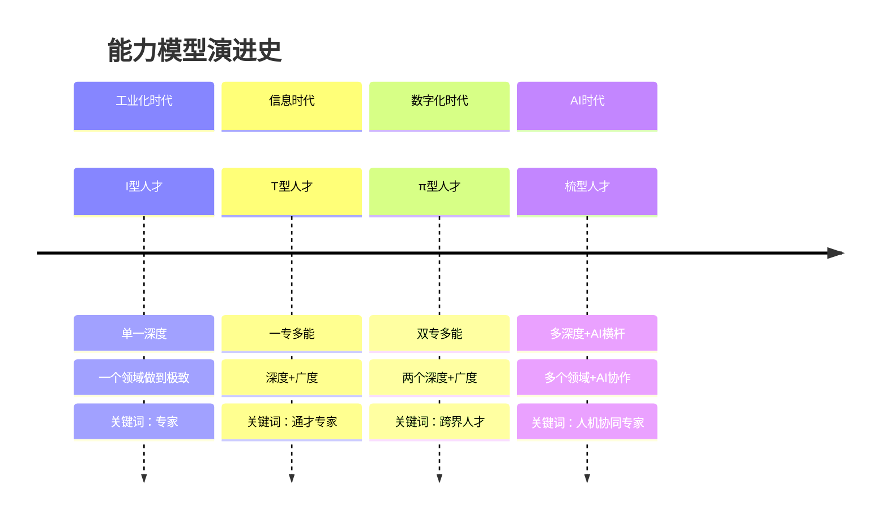
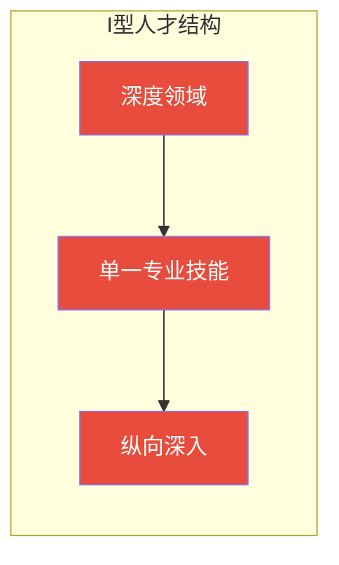
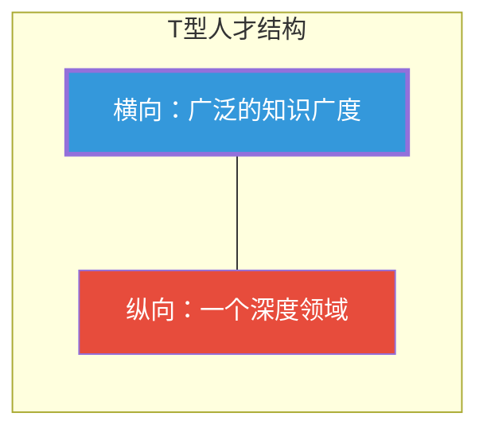
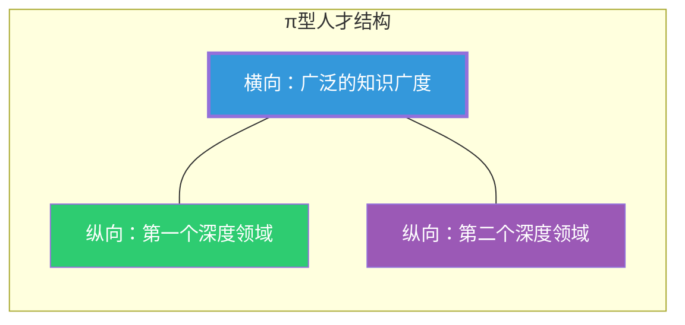
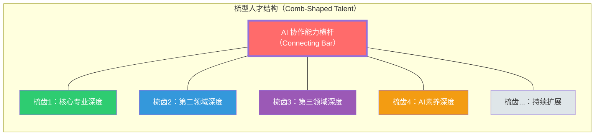
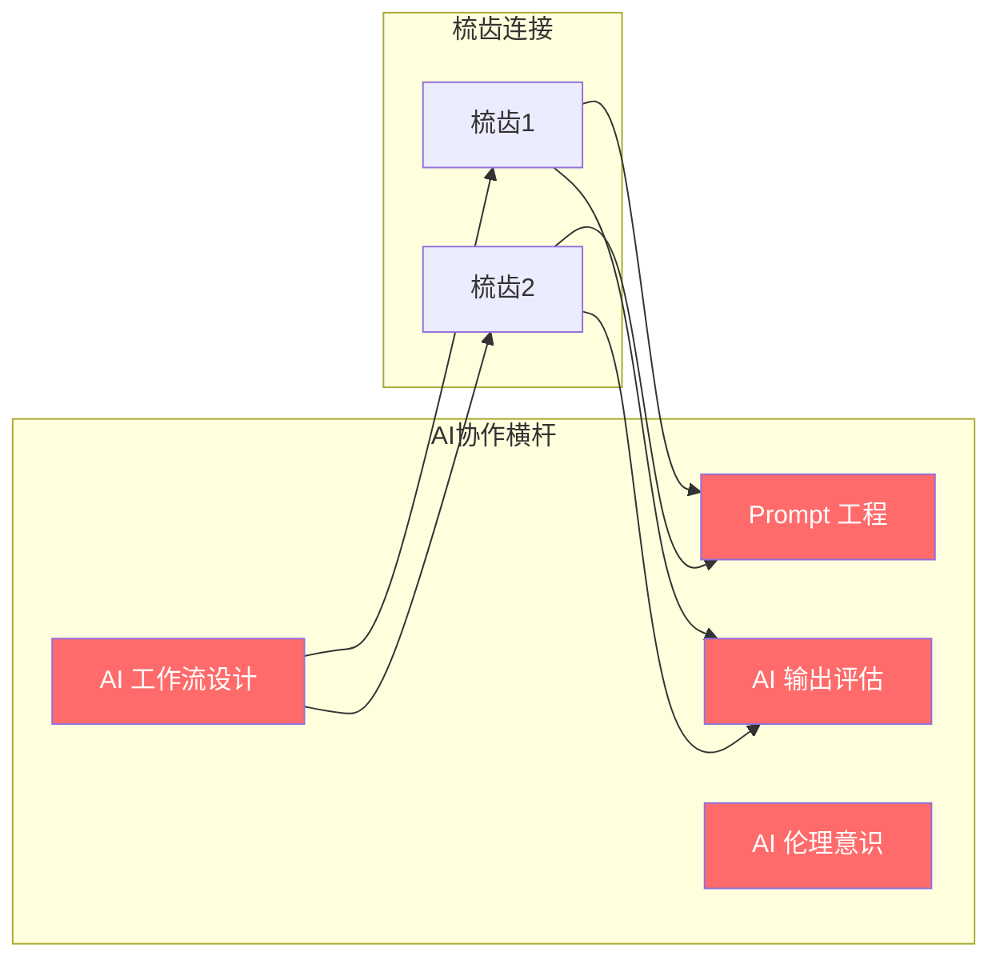
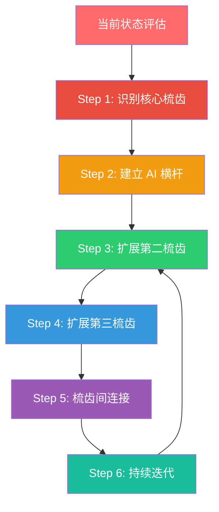

# 02 能力模型重构：从I型到T型到π型到梳型

> [!note] 本文定位
> 本文回答一个核心问题：**AI 时代需要什么样的人才结构？** 通过回顾能力模型的演进历史，提出「梳型人才（Comb-Shaped Talent）」这一适应 AI 时代的新型能力模型，并给出具体的构建路径。

---

## 一、能力模型为什么重要

> [!important] 能力模型 = 人才的「操作系统」
> 能力模型不是学术概念，而是**组织选人、育人、用人、留人的基础框架**。它决定了：
> - 面试官用什么标准评估候选人
> - 培训体系围绕什么能力设计（参见 [[03-HR人事/培训与人才发展/03-培训体系/09_课程体系搭建]]）
> - 个人把时间花在学习什么上
> - 组织如何定义「优秀人才」

---

## 二、传统能力模型演进全景

### 2.1 I 型人才：工业化时代的产物

> [!note] I 型人才特征
> - **一个深度**：在一个专业领域深耕到极致
> - **典型代表**：传统工匠、专科医生、某一领域的顶尖学者
> - **时代背景**：工业革命到 20 世纪末，分工细化、效率优先
> - **优势**：在单一领域达到极高水准
> - **劣势**：知识面狭窄，跨领域协作能力弱

> [!warning] AI 时代的冲击
> 当 AI 能够在单一领域达到甚至超越人类水准时，I 型人才面临最大的替代风险。AI 在封闭领域内的学习速度和执行精度远超人类。

### 2.2 T 型人才：信息时代的进化

> [!note] T 型人才特征
> - **一专多能**：一个深度专业领域 + 广泛的知识广度
> - **典型代表**：产品经理、咨询顾问、综合管理人才
> - **时代背景**：信息时代，跨部门协作需求增加
> - **优势**：既能在专业领域深入，又能跨领域沟通协作
> - **劣势**：广度有余但深度不足（相较于 I 型），跨领域深度不够

> [!tip] T 型人才在 AI 时代的处境
> T 型人才比 I 型人才更有韧性，因为其「广度」带来了跨领域整合能力——这是 AI 目前不擅长的。但单一的「深度」仍然面临被 AI 追赶的风险。

### 2.3 π 型人才：数字化时代的进阶

> [!note] π 型人才特征
> - **双专多能**：两个深度专业领域 + 广泛的知识广度
> - **典型代表**：懂技术的产品经理、懂业务的数据科学家、懂设计的工程师
> - **时代背景**：数字化时代，跨界创新成为竞争优势
> - **优势**：在两个领域交叉处创造独特价值，抗替代能力强
> - **劣势**：两个深度的维护成本高，广度可能被稀释

> [!tip] π 型人才在 AI 时代的处境
> π 型人才比 T 型人才更有竞争力，因为 AI 难以在两个领域之间建立创造性连接。但维护两个深度的成本很高，且 AI 正在快速追赶单一领域的深度。

---

## 三、AI 时代的「梳型人才」模型

### 3.1 为什么需要新模型

> [!important] 核心洞察
> 传统模型（I型、T型、π型）都假设「深度」是人类独有的。但在 AI 时代，**AI 本身就是一个「深度」提供者**。当 AI 可以帮你快速深入任何一个领域时，你需要的能力结构就变成了：**多个深度领域（梳齿）+ AI 协作能力（横杆）**。

### 3.2 梳型人才的核心特征

| 维度 | I 型 | T 型 | π 型 | **梳型** |
|:---|:---|:---|:---|:---|
| **深度数量** | 1 | 1 | 2 | **3+** |
| **广度** | 窄 | 宽 | 宽 | **宽 + AI 增强** |
| **AI 角色** | 无 | 无 | 无 | **核心能力横杆** |
| **跨域能力** | 弱 | 中 | 强 | **极强（AI 辅助）** |
| **抗替代性** | 低 | 中 | 中高 | **高** |
| **学习成本** | 高（单点） | 中高 | 高 | **中（AI 降低学习成本）** |
| **典型岗位** | 传统专家 | 产品经理 | 数据科学家 | **AI 时代的新角色** |

### 3.3 梳型人才的三个关键要素

#### 要素一：多个深度（3+ 梳齿）

> [!important] 为什么是 3+？
> 在 AI 时代，两个深度（π型）已经不够。因为 AI 可以快速弥补一个领域的深度，你需要至少 3 个深度领域才能在 AI 辅助下产生独特的交叉价值。

梳齿选择建议：

| 梳齿类型 | 说明 | 示例 |
|:---|:---|:---|
| **核心专业** | 你的主战场，最深的领域 | 人力资源、软件开发、市场营销 |
| **第二领域** | 与核心专业形成互补的领域 | HR + 数据分析、开发 + 产品设计 |
| **AI 素养** | 必须的「AI 梳齿」 | Prompt 工程、AI 工具使用、AI 输出评估 |
| **扩展领域** | 持续扩展的领域（可选） | 业务理解、设计思维、心理学 |

#### 要素二：AI 协作能力横杆

> [!important] 横杆 = 连接器 + 放大器
> AI 协作能力横杆是梳型人才区别于传统模型的核心。它不是「会用 AI 工具」这么简单，而是：
> - **连接器**：通过 AI 快速连接不同深度领域，产生交叉创新
> - **放大器**：让每个梳齿的深度通过 AI 获得倍增加成
> - **翻译器**：将不同领域的知识通过 AI 翻译成可沟通的语言

#### 要素三：持续扩展能力

> [!tip] 梳型人才不是静态的
> 梳子可以不断「长出新的梳齿」。AI 降低了学习新领域的成本，使得持续扩展成为可能。关键在于：
> - 保持「学习如何学习」的元能力
> - 利用 AI 加速新领域的入门和深入
> - 有意识地在不同领域之间建立连接

---

## 四、梳型人才的构建路径

### Step 1：识别核心梳齿

> [!question] 自我评估问题
> - 你当前最深的领域是什么？（核心梳齿）
> - 这个领域在 AI 时代的替代风险有多高？（参考 [[02-AI趋势与素养/AI时代能力要求/03_硬技能的变化：哪些会被替代，哪些会增值]]）
> - 你是否有第二深度领域？如果有，它与核心梳齿的交叉价值是什么？

### Step 2：建立 AI 横杆

> [!tip] AI 横杆建设清单
> - [ ] 掌握至少 2-3 个主流 AI 工具的使用
> - [ ] 学习 Prompt 工程的基本原理
> - [ ] 建立 AI 输出评估的批判性思维习惯
> - [ ] 了解 AI 伦理的基本框架
> - 详见 [[02-AI趋势与素养/AI时代能力要求/05_AI素养：新时代的基础能力]]

### Step 3-4：扩展第二、第三梳齿

> [!important] 梳齿选择策略
> 选择第二、第三梳齿时，考虑以下原则：
> 1. **互补性**：与核心梳齿形成互补，而非重叠
> 2. **交叉价值**：在交叉处能产生独特价值
> 3. **AI 增强性**：该领域能否被 AI 显著增强
> 4. **兴趣驱动**：长期维护需要内在动力

### Step 5：梳齿间连接

> [!tip] 连接 = 创造独特价值
> 梳型人才的核心优势不在于「会的多」，而在于「能在不同领域之间建立连接」。AI 横杆的作用就是加速和放大这种连接。

### Step 6：持续迭代

> [!warning] 梳型人才是动态的
> - 梳齿深度需要持续维护（AI 可以帮你）
> - 可能需要替换不再有价值的梳齿
> - 新的梳齿会随时代变化而产生
> - 横杆（AI 协作能力）本身也需要持续升级

---

## 五、梳型人才与 HR 实践的关联

### 5.1 对面试评估的影响

> [!important] 面试官需要更新的评估维度
> - 传统评估：学历、工作经验、专业技能
> - 新增评估：AI 协作能力、多领域交叉能力、学习敏捷度
> - 详见 [[02-AI趋势与素养/AI时代能力要求/06_不同岗位的差异化影响]]

### 5.2 对人才发展的影响

> [!tip] 培训体系需要重构
> - 从「T 型人才培养」转向「梳型人才培养」
> - 将 AI 协作能力纳入核心培训内容
> - 建立跨领域学习机制
> - 详见 [[02-AI趋势与素养/AI时代能力要求/07_组织层面的能力建设启示]] 和 [[03-HR人事/培训与人才发展/03-培训体系/09_课程体系搭建]]

### 5.3 对个人发展的影响

> [!tip] 个人行动建议
> - 评估自己当前的能力结构（I/T/π/梳？）
> - 制定向梳型人才转型的计划
> - 详见 [[02-AI趋势与素养/AI时代能力要求/08_个人发展建议：如何构建AI时代的竞争力]]

---

## 六、常见误区

> [!warning] 误区一：梳型人才 = 什么都会一点
> 梳型人才不是「万金油」。每个梳齿都需要有**真正的深度**，而 AI 横杆的作用是连接和放大这些深度，不是替代深度。

> [!warning] 误区二：AI 横杆 = 会用 ChatGPT
> AI 协作能力横杆远不止「会用 AI 工具」。它包括 Prompt 工程、输出评估、工作流设计、伦理意识等多维度能力。详见 [[02-AI趋势与素养/AI时代能力要求/05_AI素养：新时代的基础能力]]。

> [!warning] 误区三：梳型人才只有一种标准形态
> 梳子的形状因人而异。有的人 3 个梳齿，有的人 5 个；有的人核心梳齿是技术，有的人是业务。关键不是梳齿的数量，而是**结构**：多深度 + AI 横杆。

---

## 七、总结

> [!quote] 核心结论
> 能力模型的演进不是简单的「加一个深度」，而是**结构性的范式转变**。梳型人才的核心不是「会的多」，而是「AI 协作能力作为横杆，连接多个深度领域，产生独特的交叉价值」。这个模型将贯穿本知识库的所有后续讨论。

---

*上一篇：[[02-AI趋势与素养/AI时代能力要求/01_时代背景：AI从工具到协作者]]*
*下一篇：[[02-AI趋势与素养/AI时代能力要求/03_硬技能的变化：哪些会被替代，哪些会增值]]*