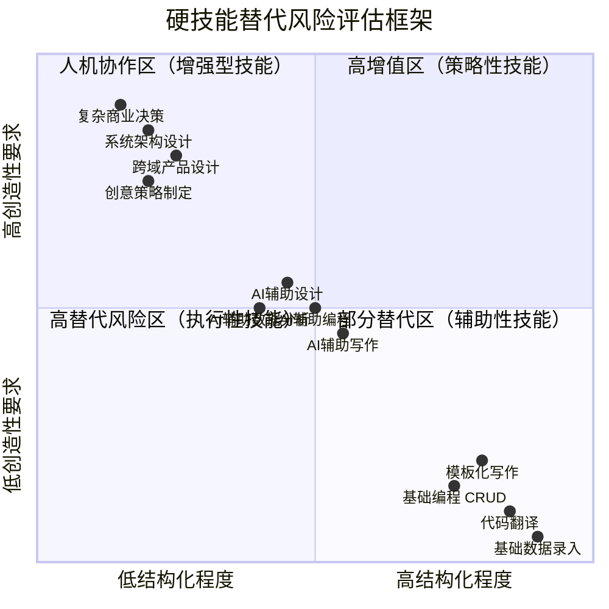
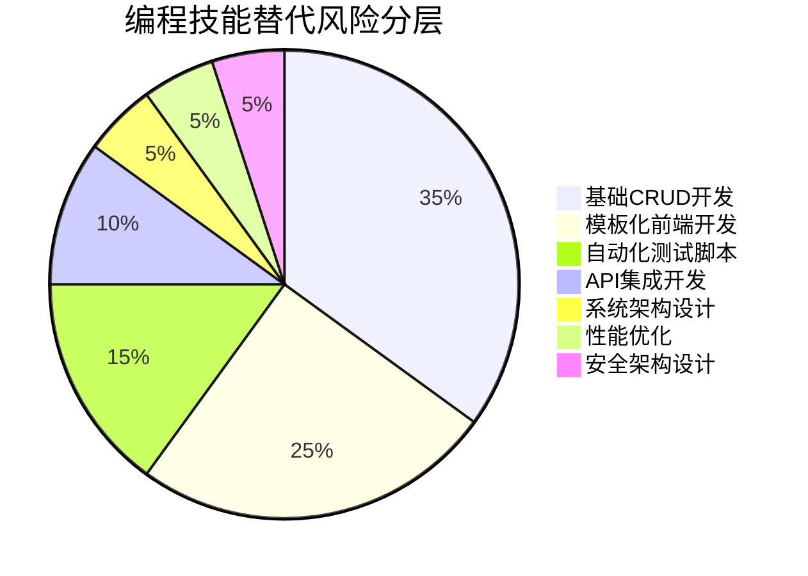
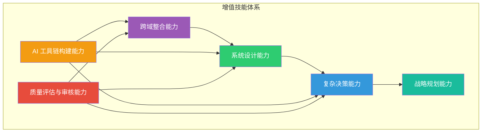
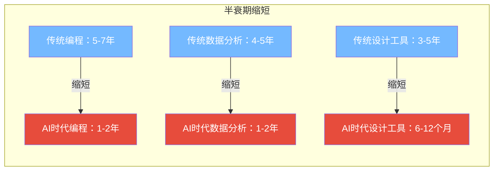
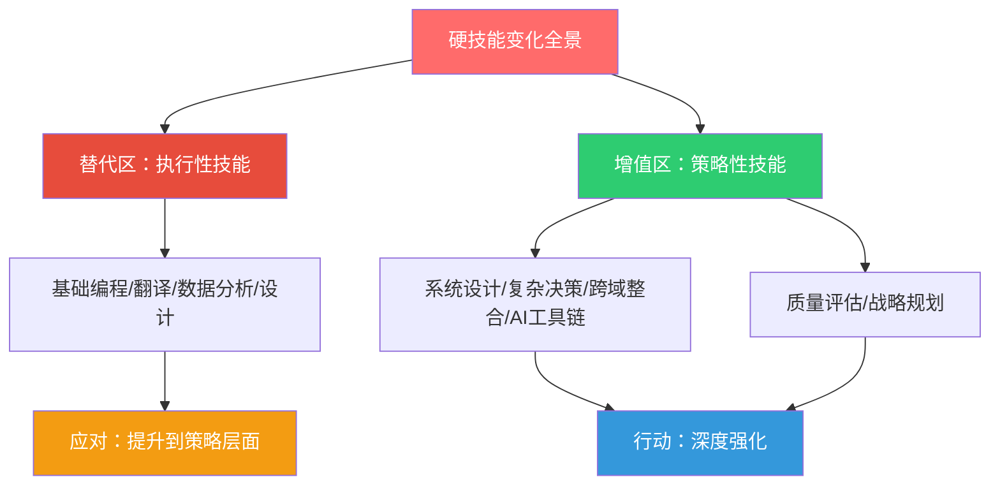

# 03 硬技能的变化：哪些会被替代，哪些会增值

> [!note] 本文定位
> 本文系统分析 AI 时代硬技能的变化趋势，回答面试官和职场人最关心的问题：**哪些硬技能会被 AI 替代？哪些硬技能会增值？我的技能组合是否安全？** 核心方法论：不是简单地列「会替代/不会替代」的清单，而是建立**替代风险评估框架**。

---

## 一、硬技能替代风险评估框架

### 1.1 双维度评估模型

### 1.2 评估维度详解

| 评估维度 | 高替代风险特征 | 低替代风险特征 |
|:---|:---|:---|
| **结构化程度** | 输入输出明确、规则清晰、流程固定 | 问题模糊、需要界定、没有标准答案 |
| **创造性要求** | 按模板/规则执行，不需要创新 | 需要原创思维、独特视角、创新方案 |
| **上下文依赖** | 不需要深度理解业务上下文 | 深度依赖业务理解、行业知识、组织文化 |
| **人际交互** | 纯技术操作，不需要与人协作 | 需要深度沟通、共识建立、利益协调 |
| **责任归属** | 结果可验证、责任可追溯 | 决策后果模糊、需要承担判断责任 |

---

## 二、高风险替代区：正在被快速替代的硬技能

### 2.1 编程类技能

> [!warning] 高替代风险
> - **基础 CRUD 开发**：AI 可以在几秒内生成完整的增删改查代码
> - **模板化前端开发**：标准页面布局、表单、列表等已被 AI 高效覆盖
> - **自动化测试脚本**：AI 可以自动生成测试用例和测试代码
> - **简单 API 集成**：标准 API 调用代码 AI 可以完美生成

> [!tip] 低替代风险
> - **系统架构设计**：需要权衡取舍、理解业务上下文、预判未来演进
> - **性能优化**：需要深入理解底层原理和具体场景
> - **安全架构设计**：需要理解攻击面、威胁模型和业务风险
> - **复杂业务逻辑**：需要深度理解业务规则和异常场景

### 2.2 语言类技能

> [!warning] 高替代风险
> - **通用文档翻译**：AI 翻译质量已接近专业水平
> - **模板化写作**：新闻稿、产品说明、会议纪要等结构化写作
> - **基础文案撰写**：标准营销文案、社交媒体内容

> [!tip] 低替代风险
> - **文学翻译**：需要传达文化内涵、风格韵律和情感色彩
> - **品牌策略文案**：需要深度理解品牌调性和目标受众心理
> - **演讲稿/重要文件**：需要体现个人风格和组织价值观

### 2.3 数据分析类技能

> [!warning] 高替代风险
> - **基础数据清洗**：AI 可以自动识别和处理数据质量问题
> - **标准报表生成**：按模板生成周报、月报、季报
> - **描述性统计分析**：均值、方差、分布等基础统计

> [!tip] 低替代风险
> - **分析框架设计**：定义分析什么、为什么分析、如何解读
> - **因果推断**：区分相关性还是因果性（参见 [[02-AI趋势与素养/AI时代能力要求/01_时代背景：AI从工具到协作者]] 中关于 AI 天花板的部分）
> - **数据故事讲述**：将数据洞察转化为业务决策建议

### 2.4 设计类技能

> [!warning] 高替代风险
> - **标准 UI 组件设计**：按钮、表单、导航栏等基础组件
> - **模板化海报设计**：活动海报、促销图等标准化设计
> - **简单图标绘制**：通用图标和插画

> [!tip] 低替代风险
> - **品牌视觉体系设计**：需要理解品牌战略和情感传达
> - **复杂交互设计**：需要理解用户心理和行为模式
> - **创新概念设计**：从零到一的创意构思

---

## 三、高增值区：AI 时代大幅增值的硬技能

### 3.1 增值技能全景图

### 3.2 系统设计能力

> [!important] 能力定义
> 在复杂约束条件下，设计出能够平衡多方需求、具备可扩展性和可维护性的整体解决方案的能力。

**为什么增值**：AI 可以生成代码片段，但不能设计系统。系统设计需要：
- 理解业务上下文和约束条件
- 在多个方案之间做出权衡
- 预判未来可能的变化和扩展
- 考虑安全性、可靠性、可维护性等非功能需求

**面试评估建议**（参见 [[02-AI趋势与素养/AI时代能力要求/06_不同岗位的差异化影响]]）：
- 给候选人一个开放性问题，观察其如何界定问题边界
- 评估其权衡取舍的思维过程，而非最终答案
- 考察其是否能用 AI 辅助系统设计（加分项）

### 3.3 复杂决策能力

> [!important] 能力定义
> 在信息不完整、约束条件模糊、结果不确定的情况下，做出合理判断并承担后果的能力。

**为什么增值**：AI 可以提供分析和建议，但不能做决策。决策需要：
- 在没有完整信息时做出判断
- 在多个利益相关方之间平衡
- 承担决策后果的责任
- 在模糊的价值判断中做出选择

### 3.4 跨域整合能力

> [!important] 能力定义
> 将不同领域的知识、方法、工具整合起来，创造出单一领域无法产生的新价值的能力。

**为什么增值**：这正是 [[02-AI趋势与素养/AI时代能力要求/02_能力模型重构：从I型到T型到π型到梳型]] 中「梳型人才」的核心优势。AI 在不同领域之间建立连接的能力仍然有限，而人类可以：
- 将技术思维应用于业务问题
- 将设计思维引入管理实践
- 将心理学原理用于产品设计

### 3.5 AI 工具链构建能力

> [!important] 能力定义
> 不只是「使用 AI 工具」，而是能够设计、构建和优化 AI 辅助的工作流程和工具链的能力。

**为什么增值**：
- 会用 AI 工具的人越来越多，但能「设计 AI 工作流」的人仍然稀缺
- 这是 [[02-AI趋势与素养/AI时代能力要求/05_AI素养：新时代的基础能力]] 中高阶能力的体现
- 能够将 AI 能力系统性地嵌入组织工作流程

### 3.6 质量评估与审核能力

> [!important] 能力定义
> 能够批判性地评估 AI 输出的质量，识别错误、偏见和幻觉，并给出改进方向的能力。

**为什么增值**：AI 输出越多，质量评估越重要。这种能力包括：
- 事实核查：验证 AI 输出的信息准确性
- 逻辑审查：检查 AI 推理过程是否合理
- 偏见识别：发现 AI 输出中可能存在的偏见
- 适用性判断：判断 AI 输出在特定场景下是否适用

---

## 四、技能半衰期分析

### 4.1 什么是技能半衰期

> [!note] 定义
> 技能半衰期（Skill Half-Life）是指一项技能的价值衰减到原来一半所需的时间。在 AI 时代，许多技能的半衰期正在急剧缩短。

### 4.2 技能半衰期分类

| 类别 | 半衰期 | 典型技能 | 应对策略 |
|:---|:---|:---|:---|
| **极短半衰期** | < 1 年 | 特定工具操作、特定框架使用 | 不要深度绑定，保持灵活性 |
| **短半衰期** | 1-3 年 | 编程语言、设计工具、分析方法 | 关注底层原理而非具体工具 |
| **中半衰期** | 3-7 年 | 系统设计、项目管理、行业知识 | 持续更新，结合 AI 增强 |
| **长半衰期** | > 7 年 | 批判性思维、沟通能力、领导力 | 这是护城河，需要持续深耕 |

> [!tip] 投资建议
> 将更多时间投入到**长半衰期技能**的培养上，用 AI 来弥补**短半衰期技能**的更新需求。

---

## 五、给面试官的评估框架

### 5.1 硬技能评估三问

> [!question] 面试官在评估候选人硬技能时，请回答三个问题：
> 1. **替代风险评估**：候选人的核心硬技能在 3-5 年内被 AI 替代的风险有多高？
> 2. **增值潜力评估**：候选人的硬技能组合中，哪些是 AI 时代会增值的？
> 3. **学习能力评估**：候选人是否有能力在硬技能半衰期缩短的时代持续学习？

### 5.2 硬技能评估矩阵

| 替代风险 | 增值潜力 | 评估结论 | 面试建议 |
|:---|:---|:---|:---|
| 高 | 低 | 谨慎招聘 | 重点关注其转型意愿和学习能力 |
| 高 | 高 | 可考虑 | 考察其是否有系统性升级技能的计划 |
| 低 | 低 | 稳定但平淡 | 适合需要稳定性的岗位 |
| 低 | 高 | 优先招聘 | 这是 AI 时代最稀缺的人才 |

---

## 六、总结

> [!quote] 核心结论
> 硬技能的变化遵循一个清晰规律：**执行性技能贬值，策略性技能增值**。AI 替代的不是「技能」本身，而是「技能中可以被结构化的部分」。因此，应对策略不是逃避，而是**将你的硬技能从执行层面提升到策略层面**——从「会做什么」升级到「知道为什么做、做什么、如何判断做得好不好」。

---

*上一篇：[[02-AI趋势与素养/AI时代能力要求/02_能力模型重构：从I型到T型到π型到梳型]]*
*下一篇：[[02-AI趋势与素养/AI时代能力要求/04_软技能的变化：AI时代的稀缺能力]]*