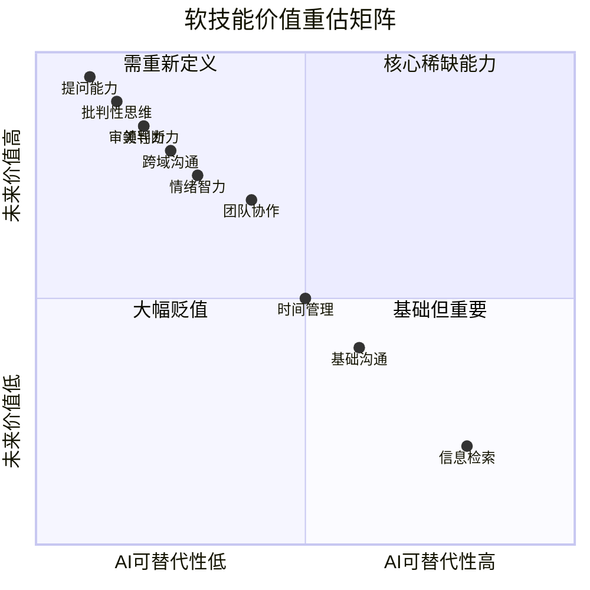
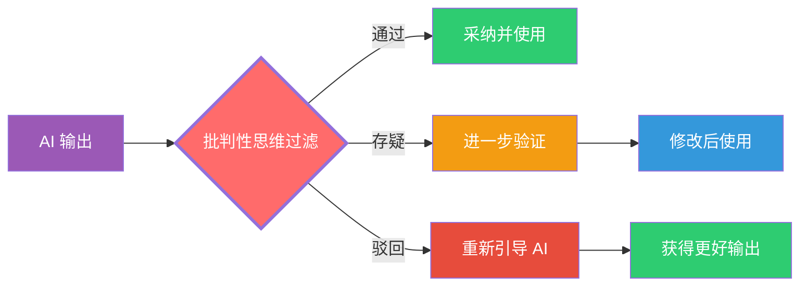
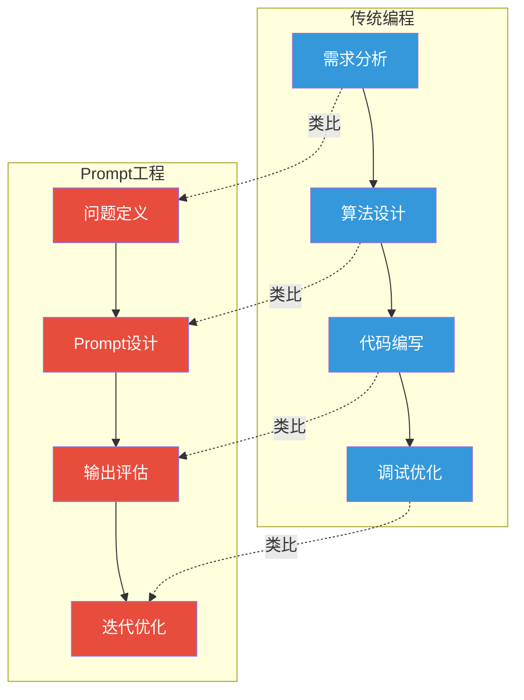
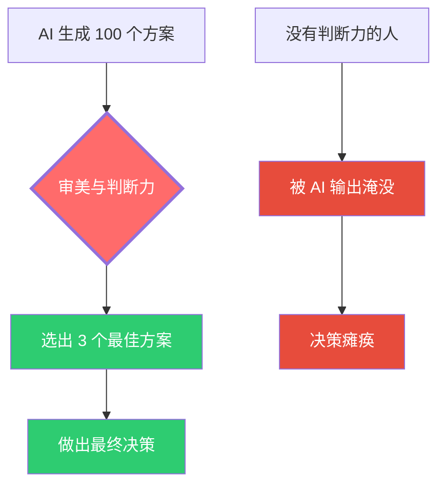
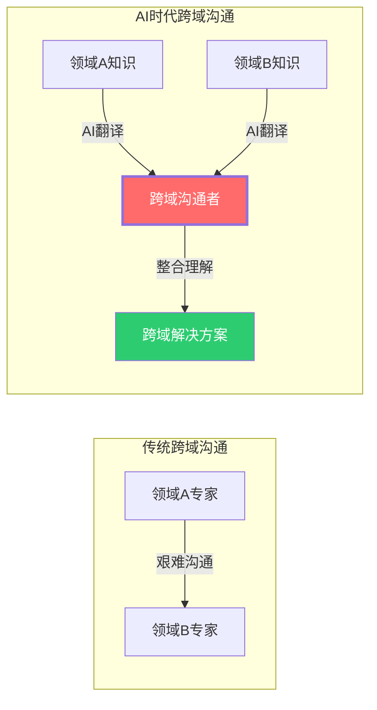
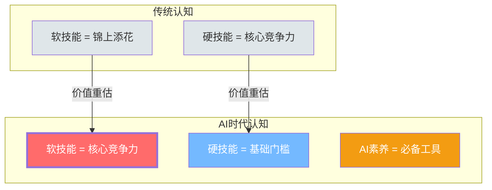
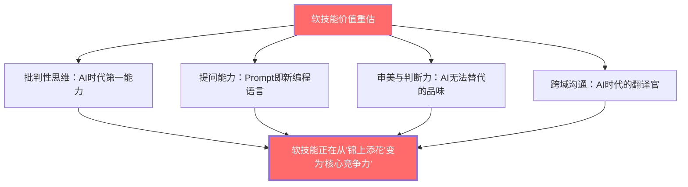

# 04 软技能的变化：AI时代的稀缺能力

> [!note] 本文定位
> 如果说 [[02-AI趋势与素养/AI时代能力要求/03_硬技能的变化：哪些会被替代，哪些会增值]] 讨论的是「会做什么」的变化，那么本文讨论的是「怎么想、怎么沟通、怎么判断」的变化。在 AI 时代，**软技能不是变软了，而是变硬了**——它们正在成为区分「会被 AI 替代的人」和「驾驭 AI 的人」的关键分水岭。

---

## 一、软技能价值重估全景

---

## 二、核心稀缺能力深度解析

### 2.1 批判性思维：AI 时代的第一能力

> [!important] 为什么批判性思维成为第一能力
> AI 可以生成海量内容，但**不能判断自己生成的内容是否正确**。批判性思维——即对信息进行质疑、分析、评估和判断的能力——成为使用 AI 的前提条件。没有批判性思维，AI 不是助手，而是**偏见放大器**和**错误传播器**。

**批判性思维在 AI 时代的三个层次**：

| 层次 | 能力要求 | 示例 |
|:---|:---|:---|
| **第一层：事实核查** | 验证 AI 输出的信息准确性 | 检查 AI 引用的数据、日期、事实 |
| **第二层：逻辑审查** | 检查 AI 推理过程是否合理 | 识别因果倒置、以偏概全等逻辑谬误 |
| **第三层：价值判断** | 判断 AI 输出在特定场景下的适用性 | 评估 AI 建议是否符合组织的价值观和战略 |

> [!tip] 面试官评估建议
> 给候选人一段 AI 生成的、包含事实错误的输出，观察其能否发现错误并给出修正方案。这不是考「知不知道正确答案」，而是考「有没有质疑的习惯和能力」。

### 2.2 提问能力：Prompt 即新编程语言

> [!important] 核心洞察
> 在 AI 时代，**提问能力（Prompt Engineering）正在成为一种新的「编程语言」**。正如代码是人与计算机的交互语言，Prompt 是人与 AI 的交互语言。编程能力决定你能让计算机做什么，提问能力决定你能让 AI 做什么。

**提问能力的三层结构**：

| 层级 | 能力 | 好问题的特征 | 差问题的特征 |
|:---|:---|:---|:---|
| **基础层** | 清晰表达需求 | 具体、明确、有上下文 | 模糊、笼统、缺乏背景 |
| **进阶层** | 结构化问题 | 有逻辑结构、分步骤、有约束 | 杂乱、跳跃、无边界 |
| **高阶层** | 元问题设计 | 能引导 AI 自我纠错、多角度探索 | 只追求单一答案 |

> [!tip] 面试官评估建议
> 让候选人展示一次「与 AI 协作完成复杂任务」的过程。重点观察：
> 1. 第一次提问的质量（是否清晰、结构化）
> 2. 收到 AI 输出后的追问能力（是否深入、有方向）
> 3. 对 AI 输出的迭代改进能力（是否能引导 AI 变得更好）

### 2.3 审美与判断力：AI 无法替代的「品味」

> [!important] 为什么审美与判断力在 AI 时代变得更稀缺
> AI 可以生成无限多的内容，但**不能判断哪个内容更好**。在内容供给无限膨胀的时代，稀缺的不是「生成能力」，而是「判断力」——知道什么是好的、什么是合适的、什么是对的。

**审美与判断力包含的维度**：

| 维度 | 定义 | 在 AI 时代的重要性 |
|:---|:---|:---|
| **审美判断** | 对美的感知和判断能力 | AI 生成内容的质量最终需要人来判断 |
| **价值判断** | 对事物价值的评估能力 | 在 AI 提供的多个选项中做出价值选择 |
| **伦理判断** | 对行为对错的判断能力 | AI 使用中的伦理边界需要人来设定 |
| **情境判断** | 对特定场景下适用性的判断 | AI 的通用建议需要在具体场景中适配 |

> [!tip] 面试官评估建议
> 给候选人 3-5 个 AI 生成的方案，要求其选出最佳方案并说明理由。重点观察：
> 1. 判断标准是否清晰（不是「我觉得好」而是「因为...所以好」）
> 2. 是否考虑了多维度因素（功能、体验、成本、战略等）
> 3. 是否能识别方案的潜在风险和局限

### 2.4 跨域沟通能力：AI 时代的「翻译官」

> [!important] 为什么跨域沟通能力变得至关重要
> 在 AI 时代，专业壁垒正在被 AI 打破（AI 可以翻译任何专业语言），但**真正的跨域沟通——理解不同领域的思维方式、价值取向和核心关切——仍然需要人类完成**。跨域沟通者是将 AI 的「翻译」转化为「理解」的关键角色。

**跨域沟通能力的三个层次**：

| 层次 | 能力 | 说明 |
|:---|:---|:---|
| **语言层** | 能用 AI 翻译专业术语 | 基础要求，AI 已经可以很好地完成 |
| **思维层** | 理解不同领域的思维模式 | 例如：工程师的「系统思维」vs 设计师的「用户思维」 |
| **价值层** | 找到不同领域的共同价值 | 例如：将技术能力转化为业务价值 |

---

## 三、其他重要软技能的变化

### 3.1 情绪智力的升级

> [!note] 情绪智力在 AI 时代的变化
> AI 可以识别情绪，但不能真正理解情绪。在 AI 承担越来越多「理性任务」的同时，人类在「情感任务」上的价值反而上升。这包括：
> - **共情能力**：理解他人的情感状态和需求
> - **冲突调解**：在复杂人际关系中找到平衡点
> - **激励与赋能**：激发他人的潜力和动力

### 3.2 学习能力的重构

> [!important] 「学会如何学习」比「学会什么」更重要
> 在技能半衰期急剧缩短的时代（参见 [[02-AI趋势与素养/AI时代能力要求/03_硬技能的变化：哪些会被替代，哪些会增值]]），**元学习能力**（学会如何学习）成为最核心的软技能之一。这包括：
> - 快速识别学习重点的能力
> - 利用 AI 加速学习过程的能力
> - 将碎片化知识整合为体系的能力
> - 识别「不需要学什么」的能力（AI 可以帮你做的事情就不需要学）

### 3.3 领导力的重新定义

> [!important] AI 时代的领导力
> 当 AI 可以替代大部分「管理」职能（任务分配、进度追踪、绩效评估），真正的领导力——定义愿景、激发动力、做出艰难决策——变得更加稀缺和重要。

---

## 四、软技能的「硬核化」趋势

> [!important] 核心趋势
> 在 AI 时代，传统的「软技能」正在「硬核化」——它们不再是「nice to have」，而是「must have」。批判性思维、提问能力、审美判断力这些「软技能」，正在成为区分人才价值的核心标准。

---

## 五、给面试官的软技能评估框架

### 5.1 软技能评估四维模型

| 维度 | 核心问题 | 评估方法 |
|:---|:---|:---|
| **批判性思维** | 候选人能否质疑 AI 输出？ | 提供含错误的 AI 输出，观察其质疑过程 |
| **提问能力** | 候选人能否提出好问题？ | 观察其与 AI 协作的过程，评估 Prompt 质量 |
| **判断力** | 候选人能否做出正确选择？ | 提供多个方案，观察其选择标准和理由 |
| **跨域沟通** | 候选人能否跨越专业边界？ | 用非专业语言解释其专业领域，观察清晰度 |

### 5.2 面试中的软技能评估要点

> [!tip] 面试官行动清单
> 1. **不要只问「你有什么软技能」**——没人会说自己缺乏批判性思维
> 2. **设计情景模拟**——让候选人在实际场景中展示软技能
> 3. **引入 AI 协作环节**——观察候选人与 AI 互动的质量
> 4. **关注过程而非结论**——软技能体现在「如何得出」而非「得出了什么」
> 5. 结合 [[02-AI趋势与素养/AI时代能力要求/06_不同岗位的差异化影响]] 中不同岗位的软技能权重

---

## 六、总结

> [!quote] 核心结论
> 在 AI 时代，软技能不是变软了，而是变硬了。批判性思维、提问能力、审美判断力、跨域沟通能力——这些曾经被视为「附加分」的能力，正在成为区分「会被 AI 替代的人」和「驾驭 AI 的人」的核心标准。对于面试官来说，**软技能评估应该从「顺便问一下」升级为「核心评估维度」**。对于职场人来说，**软技能投资应该从「有时间再说」升级为「优先级最高」**。

---

*上一篇：[[02-AI趋势与素养/AI时代能力要求/03_硬技能的变化：哪些会被替代，哪些会增值]]*
*下一篇：[[02-AI趋势与素养/AI时代能力要求/05_AI素养：新时代的基础能力]]*