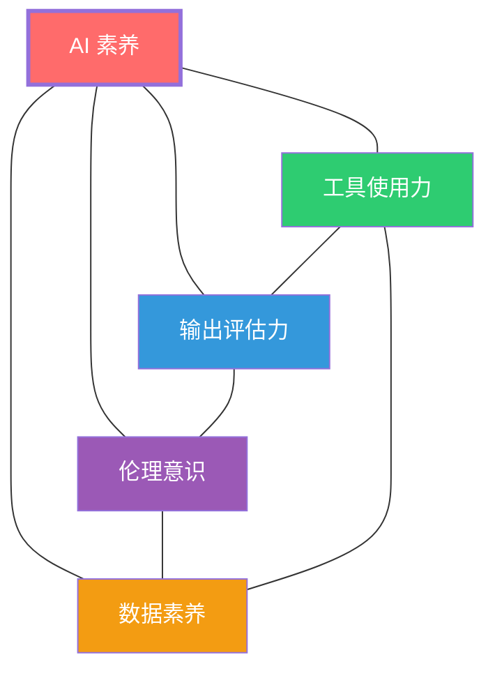
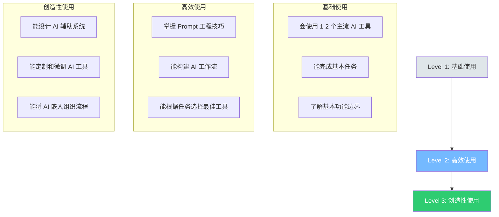
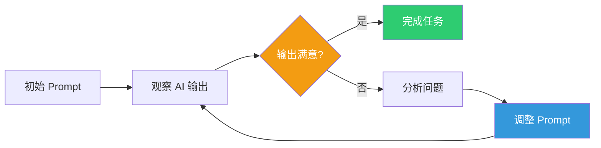
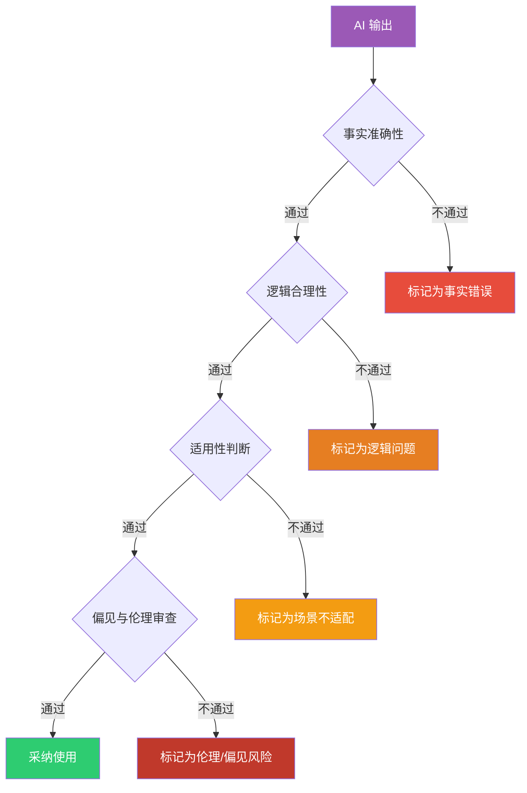
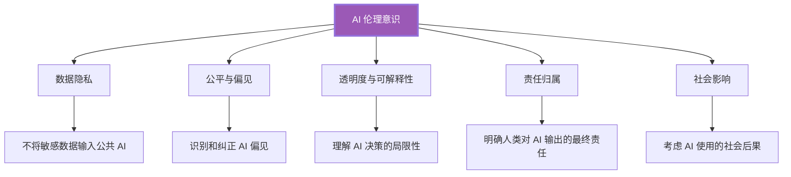
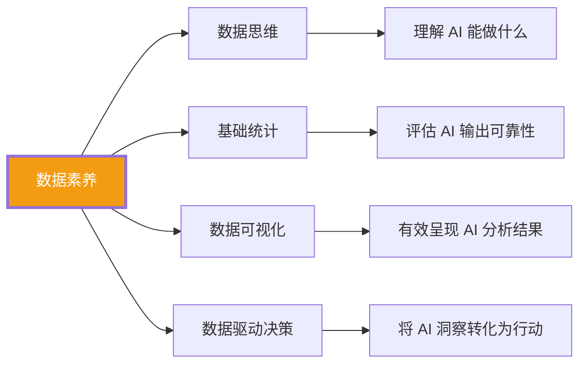
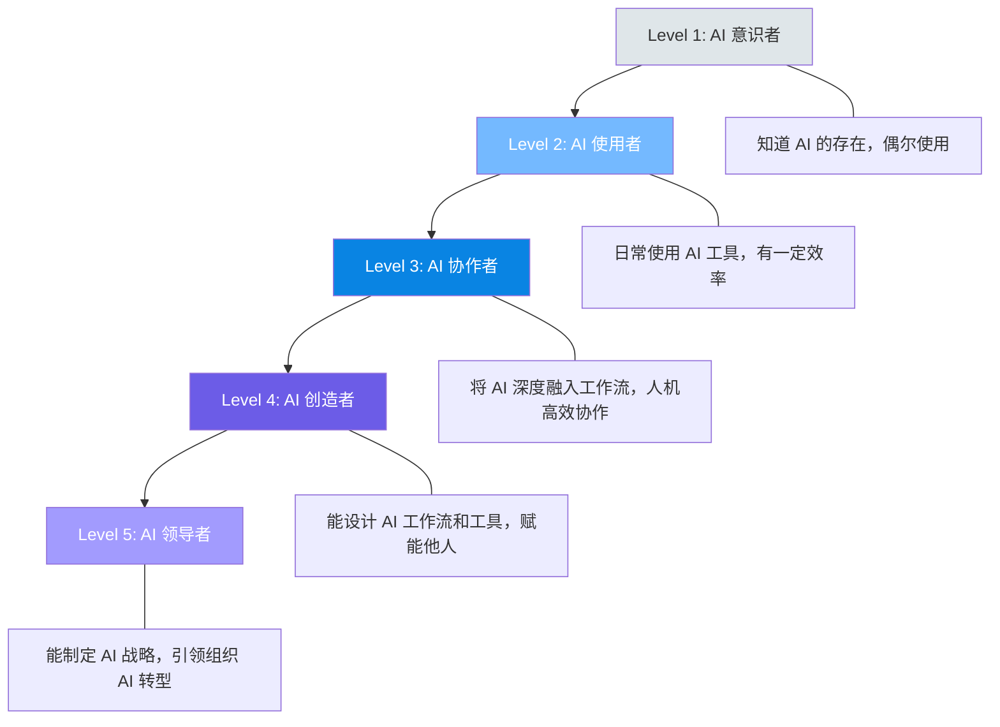
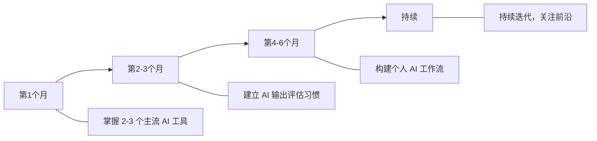
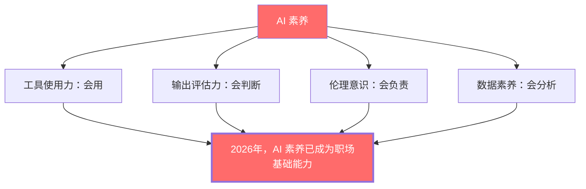

# 05 AI素养：新时代的基础能力

> [!note] 本文定位
> 如果说 [[02-AI趋势与素养/AI时代能力要求/03_硬技能的变化：哪些会被替代，哪些会增值]] 和 [[02-AI趋势与素养/AI时代能力要求/04_软技能的变化：AI时代的稀缺能力]] 讨论的是已有能力的变化，本文讨论的是一个**全新的能力维度**——AI 素养。在 AI 时代，AI 素养不再是「加分项」，而是像读写能力、计算能力一样的基础素养。

---

## 一、AI 素养四维模型

> [!important] 核心定义
> AI 素养（AI Literacy）是指在 AI 时代有效、负责任地使用 AI 技术所需的综合能力。它包含四个核心维度：**工具使用力**、**输出评估力**、**伦理意识**和**数据素养**。四个维度相互关联，缺一不可。

---

## 二、维度一：工具使用力

### 2.1 工具使用力的三个层次

### 2.2 主流 AI 工具类型与能力地图

| 工具类型 | 代表工具 | 适用场景 | 能力要求 | 关联知识 |
|:---|:---|:---|:---|:---|
| **对话式 AI** | ChatGPT, Claude, Gemini | 写作、分析、编程、学习 | 对话管理、上下文控制 | [[01-AI技术/AI Agent 工具/AI_Agent_工具全景对比]] |
| **AI 编程助手** | Cursor, Codex, Copilot | 代码生成、调试、重构 | 代码审查、架构判断 | [[01-AI技术/AI Agent 工具/AI_Agent_赛道一_终端CLI编程Agent]] |
| **AI 设计工具** | Midjourney, DALL-E, Figma AI | 视觉设计、创意构思 | 审美判断、设计指导 | 参见 [[02-AI趋势与素养/AI时代能力要求/04_软技能的变化：AI时代的稀缺能力]] |
| **AI 数据分析** | ChatGPT Code Interpreter, Julius | 数据处理、可视化、建模 | 统计思维、结果验证 | - |
| **AI 办公工具** | Microsoft Copilot, Notion AI | 文档、邮件、会议 | 工作流设计、质量把关 | [[03-HR人事/培训与人才发展/06-前沿趋势/19_AI在培训中的应用]] |

### 2.3 Prompt 工程核心能力

> [!important] Prompt 工程不只是「写提示词」
> 它是人类与 AI 交互的「界面设计」。好的 Prompt 工程需要：
> - **任务分解**：将复杂任务拆解为 AI 可以处理的子任务
> - **上下文管理**：提供足够的背景信息，但不过度
> - **角色设定**：为 AI 设定合适的角色和视角
> - **约束定义**：明确输出格式、风格、边界
> - **迭代优化**：根据 AI 输出持续改进 Prompt

> [!tip] 面试官评估建议
> 让候选人完成一个需要 AI 辅助的任务，观察其：
> 1. 是否能在不同工具之间做出合理选择
> 2. Prompt 是否清晰、结构化、有上下文
> 3. 是否能根据 AI 输出迭代改进 Prompt
> 4. 是否了解所用工具的局限性

---

## 三、维度二：输出评估力

### 3.1 为什么输出评估力至关重要

> [!warning] 核心风险
> AI 的输出质量参差不齐。如果不具备评估能力，使用 AI 不仅不会提升效率，反而会**放大错误**。正所谓「Garbage in, garbage out」升级为「Good prompt in, garbage out if you can't tell」。

### 3.2 AI 输出评估框架

| 评估维度 | 检查要点 | 典型问题 |
|:---|:---|:---|
| **事实准确性** | 数据、日期、引用、事实陈述 | AI 是否编造了不存在的数据或事实？ |
| **逻辑合理性** | 推理链条、因果关系、论据支持 | 结论是否真的由前提推导出来？ |
| **适用性判断** | 场景匹配、边界条件、隐含假设 | AI 的建议在我的具体场景下适用吗？ |
| **偏见审查** | 文化偏见、性别偏见、年龄偏见 | AI 输出是否隐含了某种偏见？ |
| **完整性检查** | 是否遗漏了关键信息或视角 | 有没有重要的方面 AI 没有考虑到？ |

### 3.3 AI 幻觉的识别与应对

> [!warning] AI 幻觉（Hallucination）
> AI 有时会生成看似合理但实际错误的内容。识别和应对 AI 幻觉是输出评估力的核心组成部分。

| 幻觉类型 | 表现 | 应对策略 |
|:---|:---|:---|
| **事实幻觉** | 编造不存在的数据、事件、人物 | 交叉验证、使用可信来源 |
| **逻辑幻觉** | 看似合理的推理但实际上存在漏洞 | 逐步检查推理链条 |
| **来源幻觉** | 编造不存在的引用和文献 | 直接搜索验证引用内容 |
| **能力幻觉** | AI 声称能做但实际做不到的事情 | 了解 AI 的能力边界 |

---

## 四、维度三：伦理意识

### 4.1 AI 伦理的核心议题

### 4.2 AI 使用伦理清单

> [!important] 日常 AI 使用伦理自检清单

| 场景 | 伦理问题 | 正确做法 |
|:---|:---|:---|
| **使用 AI 写报告** | 是否标注 AI 辅助？ | 明确标注 AI 参与程度 |
| **使用 AI 筛选简历** | 是否存在算法偏见？ | 定期审查筛选结果的公平性 |
| **使用 AI 做决策** | 谁来承担决策责任？ | 人类始终是最终决策者和责任承担者 |
| **输入客户数据** | 是否获得授权？ | 绝不将客户敏感数据输入公共 AI |
| **使用 AI 生成内容** | 是否存在版权问题？ | 了解 AI 生成内容的版权规则 |

### 4.3 不同岗位的伦理关注重点

| 岗位 | 核心伦理关注点 | 详见 |
|:---|:---|:---|
| **HR** | 招聘公平性、员工数据隐私、绩效评估偏见 | [[02-AI趋势与素养/AI时代能力要求/06_不同岗位的差异化影响]] |
| **研发** | 代码安全、算法公平、用户隐私 | [[02-AI趋势与素养/AI时代能力要求/06_不同岗位的差异化影响]] |
| **市场** | 内容真实性、消费者数据使用、算法推荐透明 | [[02-AI趋势与素养/AI时代能力要求/06_不同岗位的差异化影响]] |
| **运营** | 用户数据保护、自动化决策公平、客服 AI 伦理 | [[02-AI趋势与素养/AI时代能力要求/06_不同岗位的差异化影响]] |

---

## 五、维度四：数据素养

### 5.1 数据素养与 AI 素养的关系

> [!important] 数据素养是 AI 素养的基础
> AI 本质上是数据驱动的。不理解数据，就无法真正理解 AI 的能力和局限。数据素养包括数据思维、基础统计、数据可视化和数据驱动决策。

### 5.2 数据素养的分层要求

| 层级 | 要求 | 适用人群 |
|:---|:---|:---|
| **基础层** | 能读懂基本图表、理解平均值和中位数等概念 | 所有职场人 |
| **应用层** | 能使用 AI 工具进行数据分析、能判断分析结果是否合理 | 大多数知识工作者 |
| **专业层** | 能设计分析框架、能识别数据质量问题、能进行因果推断 | 数据分析师、产品经理、战略岗 |

---

## 六、AI 素养成熟度模型

| 成熟度 | 标识 | 核心特征 | 典型行为 |
|:---|:---|:---|:---|
| **L1** | AI 意识者 | 知道 AI 存在，偶尔使用 | 偶尔用 ChatGPT 问问题 |
| **L2** | AI 使用者 | 日常使用，有一定效率 | 日常工作稳定使用 2-3 个 AI 工具 |
| **L3** | AI 协作者 | 深度融入工作流 | 构建了 AI 辅助的工作流，人机高效协作 |
| **L4** | AI 创造者 | 能设计 AI 方案 | 能设计 Prompt 模板、工作流，赋能团队 |
| **L5** | AI 领导者 | 引领 AI 转型 | 制定组织 AI 战略，推动 AI 文化 |

> [!tip] 自评建议
> 诚实评估自己的 AI 素养成熟度，设定向下一级迈进的目标。大多数职场人目前处于 L1-L2 之间，目标应该是 2026 年底前达到 L3。

---

## 七、不同岗位的 AI 素养要求差异

> [!important] AI 素养不是「一刀切」
> 不同岗位对 AI 素养四个维度的要求权重不同。详见 [[02-AI趋势与素养/AI时代能力要求/06_不同岗位的差异化影响]]。

| 岗位 | 工具使用力 | 输出评估力 | 伦理意识 | 数据素养 |
|:---|:---|:---|:---|:---|
| **HR** | 中 | 高 | 极高 | 中 |
| **研发** | 高 | 高 | 高 | 中 |
| **市场** | 高 | 中 | 高 | 高 |
| **运营** | 高 | 中 | 中 | 高 |
| **战略** | 中 | 极高 | 高 | 极高 |

---

## 八、AI 素养提升路径

### 8.1 个人提升路线图

> [!tip] 具体行动建议
> 1. **第 1 个月**：每天用 AI 工具完成至少一项工作任务，记录使用体验
> 2. **第 2-3 个月**：每次使用 AI 后，花 2 分钟评估输出质量，养成批判性思维习惯
> 3. **第 4-6 个月**：将 AI 嵌入日常工作流，设计标准化的 Prompt 模板
> 4. **持续**：关注 AI 技术发展，参加相关培训和社群

### 8.2 组织提升建议

> [!tip] 组织如何系统性提升员工 AI 素养
> 详见 [[02-AI趋势与素养/AI时代能力要求/07_组织层面的能力建设启示]]。简要建议：
> 1. 将 AI 素养纳入新员工入职培训
> 2. 建立 AI 工具使用规范和伦理指南
> 3. 设计分层 AI 素养培训课程
> 4. 参考 [[03-HR人事/培训与人才发展/06-前沿趋势/19_AI在培训中的应用]] 和 [[03-HR人事/培训与人才发展/06-前沿趋势/20_微学习与移动学习]]

---

## 九、总结

> [!quote] 核心结论
> AI 素养不是「高级技能」，而是「基础素养」。就像 20 年前「会用电脑」是基础能力一样，今天的「会用 AI、会判断 AI 输出、会负责任地使用 AI、会基于数据做决策」正在成为职场的基本门槛。对于个人来说，AI 素养决定了你能在 AI 时代走多远。对于组织来说，员工 AI 素养的整体水平决定了组织在 AI 时代的竞争力。

---

*上一篇：[[02-AI趋势与素养/AI时代能力要求/04_软技能的变化：AI时代的稀缺能力]]*
*下一篇：[[02-AI趋势与素养/AI时代能力要求/06_不同岗位的差异化影响]]*