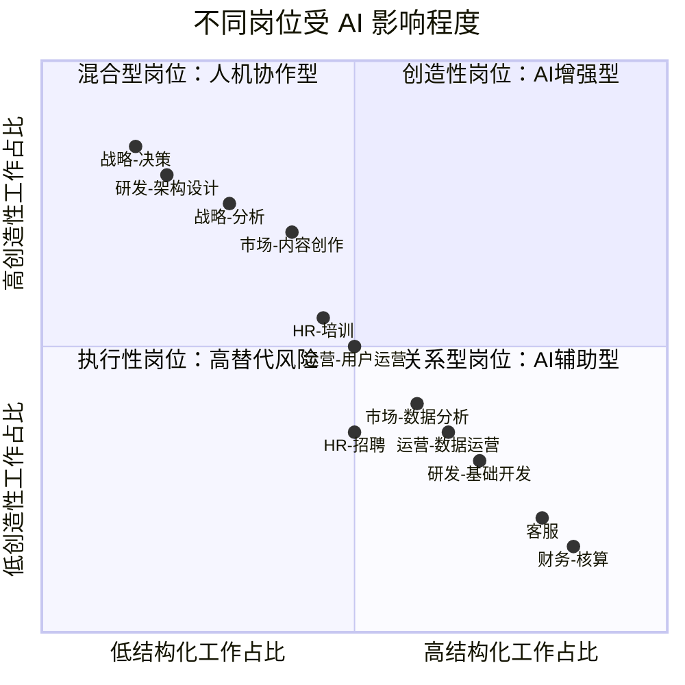
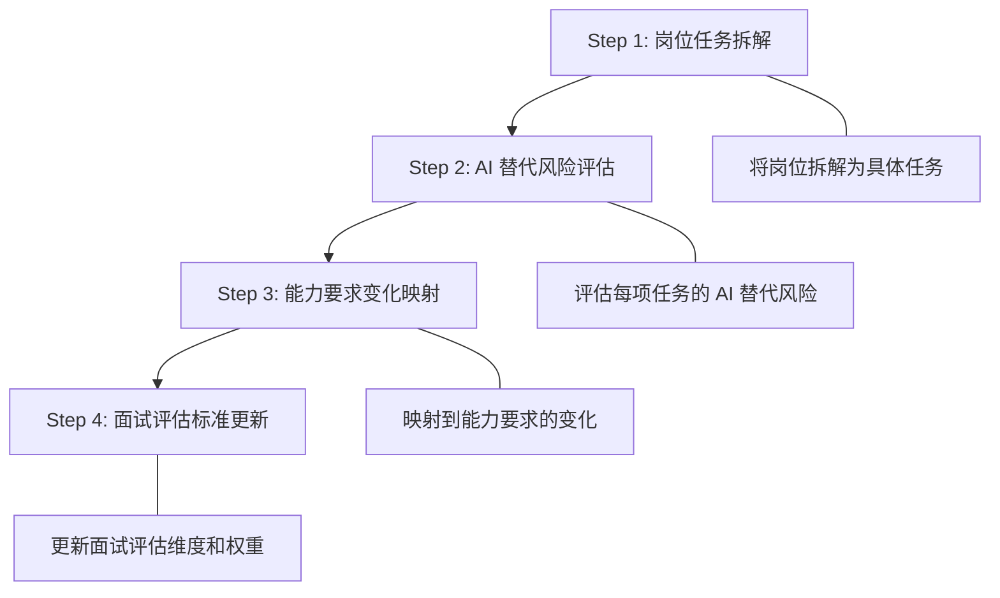
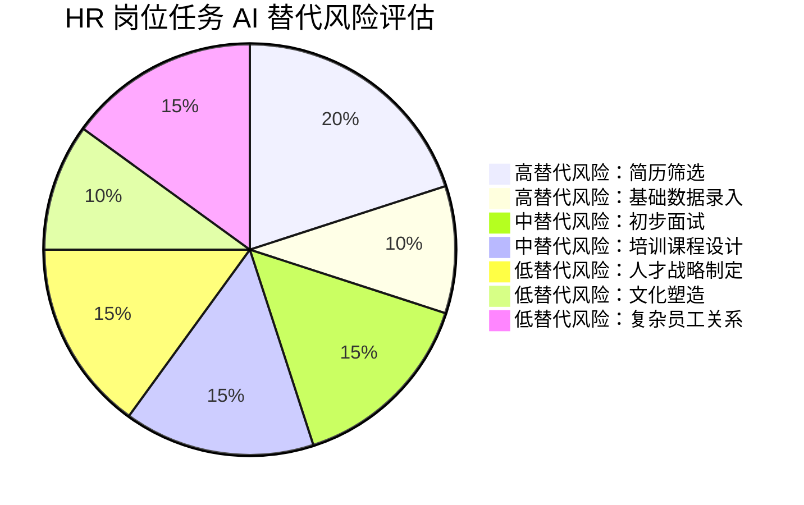
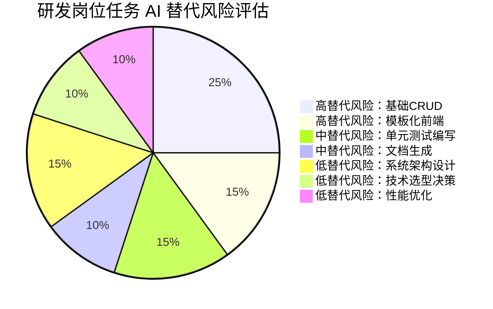
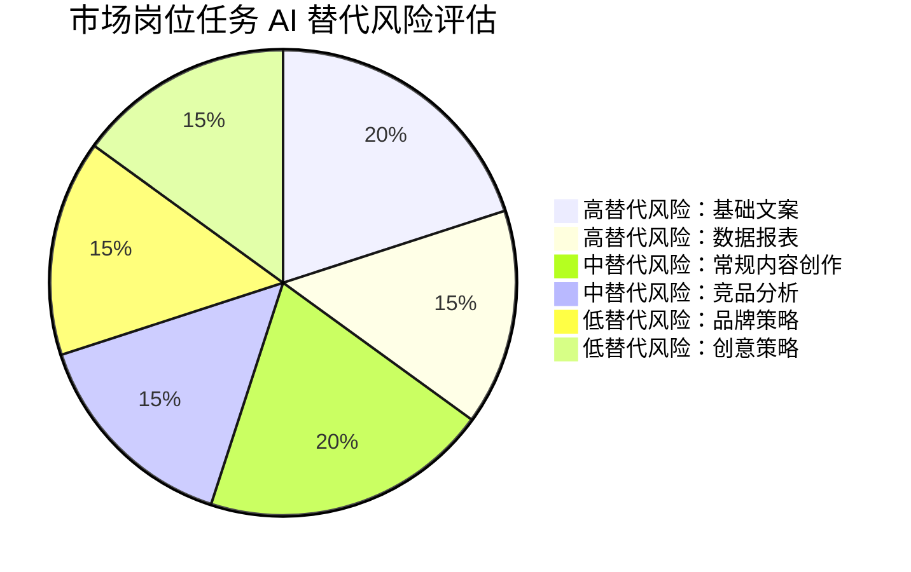
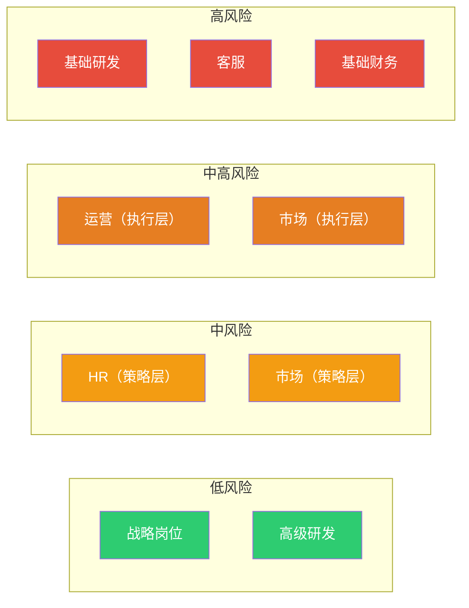
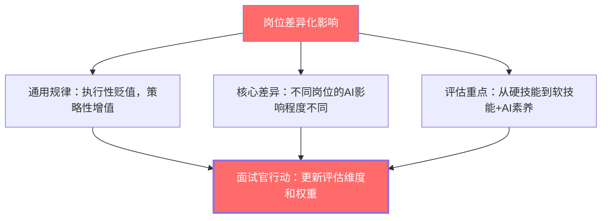

# 06 不同岗位的差异化影响

> [!note] 本文定位
> 本文从面试官视角出发，按职能维度系统分析 AI 对不同岗位的能力要求变化。为 HR 面试官、HRBP 和招聘负责人提供**岗位级别的评估框架**，帮助在面试中更精准地评估候选人的 AI 时代竞争力。

---

## 一、岗位差异化影响全景图

---

## 二、通用评估框架

### 2.1 岗位能力变化评估四步法

### 2.2 通用评估维度

| 评估维度 | 说明 | 权重调整原则 |
|:---|:---|:---|
| **硬技能** | 专业技能、工具使用、领域知识 | 降低执行性硬技能权重，提高策略性硬技能权重 |
| **软技能** | 批判性思维、提问能力、判断力、沟通 | 整体提高权重，从「附加分」升级为「核心分」 |
| **AI 素养** | 工具使用、输出评估、伦理意识、数据素养 | 新增核心维度，权重不低于 15% |
| **学习能力** | 学习敏捷度、元学习能力、适应能力 | 提高权重，因为技能半衰期缩短 |
| **文化匹配** | 价值观、团队协作、组织认同 | 保持权重，在 AI 时代更加重要 |

---

## 三、各岗位详细分析

### 3.1 HR 岗位

#### 3.1.1 HR 岗位能力变化总览

| 能力维度 | 变化方向 | 具体变化 | 面试评估建议 |
|:---|:---|:---|:---|
| **招聘能力** | 从「筛选者」到「策略者」 | 简历筛选 AI 化，重点是定义人才标准和最终判断 | 评估其是否能定义岗位核心能力要求，而非仅看 JD 匹配度 |
| **培训能力** | 从「课程设计者」到「学习体验架构师」 | AI 可以生成课程内容，但学习路径设计仍需人类 | 评估其是否理解 [[03-HR人事/培训与人才发展/03-培训体系/09_课程体系搭建]] 和 [[03-HR人事/培训与人才发展/06-前沿趋势/19_AI在培训中的应用]] |
| **人才发展** | 从「评估者」到「教练」 | AI 可以辅助人才盘点，但高潜判断和辅导仍需人类 | 评估其是否有 [[03-HR人事/培训与人才发展/04-人才发展/12_人才盘点九宫格]] 和 [[03-HR人事/培训与人才发展/04-人才发展/14_IDP个人发展计划]] 的实操经验 |
| **员工关系** | 从「处理者」到「调解者」 | AI 可以处理标准化流程，但复杂冲突仍需人类共情 | 评估其情绪智力和冲突调解能力 |

#### 3.1.2 HR 岗位面试评估维度权重

| 维度 | 传统权重 | AI 时代权重 | 变化说明 |
|:---|:---|:---|:---|
| 专业知识（劳动法、HR 理论） | 30% | 20% | AI 可以回答大部分专业知识问题 |
| 招聘/培训实操经验 | 30% | 20% | 执行层面被 AI 替代 |
| 批判性思维与判断力 | 10% | 20% | 大幅提升，评估 AI 输出和人才判断 |
| AI 素养 | 0% | 15% | 新增维度 |
| 沟通与影响力 | 15% | 15% | 保持，AI 无法替代 |
| 战略思维 | 10% | 10% | 保持，但重要性持续上升 |

> [!tip] HR 面试官自检清单
> - [ ] 我是否在面试中评估了候选人的 AI 工具使用能力？
> - [ ] 我是否考察了候选人对 AI 输出（如 AI 生成的简历评估）的批判性判断？
> - [ ] 我是否理解了 AI 招聘工具的公平性和偏见问题，并在面试中考察候选人的伦理意识？
> - [ ] 我是否更新了岗位 JD 中的能力要求，反映了 AI 时代的变化？

---

### 3.2 研发岗位

#### 3.2.1 研发岗位能力变化总览

| 能力维度 | 变化方向 | 具体变化 | 面试评估建议 |
|:---|:---|:---|:---|
| **编码能力** | 从「写代码」到「审代码」 | 重点是审查 AI 生成的代码质量，而非手写代码速度 | 让候选人 review AI 生成的代码，观察其审查深度 |
| **架构能力** | 重要性大幅提升 | AI 不能替代架构决策中的权衡取舍 | 考察其在不同方案之间的权衡能力 |
| **调试能力** | 从「找 bug」到「描述 bug」 | 重点是能清晰描述问题让 AI 帮助定位 | 观察其问题描述的清晰度和结构化程度 |
| **学习能力** | 从「学新语言」到「学新范式」 | 编程语言半衰期缩短，范式理解更重要 | 考察其跨语言、跨范式的学习能力 |

#### 3.2.2 研发岗位面试评估维度权重

| 维度 | 传统权重 | AI 时代权重 | 变化说明 |
|:---|:---|:---|:---|
| 编程语言掌握 | 25% | 10% | 大幅下降，AI 可以写代码 |
| 算法与数据结构 | 20% | 15% | 下降，AI 可以解决标准算法题 |
| 系统设计 | 20% | 30% | 大幅提升，AI 不能替代架构决策 |
| 代码审查与质量意识 | 10% | 15% | 提升，审 AI 代码成为核心能力 |
| AI 工具使用 | 0% | 15% | 新增维度 |
| 沟通与协作 | 10% | 10% | 保持 |
| 业务理解 | 15% | 15% | 保持，但更强调从业务到技术的转化 |

> [!tip] 研发面试官自检清单
> - [ ] 我是否还在用传统算法题面试，而非考察候选人与 AI 协作完成复杂任务的能力？
> - [ ] 我是否考察了候选人的代码审查能力（特别是审查 AI 生成代码）？
> - [ ] 我是否让候选人展示他们使用 AI 编程工具（如 Cursor/Copilot）的工作流？
> - [ ] 我的面试题是否反映了真实工作场景（而非脱离 AI 的理论题）？

---

### 3.3 市场岗位

#### 3.3.1 市场岗位能力变化总览

| 能力维度 | 变化方向 | 具体变化 | 面试评估建议 |
|:---|:---|:---|:---|
| **内容创作** | 从「创作者」到「策展人」 | AI 生成初稿，人类提供创意方向和最终判断 | 评估其审美判断力和品牌调性把握 |
| **数据分析** | 从「做报表」到「讲故事」 | AI 做数据计算，人类做数据叙事和决策建议 | 评估其数据故事讲述能力（Data Storytelling） |
| **策略规划** | 重要性大幅提升 | AI 提供信息，人类制定策略 | 评估其系统思维和战略判断力 |
| **用户洞察** | 从「问卷分析」到「深度理解」 | AI 量化分析，人类做定性洞察 | 评估其共情能力和用户心理理解 |

#### 3.3.2 市场岗位面试评估维度权重

| 维度 | 传统权重 | AI 时代权重 | 变化说明 |
|:---|:---|:---|:---|
| 内容创作能力 | 25% | 10% | 大幅下降，AI 可以生成内容 |
| 数据分析能力 | 20% | 15% | 从「做分析」变为「解读分析」 |
| 策略思维 | 15% | 25% | 大幅提升，AI 不能替代策略 |
| 创意与审美 | 15% | 20% | 提升，AI 生成内容的质量判断 |
| AI 工具使用 | 0% | 15% | 新增维度 |
| 沟通与影响力 | 15% | 15% | 保持 |
| 行业理解 | 10% | 10% | 保持 |

---

### 3.4 运营岗位

#### 3.4.1 运营岗位能力变化总览

| 能力维度 | 变化方向 | 具体变化 | 面试评估建议 |
|:---|:---|:---|:---|
| **流程管理** | 从「执行流程」到「设计流程」 | AI 执行标准化流程，人类设计流程和异常处理 | 评估其流程设计能力和异常场景预判 |
| **用户运营** | 从「回复用户」到「理解用户」 | AI 处理标准化回复，人类处理复杂需求和情感连接 | 评估其用户心理理解和共情能力 |
| **数据运营** | 从「看数据」到「用数据」 | AI 产出数据报告，人类做数据驱动的决策 | 评估其数据驱动决策的能力 |
| **活动运营** | 从「执行活动」到「设计活动」 | AI 辅助执行，人类做创意和策略 | 评估其创意能力和效果预判 |

#### 3.4.2 运营岗位面试评估维度权重

| 维度 | 传统权重 | AI 时代权重 | 变化说明 |
|:---|:---|:---|:---|
| 执行能力 | 30% | 15% | 大幅下降，AI 可以执行 |
| 数据分析 | 20% | 20% | 从「计算」变为「解读」 |
| 用户理解 | 15% | 20% | 提升，AI 不能替代深度共情 |
| 流程设计 | 10% | 15% | 提升，设计 AI 工作流 |
| AI 工具使用 | 0% | 15% | 新增维度 |
| 沟通协作 | 15% | 15% | 保持 |
| 抗压能力 | 10% | 10% | 保持 |

---

### 3.5 战略岗位

#### 3.5.1 战略岗位能力变化总览

| 能力维度 | 变化方向 | 具体变化 | 面试评估建议 |
|:---|:---|:---|:---|
| **信息收集** | 从「搜集信息」到「验证信息」 | AI 搜集海量信息，人类验证和筛选 | 评估其信息验证和优先级判断能力 |
| **分析框架** | 从「套用框架」到「创造框架」 | AI 可以套用标准框架，人类需要创造新框架 | 评估其分析框架的创造能力 |
| **决策判断** | 重要性大幅提升 | AI 提供选项，人类做决策并承担后果 | 评估其决策逻辑和风险承担意识 |
| **趋势预判** | 从「追踪趋势」到「创造趋势」 | AI 分析已有趋势，人类预判未来和创造方向 | 评估其前瞻思维和想象力 |

#### 3.5.2 战略岗位面试评估维度权重

| 维度 | 传统权重 | AI 时代权重 | 变化说明 |
|:---|:---|:---|:---|
| 分析框架 | 25% | 15% | 下降，AI 可以套用框架 |
| 行业知识 | 20% | 15% | 下降，AI 可以检索知识 |
| 判断力与决策力 | 15% | 25% | 大幅提升，核心能力 |
| 创新思维 | 15% | 20% | 提升，AI 不能替代真正的创新 |
| AI 工具使用 | 0% | 10% | 新增维度 |
| 沟通影响力 | 15% | 15% | 保持 |
| 领导力 | 10% | 10% | 保持 |

---

## 四、跨岗位能力变化对比

### 4.1 能力维度热力图

| 能力维度 | HR | 研发 | 市场 | 运营 | 战略 |
|:---|:---:|:---:|:---:|:---:|:---:|
| **批判性思维** | 极高 | 高 | 高 | 中 | 极高 |
| **提问能力** | 高 | 极高 | 高 | 中 | 极高 |
| **审美判断力** | 中 | 中 | 极高 | 中 | 中 |
| **跨域沟通** | 极高 | 高 | 高 | 高 | 极高 |
| **AI 工具使用** | 高 | 极高 | 高 | 高 | 中 |
| **AI 输出评估** | 高 | 极高 | 中 | 中 | 极高 |
| **AI 伦理意识** | 极高 | 高 | 高 | 中 | 高 |
| **数据素养** | 中 | 中 | 高 | 极高 | 极高 |
| **系统设计** | 中 | 极高 | 中 | 高 | 极高 |
| **复杂决策** | 高 | 高 | 中 | 中 | 极高 |

> [!legend] 图例
> 极高 = 该岗位的核心差异化能力 | 高 = 重要能力 | 中 = 基础要求

### 4.2 岗位替代风险排名

---

## 五、面试官实操指南

### 5.1 面试评估模板（通用版）

> [!important] AI 时代面试评估表

| 评估维度 | 权重 | 评估方法 | 评分（1-5） | 备注 |
|:---|:---|:---|:---|:---|
| **策略性硬技能** | 25% | 案例分析、情景模拟 | | |
| **软技能（批判思维/判断力）** | 25% | AI 协作演示、情景判断 | | |
| **AI 素养** | 20% | AI 工具实操、Prompt 质量评估 | | |
| **学习能力** | 15% | 行为面试、学习历史回顾 | | |
| **文化匹配** | 15% | 价值观评估、团队协作场景 | | |

### 5.2 面试问题库（按岗位）

#### HR 岗位面试问题

> [!question] 关键面试问题
> 1. **AI 素养评估**：「请描述你日常工作中使用 AI 工具的场景。效果如何？有哪些局限？」
> 2. **判断力评估**：「这里有一份 AI 生成的候选人评估报告，请指出其中可能存在的问题。」
> 3. **伦理意识**：「如果你发现 AI 招聘工具对某类候选人存在系统性偏见，你会怎么做？」
> 4. **战略思维**：「你认为未来 3 年 HR 岗位的核心能力要求会发生什么变化？」

#### 研发岗位面试问题

> [!question] 关键面试问题
> 1. **AI 协作能力**：「请展示你使用 AI 编程工具完成一个功能开发的过程。」
> 2. **代码审查能力**：「这里有一段 AI 生成的代码，请 review 并指出问题。」
> 3. **架构能力**：「AI 可以生成代码，但不能设计架构。请谈谈你对这句话的理解。」
> 4. **学习能力**：「你最近学的一个新技术是什么？AI 在你的学习过程中起了什么作用？」

#### 市场岗位面试问题

> [!question] 关键面试问题
> 1. **审美判断**：「这里有 3 个 AI 生成的营销方案，请选出最佳方案并说明理由。」
> 2. **策略思维**：「AI 可以生成内容，但品牌策略需要人来制定。你如何理解品牌策略的核心？」
> 3. **数据素养**：「请展示一个你使用数据驱动决策的案例。」

---

## 六、总结

> [!quote] 核心结论
> 不同岗位受 AI 影响的程度和方式不同，但有一个共同规律：**执行性工作贬值，策略性工作增值**。对于面试官来说，核心任务是识别岗位中「AI 不可替代的部分」，并在面试中重点评估候选人在这些部分的能力。对于职场人来说，核心任务是**将工作重心从执行层面向策略层面转移**。同时，结合 [[02-AI趋势与素养/AI时代能力要求/07_组织层面的能力建设启示]] 和 [[02-AI趋势与素养/AI时代能力要求/08_个人发展建议：如何构建AI时代的竞争力]] 制定相应的行动计划。

---

*上一篇：[[02-AI趋势与素养/AI时代能力要求/05_AI素养：新时代的基础能力]]*
*下一篇：[[02-AI趋势与素养/AI时代能力要求/07_组织层面的能力建设启示]]*