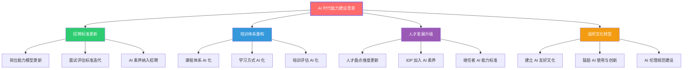
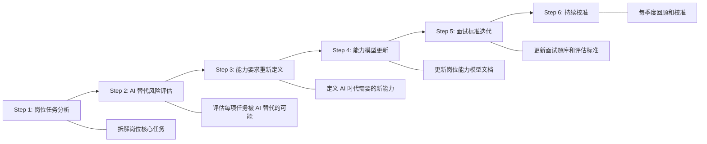
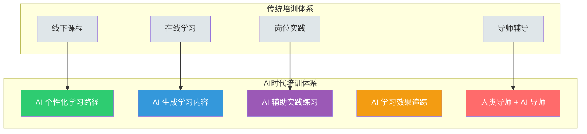
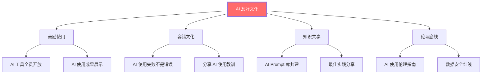
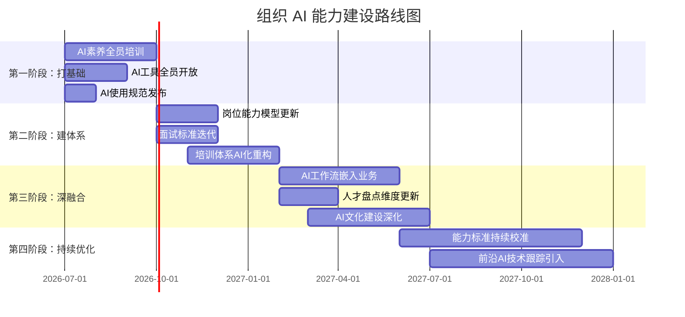
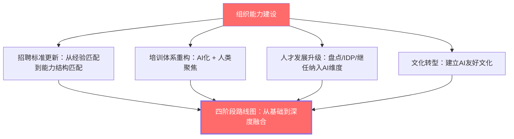

# 07 组织层面的能力建设启示

> [!note] 本文定位
> 本文从组织管理者视角出发，回答一个战略性问题：**企业如何应对 AI 时代的能力结构变化？** 涵盖招聘标准更新、培训体系重构、人才发展机制升级和组织文化转型四个维度，为 HRD、OD 负责人和企业大学负责人提供系统性的行动框架。

---

## 一、组织能力建设的战略框架

---

## 二、招聘标准更新

### 2.1 从「经验匹配」到「能力结构匹配」

> [!important] 核心转变
> 传统招聘关注「这个人做过什么」（经验匹配），AI 时代招聘应关注「这个人的能力结构是否适应 AI 时代」（能力结构匹配）。经验和技能会过时，但能力结构决定了长期适应性。

| 传统招聘标准 | AI 时代招聘标准 | 变化原因 |
|:---|:---|:---|
| 3-5 年相关经验 | 学习敏捷度 + 适应能力 | 经验可能过时，学习能力不会 |
| 精通某个工具/语言 | 理解底层原理 + 快速上手新工具 | 工具半衰期缩短 |
| 独立完成任务 | 与 AI 协作完成任务 | 工作方式已变 |
| 专业知识深度 | 知识广度 + 深度 + AI 素养 | 参见 [[02-AI趋势与素养/AI时代能力要求/02_能力模型重构：从I型到T型到π型到梳型]] |
| 过往业绩 | 业绩 + 成长潜力 + AI 适应力 | 过去不代表未来 |

### 2.2 岗位能力模型的更新路径

### 2.3 新增面试评估维度

> [!important] AI 时代面试评估维度（通用版）

| 维度 | 权重建议 | 评估方法 | 关联文档 |
|:---|:---|:---|:---|
| **策略性硬技能** | 25% | 案例分析、情景模拟 | [[02-AI趋势与素养/AI时代能力要求/03_硬技能的变化：哪些会被替代，哪些会增值]] |
| **软技能（批判思维/判断力）** | 25% | AI 协作演示、情景判断 | [[02-AI趋势与素养/AI时代能力要求/04_软技能的变化：AI时代的稀缺能力]] |
| **AI 素养** | 20% | AI 工具实操、Prompt 质量评估 | [[02-AI趋势与素养/AI时代能力要求/05_AI素养：新时代的基础能力]] |
| **学习能力** | 15% | 行为面试、学习历史回顾 | [[03-HR人事/培训与人才发展/04-人才发展/14_IDP个人发展计划]] |
| **文化匹配** | 15% | 价值观评估、团队协作场景 | [[03-HR人事/培训与人才发展/07-面试实战/22_面试常见问题]] |

> [!tip] 实施建议
> 1. 先试点 1-2 个岗位，收集反馈后再推广
> 2. 为面试官提供 AI 素养评估培训
> 3. 建立面试评估校准机制，确保评估一致性
> 4. 跟踪新评估标准的预测效度

---

## 三、培训体系重构

### 3.1 培训体系的「AI 化」转型

### 3.2 课程体系更新建议

> [!important] 必设课程（AI 时代新增/升级）

| 课程名称 | 目标学员 | 课程目标 | 关联知识 |
|:---|:---|:---|:---|
| **AI 素养基础** | 全员 | 建立 AI 工具使用、输出评估、伦理意识 | [[02-AI趋势与素养/AI时代能力要求/05_AI素养：新时代的基础能力]] |
| **Prompt 工程实战** | 全员 | 掌握高效与 AI 协作的方法 | [[02-AI趋势与素养/AI时代能力要求/04_软技能的变化：AI时代的稀缺能力]] |
| **AI 时代的批判性思维** | 全员 | 提升 AI 输出评估和判断能力 | [[02-AI趋势与素养/AI时代能力要求/04_软技能的变化：AI时代的稀缺能力]] |
| **AI 伦理与责任** | 全员 | 理解 AI 伦理边界和负责任使用 | [[02-AI趋势与素养/AI时代能力要求/05_AI素养：新时代的基础能力]] |
| **AI 增强工作流设计** | 中高层 | 设计 AI 辅助的工作流程 | [[02-AI趋势与素养/AI时代能力要求/03_硬技能的变化：哪些会被替代，哪些会增值]] |
| **AI 时代的人才管理** | HR 团队 | 更新招聘、培训、绩效管理方法 | 本文 + [[02-AI趋势与素养/AI时代能力要求/06_不同岗位的差异化影响]] |
| **AI 战略与组织转型** | 高层 | 制定组织级 AI 战略 | 本文 + [[03-HR人事/培训与人才发展/01-战略视角/01_企业生命周期与人才战略]] |

### 3.3 培训方式创新

> [!tip] 培训方式 AI 化建议

| 传统方式 | AI 时代方式 | 优势 |
|:---|:---|:---|
| 统一课程 | AI 个性化学习路径 | 因材施教，效率更高 |
| 讲师授课 | AI 讲师 + 人类讲师 | 知识传授 AI 化，互动讨论人工化 |
| 固定考核 | AI 持续评估 | 实时追踪学习效果 |
| 线下练习 | AI 模拟练习 | 无限次练习机会 |
| 年度培训 | 持续微学习 | 参见 [[03-HR人事/培训与人才发展/06-前沿趋势/20_微学习与移动学习]] |

> [!important] 培训体系重构原则
> 1. **AI First**：能用 AI 做的培训内容，优先用 AI（效率更高）
> 2. **人类聚焦**：AI 做不了的（情感连接、深度讨论、实践指导），聚焦人类
> 3. **持续迭代**：培训内容和方式需要随 AI 能力变化持续更新
> 4. **参考框架**：结合 [[03-HR人事/培训与人才发展/02-核心理论/07_ADDIE教学设计模型]] 和 [[03-HR人事/培训与人才发展/02-核心理论/06_柯氏四级评估]] 进行系统化设计

---

## 四、人才发展机制升级

### 4.1 人才盘点维度更新

> [!important] 在 [[03-HR人事/培训与人才发展/04-人才发展/12_人才盘点九宫格]] 的基础上，新增 AI 时代维度

| 传统维度 | 新增维度 | 说明 |
|:---|:---|:---|
| 绩效 | 绩效 + AI 增效比 | 使用 AI 后的绩效提升程度 |
| 潜力 | 潜力 + AI 学习力 | 学习和应用新 AI 工具的速度 |
| 价值观 | 价值观 + AI 伦理 | 使用 AI 的伦理意识和责任感 |

### 4.2 IDP 加入 AI 素养

> [!tip] 在 [[03-HR人事/培训与人才发展/04-人才发展/14_IDP个人发展计划]] 中必设 AI 相关目标

| IDP 目标类型 | 示例 | 考核方式 |
|:---|:---|:---|
| **AI 工具掌握** | 本季度掌握 3 个新 AI 工具并应用到工作 | 工具使用频率和效果评估 |
| **AI 工作流设计** | 设计 1 个 AI 辅助的工作流，提升效率 30% | 效率提升数据 |
| **AI 素养提升** | 完成 AI 素养系列课程，通过评估 | 课程完成 + 评估得分 |
| **AI 伦理实践** | 在团队内推动 AI 伦理讨论，形成使用规范 | 规范文档 + 团队反馈 |

### 4.3 继任者计划更新

> [!important] 在 [[03-HR人事/培训与人才发展/04-人才发展/13_继任者计划]] 中，AI 能力应成为核心评估维度

| 继任者评估维度 | 传统标准 | AI 时代新增标准 |
|:---|:---|:---|
| 业务能力 | 熟悉业务 | 能用 AI 增强业务决策 |
| 领导力 | 团队管理 | 能用 AI 赋能团队 |
| 战略思维 | 行业洞察 | 能理解 AI 对行业的颠覆性影响 |
| 学习能力 | 持续学习 | 能快速掌握和应用新 AI 技术 |

---

## 五、组织文化转型

### 5.1 建立 AI 友好文化

### 5.2 AI 文化建设行动清单

> [!tip] 组织文化建设行动清单
> - [ ] 制定并发布《AI 工具使用规范》和《AI 伦理指南》
> - [ ] 建立公司级 AI Prompt 共享库，鼓励员工贡献和复用
> - [ ] 每月举办「AI 最佳实践分享会」
> - [ ] 设立「AI 创新基金」，奖励用 AI 提升工作效率的创新
> - [ ] 高层带头使用 AI 工具，以身作则
> - [ ] 将 AI 使用纳入绩效考核（非惩罚性，鼓励性）
> - [ ] 定期组织 AI 伦理培训，确保全员知晓底线

---

## 六、能力建设路线图

### 6.1 分阶段推进策略

### 6.2 各阶段关键指标

| 阶段 | 关键指标 | 目标值 |
|:---|:---|:---|
| **第一阶段** | AI 工具使用率 | > 80%员工日常使用 AI |
| **第一阶段** | AI 素养培训完成率 | > 90% |
| **第二阶段** | 岗位能力模型更新覆盖率 | 100% |
| **第二阶段** | 面试官 AI 评估培训完成率 | 100% |
| **第三阶段** | AI 工作流嵌入率 | 核心流程 > 50% |
| **第三阶段** | AI 创新项目数 | 每季度 > 10 个 |
| **第四阶段** | 员工 AI 素养成熟度 | L3+ 占比 > 50% |
| **第四阶段** | 人才招聘 AI 标准覆盖率 | 100% |

---

## 七、风险与应对

### 7.1 组织能力建设中的常见风险

> [!warning] 风险一：AI 鸿沟
> 积极使用 AI 的员工和不使用 AI 的员工之间产生能力鸿沟，可能导致团队分化。
>
> **应对**：强制全员 AI 素养培训，设置最低 AI 使用标准。

> [!warning] 风险二：过度依赖 AI
> 员工过度依赖 AI 导致基本能力退化，出现「AI 宕机就宕人」的情况。
>
> **应对**：定期进行「无 AI 日」演练，确保核心能力不退化。

> [!warning] 风险三：数据安全风险
> 员工将敏感数据输入公共 AI 工具，导致数据泄露。
>
> **应对**：建立严格的 AI 使用规范，部署企业级 AI 工具。

> [!warning] 风险四：变革阻力
> 员工（尤其是资深员工）抵制 AI 工具的使用，认为「AI 不如我」。
>
> **应对**：高层带头示范，展示 AI 增效案例，将 AI 使用与职业发展挂钩。

### 7.2 预算与 ROI 考量

> [!important] 能力建设投资回报分析
> 组织 AI 能力建设不是成本，而是投资。参考 [[03-HR人事/培训与人才发展/03-培训体系/11_培训预算与ROI]] 的方法论，评估 AI 能力建设的投资回报：
> - **效率提升**：AI 工具使用带来的工作效率提升（可量化）
> - **质量提升**：AI 辅助决策带来的决策质量提升
> - **人才吸引**：AI 友好文化对优秀人才的吸引力
> - **风险规避**：提前布局避免被 AI 时代淘汰的风险

---

## 八、总结

> [!quote] 核心结论
> 组织层面的能力建设不是「买几个 AI 工具」或「开几场 AI 培训」那么简单，而是**招聘、培训、人才发展、文化四个维度的系统重构**。这需要从战略层面规划，分阶段推进，持续迭代。对于组织来说，AI 能力建设不是「选择题」，而是「生存题」——未来的竞争，本质上是组织 AI 能力的竞争。

---

*上一篇：[[02-AI趋势与素养/AI时代能力要求/06_不同岗位的差异化影响]]*
*下一篇：[[02-AI趋势与素养/AI时代能力要求/08_个人发展建议：如何构建AI时代的竞争力]]*