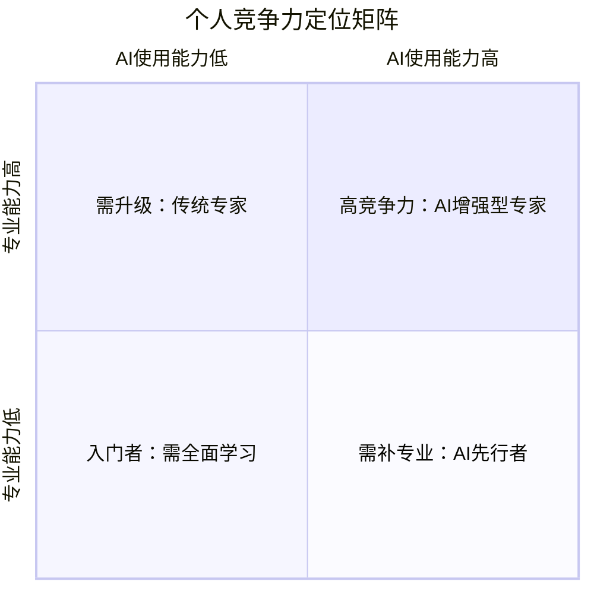
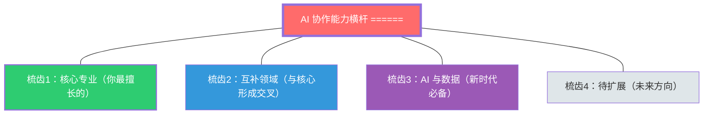
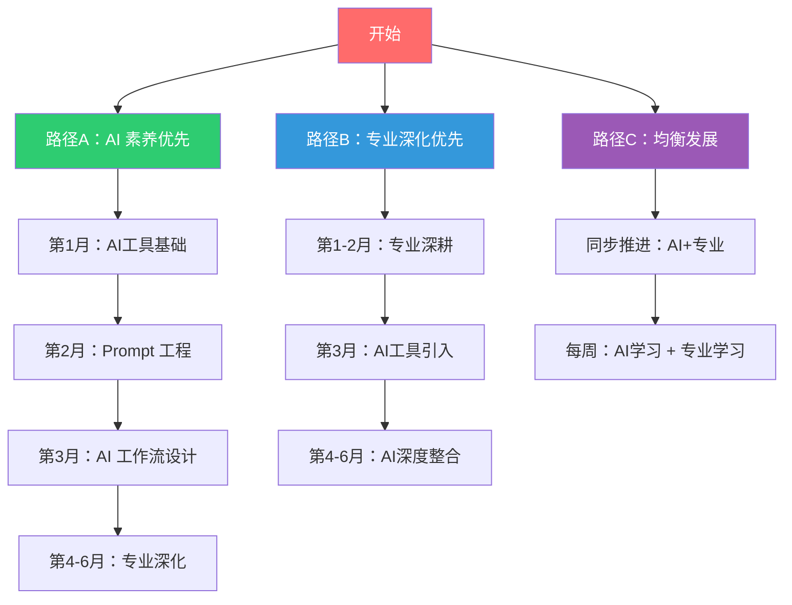
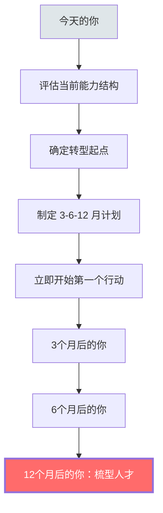

# 08 个人发展建议：如何构建AI时代的竞争力

> [!note] 本文定位
> 本文是知识库的「行动篇」，面向职场人提供具体的、可落地的个人发展建议。在前面的 7 篇文档建立了「理解框架」之后，本文回答最实际问题：**我该怎么做？** 核心方法论：不是「学什么技能」，而是「构建什么能力组合」。

---

## 一、个人竞争力自评

### 1.1 AI 时代竞争力自评表

> [!question] 在开始之前，请诚实回答以下问题

| 自评维度 | 自评问题 | 评分（1-5） |
|:---|:---|:---|
| **AI 使用频率** | 我每天使用 AI 工具完成几项工作任务？ | |
| **AI 使用深度** | 我是「偶尔问问题」还是「深度融入工作流」？ | |
| **批判性思维** | 我是否经常质疑 AI 的输出？还是「AI 说什么就是什么」？ | |
| **提问能力** | 我能否通过高质量提问让 AI 产生更好的输出？ | |
| **跨域能力** | 我是否拥有 2 个以上的深度领域？ | |
| **学习能力** | 我最近 3 个月学了什么新东西？用了什么方法？ | |
| **AI 伦理意识** | 我是否了解 AI 使用的伦理边界？ | |
| **能力结构** | 我的能力结构是 I/T/π/梳型？ | |

### 1.2 根据自评结果定位

> [!tip] 解读你的定位
> - **右上（高竞争力）**：你已经在正确的轨道上，继续深化梳型能力结构
> - **左上（需升级）**：你有深厚的专业能力，但需要补齐 AI 素养
> - **右下（需补专业）**：你擅长使用 AI，但需要建立更深的专业领域
> - **左下（入门者）**：需要同时提升专业能力和 AI 使用能力

---

## 二、能力组合构建策略

### 2.1 理想能力组合：梳型结构

> [!important] 能力组合构建原则
> 1. **核心梳齿要深**：至少有一个领域达到「专家级」深度
> 2. **互补梳齿要选对**：选择与核心专业形成互补的领域（参见 [[02-AI趋势与素养/AI时代能力要求/02_能力模型重构：从I型到T型到π型到梳型]]）
> 3. **AI 横杆要牢固**：AI 协作能力是所有梳齿的连接器（参见 [[02-AI趋势与素养/AI时代能力要求/05_AI素养：新时代的基础能力]]）
> 4. **软技能要打磨**：批判性思维、提问能力、判断力是核心护城河（参见 [[02-AI趋势与素养/AI时代能力要求/04_软技能的变化：AI时代的稀缺能力]]）

### 2.2 不同起点的能力组合建议

#### 起点一：I 型人才（单一深度）

> [!tip] 转型路径
> 你有深厚的专业积累，这是最大的资产。下一步：
> 1. **立刻建立 AI 横杆**：学习 AI 工具使用，将 AI 融入你的专业领域
> 2. **扩展第二梳齿**：选择一个与你的专业互补的领域，利用 AI 加速学习
> 3. **刻意练习软技能**：特别关注批判性思维和提问能力

**时间表**：
- 第 1-2 个月：AI 素养基础建设
- 第 3-6 个月：第二梳齿入门
- 第 6-12 个月：梳型结构成型

#### 起点二：T 型人才（一专多能）

> [!tip] 转型路径
> 你已经有了一定的广度，但深度不够多。下一步：
> 1. **升级 AI 横杆**：从「会用 AI」升级到「精通 AI 协作」
> 2. **深化第二梳齿**：将你的「广度」中的某个领域升级为「深度」
> 3. **强化软技能**：在已有基础上提升批判性思维层次

**时间表**：
- 第 1-3 个月：AI 横杆升级
- 第 3-6 个月：第二梳齿深化
- 第 6-9 个月：梳型结构成型

#### 起点三：π 型人才（双专多能）

> [!tip] 转型路径
> 你最接近梳型人才，但缺少 AI 横杆。下一步：
> 1. **建立 AI 横杆**：这是你的核心差距，优先补齐
> 2. **利用 AI 强化两个梳齿**：用 AI 提升两个领域的深度
> 3. **扩展第三梳齿**：AI 降低了学习成本，可以开始探索新领域

**时间表**：
- 第 1-2 个月：AI 横杆建立
- 第 2-4 个月：AI 增强现有梳齿
- 第 4-8 个月：第三梳齿探索

### 2.3 不同职业阶段的建议

| 职业阶段 | 核心建议 | 优先级 |
|:---|:---|:---|
| **初入职场（0-3年）** | 先建立核心梳齿深度，同时养成 AI 使用习惯 | 专业深度 > AI 素养 |
| **成长期（3-7年）** | 在核心梳齿基础上扩展第二梳齿，AI 横杆升级 | 能力扩展 > 深度维护 |
| **成熟期（7-15年）** | 构建完整梳型结构，成为 AI 时代的引领者 | 引领转型 > 个人成长 |
| **资深期（15年+）** | 用 AI 放大经验价值，避免「经验过时」陷阱 | 经验 AI 化 > 学习新技能 |

---

## 三、学习路径设计

### 3.1 学习路径全景图

### 3.2 推荐学习资源矩阵

| 学习主题 | 推荐资源类型 | 具体建议 | 时间投入 |
|:---|:---|:---|:---|
| **AI 工具使用** | 实操练习 | 每天用 AI 完成 1 项工作任务 | 每天 30 分钟 |
| **Prompt 工程** | 在线课程 + 实践 | 系统学习 Prompt 技巧，建立个人 Prompt 库 | 每周 2 小时 |
| **批判性思维** | 阅读 + 刻意练习 | 每次使用 AI 后花 2 分钟评估输出质量 | 融入日常 |
| **第二领域** | 项目驱动学习 | 选择一个实际项目，用 AI 辅助学习 | 每周 3-5 小时 |
| **AI 前沿** | 信息追踪 | 关注 AI 发展动态，保持前沿认知 | 每周 1 小时 |

### 3.3 每周学习计划模板

> [!tip] 建议的每周学习节奏

| 时间 | 周一 | 周二 | 周三 | 周四 | 周五 | 周末 |
|:---|:---|:---|:---|:---|:---|:---|
| **早上 30min** | AI 资讯 | AI 工具练习 | AI 资讯 | Prompt 练习 | AI 工具练习 | 项目实践 |
| **工作中** | AI 辅助工作 | AI 辅助工作 | AI 辅助工作 | AI 辅助工作 | AI 辅助工作 | - |
| **晚上 1h** | - | 第二领域学习 | - | 批判性思维练习 | - | 复盘总结 |

---

## 四、实践项目建议

### 4.1 项目式学习矩阵

> [!important] 最好的学习方式是用 AI 完成实际项目

| 项目类型 | 难度 | 适合人群 | 项目示例 | 学习收获 |
|:---|:---|:---|:---|:---|
| **AI 工具探索** | 入门 | 所有人 | 用 3 个不同 AI 工具完成同一任务，对比效果 | AI 工具选择能力 |
| **AI 工作流设计** | 初级 | AI 使用者 | 设计一个 AI 辅助的工作流，目标提升效率 30% | AI 工作流设计能力 |
| **AI 内容创作** | 初级 | 市场/运营 | 用 AI 完成一个完整的内容营销项目 | AI 辅助创作能力 |
| **AI 数据分析** | 中级 | 分析/运营 | 用 AI 完成一个完整的数据分析项目并形成报告 | AI 数据分析能力 |
| **AI 应用开发** | 中高级 | 研发/产品 | 用 AI 编程工具从零开发一个应用 | AI 编程协作能力 |
| **AI 培训设计** | 中高级 | HR/培训 | 设计一套 AI 辅助的培训课程 | AI 培训设计能力 |
| **AI 战略方案** | 高级 | 战略/管理 | 撰写一份 AI 对所在行业的影响分析报告 | AI 战略思维 |

### 4.2 项目实践建议

> [!tip] 项目实践原则
> 1. **选择真实项目**：不要做「练习项目」，直接做「工作项目」
> 2. **记录 AI 使用过程**：记录每次与 AI 交互的质量和效果
> 3. **复盘 AI 协作**：项目完成后，复盘 AI 在哪些环节帮了忙，哪些环节帮了倒忙
> 4. **分享经验**：将使用 AI 的经验分享给同事，教学相长

---

## 五、避免常见陷阱

### 5.1 个人发展中的五大陷阱

> [!warning] 陷阱一：技能焦虑症
> 表现：什么都想学，什么都学不深。今天学 Python，明天学 AI，后天学产品。
>
> **应对**：回到 [[02-AI趋势与素养/AI时代能力要求/02_能力模型重构：从I型到T型到π型到梳型]] 的框架，聚焦核心梳齿，不要贪多。

> [!warning] 陷阱二：AI 依赖症
> 表现：什么都问 AI，自己不再思考，基本能力退化。
>
> **应对**：定期进行「无 AI 日」练习，确保核心能力不退化。AI 是助手，不是拐杖。

> [!warning] 陷阱三：经验固化症
> 表现：认为「我多年的经验比 AI 可靠」，拒绝学习和使用 AI。
>
> **应对**：记住「不会用 AI 的人会被会用 AI 的人替代」。经验是资产，但需要 AI 来放大。

> [!warning] 陷阱四：焦虑内耗症
> 表现：整天担心被 AI 替代，但什么都不做。
>
> **应对**：行动是焦虑的解药。从今天开始，每天用 AI 完成一项工作任务。

> [!warning] 陷阱五：工具收集症
> 表现：不断尝试新 AI 工具，但哪个都不深入使用。
>
> **应对**：选定 2-3 个核心 AI 工具深度使用，而非浅尝辄止地尝试 20 个。

### 5.2 陷阱应对清单

| 陷阱 | 核心原因 | 应对策略 |
|:---|:---|:---|
| 技能焦虑症 | 缺乏能力框架指引 | 用梳型模型聚焦 |
| AI 依赖症 | 过度依赖 AI | 定期无 AI 练习 |
| 经验固化症 | 经验成为包袱 | 用 AI 放大经验 |
| 焦虑内耗症 | 焦虑但不行动 | 从最小行动开始 |
| 工具收集症 | 错把尝试当学习 | 深度使用 2-3 个工具 |

---

## 六、阶段性里程碑

### 6.1 3 个月里程碑

> [!tip] 3 个月后，你应该做到
> - [ ] 日常工作中稳定使用 2-3 个 AI 工具
> - [ ] 建立了自己的 Prompt 模板库（至少 10 个高质量 Prompt）
> - [ ] 养成了每次使用 AI 后评估输出的习惯
> - [ ] 完成 1 个 AI 辅助的项目实践
> - [ ] 能够清晰描述自己的当前能力结构（I/T/π/梳？）

### 6.2 6 个月里程碑

> [!tip] 6 个月后，你应该做到
> - [ ] AI 工作流已融入日常，效率提升可量化
> - [ ] 第二梳齿（互补领域）已有初步深度
> - [ ] 批判性思维和提问能力有显著提升
> - [ ] 完成 3 个以上 AI 辅助的项目实践
> - [ ] 能够向他人分享 AI 使用经验

### 6.3 12 个月里程碑

> [!tip] 12 个月后，你应该做到
> - [ ] 梳型能力结构基本成型（3+ 梳齿 + AI 横杆）
> - [ ] AI 素养达到 L3+（AI 协作者水平）
> - [ ] 在所在领域成为「AI 增强型专家」
> - [ ] 能够指导他人构建 AI 时代的能力组合
> - [ ] 建立了持续学习和迭代的机制

---

## 七、总结与行动号召

> [!quote] 核心结论
> 构建 AI 时代的竞争力，不是「学一个新技能」那么简单，而是**系统性地重构你的能力结构**。从 I 型到 T 型到 π 型到梳型，每一次进化都意味着更大的抗替代性和更高的价值创造能力。
>
> 三个最重要的行动：
> 1. **立刻建立 AI 协作能力横杆**（这是所有梳齿的连接器）
> 2. **审视你的硬技能组合**（哪些在贬值？哪些在增值？）
> 3. **刻意练习软技能**（批判性思维、提问能力、判断力是你的护城河）
>
> 不要等到「准备好了」再开始。从今天开始，从下一个工作任务开始，让 AI 成为你的协作者。

---

## 八、知识库全文回顾

| 文档 | 核心要点 | 对你的意义 |
|:---|:---|:---|
| [[02-AI趋势与素养/AI时代能力要求/01_时代背景：AI从工具到协作者]] | AI 已从工具演进为协作者 | 理解为什么需要改变 |
| [[02-AI趋势与素养/AI时代能力要求/02_能力模型重构：从I型到T型到π型到梳型]] | 梳型人才是 AI 时代的能力模型 | 理解应该变成什么样 |
| [[02-AI趋势与素养/AI时代能力要求/03_硬技能的变化：哪些会被替代，哪些会增值]] | 执行性贬值，策略性增值 | 知道哪些技能要调整 |
| [[02-AI趋势与素养/AI时代能力要求/04_软技能的变化：AI时代的稀缺能力]] | 软技能正在「硬核化」 | 知道什么能力最稀缺 |
| [[02-AI趋势与素养/AI时代能力要求/05_AI素养：新时代的基础能力]] | AI 素养四维模型 | 知道 AI 方面要学什么 |
| [[02-AI趋势与素养/AI时代能力要求/06_不同岗位的差异化影响]] | 不同岗位的 AI 影响不同 | 了解自己岗位的变化 |
| [[02-AI趋势与素养/AI时代能力要求/07_组织层面的能力建设启示]] | 组织如何应对 AI 时代 | 理解组织在做什么 |
| [[02-AI趋势与素养/AI时代能力要求/08_个人发展建议：如何构建AI时代的竞争力]] | 你的行动指南 | **现在就开始行动** |

---

*上一篇：[[02-AI趋势与素养/AI时代能力要求/07_组织层面的能力建设启示]]*
*返回中枢：[[02-AI趋势与素养/AI时代能力要求/00_MOC_AI时代能力要求中枢]]*