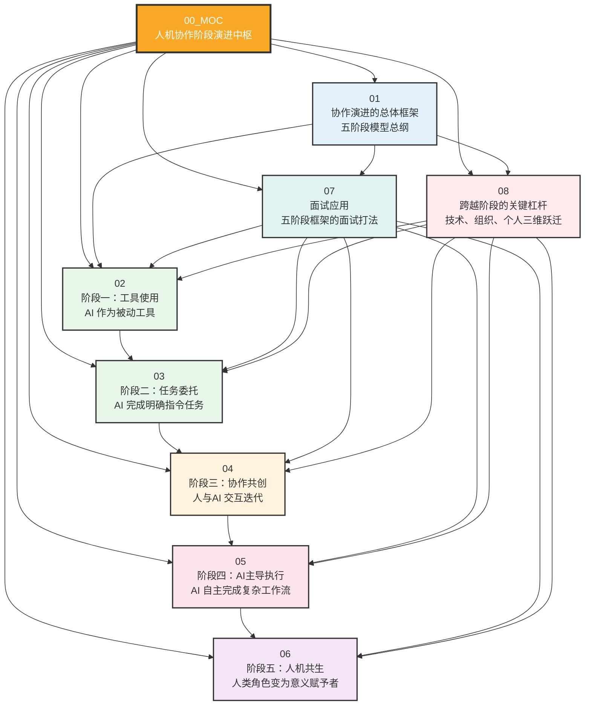
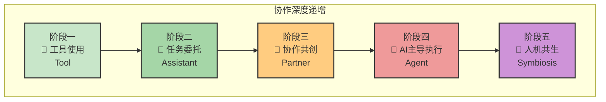
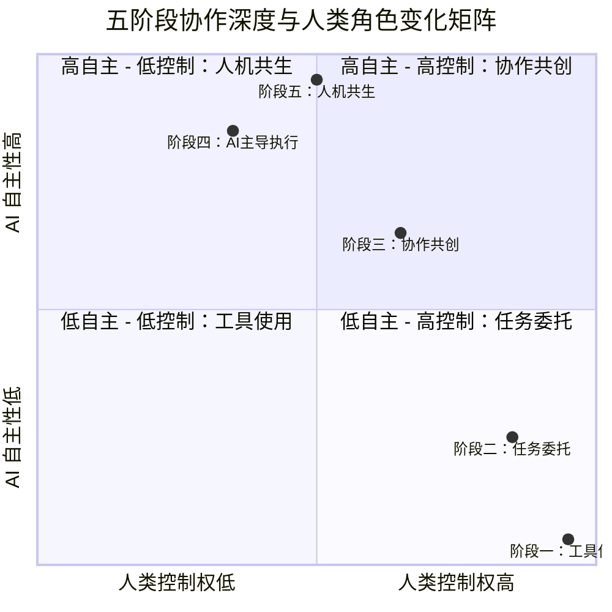
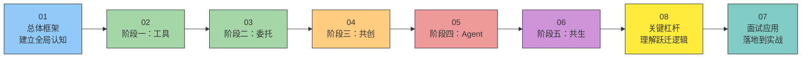
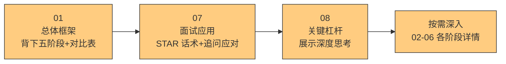
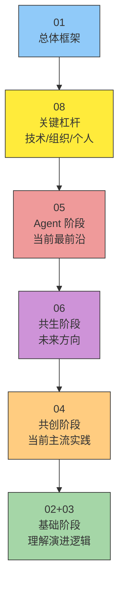
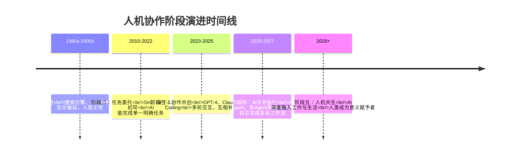
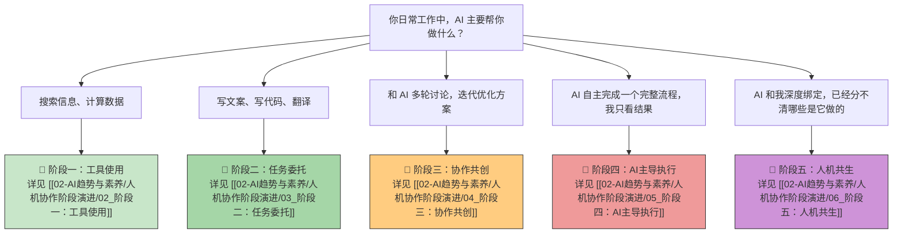

# 人机协作阶段演进中枢

> [!note] 知识库定位
> 本知识库从**"战略+人力+AI"的复合视角**切入，建立一个人与AI协作的阶段性框架。核心逻辑：不是简单的时间线，而是从 **"协作深度"** 和 **"人类角色变化"** 两个维度来定义阶段。既有理论深度，又有面试实战价值。

---

## 一、五阶段模型总览

---

## 二、五阶段核心对比总表

| 维度 | 阶段一：工具 | 阶段二：委托 | 阶段三：共创 | 阶段四：Agent | 阶段五：共生 |
|:---|:---|:---|:---|:---|:---|
| **人类角色** | 操作者 | 任务定义者 | 协作者 | 目标设定者 | 意义赋予者 |
| **AI 角色** | 被动工具 | 指令执行者 | 共创伙伴 | 自主执行者 | 融入性存在 |
| **协作深度** | 零交互 | 单轮交互 | 多轮迭代 | 自主闭环 | 持续融合 |
| **人类核心能力** | 操作技能 | 任务拆解+指令表达 | 批判性思维+审美判断 | 系统设计+风险管理 | 愿景定义+价值判断+伦理决策 |
| **典型场景** | 搜索引擎、计算器 | Copilot 写代码、ChatGPT 写文案 | AI 辅助产品设计、战略分析 | AI Agent 全流程客服、自动数据分析 | 未来工作生活深度整合 |
| **决策权归属** | 100% 人类 | 人类 | 人类+AI 共同 | 人类设定边界，AI 执行 | 人类定义方向 |
| **当前成熟度** | ✅ 已普及 | ✅ 已普及 | 🔄 进入主流 | 🔄 进行中 | ⏳ 早期探索 |

---

## 三、文档索引表

| 编号 | 文档名称 | 核心主题 | 阅读难度 | 关键问题 |
|:---:|:---|:---|:---:|:---|
| 01 | [[02-AI趋势与素养/人机协作阶段演进/01_协作演进的总体框架]] | 五阶段框架总纲、判断维度、阶段对比 | ★★★ | 如何定义协作阶段？ |
| 02 | [[02-AI趋势与素养/人机协作阶段演进/02_阶段一：工具使用]] | AI 作为被动工具，人类完全主导 | ★★☆ | 工具阶段还有价值吗？ |
| 03 | [[02-AI趋势与素养/人机协作阶段演进/03_阶段二：任务委托]] | AI 完成明确指令任务，人类定义+验收 | ★★★ | 如何写好指令？ |
| 04 | [[02-AI趋势与素养/人机协作阶段演进/04_阶段三：协作共创]] | 人与AI 交互迭代，互相补位 | ★★★★ | 共创的核心能力是什么？ |
| 05 | [[02-AI趋势与素养/人机协作阶段演进/05_阶段四：AI主导执行]] | AI 自主完成复杂工作流，人类设定边界 | ★★★★ | 如何设计 Agent 边界？ |
| 06 | [[02-AI趋势与素养/人机协作阶段演进/06_阶段五：人机共生]] | 人类角色从"操作者"变为"意义赋予者" | ★★★★★ | 共生时代人还剩下什么？ |
| 07 | [[02-AI趋势与素养/人机协作阶段演进/07_面试应用：如何回答人与AI协作类问题]] | 五阶段框架的面试打法，STAR 话术 | ★★★ | 面试时怎么用这个框架？ |
| 08 | [[02-AI趋势与素养/人机协作阶段演进/08_跨越阶段的关键杠杆]] | 技术、组织、个人三维跃迁分析 | ★★★★ | 如何推动阶段跃迁？ |

---

## 四、协作深度象限分析

---

## 五、推荐阅读路径

### 路径一：从零建立认知框架（建议顺序阅读）

> [!tip] 新手建议
> 如果你是第一次接触人机协作框架，建议从 01 开始按顺序阅读，建立从工具到共生的完整认知链条。每个阶段文档都包含该阶段的**人类角色、AI 角色、典型场景、核心能力**四个维度的深度分析。

### 路径二：面试备战（快速上手）

> [!important] 面试场景建议
> 如果你正在准备面试，**01 + 07 + 08** 是最短路径。01 提供框架，07 提供话术，08 展示深度。面试官追问具体阶段细节时，再按需查阅 02-06。

### 路径三：战略视角（体系化思考）

> [!note] 战略视角
> 如果你关注组织如何推动人机协作升级，建议从 01 和 08 入手，理解跃迁的底层逻辑，再深入 Agent 和共生阶段的前沿思考。

---

## 六、阶段演进时间线

---

## 七、关键概念速查

| 概念 | 定义 | 详见 |
|:---|:---|:---|
| **协作深度** | 衡量人与AI 之间交互的频次、复杂度、相互依赖程度的指标 | [[02-AI趋势与素养/人机协作阶段演进/01_协作演进的总体框架]] |
| **人类角色变化** | 随着AI 能力提升，人类在协作中的角色从"操作者"逐步演变为"意义赋予者" | [[02-AI趋势与素养/人机协作阶段演进/01_协作演进的总体框架]] |
| **任务拆解** | 将复杂问题分解为 AI 可执行的明确子任务的能力，是阶段二的核心技能 | [[02-AI趋势与素养/人机协作阶段演进/03_阶段二：任务委托]] |
| **批判性思维** | 在 AI 产出基础上进行独立判断、质疑和验证的能力，是阶段三的核心能力 | [[02-AI趋势与素养/人机协作阶段演进/04_阶段三：协作共创]] |
| **边界条件** | 人类为 AI Agent 设定的目标、约束、异常处理规则，是阶段四的核心设计要素 | [[02-AI趋势与素养/人机协作阶段演进/05_阶段四：AI主导执行]] |
| **意义赋予** | 在 AI 能完成几乎所有执行任务的时代，人类的核心价值在于定义"为什么做"和"为谁做" | [[02-AI趋势与素养/人机协作阶段演进/06_阶段五：人机共生]] |
| **阶段跃迁** | 从阶段 N 到阶段 N+1 的跨越，由技术、组织、个人三个维度的杠杆共同推动 | [[02-AI趋势与素养/人机协作阶段演进/08_跨越阶段的关键杠杆]] |
| **STAR 话术** | 面试中运用情境(Situation)-任务(Task)-行动(Action)-结果(Result)框架回答的方法 | [[02-AI趋势与素养/人机协作阶段演进/07_面试应用：如何回答人与AI协作类问题]] |

---

## 八、关联知识库

本知识库与以下知识库体系紧密关联：

- **[[05-产品与开发/Vibe Coder/05-思想与思维/人机协作的边界]]** — 五个维度探讨人与AI 的边界法则（决策、创造力、情感、学习、道德）
- **[[05-产品与开发/Vibe Coder/05-思想与思维/面试回答_人与AI协作的边界]]** — 面试场景下的三版本回答（30秒/3分钟/带故事）
- **[[01-AI技术/AI Agent 工具/AI_Agent_工具全景对比]]** — 了解市场上 AI Agent 工具生态，对应阶段四的实践
- **[[05-产品与开发/Vibe Coder/Vibe Coding 产品经理法则]]** — 人机协作的微观模型：描述需求 vs 决定方案
- **[[05-产品与开发/Vibe Coder/Vibe Coder 常见问题全景图]]** — Vibe Coding 场景下的常见问题，对应阶段三实践
- **[[05-产品与开发/Vibe Coder/AI产品开发导航系统]]** — AI 产品开发的宏观视角
- **[[05-产品与开发/Vibe Coder/AI产品开发导航系统]]** — 通用 AI 产品开发原则
- **[[05-产品与开发/Vibe Coder/AI生成产品的经验法则]]** — 从实战中总结的经验规律

> [!note] 知识库体系关系
> 本知识库是"人机协作"主题的**核心框架层**。如果说 [[05-产品与开发/Vibe Coder/05-思想与思维/人机协作的边界]] 是"横向维度"（在不同维度上画边界线），那么本知识库就是"纵向阶段"（从时间/深度维度看协作演化）。两者互为补充，共同构成完整的人机协作认知体系。

---

## 九、核心理念速览

> [!important] 核心逻辑
> 本知识库的底层逻辑不是"AI 技术发展史"，而是**"协作深度"和"人类角色变化"两个维度的交叉分析**。同样一个 GPT-4，在不同组织、不同个人手中，可能处于阶段二（任务委托）也可能处于阶段三（协作共创）。阶段不是由技术单方面决定的，而是由**人如何使用技术**决定的。

> [!tip] 核心洞察
> 五个阶段的本质是：**人类从"怎么做"的焦虑中逐步解放，转向"做什么"和"为什么做"的思考。** 每一次阶段跃迁，都是人类认知带宽的一次重新分配。

> [!warning] 常见误区
> 1. **误区一**：认为阶段越高越好。实际上，不同任务适合不同阶段的协作模式。写一封邮件用阶段二就够了，不需要阶段四的 Agent。
> 2. **误区二**：认为阶段是线性单向的。实际中，同一个团队可能同时在多个阶段运作，取决于任务的复杂度。
> 3. **误区三**：认为阶段跃迁只需要技术。技术是必要条件，但组织和个人的认知升级同样关键。

---

## 十、快速自测：你在哪个阶段？

---

## 十一、版本历史

| 版本 | 日期 | 变更说明 |
|:---|:---|:---|
| v1.0 | 2026-07-27 | 初始版本，建立知识库框架，包含 MOC + 8 篇内容文档，覆盖五阶段模型、面试应用、阶段跃迁分析 |

---

> [!tip] 使用建议
> 本 MOC 是知识库的入口和导航中枢。建议在阅读具体文档前，先浏览本页面的**五阶段模型总览**和**核心对比总表**，建立全局认知。之后可以根据自身需求选择合适的阅读路径，也可以直接按问题查阅。

---

*本知识库持续更新中，欢迎贡献反馈和案例。*