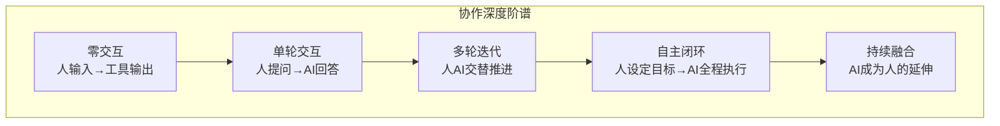
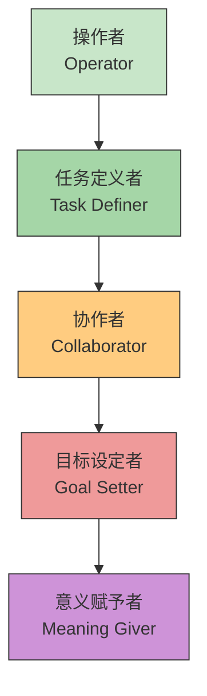
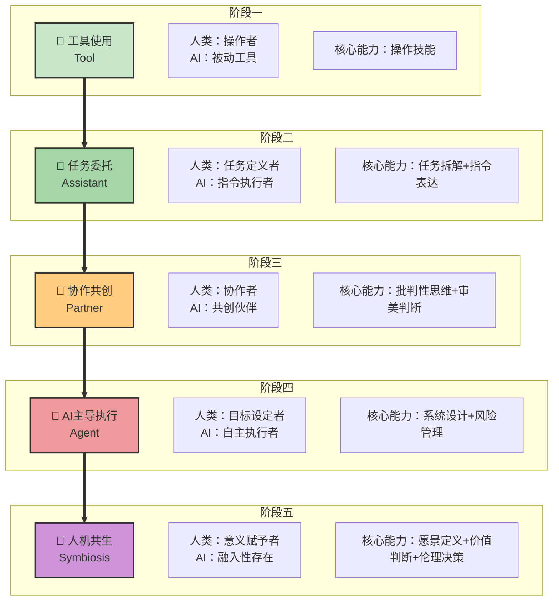
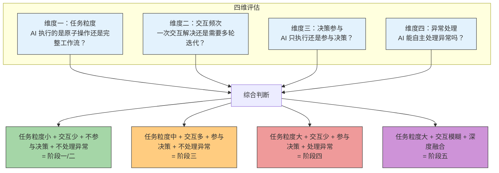
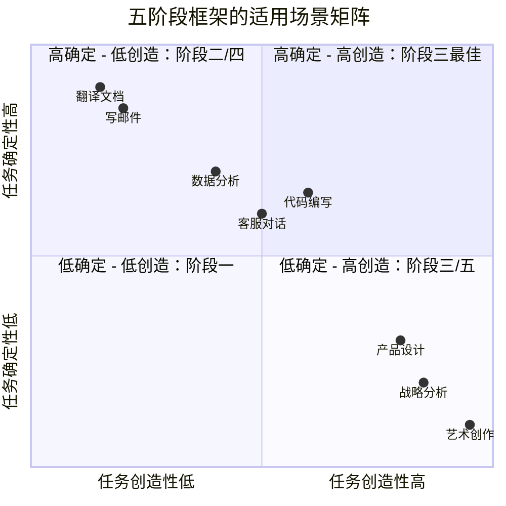
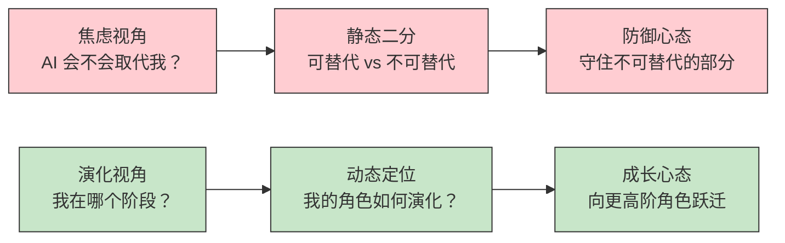

# 协作演进的总体框架

> [!abstract] 本篇定位
> 本篇是整个人机协作知识库的**总纲**。它回答的是最根本的问题：如何定义和判断人与AI 的协作阶段？不是按时间线，而是按 **"协作深度"** 和 **"人类角色变化"** 两个维度来建立框架。读完本篇，你将拥有一个可以应用于任何场景的阶段判断模型。

---

## 一、为什么需要"阶段框架"？

> [!question] 一个常见困惑
> 我每天都在用 ChatGPT，也见过别人用 AI Agent 跑全流程。我们算是同一个层次的 AI 用户吗？答案显然不是。但差别在哪？怎么量化？

现有的讨论往往陷入两个极端：

| 极端 | 问题 |
|:---|:---|
| **技术决定论** | 用 GPT-3.5 就是阶段二，用 GPT-4 就是阶段三？同样用 GPT-4，有人只做翻译，有人做多轮共创 |
| **时间线决定论** | 2023 年是阶段二，2025 年是阶段三？但同一个团队里，不同人可能处在不同阶段 |

> [!important] 核心主张
> **阶段不是由技术单方面决定的，而是由"人如何使用技术"决定的。** 同样的 GPT-4，在不同人手中，可以是阶段二的"指令执行者"，也可以是阶段三的"共创伙伴"。阶段定义应该基于**协作模式**而非**技术版本**。

---

## 二、两个核心判断维度

### 维度一：协作深度

**协作深度**衡量的是人与AI 之间交互的**频次、复杂度和相互依赖程度**。

| 深度级别 | 交互模式 | 典型场景 | 对应阶段 |
|:---|:---|:---|:---|
| L0 零交互 | 人输入指令，工具执行确定性操作 | 计算器、搜索引擎 | [[02-AI趋势与素养/人机协作阶段演进/02_阶段一：工具使用|阶段一：工具]] |
| L1 单轮交互 | 人给一次指令，AI 给一次结果 | ChatGPT 写文案、Copilot 补全代码 | [[02-AI趋势与素养/人机协作阶段演进/03_阶段二：任务委托|阶段二：委托]] |
| L2 多轮迭代 | 人与AI 在对话中逐步推进，互相修正 | AI 辅助产品设计、战略研讨 | [[02-AI趋势与素养/人机协作阶段演进/04_阶段三：协作共创|阶段三：共创]] |
| L3 自主闭环 | 人设定目标，AI 自主规划、执行、汇报 | AI Agent 自动化客服、数据分析 | [[02-AI趋势与素养/人机协作阶段演进/05_阶段四：AI主导执行|阶段四：Agent]] |
| L4 持续融合 | AI 深度融入日常，人类与AI 边界模糊 | 未来工作生活场景 | [[02-AI趋势与素养/人机协作阶段演进/06_阶段五：人机共生|阶段五：共生]] |

### 维度二：人类角色变化

**人类角色变化**是另一条核心线索。随着协作深度增加，人类的角色从"执行者"逐步转变为"思考者"和"意义赋予者"。

| 角色 | 人类做什么 | AI 做什么 | 对应阶段 |
|:---|:---|:---|:---|
| **操作者** | 学习工具操作、输入指令、解读结果 | 被动响应，执行确定性操作 | [[02-AI趋势与素养/人机协作阶段演进/02_阶段一：工具使用|阶段一]] |
| **任务定义者** | 拆解任务、写指令、验收结果 | 按指令完成单一任务 | [[02-AI趋势与素养/人机协作阶段演进/03_阶段二：任务委托|阶段二]] |
| **协作者** | 提方向、做判断、给反馈 | 生成方案、迭代优化、提供多元视角 | [[02-AI趋势与素养/人机协作阶段演进/04_阶段三：协作共创|阶段三]] |
| **目标设定者** | 定义目标、设定边界、处理异常 | 自主规划、执行、汇报 | [[02-AI趋势与素养/人机协作阶段演进/05_阶段四：AI主导执行|阶段四]] |
| **意义赋予者** | 定义方向、判断价值、做伦理决策 | 深度融入、无处不在 | [[02-AI趋势与素养/人机协作阶段演进/06_阶段五：人机共生|阶段五]] |

> [!tip] 关键洞察
> 人类角色的变化，本质上是一个**认知带宽逐步释放**的过程。从"怎么做"（操作者）→"做什么"（任务定义者）→"怎么做得更好"（协作者）→"要达到什么目标"（目标设定者）→"为什么要做"（意义赋予者）。每一次跃迁，人类都从更底层的执行中解放出来，把注意力投向更高阶的思考。

---

## 三、五阶段模型全景

### 阶段对比总表

| 维度 | 阶段一：工具 | 阶段二：委托 | 阶段三：共创 | 阶段四：Agent | 阶段五：共生 |
|:---|:---|:---|:---|:---|:---|
| **英文标识** | Tool | Assistant | Partner | Agent | Symbiosis |
| **人类角色** | 操作者 | 任务定义者 | 协作者 | 目标设定者 | 意义赋予者 |
| **AI 角色** | 被动工具 | 指令执行者 | 共创伙伴 | 自主执行者 | 融入性存在 |
| **交互模式** | 零交互 | 单轮交互 | 多轮迭代 | 自主闭环 | 持续融合 |
| **决策权** | 100% 人类 | 人类决定 | 人机共同 | 人类设定边界 | 人类定义方向 |
| **核心能力** | 操作技能 | 任务拆解+指令 | 批判思维+审美 | 系统设计+风控 | 愿景+价值+伦理 |
| **失败成本** | 极低 | 低 | 中 | 高 | 极高 |
| **典型场景** | 搜索引擎 | Copilot 写代码 | AI 辅助设计 | AI Agent 客服 | 未来深度整合 |
| **成熟度** | ✅ 已普及 | ✅ 已普及 | 🔄 进入主流 | 🔄 进行中 | ⏳ 早期探索 |

---

## 四、阶段判断的四维评估法

如何判断一个人或一个团队处于哪个阶段？不是看他们用什么工具，而是看四个维度：

### 四维评估详解

| 评估维度 | 阶段一 | 阶段二 | 阶段三 | 阶段四 | 阶段五 |
|:---|:---|:---|:---|:---|:---|
| **任务粒度** | 原子操作（一次搜索） | 单一任务（写一篇文章） | 复杂任务块（设计一个产品功能） | 完整工作流（从需求到交付） | 无限（工作+生活全域） |
| **交互频次** | 1次 | 1-2次 | 5-20次 | 1-3次（设定+验收） | 持续不断 |
| **决策参与度** | 0% | 0% | 30-50% | 50-80% | 模糊 |
| **异常处理能力** | 无 | 无 | 有限 | 主体 | 全覆盖 |

> [!important] 评估原则
> 1. **看模式，不看工具**：用 GPT-4 不代表就在阶段三，关键看你怎么用
> 2. **看常态，不看峰值**：偶尔让 AI 自主跑一个流程不算阶段四，常态化才算
> 3. **看依赖，不看能力**：AI 能做的事，和你实际让 AI 做的事，是两回事
> 4. **任务不同，阶段不同**：同一个人，写邮件可能在阶段二，做战略分析可能在阶段三

---

## 五、框架的边界与适用性

> [!warning] 框架的三大局限
> 1. **阶段不是线性单向的**：同一个团队可能同时在多个阶段运作。一个数据分析师可能用阶段二的方式写周报，用阶段三的方式做深度分析，用阶段四的方式跑自动化报表。
> 2. **阶段不是越高越好**：不同任务适合不同阶段的协作模式。给客户发一封确认邮件，用阶段二就够了，不需要启动一个 Agent。过度工程化反而降低效率。
> 3. **文化差异会影响阶段感知**：在某些组织文化中，"让 AI 做决策"可能被视为不负责，即使技术上完全可行。阶段推进必须考虑组织心理安全边界。

---

## 六、从"替代焦虑"到"演化思维"

> [!important] 框架的深层价值
> 这个框架最重要的价值，不是帮你判断"我在哪个阶段"，而是帮你建立一种**演化思维**：人类与AI 的关系不是静态的"替代 vs 被替代"，而是动态的"角色持续演化"。

> [!tip] 一句话总结
> 不要问"AI 能不能做我的工作"，而要问"有了 AI，我的工作可以进化成什么样"。这个框架就是帮你回答后一个问题的地图。

---

## 七、框架的面试应用预览

这个框架在面试中极具实用价值。它可以帮你：

1. **结构化回答**：不再泛泛而谈"AI 很重要"，而是用五阶段模型展示你对人机协作的深度理解
2. **展示思考框架**：面试官最喜欢的不是"知道答案的人"，而是"有思考框架的人"
3. **应对追问**：面试官追问"你怎么看 AI 对 HR 的影响"时，你可以从五个阶段逐一分析，展示系统性思考
4. **定位自身**：在"你用过哪些 AI 工具"的问题上，不只是罗列工具，而是展现你在哪个阶段、如何升级

> [!note] 详见面试应用文档
> 完整的面试话术、STAR 框架、常见追问应对，请参阅 [[02-AI趋势与素养/人机协作阶段演进/07_面试应用：如何回答人与AI协作类问题]]。

---

## 八、关联思考

> [!question] 延伸问题
> 读完本篇框架，你可能会自然产生以下问题：
> - 阶段跃迁是怎么发生的？技术、组织、个人各自扮演什么角色？→ [[02-AI趋势与素养/人机协作阶段演进/08_跨越阶段的关键杠杆]]
> - 每个阶段的具体能力要求是什么？我怎么培养这些能力？→ 各阶段文档（[[02-AI趋势与素养/人机协作阶段演进/02_阶段一：工具使用|02]]-[[02-AI趋势与素养/人机协作阶段演进/06_阶段五：人机共生|06]]）
> - 在 HR 领域，这个框架如何落地？→ [[05-产品与开发/Vibe Coder/05-思想与思维/面试回答_人与AI协作的边界]]
> - 人机协作的边界到底在哪？→ [[05-产品与开发/Vibe Coder/05-思想与思维/人机协作的边界]]

---

## 九、关联文档

- [[02-AI趋势与素养/人机协作阶段演进/00_MOC_人机协作阶段演进中枢]] — 回中枢导航
- [[02-AI趋势与素养/人机协作阶段演进/02_阶段一：工具使用]] — 阶段一深度分析
- [[02-AI趋势与素养/人机协作阶段演进/03_阶段二：任务委托]] — 阶段二深度分析
- [[02-AI趋势与素养/人机协作阶段演进/04_阶段三：协作共创]] — 阶段三深度分析
- [[02-AI趋势与素养/人机协作阶段演进/05_阶段四：AI主导执行]] — 阶段四深度分析
- [[02-AI趋势与素养/人机协作阶段演进/06_阶段五：人机共生]] — 阶段五深度分析
- [[02-AI趋势与素养/人机协作阶段演进/07_面试应用：如何回答人与AI协作类问题]] — 面试实战打法
- [[02-AI趋势与素养/人机协作阶段演进/08_跨越阶段的关键杠杆]] — 阶段跃迁分析
- [[05-产品与开发/Vibe Coder/05-思想与思维/人机协作的边界]] — 横向维度边界分析
- [[05-产品与开发/Vibe Coder/05-思想与思维/面试回答_人与AI协作的边界]] — 面试场景边界回答

---

> [!tip] 阅读建议
> 本篇是总纲，建议先通读建立全局认知。之后可以按 [[02-AI趋势与素养/人机协作阶段演进/00_MOC_人机协作阶段演进中枢#五、推荐阅读路径|MOC 中的推荐阅读路径]] 选择适合自己的路线继续深入。如果你正在准备面试，建议直接跳到 [[02-AI趋势与素养/人机协作阶段演进/07_面试应用：如何回答人与AI协作类问题]] 学习如何将框架转化为面试话术。

---

*本框架将持续根据技术发展和实践经验迭代更新。*