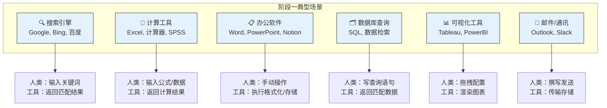
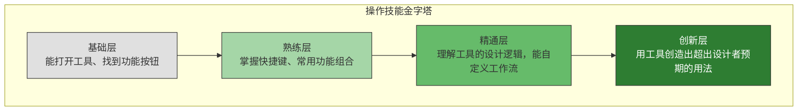
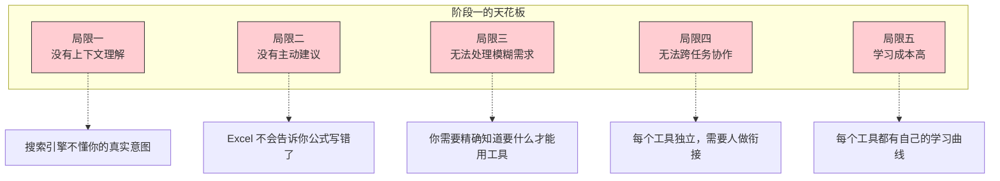
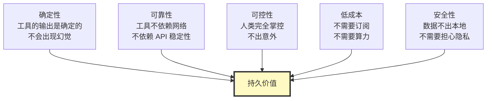

# 阶段一：工具使用（Tool）

> [!abstract] 阶段定位
> 在人与AI协作的五个阶段中，阶段一是**最基础也是历史最悠久**的阶段。AI 作为完全被动的工具，人类是唯一的主导者。这个阶段看似"低级"，但它奠定了所有后续阶段的基础逻辑：**人类与技术的协作，始于人对工具的掌控**。

---

## 一、阶段画像

```mermaid
graph LR
    subgraph 阶段一：工具使用
        H["👤 人类<br/>操作者<br/>完全主导"] -->|"输入指令"| T["🔧 AI 工具<br/>被动响应<br/>确定性输出"]
        T -->|"返回结果"| H
        H -->|"解读结果"| D["决策与行动"]
    end

    style H fill:#c8e6c9,stroke:#333,stroke-width:2px
    style T fill:#e0e0e0,stroke:#333,stroke-width:2px
    style D fill:#fff9c4,stroke:#333,stroke-width:2px
```

### 核心特征

| 维度 | 特征描述 |
|:---|:---|
| **人类角色** | 操作者（Operator）—— 学习工具、输入指令、解读结果、做出决策 |
| **AI 角色** | 被动工具 —— 没有自主性，严格按指令执行，输出确定性结果 |
| **交互模式** | 零交互 —— 人输入，工具输出，工具不主动发起任何交互 |
| **决策权** | 100% 属于人类 —— 工具不参与任何决策，只提供信息或计算结果 |
| **协作深度** | 最低 —— 工具不知道"为什么"，不知道"上下文"，不知道"目标" |
| **核心能力** | 操作技能 —— 学会使用工具，理解工具的输入输出格式 |

> [!important] 阶段一的本质
> 在这个阶段，AI 不是"协作者"，而是"工具"。就像锤子不会和你讨论"这个钉子该钉在哪"，搜索引擎也不会和你讨论"这个搜索关键词是否合理"。工具只负责执行，不负责思考。

---

## 二、典型场景图谱



### HR 场景中的阶段一工具

| HR 场景 | 传统工具 | 人做什么 | 工具做什么 |
|:---|:---|:---|:---|
| **简历筛选** | Excel 关键词筛选 | 定义筛选条件，逐一阅读简历 | 执行关键词匹配，排序 |
| **薪酬计算** | Excel 公式 | 设计薪酬结构，输入数据 | 执行公式计算，生成报表 |
| **招聘渠道分析** | 数据看板 | 定义分析维度，解读数据 | 汇总数据，渲染图表 |
| **培训记录管理** | LMS 系统 | 设计课程体系，录入数据 | 存储记录，统计完成率 |
| **考勤管理** | 考勤系统 | 制定考勤规则，处理异常 | 记录打卡数据，计算工时 |

> [!note] 阶段一尚未消失
> 即使在 2026 年，阶段一的工具仍然大量存在于日常工作流中。它们不是"被淘汰"了，而是成为更高级协作模式的**基础设施**。当你用阶段二的 ChatGPT 写 JD 初稿后，可能还要用阶段一的 Word 做最终排版。

---

## 三、阶段一的核心能力：操作技能



### 操作技能在 HR 中的体现

| 能力层级 | HR 技能举例 | 价值 |
|:---|:---|:---|
| **基础层** | 会用 Excel 做基本筛选排序 | 完成日常事务性工作 |
| **熟练层** | 能用 VLOOKUP + 数据透视表做薪酬分析 | 独立完成中等复杂度分析 |
| **精通层** | 能搭建自动化招聘漏斗、动态薪酬模型 | 成为团队的技术中坚 |
| **创新层** | 用 Excel 搭建出简易的 HR 数据分析系统 | 改变团队的工作方式 |

> [!tip] 操作技能永远不会过时
> 即使在阶段五的共生时代，理解工具的基本操作逻辑仍然重要。因为当 AI 出问题时，你需要知道"它在做什么"和"为什么出错"。操作技能是**安全底线**，也是**信任基础**。

---

## 四、阶段一的局限与天花板



> [!warning] 阶段一的最大局限
> 阶段一的工具不知道你在做什么、为什么做、做的对不对。它们只是忠实地执行你输入的命令。当你的需求模糊时，工具帮不了你。当你犯错时，工具不会提醒你。当你需要跨工具协作时，工具不会帮你衔接。

这些局限正是推动协作向阶段二演化的内在动力。当 AI 开始具备理解指令、处理模糊需求的能力时，阶段二就自然出现了。详见 [[02-AI趋势与素养/人机协作阶段演进/08_跨越阶段的关键杠杆]]。

---

## 五、阶段一的持久价值

> [!important] 阶段一不会消失
> 很多人认为进入阶段二、阶段三后，阶段一的工具就没用了。**这是一个重大误解。** 阶段一工具的价值在于：



### 阶段一工具的最佳使用场景

| 场景 | 为什么用阶段一而不是阶段二/三 |
|:---|:---|
| **确定性计算**（发工资） | 不允许 AI 幻觉，1 分钱都不能错 |
| **敏感数据处理**（薪酬数据） | 数据不能上传到云端 AI |
| **标准化格式**（政府报表） | 格式要求精确，AI 生成可能不符合规范 |
| **高频重复操作**（每日考勤导出） | 确定性工具更快更稳定 |
| **合规性要求**（法律文件） | 需要精确的版本控制和审计追踪 |

> [!tip] 实用建议
> 判断一个任务该用阶段一还是阶段二/三，问自己三个问题：
> 1. 这个任务的结果需要 100% 准确吗？→ 是，用阶段一
> 2. 这个任务涉及敏感数据吗？→ 是，用阶段一
> 3. 这个任务高度标准化吗？→ 是，用阶段一
> 如果三个答案都是"否"，可以考虑用阶段二或三。

---

## 六、从阶段一到阶段二的跃迁

```mermaid
flowchart LR
    subgraph 阶段一
        A1["我知道答案<br/>我只需要工具帮我算"]
    end

    subgraph 跃迁
        T["关键转变<br/>从"我知道怎么做"<br/>到"我知道要什么""]
    end

    subgraph 阶段二
        A2["我知道要什么<br/>AI 帮我做出来"]
    end

    A1 --> T --> A2

    style A1 fill:#c8e6c9,stroke:#333
    style T fill:#ffcc80,stroke:#333,stroke-width:2px
    style A2 fill:#a5d6a7,stroke:#333
```

> [!important] 跃迁的关键
> 从阶段一到阶段二的跃迁，本质上是一个**认知升级**：从"我会操作工具"升级为"我会定义任务"。这不是操作技能的提升，而是**思维方式的转变**。详见 [[02-AI趋势与素养/人机协作阶段演进/08_跨越阶段的关键杠杆#二、个人维度的跃迁杠杆]]。

---

## 七、关联文档

- [[02-AI趋势与素养/人机协作阶段演进/00_MOC_人机协作阶段演进中枢]] — 回中枢导航
- [[02-AI趋势与素养/人机协作阶段演进/01_协作演进的总体框架]] — 五阶段框架总纲
- [[02-AI趋势与素养/人机协作阶段演进/03_阶段二：任务委托]] — 下一阶段的深度分析
- [[02-AI趋势与素养/人机协作阶段演进/08_跨越阶段的关键杠杆]] — 如何从阶段一跃迁到阶段二
- [[05-产品与开发/Vibe Coder/05-思想与思维/人机协作的边界]] — 横向维度边界分析

---

> [!tip] 阅读建议
> 如果你已经熟练使用阶段一的工具，建议直接进入 [[02-AI趋势与素养/人机协作阶段演进/03_阶段二：任务委托]] 了解如何将 AI 从"工具"升级为"助手"。如果你对阶段跃迁的底层逻辑感兴趣，可以先读 [[02-AI趋势与素养/人机协作阶段演进/08_跨越阶段的关键杠杆]]。

---

*阶段一看似简单，但所有高阶协作都建立在对工具基本逻辑的深刻理解之上。不要轻视工具，也不要止步于工具。*