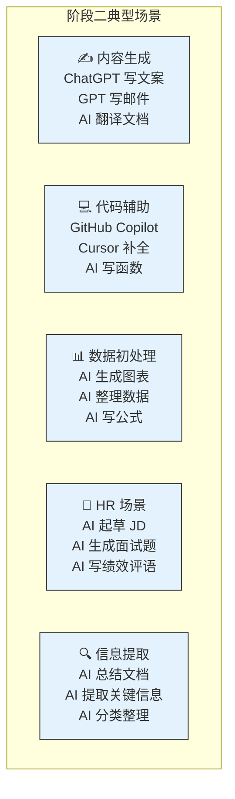
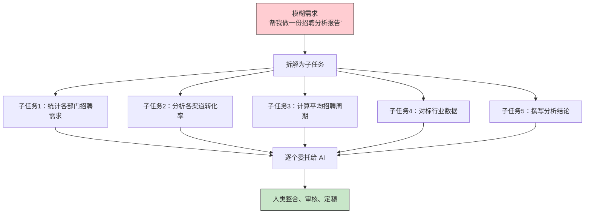
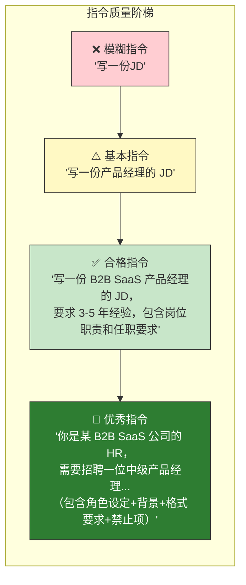
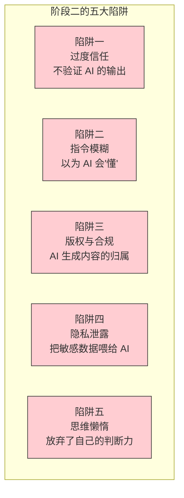
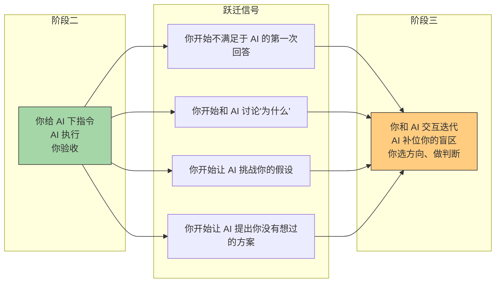

# 阶段二：任务委托（Assistant）

> [!abstract] 阶段定位
> 阶段二是当前大多数知识工作者与 AI 协作的主流模式。AI 不再是被动的工具，而是能**理解自然语言指令、完成单一明确任务**的助手。人类的核心角色从"操作者"转变为"任务定义者"——不是自己动手做，而是定义清楚"要做什么"，让 AI 去执行。

---

## 一、阶段画像

```mermaid
graph LR
    subgraph 阶段二：任务委托
        H["👤 人类<br/>任务定义者<br/>拆解任务 + 写指令 + 验收"] -->|"自然语言指令"| AI["🤖 AI 助手<br/>指令执行者<br/>理解指令 → 生成结果"]
        AI -->|"返回结果"| H
        H -->|"验收/修改"| AI
        H -->|"最终决策"| D["决策与行动"]
    end

    style H fill:#a5d6a7,stroke:#333,stroke-width:2px
    style AI fill:#e3f2fd,stroke:#333,stroke-width:2px
    style D fill:#fff9c4,stroke:#333,stroke-width:2px
```

### 核心特征

| 维度 | 特征描述 |
|:---|:---|
| **人类角色** | 任务定义者（Task Definer）—— 拆解任务、写明确指令、验收结果 |
| **AI 角色** | 指令执行者（Assistant）—— 理解自然语言指令，完成单一任务并返回结果 |
| **交互模式** | 单轮交互为主 —— 人给指令，AI 给结果，偶尔需要 1-2 轮修正 |
| **决策权** | 人类决定 —— AI 只执行，不参与"要不要做"和"做得好不好"的判断 |
| **协作深度** | 浅层协作 —— AI 理解任务内容，但不理解任务背后的上下文和目标 |
| **核心能力** | 任务拆解 + 指令表达 —— 把模糊需求转化为 AI 可执行的明确指令 |

> [!important] 阶段二的关键跃迁
> 从阶段一到阶段二，最大的变化是：**AI 开始理解自然语言**。你不再需要学习工具的特定操作语法（SQL、Excel 公式、搜索引擎语法），而是可以用自然语言直接表达需求。这解放了人类的认知带宽——从"怎么操作工具"转为"要产出什么结果"。

---

## 二、典型场景图谱



### HR 场景深度展开

| HR 场景 | AI 能做什么 | 人做什么 | 效率提升 |
|:---|:---|:---|:---|
| **JD 撰写** | 根据岗位名称和基本要求，生成完整 JD 初稿 | 补充公司文化、团队风格等"软信息"，审核并定稿 | 70% 时间节省 |
| **简历初筛** | 从 500 份简历中按匹配度排序，标记 Top 20 | 审核 Top 20 的匹配度，深入阅读，做最终筛选 | 90% 时间节省 |
| **面试题生成** | 根据岗位能力模型自动生成结构化面试题 | 根据候选人特点个性化调整题目，补充追问 | 60% 时间节省 |
| **绩效评语** | 根据绩效数据生成初版评语框架 | 补充具体行为事例，调整语气，确保公正性 | 50% 时间节省 |
| **薪酬报告** | 抓取市场数据，生成薪酬对标报告 | 结合内部公平性和预算做最终判断 | 80% 时间节省 |
| **培训材料** | 根据主题生成培训大纲和初版 PPT | 补充案例、调整难度、适配学员水平 | 60% 时间节省 |

> [!tip] 阶段二的关键心得
> AI 在这个阶段像一个"超级实习生"——能力很强，但需要你给出非常明确的指令。你写得越清楚，它做得越好。你写得模糊，它就会"自由发挥"，结果可能令人啼笑皆非。

---

## 三、阶段二的核心能力

### 能力一：任务拆解



> [!important] 任务拆解原则
> 1. **单一职责**：每个子任务只做一件事，AI 才能精准执行
> 2. **可验证**：每个子任务有明确的输出和验收标准
> 3. **独立性**：子任务之间尽量独立，减少依赖
> 4. **粒度适中**：太细浪费时间，太粗 AI 容易跑偏

### 能力二：指令表达（Prompt 工程）



| 指令要素 | 说明 | 示例 |
|:---|:---|:---|
| **角色设定** | 告诉 AI "你是谁" | "你是一位有 10 年经验的 HRBP" |
| **背景信息** | 提供任务的上下文 | "我们是一家 200 人的 B2B SaaS 公司" |
| **明确任务** | 说清楚要做什么 | "请撰写一份 JD" |
| **格式要求** | 指定输出格式 | "用 Markdown 格式，包含以下部分..." |
| **约束条件** | 告诉 AI 不能做什么 | "不要使用性别化语言，不要超过 500 字" |
| **验收标准** | 告诉 AI 什么是好的结果 | "JD 应该让候选人看完就能判断自己是否适合" |

> [!tip] 指令表达的核心原则
> **把 AI 当成一个聪明但缺乏上下文的新同事。** 你不需要告诉它每个操作细节（那是阶段一），但你需要告诉它：你是谁、背景是什么、要做什么、什么格式、什么不能做、什么算好。给足上下文，AI 才能给出好结果。

---

## 四、阶段二的局限与陷阱



### 陷阱详解

| 陷阱 | 表现 | 应对策略 |
|:---|:---|:---|
| **过度信任** | AI 写的 JD 直接发布，不检查 | 永远把 AI 输出当作"初稿"，而不是"定稿" |
| **指令模糊** | "帮我写一个培训方案" | 至少提供角色、背景、目标学员、时长、格式 |
| **版权合规** | AI 生成的图片/文案可能侵权 | 了解公司 AI 使用政策，关键内容人工审核 |
| **隐私泄露** | 把候选人简历直接粘贴给 ChatGPT | 脱敏处理，使用企业版 AI 工具 |
| **思维懒惰** | 面试题由 AI 生成后不再思考 | AI 生成问题 + 人做个性化调整 + 人做追问 |

> [!warning] 阶段二的最大风险
> 阶段二的最大风险不是 AI 做不好，而是**人因为 AI 做得"够好"而放弃了自己的专业判断**。当 AI 能写出 80 分的文案时，很多人就满足于 80 分了。但真正的专业价值，在于你能把 80 分改到 95 分——那 15 分的差距，就是现阶段你不可替代的地方。

---

## 五、阶段二到阶段三的跃迁信号



> [!tip] 你已经在阶段二的边缘了
> 如果你发现自己开始不满足于"AI 照做"，而是希望 AI 能"帮你想"——比如问 AI "你觉得这个方案有什么问题？"、"还有其他思路吗？"、"如果你是候选人会怎么想？"——这说明你已经触摸到了阶段三的门槛。

---

## 六、面试中的阶段二叙事

在面试中，阶段二的经验可以这样表达：

> [!note] 面试话术
> "我现在日常工作中大量使用 AI 做任务委托。比如写 JD，我会给 AI 提供岗位背景、能力模型、公司文化，让它生成初稿——这能节省我 70% 的时间。但我的价值不在于'让 AI 写 JD'，而在于我能判断 AI 写的 JD 是否准确传达了岗位的核心价值，是否能吸引到对的人。这个判断力，是我多年 HR 经验积累的。"

---

## 七、关联文档

- [[02-AI趋势与素养/人机协作阶段演进/00_MOC_人机协作阶段演进中枢]] — 回中枢导航
- [[02-AI趋势与素养/人机协作阶段演进/01_协作演进的总体框架]] — 五阶段框架总纲
- [[02-AI趋势与素养/人机协作阶段演进/02_阶段一：工具使用]] — 上一阶段
- [[02-AI趋势与素养/人机协作阶段演进/04_阶段三：协作共创]] — 下一阶段
- [[02-AI趋势与素养/人机协作阶段演进/08_跨越阶段的关键杠杆]] — 如何从阶段二跃迁到阶段三
- [[05-产品与开发/Vibe Coder/05-思想与思维/面试回答_人与AI协作的边界]] — 面试场景中的任务委托叙事
- [[05-产品与开发/Vibe Coder/05-思想与思维/人机协作的边界]] — 横向维度边界分析

---

> [!tip] 阅读建议
> 如果你主要在阶段二工作，建议重点阅读 [[02-AI趋势与素养/人机协作阶段演进/04_阶段三：协作共创]] 了解如何升级协作模式，以及 [[02-AI趋势与素养/人机协作阶段演进/08_跨越阶段的关键杠杆]] 中关于"指令表达→批判性思维"的跃迁路径。

---

*AI 是你最勤奋的实习生——但实习生永远不能替代你的判断力。*