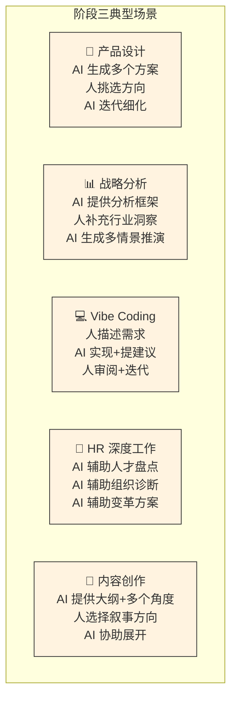
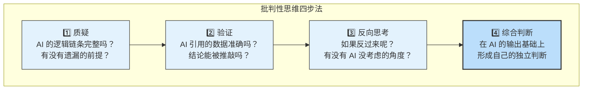
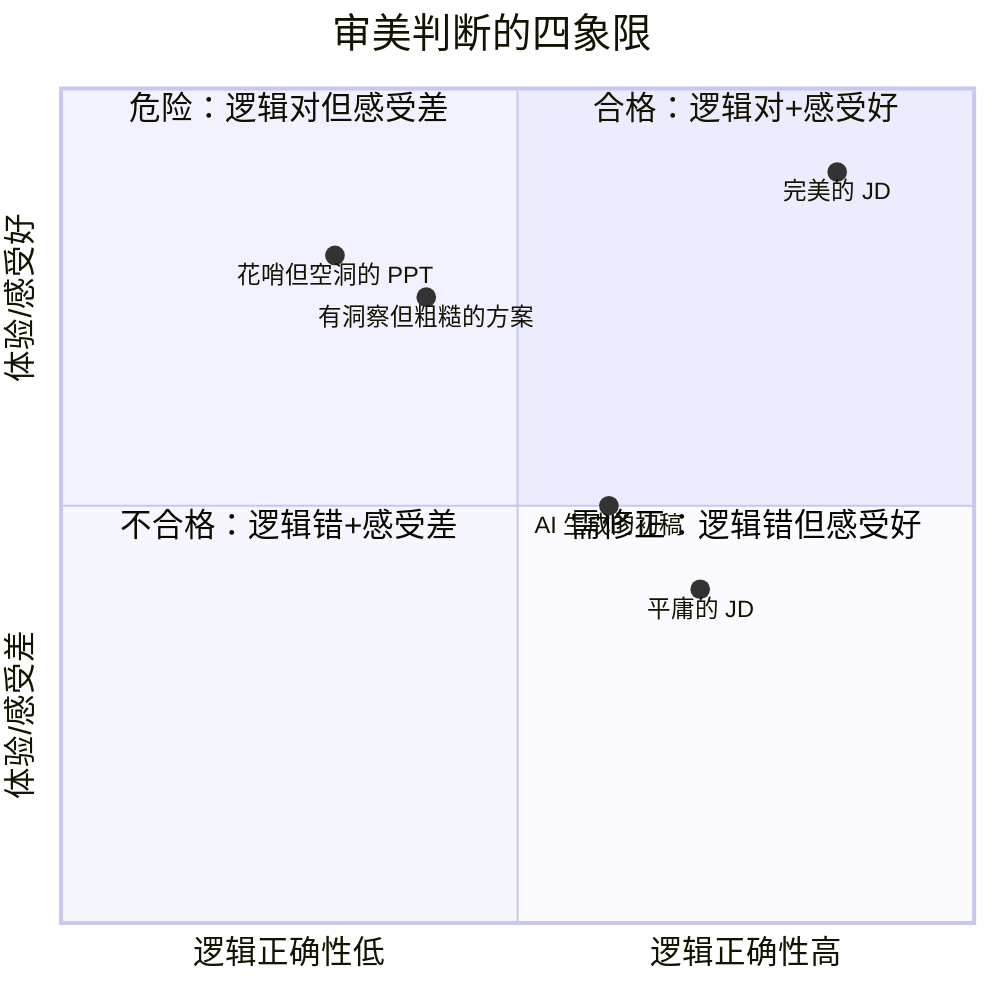
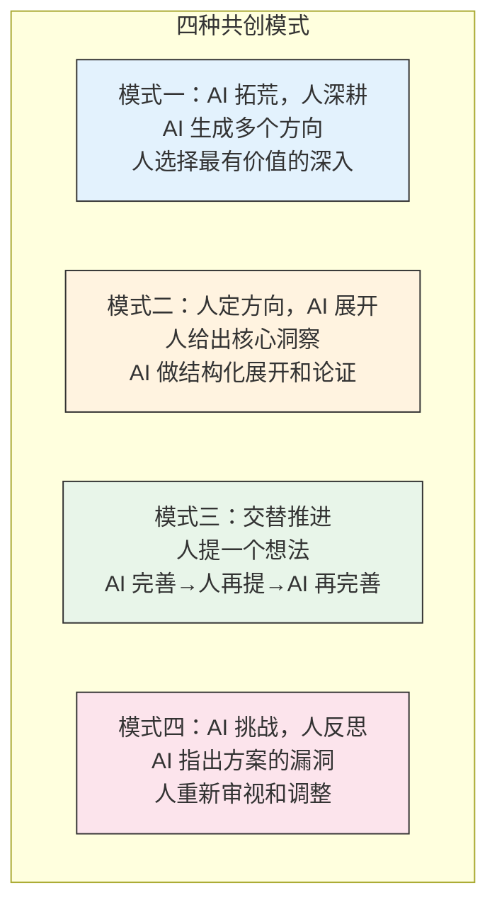
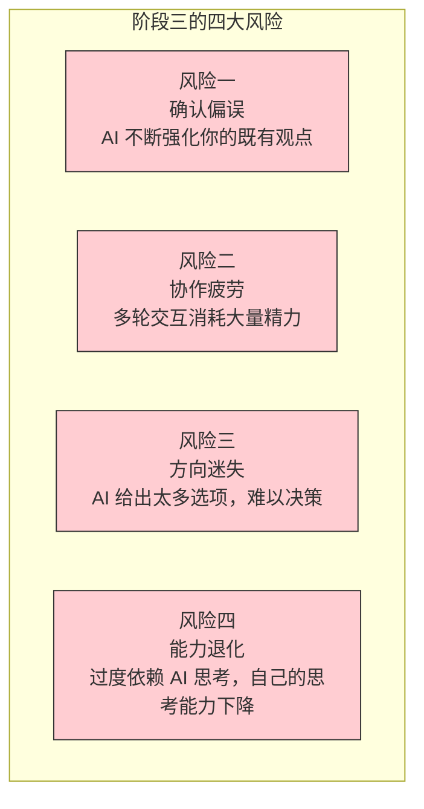
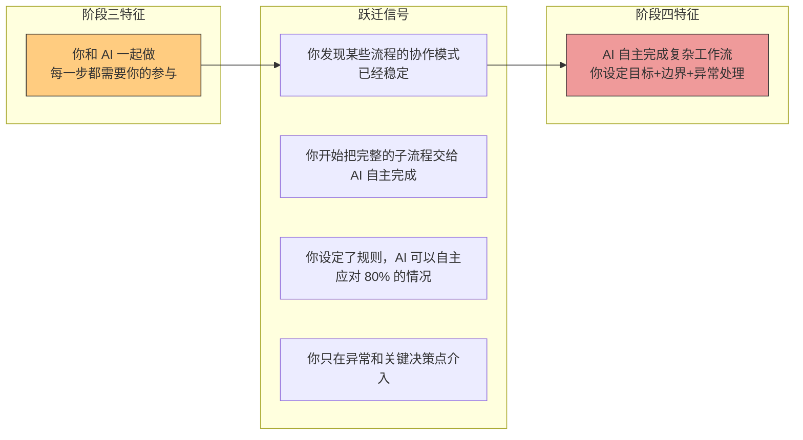

# 阶段三：协作共创（Partner）

> [!abstract] 阶段定位
> 阶段三是人机协作从"指令-执行"模式升级为"对话-共创"模式的关键转折点。在这个阶段，AI 不再是单向接收指令的工具，而是能**主动提供视角、挑战假设、补位盲区**的共创伙伴。人类的核心角色从"任务定义者"转变为"协作者"——不是告诉 AI 做什么，而是和 AI 一起探索怎么做更好。

---

## 一、阶段画像

```mermaid
graph TB
    subgraph 阶段三：协作共创
        H["👤 人类<br/>协作者<br/>提方向、做判断、给反馈"] <-->|"多轮对话<br/>交互迭代<br/>互相补位"| AI["🤝 AI 共创伙伴<br/>生成方案、挑战假设<br/>提供多元视角、迭代优化"]

        H --> D["最终决策<br/>审美判断<br/>方向选择"]
        AI --> H
    end

    style H fill:#ffcc80,stroke:#333,stroke-width:2px
    style AI fill:#fff3e0,stroke:#333,stroke-width:2px
    style D fill:#fff9c4,stroke:#333,stroke-width:2px
```

### 核心特征

| 维度 | 特征描述 |
|:---|:---|
| **人类角色** | 协作者（Collaborator）—— 提方向、做判断、给反馈、选方案 |
| **AI 角色** | 共创伙伴（Partner）—— 生成方案、挑战假设、提供多元视角、迭代优化 |
| **交互模式** | 多轮迭代 —— 人与AI 在对话中持续碰撞，逐步逼近最优解 |
| **决策权** | 人机共同探讨，人类最终决策 —— AI 参与"怎么做更好"的讨论，但方向选择权在人 |
| **协作深度** | 深度协作 —— AI 理解任务上下文，能主动提出人没有考虑到的角度 |
| **核心能力** | 批判性思维 + 审美判断 —— 不是判断 AI 有没有照做，而是判断 AI 的方案好不好 |

> [!important] 阶段三的关键跃迁
> 从阶段二到阶段三，最大的变化是：**AI 从"照你说的做"升级为"帮你一起想"**。在阶段二，你告诉 AI 要什么，AI 做出来。在阶段三，你告诉 AI 你的目标，AI 和你一起探索怎么达成。这个变化要求人类的能力也同步升级——从"写好指令"升级为"做好判断"。

---

## 二、典型场景图谱



### HR 场景深度展开：协作共创的实战

```mermaid
flowchart TD
    subgraph HR+AI 协作共创流程
        A["👤 HR 提出需求<br/>'我们需要做一次组织诊断'"] --> B["🤝 AI 提供分析框架<br/>麦肯锡7S、Burke-Litwin、<br/>Galbraith 星型模型..."]
        B --> C["👤 HR 选择框架<br/>'我们用 7S + 补充文化维度'"]
        C --> D["🤝 AI 生成诊断问题清单<br/>按维度结构化"]
        D --> E["👤 HR 补充+调整<br/>加入公司特有的痛点"]
        E --> F["🤝 AI 生成数据分析方案<br/>建议的量化+定性方法"]
        F --> G["👤 HR 审核+调整<br/>'这个指标不对，换成...'"]
        G --> H["🤝 AI 生成初步诊断报告<br/>包含发现+建议"]
        H --> I["👤 HR 深度审核<br/>结合自己的组织判断<br/>修正 AI 的结论"]
        I --> J["✅ 最终诊断报告"]
    end

    style A fill:#ffcc80,stroke:#333
    style B fill:#fff3e0,stroke:#333
    style C fill:#ffcc80,stroke:#333
    style D fill:#fff3e0,stroke:#333
    style E fill:#ffcc80,stroke:#333
    style F fill:#fff3e0,stroke:#333
    style G fill:#ffcc80,stroke:#333
    style H fill:#fff3e0,stroke:#333
    style I fill:#ffcc80,stroke:#333
    style J fill:#c8e6c9,stroke:#333,stroke-width:2px
```



> [!tip] 协作共创的精髓
> 注意这个流程中，每一步都是"人做出方向性决策，AI 做展开和执行"。AI 提出框架，人选框架；AI 生成问题，人调整问题；AI 写报告，人审核修正。**不是谁主导谁，而是各自发挥优势，在交互中逐步逼近最优解。**

---

## 三、阶段三的核心能力

### 能力一：批判性思维



> [!important] 为什么批判性思维是阶段三的核心能力
> 在阶段二，你只需要判断 AI 有没有"照做"。在阶段三，AI 会主动提出观点和建议。如果缺乏批判性思维，你很容易被 AI 的"听起来很对"带偏。**AI 的流畅表达不等于正确推理，AI 的自信语气不等于可靠结论。**

### 批判性思维在 HR 场景中的实战

| 场景 | AI 可能给出的建议 | 批判性思维该问的问题 |
|:---|:---|:---|
| **人才盘点** | "根据绩效数据，建议淘汰 Bottom 10%" | 绩效数据本身是否公正？有没有系统性偏差？这些人是否处在不适合的岗位上？ |
| **薪酬调整** | "该员工薪酬低于市场 P50，建议调薪 15%" | 内部公平性如何？他的绩效是否匹配？调薪后的连锁反应？ |
| **招聘渠道** | "渠道 A 的候选人留存率低，建议停用" | 渠道 A 是否覆盖特定人群？停用是否有公平性风险？留存率低的原因是什么？ |
| **培训方案** | "根据调研，最需要的是沟通技巧培训" | 调研样本有代表性吗？是沟通技能问题还是流程问题？培训能解决吗？ |

### 能力二：审美判断

> [!important] 审美判断的本质
> 在阶段三，审美判断不是"好不好看"，而是**"这个方案是不是对的"**——一种基于经验、直觉和价值观的综合性判断力。



> [!tip] 审美判断的训练方法
> 1. **多看好的**：积累"好东西"的样本库，建立审美参照系
> 2. **多问为什么**：不只是觉得"这个好"，要能说出"哪里好、为什么好"
> 3. **多对比**：把 AI 的初稿和你的终稿放在一起对比，感受差距
> 4. **多让他人评价**：把你的判断结果给别人看，校准你的审美

---

## 四、阶段三的协作模式分类



| 模式 | 适用场景 | 人类核心动作 | AI 核心动作 |
|:---|:---|:---|:---|
| **AI 拓荒，人深耕** | 探索性任务（新产品方案、新市场策略） | 评估方向潜力、选择深耕方向 | 生成大量可能性，快速发散 |
| **人定方向，AI 展开** | 有明确洞察但需要执行（你有一个好想法） | 提供核心洞察、判断展开质量 | 结构化展开、补充细节、论证 |
| **交替推进** | 复杂创意任务（写方案、做设计） | 持续给予方向性反馈 | 快速迭代实现、保持一致性 |
| **AI 挑战，人反思** | 需要避免盲区的任务（战略决策、风险评估） | 接收反馈、反思调整 | 扮演"魔鬼代言人"，指出漏洞 |

> [!tip] 模式选择建议
> 不同的任务适合不同的共创模式。做战略分析时多用"AI 挑战，人反思"；做产品设计时多用"交替推进"；做内容创作时多用"AI 拓荒，人深耕"。**关键是灵活切换，而不是死守一种模式。**

---

## 五、阶段三的局限与风险



| 风险 | 表现 | 应对策略 |
|:---|:---|:---|
| **确认偏误** | AI 倾向于赞同你的观点，让你误以为自己总是对的 | 主动要求 AI 扮演反对者角色；定期找真人讨论 |
| **协作疲劳** | 一轮轮迭代下来，精力消耗比自己做还大 | 设定迭代上限（如最多 3 轮）；学会在"够好"时停下来 |
| **方向迷失** | AI 给了 10 个方案，每个看起来都不错，无法决策 | 回到目标本身：哪个方案最能达成目标？设定硬性筛选标准 |
| **能力退化** | 太久没有独立深度思考，遇到问题第一反应是"问 AI" | 定期做"无 AI 日"；先自己思考再问 AI；保持领域深度学习 |

> [!warning] 阶段三的最大考验
> 阶段三对人类的**心力消耗**是最大的。在阶段二，你只需要下一个指令然后验收。在阶段三，你需要持续投入注意力，和 AI 进行有质量的对话。**这不是"AI 替我做"，而是"AI 和我一起做"——后者可能比前者更累，但产出质量也更高。**

---

## 六、阶段三的面试叙事

> [!note] 面试话术：阶段三的 STAR 表达
> **Situation**：在做年度人才盘点时，我需要从多个维度评估关键岗位的继任风险。
> **Task**：传统的九宫格方法太单一，我需要一个更全面的分析框架。
> **Action**：我和 AI 进行了多轮协作——我先描述了组织的特点和痛点，AI 推荐了五个分析框架。我选了其中两个做组合，AI 帮我生成了评估维度和问题清单。然后我根据自己对团队的了解，调整了 30% 的问题，补充了 AI 没有考虑到的组织文化因素。AI 再帮我生成了分析模板和报告结构。
> **Result**：最终产出的盘点报告比以往任何一次都更全面，得到了业务 Leader 的高度认可。CTO 说"这是第一次看到能真正反映团队真实状态的人才盘点"。

---

## 七、阶段三到阶段四的跃迁信号



---

## 八、关联文档

- [[02-AI趋势与素养/人机协作阶段演进/00_MOC_人机协作阶段演进中枢]] — 回中枢导航
- [[02-AI趋势与素养/人机协作阶段演进/01_协作演进的总体框架]] — 五阶段框架总纲
- [[02-AI趋势与素养/人机协作阶段演进/03_阶段二：任务委托]] — 上一阶段
- [[02-AI趋势与素养/人机协作阶段演进/05_阶段四：AI主导执行]] — 下一阶段
- [[02-AI趋势与素养/人机协作阶段演进/08_跨越阶段的关键杠杆]] — 如何从阶段三跃迁到阶段四
- [[05-产品与开发/Vibe Coder/05-思想与思维/人机协作的边界]] — 横向维度边界分析（尤其是"创造力"和"决策"维度）
- [[05-产品与开发/Vibe Coder/05-思想与思维/面试回答_人与AI协作的边界]] — 面试中的共创叙事
- [[05-产品与开发/Vibe Coder/Vibe Coding 产品经理法则]] — 人机协作共创的微观模型

---

> [!tip] 阅读建议
> 阶段三是当前大多数 AI 深度用户所处的阶段。如果你每天都在和 AI 进行多轮对话、迭代优化，建议重点阅读 [[02-AI趋势与素养/人机协作阶段演进/05_阶段四：AI主导执行]] 了解如何将成熟的共创模式升级为自主 Agent，以及 [[02-AI趋势与素养/人机协作阶段演进/08_跨越阶段的关键杠杆]] 中关于"批判性思维→系统设计"的跃迁路径。

---

*最好的共创，不是你依赖 AI，也不是 AI 替代你——而是你因为有了 AI，变成了比原来更好的自己。*