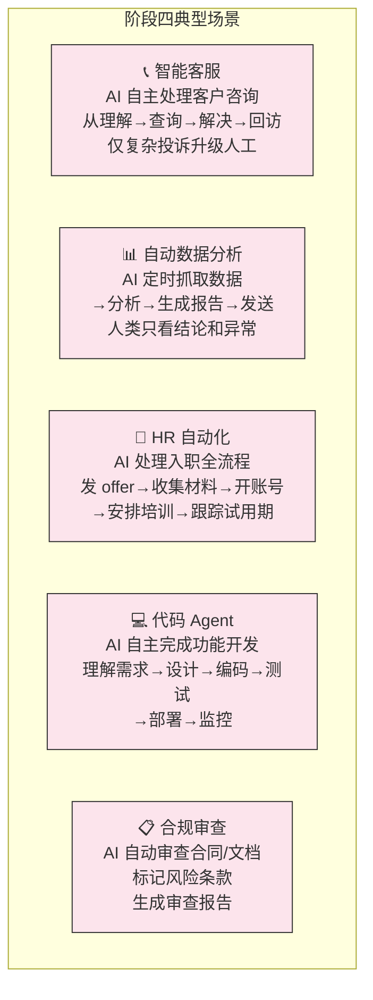
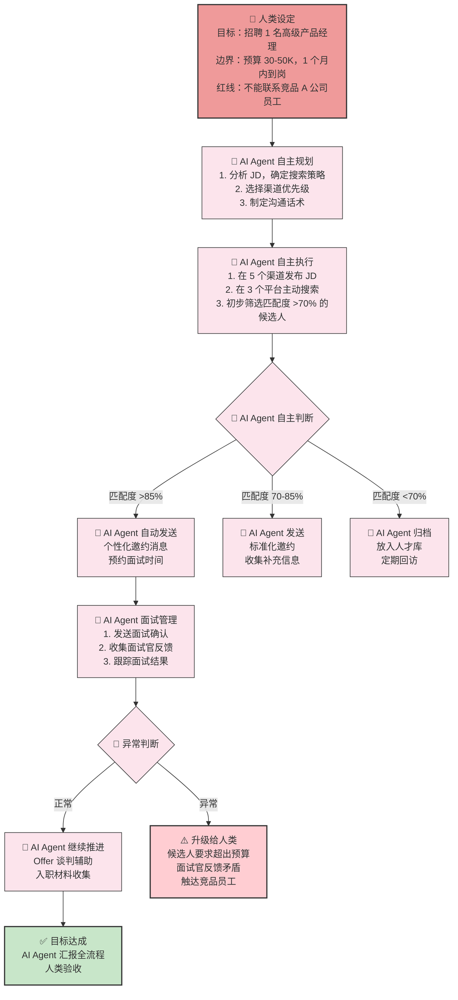
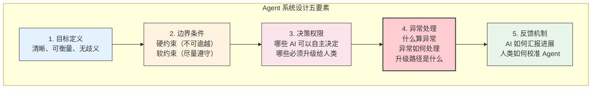
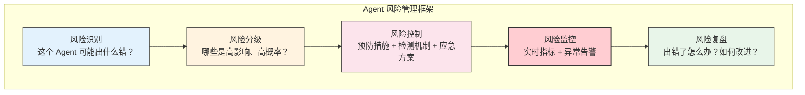
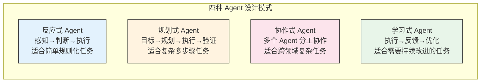
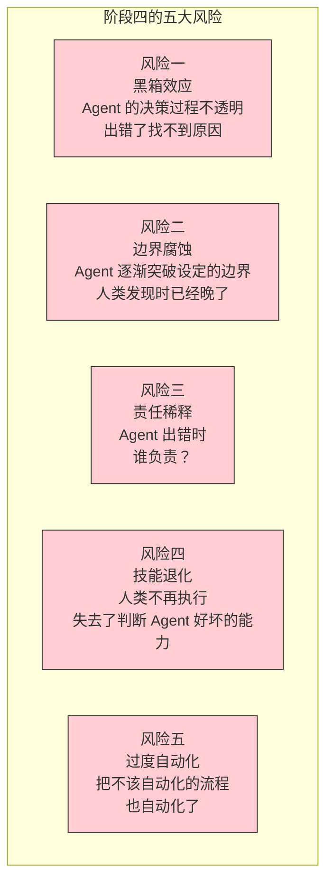

# 阶段四：AI主导执行（Agent）

> [!abstract] 阶段定位
> 阶段四代表了人机协作的一次质变：AI 从"和你一起做"升级为"替你完成整个工作流"。在这个阶段，AI 不再需要你每一步都参与，而是能**自主规划、执行、监控、汇报**一个完整的复杂任务。人类的角色从"协作者"转变为"目标设定者"——定义目标、设定边界、处理异常，而不是参与执行。

---

## 一、阶段画像

```mermaid
graph TB
    subgraph 阶段四：AI主导执行
        H["👤 人类<br/>目标设定者<br/>定义目标 + 设定边界<br/>处理异常 + 验收结果"] -->|"目标与边界"| AG["🎯 AI Agent<br/>自主执行者<br/>自主规划 → 执行 → 监控<br/>→ 汇报 → 异常升级"]

        AG -->|"执行结果<br/>异常报告"| H
        AG -.->|"80% 自主处理"| WF["复杂工作流<br/>多步骤、多工具<br/>有分支、有判断"]
        AG -.->|"20% 升级"| H

        H -->|"关键决策"| D["最终决策<br/>异常处理<br/>边界调整"]
    end

    style H fill:#ef9a9a,stroke:#333,stroke-width:2px
    style AG fill:#fce4ec,stroke:#333,stroke-width:2px
    style WF fill:#e3f2fd,stroke:#333,stroke-width:2px
    style D fill:#fff9c4,stroke:#333,stroke-width:2px
```

### 核心特征

| 维度 | 特征描述 |
|:---|:---|
| **人类角色** | 目标设定者（Goal Setter）—— 定义目标、设定边界条件、处理异常、验收结果 |
| **AI 角色** | 自主执行者（Agent）—— 自主规划、执行、监控、汇报，处理 80% 常规情况 |
| **交互模式** | 自主闭环 —— 人类设定目标后，AI 自主完成全流程，仅在异常或关键节点汇报 |
| **决策权** | 人类设定边界，AI 在边界内自主决策 —— 边界外自动升级给人类 |
| **协作深度** | 高度自主 —— AI 理解目标任务，能自主选择策略、工具和路径 |
| **核心能力** | 系统设计 + 风险管理 —— 不是让 AI 去跑，而是设计好 AI 跑不偏的框架 |

> [!important] 阶段四的关键跃迁
> 从阶段三到阶段四，最大的变化是：**人类从"参与者"变为"架构师"**。在阶段三，你每一步都在和 AI 交互。在阶段四，你设计好一个"系统"，让 AI 在这个系统里自主运行。你的价值从"过程中做得好"转移到"框架设计得好"。

---

## 二、典型场景图谱



### HR 场景深度展开：AI Agent 在招聘流程中的自主执行



> [!tip] Agent 的精髓
> 注意这个流程中，人类只在两个节点出现：**开始（设定目标+边界）** 和**异常（处理升级）**。中间的所有步骤——规划、执行、判断、推进——都由 AI Agent 自主完成。这就是阶段四的本质：**人类定义围栏，AI 在围栏内自由奔跑。**

---

## 三、阶段四的核心能力

### 能力一：系统设计



| 设计要素 | 关键问题 | 示例（HR 招聘 Agent） |
|:---|:---|:---|
| **目标定义** | 成功的标准是什么？ | 1 个月内找到合适的候选人并完成面试 |
| **硬约束** | 绝对不能做什么？ | 不能联系竞品 A 公司员工；不能承诺超出预算的薪酬 |
| **软约束** | 尽量做到什么？ | 优先考虑有 B2B 经验的候选人；尽量在 2 周内完成初筛 |
| **决策权限** | AI 能自主决定什么？ | 匹配度 >85% 自动邀约；匹配度 <70% 自动归档 |
| **异常升级** | 什么时候必须叫人类？ | 候选人要求超出预算；面试官反馈严重矛盾；候选人投诉 |
| **反馈机制** | 如何保证 AI 不走偏？ | 每周生成进展报告；关键节点（Top 10 确定）需要人类确认 |

> [!important] 系统设计的核心原则
> **"设计 AI 能跑不偏的框架"比"让 AI 跑得更快"更重要。** 一个没有边界设计的 Agent 就像一个没有交通规则的城市——再快的车也会撞。

### 能力二：风险管理



| 风险类型 | HR Agent 场景 | 预防措施 | 应急方案 |
|:---|:---|:---|:---|
| **偏见风险** | Agent 学会按年龄/性别筛选 | 定期审计 Agent 决策的公平性指标 | 发现偏差立即暂停，人工接管 |
| **合规风险** | Agent 在沟通中做出不当承诺 | 预设沟通话术模板，限制可承诺范围 | 法律团队审核所有自动发送的官方文件 |
| **体验风险** | 候选人感觉被机器对待，体验差 | 关键节点由人发送个性化消息 | 收到体验投诉时，人工介入 |
| **数据风险** | Agent 错误处理候选人隐私数据 | 数据脱敏，权限最小化 | 发现数据泄露立即启动应急流程 |
| **决策风险** | Agent 错误淘汰了优秀候选人 | 设置"安全网"——被淘汰的候选人数据保留，定期人工抽查 | 发现误淘汰立即恢复联系 |

> [!warning] 风险管理的黄金法则
> **Agent 的自主性越高，风险管理的投入就应该越大。** 永远不要假设 Agent 会"不出错"——要假设它会出错，然后设计好在出错时如何"不造成不可逆的伤害"。

---

## 四、阶段四的 Agent 设计模式



| 模式 | 适用场景 | 人类介入频率 | 风险等级 |
|:---|:---|:---|:---|
| **反应式 Agent** | 邮件自动分类、简历关键词匹配 | 低（设定规则后很少改） | 低 |
| **规划式 Agent** | 招聘全流程自动化、数据分析报告生成 | 中（关键节点确认） | 中 |
| **协作式 Agent** | 跨部门招聘（HR+业务+薪酬）、复杂项目管理 | 中高（跨 Agent 协调） | 中高 |
| **学习式 Agent** | 智能客服持续优化、招聘策略动态调整 | 中（定期校准） | 高 |

> [!tip] 从简单模式开始
> 如果这是你第一次设计 Agent，建议从**反应式 Agent**开始。先让 AI 自主处理那些规则明确、后果可控的任务。积累信心和经验后，再逐步升级到更复杂的模式。

---

## 五、阶段四的局限与风险



> [!warning] 阶段四的核心矛盾
> 阶段四面临一个核心矛盾：**自主性越高，风险越大；但如果不给自主性，就无法发挥 Agent 的价值。** 解决这个矛盾的关键不是"限制自主性"，而是"设计好边界和监控机制"——让 Agent 在安全的前提下最大化自主。

---

## 六、与已有 Agent 工具生态的关联

当前市场上已有大量 AI Agent 工具，了解它们有助于理解阶段四的实践状态。

> [!note] 工具生态参考
> 完整的 Agent 工具全景对比，请参阅 [[01-AI技术/AI Agent 工具/AI_Agent_工具全景对比]]。该文档覆盖了终端 CLI 编程 Agent、AI 原生 IDE、前端全栈生成器、桌面 AI 助手、LLM 应用开发平台、代码补全插件等六大赛道，每个赛道对应阶段四在不同场景下的落地实践。

---

## 七、阶段四的面试叙事

> [!note] 面试话术：阶段四的 STAR 表达
> **Situation**：公司招聘量突然翻倍，HR 团队无法手动处理所有简历筛选和初步沟通。
> **Task**：需要设计一个 AI Agent 来自动化候选人的初步筛选和面试邀约流程。
> **Action**：我作为项目负责人，首先定义了 Agent 的目标（筛选出匹配度 >70% 的候选人并自动邀约）和边界（不能联系竞品员工、不能承诺薪酬范围、发现异常立即升级）。然后我和技术团队一起设计了决策逻辑——匹配度 >85% 自动发送个性化邀约，70-85% 发送标准化邀约，<70% 自动归档。同时设定了风险监控机制：每周人工抽查 10% 的 Agent 决策，确保没有系统性偏差。
> **Result**：Agent 上线后，简历筛选效率提升 90%，HR 从每天花 4 小时筛简历变成花 30 分钟审核 Agent 的决策。候选人的首次响应时间从平均 48 小时缩短到 2 小时。更重要的是，我们发现了 Agent 的一个偏好偏差——它倾向于给某些关键词更高的权重，经过调整后消除了这个偏差。

---

## 八、关联文档

- [[02-AI趋势与素养/人机协作阶段演进/00_MOC_人机协作阶段演进中枢]] — 回中枢导航
- [[02-AI趋势与素养/人机协作阶段演进/01_协作演进的总体框架]] — 五阶段框架总纲
- [[02-AI趋势与素养/人机协作阶段演进/04_阶段三：协作共创]] — 上一阶段
- [[02-AI趋势与素养/人机协作阶段演进/06_阶段五：人机共生]] — 下一阶段
- [[02-AI趋势与素养/人机协作阶段演进/08_跨越阶段的关键杠杆]] — 如何从阶段三跃迁到阶段四
- [[01-AI技术/AI Agent 工具/AI_Agent_工具全景对比]] — 市场上的 Agent 工具生态
- [[05-产品与开发/Vibe Coder/05-思想与思维/人机协作的边界]] — 横向维度边界分析（尤其是"决策"和"道德"维度）

---

> [!tip] 阅读建议
> 阶段四是当前 AI 发展的最前沿。如果你对这个阶段感兴趣，建议进一步阅读 [[02-AI趋势与素养/人机协作阶段演进/08_跨越阶段的关键杠杆]] 了解组织如何推动 Agent 落地，以及 [[02-AI趋势与素养/人机协作阶段演进/06_阶段五：人机共生]] 展望更远的未来。

---

*Agent 不是替代你，而是让你从"执行者"升级为"架构师"。好的架构师不写每一行代码，但设计出能跑 100 年的系统。*