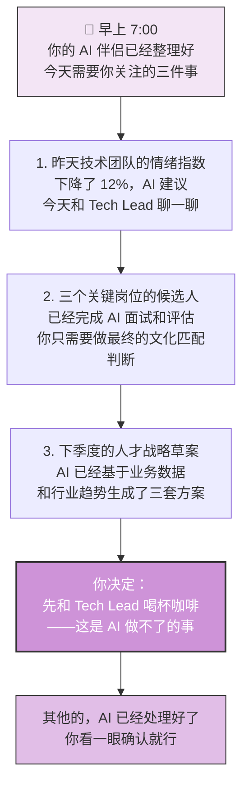
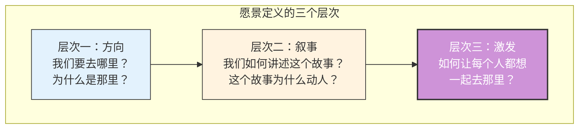
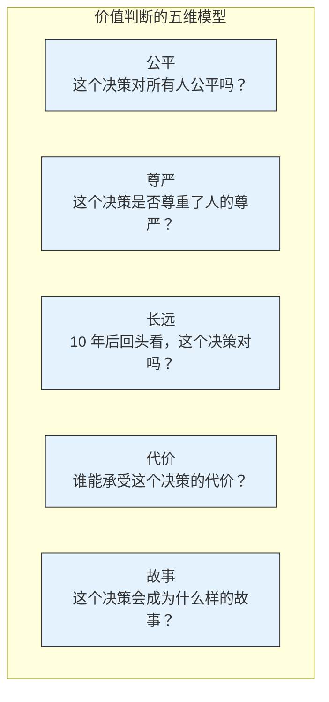
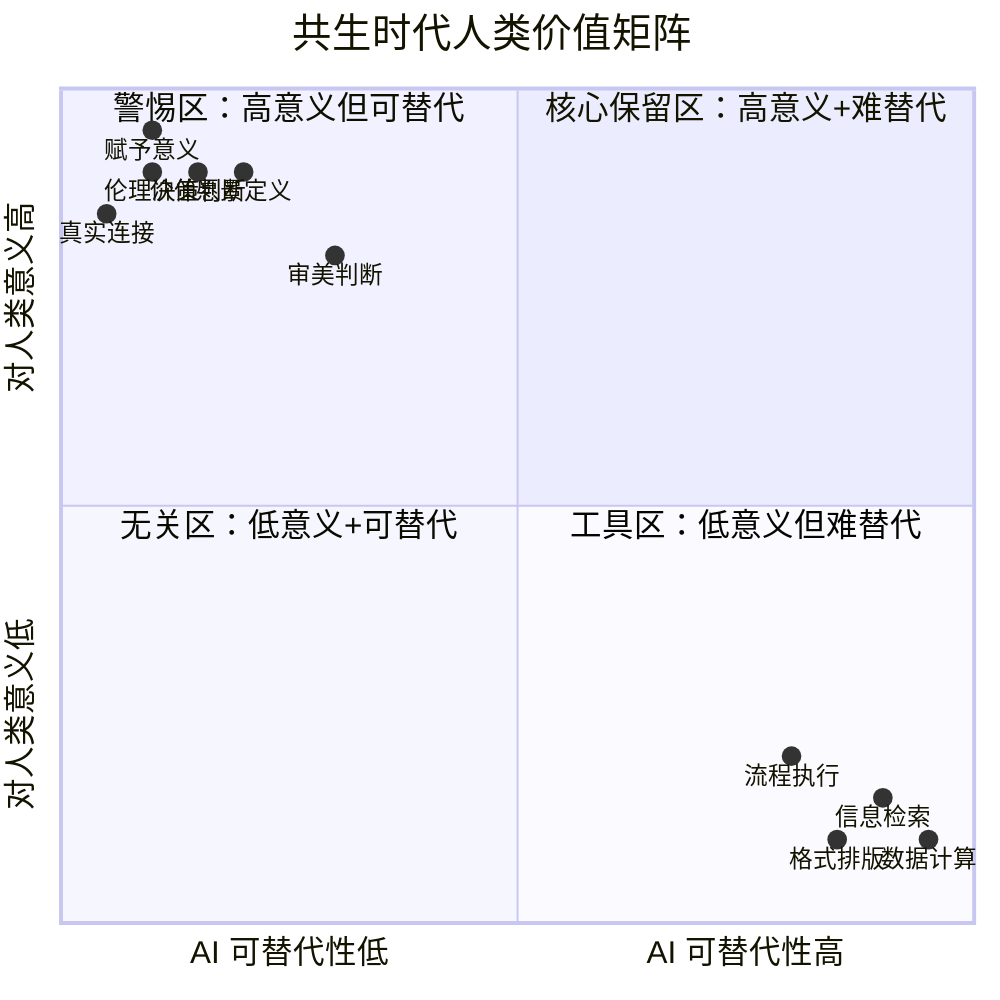
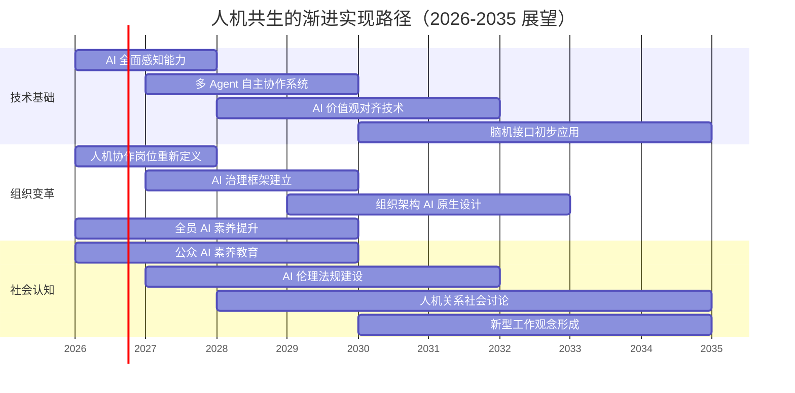

# 阶段五：人机共生（Symbiosis）

> [!abstract] 阶段定位
> 阶段五是人机协作的终极形态——不是 AI 替代人类，也不是人类控制 AI，而是**人与AI 深度融入彼此的工作与生活，边界模糊到几乎不可分辨**。在这个阶段，人类的角色从"操作者"、"任务定义者"、"协作者"、"目标设定者"一路演化，最终成为"意义赋予者"——人类的核心价值不再是"做了什么"，而是"为什么做"和"为谁做"。

---

## 一、阶段画像

```mermaid
graph TB
    subgraph 阶段五：人机共生
        H["👤 人类<br/>意义赋予者<br/>愿景定义 + 价值判断<br/>伦理决策 + 人际关系"]
        AI["🌟 AI 融入性存在<br/>无处不在、深度嵌入<br/>主动理解、预见需求"]

        H <-.->|"深度绑定<br/>边界模糊"| AI

        H --> V1["定义方向<br/>'我们要去哪里'"]
        H --> V2["做价值判断<br/>'什么是对的'"]
        H --> V3["维护人性连接<br/>'我理解你的感受'"]

        AI --> E1["预见性服务<br/>在你开口之前就知道你需要什么"]
        AI --> E2["全域执行<br/>跨领域自主完成复杂任务"]
        AI --> E3["持续进化<br/>在协作中不断学习你的偏好和价值观"]
    end

    style H fill:#ce93d8,stroke:#333,stroke-width:2px,color:#fff
    style AI fill:#f3e5f5,stroke:#333,stroke-width:2px
    style V1 fill:#e1bee7,stroke:#333
    style V2 fill:#e1bee7,stroke:#333
    style V3 fill:#e1bee7,stroke:#333
    style E1 fill:#e1bee7,stroke:#333
    style E2 fill:#e1bee7,stroke:#333
    style E3 fill:#e1bee7,stroke:#333
```

### 核心特征

| 维度 | 特征描述 |
|:---|:---|
| **人类角色** | 意义赋予者（Meaning Giver）—— 定义方向、做价值判断、维护人性连接、进行伦理决策 |
| **AI 角色** | 融入性存在（Integrated Presence）—— 无处不在、深度嵌入、主动理解、预见需求 |
| **交互模式** | 持续融合 —— 不再是"使用 AI"，而是"和 AI 一起生活工作"，边界难以分辨 |
| **决策权** | 人类定义方向，AI 在方向内自主决策 —— 但"方向"本身是人和 AI 共同探索的 |
| **协作深度** | 终极深度 —— AI 深度理解人类的价值观、偏好、目标，甚至比人类自己更了解自己 |
| **核心能力** | 愿景定义 + 价值判断 + 伦理决策 —— 不是"怎么做"，而是"为什么做"和"应不应该做" |

> [!important] 阶段五的本质
> 阶段五不是"AI 变得超级强大以至于不需要人类了"，而是**人类从所有执行层面的工作中解放出来，专注于只有人类能做的事：赋予意义、做出价值判断、维护人与人之间的真实连接**。这不是人类的"失业"，而是人类的"升级"。

---

## 二、阶段五的图景：一个思想实验

> [!question] 假设现在是 2035 年...

**场景一：HR 的早晨**



**场景二：招聘决策**

> 过去的招聘：HR 花 70% 时间筛简历、排面试、做协调。  
> 共生时代的招聘：AI 完成了 95% 的流程——需求分析、渠道匹配、候选人触达、初步面试、能力评估、薪酬建议。  
> HR 做什么？**做那个 5% 只有人能做的事**：感受候选人的价值观是否契合、判断这个人的潜力、在候选人犹豫时讲出公司的故事和愿景。

**场景三：组织变革**

> 过去的组织变革：HR 花大量时间做数据分析、方案撰写、沟通材料准备。  
> 共生时代的组织变革：AI 实时分析组织健康度、预测变革阻力点、自动生成个性化沟通方案。  
> HR 做什么？**走进团队，听那些数据听不到的声音，在变革中维护人的尊严和信任。**

> [!tip] 共生时代的核心悖论
> AI 做得越多，人的价值反而越清晰——不是"AI 能做的你都不用做了"，而是"因为 AI 做了所有能做的，你终于可以专注于只有你能做的事了"。

---

## 三、阶段五的核心能力

### 能力一：愿景定义



> [!important] 愿景定义为什么是人的专属能力
> AI 可以分析数据、预测趋势、生成方案——但它无法"想要"某个未来。愿景的本质不是"预测什么会发生"，而是"选择什么值得发生"。这个"选择"背后是价值观、是信念、是对"什么是好的"的判断——这些都是 AI 不具备的。

### 能力二：价值判断



> [!warning] 价值判断不能被外包
> AI 可以告诉你"这样做效率最高"，但不能告诉你"这样做对不对"。效率是 AI 的语言，但"对"和"错"是人类独有的语言。在共生时代，当 AI 能处理所有"怎么做"的问题，人类的核心价值就集中在"应该做吗"这个问题上。

### 能力三：伦理决策

| 伦理维度 | AI 能做什么 | 人必须做什么 |
|:---|:---|:---|
| **招聘公平** | AI 可以分析招聘流程是否存在系统性偏差 | 人必须决定：我们愿意为公平牺牲多少效率？ |
| **裁员决策** | AI 可以基于数据给出最优裁员方案 | 人必须面对被裁的人，承担决策的道德重量 |
| **隐私边界** | AI 可以分析员工数据预测离职风险 | 人必须决定：多大程度的监控是可以接受的？ |
| **AI 治理** | AI 可以监控其他 AI 的行为 | 人必须设定：AI 的伦理边界在哪里？谁来监督监督者？ |
| **技术选择** | AI 可以评估不同技术方案的成本收益 | 人必须判断：这个技术是否符合我们的价值观？ |

> [!important] 伦理决策的不可替代性
> 伦理决策的核心不是"找到最优解"，而是**承担选择的后果**。AI 可以计算所有选项的预期效用，但无法为选择感到内疚、后悔或骄傲。这些情感不是决策的缺陷，而是人类决策的基石——它们确保决策者真正在意决策的后果。

---

## 四、阶段五的追问：人类还剩下什么？



> [!important] 核心结论
> 共生时代，人类的核心保留区集中在**右上角之外的区域**——那些"对人类意义极高但 AI 难以替代"的能力：赋予意义、价值判断、真实连接、审美判断、愿景定义、伦理决策。这些能力有一个共同点：**它们不是"技能"，而是"人性"的体现。** 技能可以学习、可以模拟、可以被替代。但人性——在乎、感受、判断、选择、承担——不能。

---

## 五、阶段五的实现路径：从畅想到现实



---

## 六、阶段五的警示与反思

> [!warning] 五个必须警惕的风险

1. **意义感的丧失**：当 AI 能完成一切，人类会不会陷入"我还有什么用"的虚无？
2. **人际连接的退化**：当你最懂你的是 AI 而不是任何人，真实的人际关系会怎样？
3. **决策能力的萎缩**：当 AI 总是帮你做判断，你还能为自己做判断吗？
4. **权力集中**：控制最强 AI 的少数人，会不会成为新的"神"？
5. **人类独特性的消解**：如果 AI 能模拟一切人类特质，"做人"还有什么特别？

> [!important] 对这些风险的回答
> 这些风险没有简单的答案。但它们指向同一个方向：**共生时代的核心能力，不是"如何使用 AI"，而是"如何保持人性"。** 技术越强大，人的自我认知越重要。AI 能做的事越多，人越需要清楚地知道"我是谁"和"我想成为谁"。

---

## 七、与已有思考的关联

> [!note] 回到边界思考
> 阶段五的很多讨论，其实在 [[05-产品与开发/Vibe Coder/05-思想与思维/人机协作的边界]] 中已经有了铺垫。那篇笔记中提出的"五个维度边界法则"——决策（谁承担后果）、创造力（意义）、情感（真实连接）、学习与成长（经历）、道德与价值判断（不能外包）——在共生时代不但没有过时，反而更加重要。当 AI 能做一切时，这些边界就成了"做人"的最后防线。

---

## 八、关联文档

- [[02-AI趋势与素养/人机协作阶段演进/00_MOC_人机协作阶段演进中枢]] — 回中枢导航
- [[02-AI趋势与素养/人机协作阶段演进/01_协作演进的总体框架]] — 五阶段框架总纲
- [[02-AI趋势与素养/人机协作阶段演进/05_阶段四：AI主导执行]] — 上一阶段
- [[02-AI趋势与素养/人机协作阶段演进/08_跨越阶段的关键杠杆]] — 如何从阶段四跃迁到阶段五
- [[05-产品与开发/Vibe Coder/05-思想与思维/人机协作的边界]] — 横向维度边界分析（五个维度法则）
- [[05-产品与开发/Vibe Coder/05-思想与思维/面试回答_人与AI协作的边界]] — 面试中的边界讨论

---

> [!tip] 阅读建议
> 阶段五是对未来的展望和思想实验。建议先充分理解 [[02-AI趋势与素养/人机协作阶段演进/05_阶段四：AI主导执行]] 的实践，再回到本篇思考更远的未来。同时，[[05-产品与开发/Vibe Coder/05-思想与思维/人机协作的边界]] 中的五个维度法则可以作为理解共生时代人类价值的底层框架。

---

*共生时代的终极问题不是"AI 能做什么"，而是"有了 AI，人想成为什么"。*