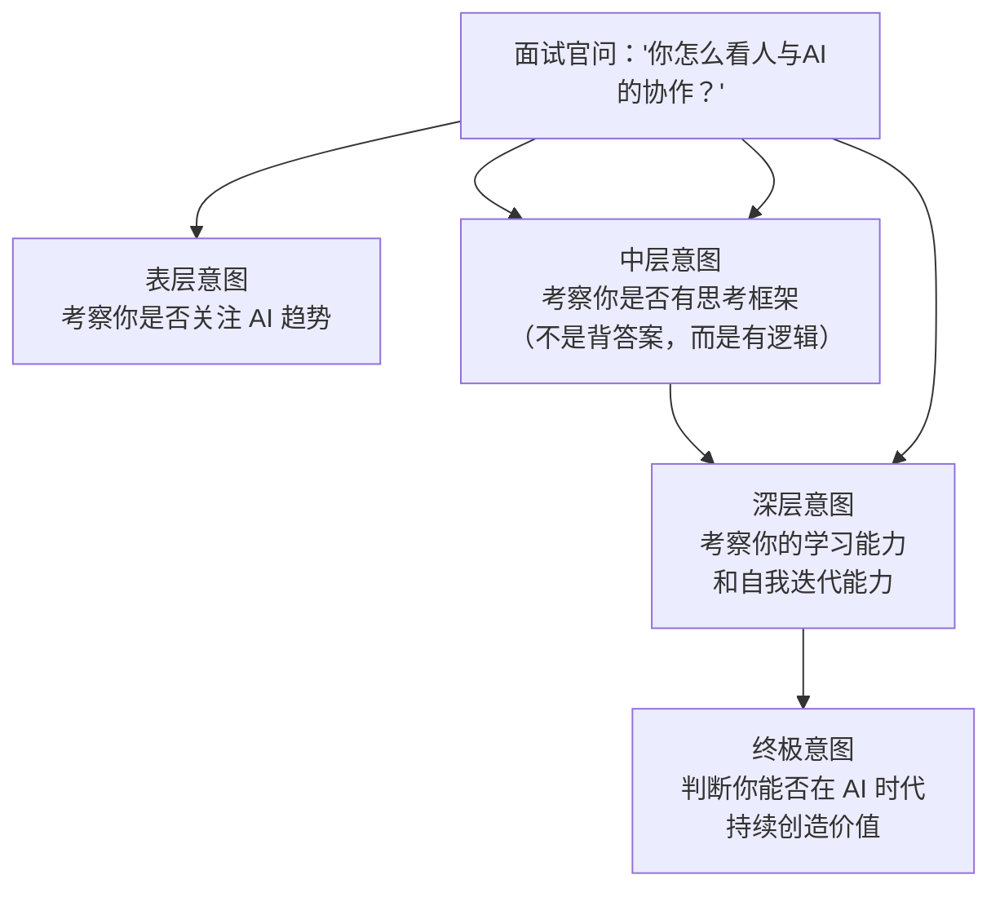
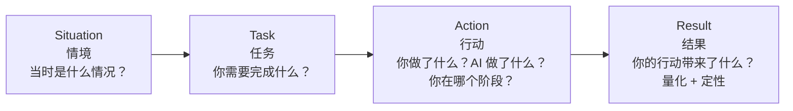
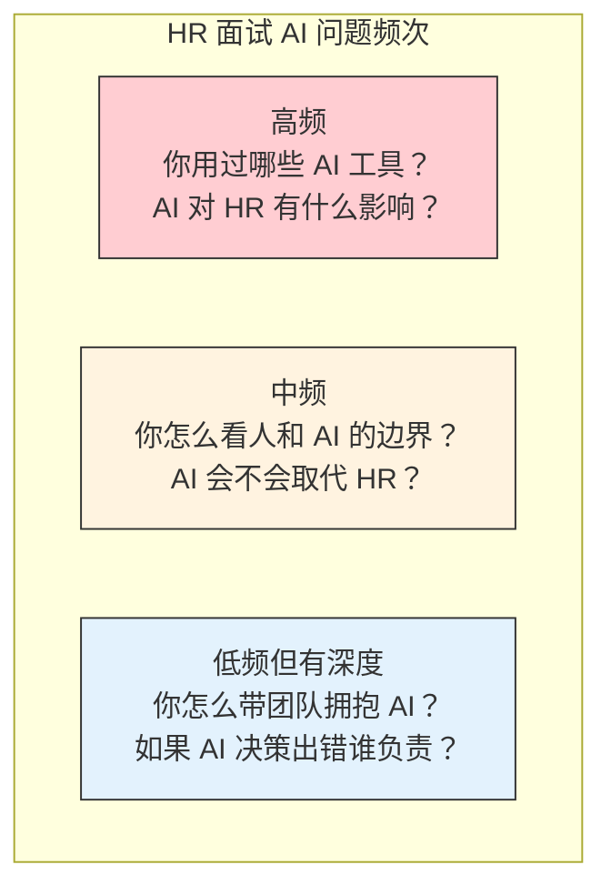
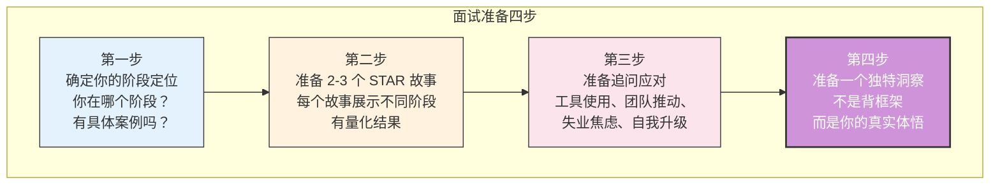

# 面试应用：如何回答"人与AI协作"类问题

> [!abstract] 本篇定位
> 本篇是五阶段框架的**面试实战落地**。不讨论理论，只聚焦一件事：**面试官问"你怎么看人与AI协作"时，你怎么答得让面试官眼前一亮。** 包含三种回答模板、STAR 话术、常见追问应对、以及针对 HR 岗位的专项打法。

---

## 一、为什么面试官爱问这个问题

> [!important] 面试官的潜台词
> 当面试官问这个问题时，他真正想知道的是：**"如果我把你招进来，一年后 AI 进步了，你是变得更有价值了，还是被替代了？"** 你的回答需要传递一个信号：你会因为 AI 的进步而变得更强，而不是更弱。

---

## 二、三个版本的回答模板

### 版本一：30 秒电梯回答（一面、快速对答）

> [!tip] 适用场景：面试官随口一问，或时间紧张

> 关于人与AI的协作，我有一个五阶段的框架来理解。简单说，从协作深度来看，可以分成五个阶段：**工具使用、任务委托、协作共创、AI 主导执行、人机共生。**
>
> 目前大多数人在阶段二（让 AI 执行单一任务，比如写文案、写代码），我目前在阶段三（和 AI 多轮迭代，互相补位），也在探索阶段四（设计 AI Agent 自主完成复杂工作流）。
>
> 关键认知是：**阶段不是由技术决定的，而是由人如何使用技术决定的。** 同样的 GPT-4，有人只用来写邮件（阶段二），有人用来做战略共创（阶段三）。我的目标是让 AI 把我从"执行"中解放出来，让我专注于"判断"和"决策"——这才是人类不可替代的价值。

**为什么这个回答好？**

| 要素 | 效果 |
|:---|:---|
| 抛出框架 | 展示你有系统性思考，不是泛泛而谈 |
| 自定位 | 让面试官知道你不仅知道理论，还在实践 |
| 核心洞察 | "阶段由人决定"——展示深度思考 |
| 价值主张 | 最后的落脚点是"你的价值"——不是"AI 多厉害" |

### 版本二：3 分钟结构化回答（二面、深度对谈）

> [!tip] 适用场景：面试官追问细节，需要展示思考深度

> 这个问题我思考比较多，我用一个框架来回答。我把人机协作分成五个阶段，从两个维度来定义：**协作深度**和**人类角色变化**。

**第一步：快速抛出框架（30 秒）**

> 阶段一**工具使用**——AI 是被动工具，人是操作者，比如搜索引擎。阶段二**任务委托**——AI 按指令完成单一任务，人是任务定义者，比如用 ChatGPT 写 JD。阶段三**协作共创**——人和 AI 多轮交互迭代，人是协作者，比如 AI 辅助产品设计。阶段四 **AI 主导执行**——AI 自主完成复杂工作流，人是目标设定者，比如 AI Agent 自动化招聘流程。阶段五**人机共生**——AI 深度融入工作生活，人成为意义赋予者。

**第二步：自定位 + 具体案例（90 秒）**

> 我个人目前在阶段三，正在向阶段四探索。举个例子，在做人才盘点时，我不只是让 AI 帮我生成报告——那还是阶段二。我和 AI 进行了多轮共创：我先描述组织特点，AI 推荐分析框架，我选择+组合，AI 生成评估维度，我补充 AI 没考虑到的组织文化因素，AI 再生成报告结构。最终产出的人才盘点，比过去任何一次都更全面。
>
> 同时，我也在探索阶段四——把成熟的协作模式固化为 AI Agent。比如我们设计了一个 Agent，能自主完成候选人从初筛到面试邀约的全流程，人类只在设定目标和处理异常时介入。

**第三步：价值观收尾（60 秒）**

> 这个框架让我最深的体悟是：**AI 做"建议"，人做"决定"。** AI 可以告诉我"数据上这些人是 Bottom 10%"，但裁掉谁、怎么面对那个人，必须是人来做。
>
> 所以我认为，在 AI 时代，HR 的核心价值不是"会不会用 AI 工具"，而是**能不能在 AI 提供的海量信息中做出正确的判断，能不能在效率之外守护公平、尊严和人性。** 这也是为什么我相信，会用 AI 的 HR 会替代不会用 AI 的 HR，但 AI 本身不会替代 HR。

### 版本三：带故事的回答（终面、展现人格）

> [!tip] 适用场景：面试官想了解"你是一个怎样的人"，而非"你懂多少"

> 我想分享两个场景，这两个场景定义了我对人与AI 协作的理解。

**场景一：AI 让我更强**

> 去年我探索 AI 的时候，让 AI 帮我分析了 50 份简历，30 秒出结果，匹配度排序、技能雷达图全出来了。过去我花 3 小时做的事，现在 30 秒。我当时的感觉是——过去 HR 花 70% 时间做的"信息处理"，AI 确实能做得更好更快。这块我毫不犹豫交给 AI。

**场景二：AI 不能替代的东西**

> 但我也遇到过另一个场景。一个团队 Leader 离职，整个团队士气很低。AI 能帮我生成"如何安抚团队"的话术，但它不会走进会议室，看着那几个 junior 的眼神，说"我知道你们现在很不安，但我会和你们一起扛过去"。
>
> 那句话，AI 说不了。不是技术不够，是因为它不需要为这句话的后果负责，而我需要。
>
> 所以我判断人机协作边界的标准很简单：**凡是我愿意为后果承担责任的，我借助 AI 做得更好；凡是后果必须由我亲自面对的，我必须亲自做。**

---

## 三、STAR 话术：用故事展示你的阶段

> [!important] 面试铁律
> 面试官不会因为你"知道"五阶段模型而录用你。他们录用你，是因为你**展示了你在这个框架下做了什么、怎么做的、结果如何**。STAR 框架就是把理论转化为说服力的工具。

### STAR 模板

### 针对不同阶段的话术重点

| 阶段 | STAR 话术重点 | 面试官想听到的 |
|:---|:---|:---|
| **阶段二：委托** | "我把 XX 任务拆解后委托给 AI，节省了 XX% 时间，但我花了 XX 时间做审核和调整" | 你会拆解任务、会验收、不盲目信任 AI |
| **阶段三：共创** | "我和 AI 多轮迭代，AI 给了我 XX 个方案，我选择了 XX 方向，AI 帮我展开，我补充了 XX 洞察" | 你有批判性思维，能驾驭 AI 而不是被 AI 带跑 |
| **阶段四：Agent** | "我设计了 Agent 的目标和边界，Agent 自主完成了 XX 流程，我设置了 XX 监控机制，发现了 XX 问题并调整" | 你有系统思维和风险管理意识，不只是"用 AI"而是"设计系统" |

### 完整 STAR 示例（HR 岗位）

| 步骤 | 内容 |
|:---|:---|
| **Situation** | 2025 年下半年，公司业务快速扩张，招聘量翻倍，HR 团队只有 3 个人，简历筛选成为最大瓶颈 |
| **Task** | 需要在 1 个月内建立高效的候选人筛选机制，同时保证筛选质量不下降 |
| **Action** | 我主导了三个阶段的推进：**阶段二**——用 AI 生成结构化的 JD 和面试评估表，节省 60% 准备时间；**阶段三**——和 AI 共创了匹配度评估模型，从 5 个维度评估候选人，多轮迭代了评估标准；**阶段四**——设计了一个 AI Agent 来自动化初步筛选和面试邀约，设定了决策边界和异常升级机制 |
| **Result** | 简历筛选效率提升 90%（从日均 30 份到 300 份），候选人首次响应时间从 48 小时缩短到 2 小时，招聘经理对候选人质量的满意度提升 15%。更重要的是，团队从机械的筛简历工作中解放出来，把时间投入到更深度的人才评估和候选人体验优化上 |

---

## 四、常见追问与应对

### 追问 1：「你用过哪些 AI 工具？效果怎么样？」

> [!tip] 应答策略：不要罗列工具，要展示"你在哪个阶段用这个工具"

> 我用的工具可以按协作阶段来分类。阶段二层面，我日常用 ChatGPT 和 Claude 做内容生成——写 JD、写邮件、翻译文档。阶段三层面，我用 AI 做深度共创，比如用 AI 辅助人才盘点框架设计、组织诊断方案讨论。阶段四层面，我在探索 AI Agent 工具，比如让 Agent 自主完成招聘流程的部分环节。
>
> 关键不是工具本身，而是使用方式。同样用 ChatGPT，有人只停留在"帮我写一封邮件"（阶段二），我用它做"你觉得这个岗位的胜任力模型应该怎么设计？"（阶段三）。

### 追问 2：「如果上级/团队抗拒用 AI，你怎么办？」

> [!tip] 应答策略：展示你的推动力，同时展示你的同理心

> 我不会强调"AI 能替代你"，而是强调"AI 能把你最讨厌的那部分工作吃掉"。比如一个 HRBP 最烦的是花三小时做离职数据分析报告——我说"你把这个交给我和 AI，5 分钟出来，你只需要花 30 分钟看结论和做判断。"
>
> 关键叙事是：**让 AI 吃掉 dirty work，人保留 meaningful work。** 这个叙事比"AI 来了你要失业了"有效得多。
>
> 同时，我会先在小范围做"示范案例"——用一个成功的案例证明 AI 确实能提升效率，而不是空谈理论。从我自己的经验来看，一个真实的数字比一百个 PPT 更有说服力。

### 追问 3：「AI 会不会让 HR 失业？」

> [!tip] 应答策略：展示你的框架思考，而不是情绪化回答

> 这个问题我用五阶段框架来回答。HR 不会被 AI 取代，但会被"会用 AI 的 HR"取代。区别在于：**过去的 HR 大量时间花在阶段一和阶段二的工作上——操作工具、执行单一任务（筛简历、排面试、填表）。这些确实会被 AI 替代。**
>
> 但**阶段三、四、五的工作——做出判断、设计系统、赋予意义、维护人的连接——这些 AI 替代不了。** 所以问题不是"我会不会被 AI 取代"，而是"我有没有在主动升级到更高阶段的协作模式，把自己从执行者变成判断者和意义赋予者。"

### 追问 4：「你觉得自己在哪个阶段？下一步怎么升级？」

> [!tip] 应答策略：诚实自评 + 展示成长计划

> 我诚实地评估自己：日常事务性工作中，我在阶段二（任务委托），比如写 JD、写邮件。深度分析工作中，我在阶段三（协作共创），比如人才盘点、组织诊断。我还在探索阶段四，比如设计自动化的招聘筛选 Agent。
>
> 下一步的升级计划有三点：**第一，把更多成熟的共创模式固化为 Agent**，减少重复性的协作；**第二，刻意练习系统设计能力**，不只是"用 AI"，而是设计好 AI 能自主运行的框架；**第三，深化对 AI 局限性的理解**，知道什么时候该信任 AI，什么时候必须亲自判断。

### 追问 5：「你面试的这个岗位，AI 能替代多少？」

> [!tip] 应答策略：细分岗位任务，用五阶段框架分析，展示你对岗位的深入理解

> 这是一个很好的问题。我把这个岗位的工作拆成三个层面来看：
>
> **可替代层面（约 40%）**：信息收集、数据整理、初稿撰写、流程性沟通——这些属于阶段一和阶段二的工作，AI 可以做得更快更准。这部分被替代是好事，因为解放了我的时间。
>
> **AI 辅助但人主导层面（约 40%）**：候选人深度评估、组织诊断分析、方案设计——这些属于阶段三的工作，AI 能提供框架和视角，但最终判断需要人的经验和对组织文化的理解。
>
> **不可替代层面（约 20%）**：关键决策（尤其是涉及人的决策）、危机处理、跨部门敏感沟通、文化建设——这些是阶段四和阶段五的工作，必须由人来完成，因为涉及价值判断、责任承担和真实的人际连接。
>
> 所以，我不是在找一个"不会被 AI 替代的工作"，而是在找一个"能让我借 AI 之力发挥更大价值的工作"。

---

## 五、针对 HR 岗位的专项打法

### HR 面试中 AI 相关问题的出现概率

### HR 各模块的 AI 应用叙事

| HR 模块 | 阶段二叙事 | 阶段三叙事 | 阶段四叙事 |
|:---|:---|:---|:---|
| **招聘** | AI 生成 JD、筛选简历 | AI 辅助设计结构化面试 | AI Agent 自动化初筛+邀约 |
| **培训** | AI 生成培训大纲和材料 | AI 辅助培训需求诊断 | AI Agent 个性化学习路径推荐 |
| **薪酬** | AI 生成市场薪酬对标报告 | AI 辅助薪酬结构设计 | AI Agent 自动化薪酬分析 |
| **绩效** | AI 生成绩效评语初稿 | AI 辅助绩效校准 | AI Agent 绩效数据分析+预警 |
| **员工关系** | AI 生成沟通话术 | AI 辅助离职风险分析 | AI Agent 情绪监测+预警 |
| **组织发展** | AI 生成组织诊断问卷 | AI 辅助组织诊断分析 | AI Agent 组织健康度持续监控 |

> [!tip] 面试策略
> 根据你面试的岗位选择叙事重点。如果是**HRBP 岗位**，重点展示阶段二的效率和阶段三的共创能力。如果是**HR 负责人或 COE 岗位**，必须展示阶段四的系统设计思维和对阶段五的思考。

---

## 六、面试前的准备清单

> [!important] 最重要的准备
> 框架和话术是工具，但面试官最想听的，是**你真实的故事和体悟**。在上面所有准备的基础上，问自己一个问题：**"关于人机协作，我最相信的一件事是什么？"** 那个答案，就是你在面试中应该传递的核心信息。

---

## 七、关联文档

- [[02-AI趋势与素养/人机协作阶段演进/00_MOC_人机协作阶段演进中枢]] — 回中枢导航
- [[02-AI趋势与素养/人机协作阶段演进/01_协作演进的总体框架]] — 五阶段框架总纲，面试前必须背熟
- [[02-AI趋势与素养/人机协作阶段演进/02_阶段一：工具使用]] — 阶段一深度
- [[02-AI趋势与素养/人机协作阶段演进/03_阶段二：任务委托]] — 阶段二深度
- [[02-AI趋势与素养/人机协作阶段演进/04_阶段三：协作共创]] — 阶段三深度（含 STAR 示例）
- [[02-AI趋势与素养/人机协作阶段演进/05_阶段四：AI主导执行]] — 阶段四深度（含 STAR 示例）
- [[02-AI趋势与素养/人机协作阶段演进/06_阶段五：人机共生]] — 阶段五深度
- [[02-AI趋势与素养/人机协作阶段演进/08_跨越阶段的关键杠杆]] — 展示"如何升级"的深度思考
- [[05-产品与开发/Vibe Coder/05-思想与思维/面试回答_人与AI协作的边界]] — 另一个面试场景的边界回答
- [[05-产品与开发/Vibe Coder/05-思想与思维/人机协作的边界]] — 五个维度边界法则

---

> [!tip] 使用建议
> 面试前，建议至少完成以下三步：1) 通读 [[02-AI趋势与素养/人机协作阶段演进/01_协作演进的总体框架]] 掌握五阶段模型；2) 根据你的实际经验，准备 2-3 个 STAR 故事；3) 预演"常见追问"部分的回答。面试时，不要背诵框架，而是把框架当作**组织你真实经验的脚手架**。

---

*面试不是在考你"知不知道"，而是在考你"有没有做过、有没有想过、有没有自己的判断"。*