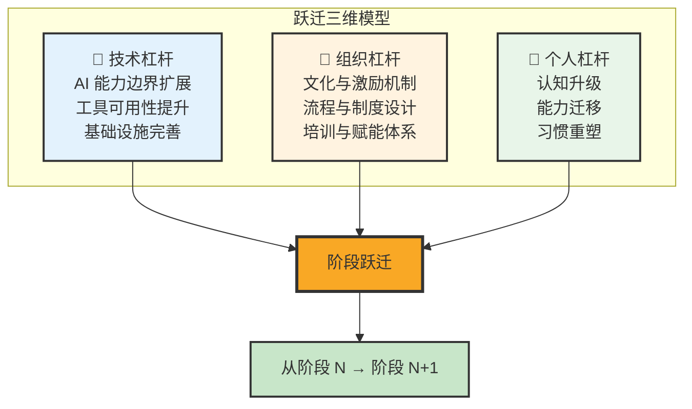
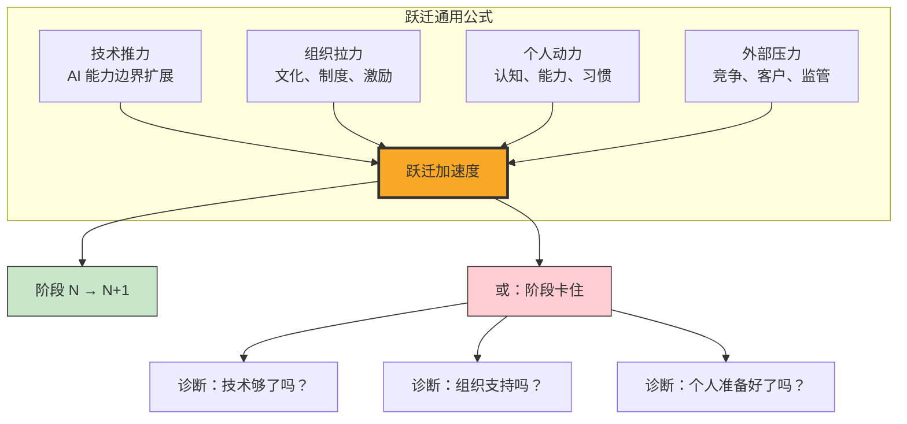
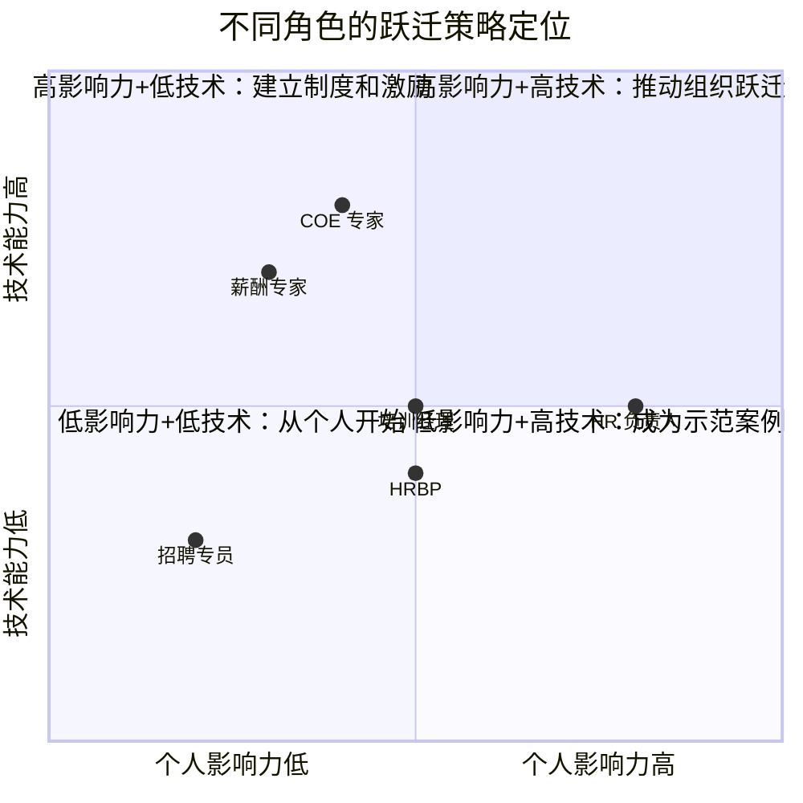
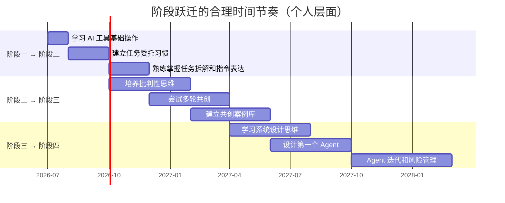

# 跨越阶段的关键杠杆

> [!abstract] 本篇定位
> 本篇回答一个核心问题：**是什么推动从阶段 N 到阶段 N+1 的跃迁？** 不是单靠技术，也不是单靠个人意愿。跃迁是**技术、组织、个人**三个维度的杠杆共同作用的结果。理解这三个维度，你就能诊断"为什么我的团队卡在阶段 X"，并找到推动升级的发力点。

---

## 一、跃迁的三维模型



> [!important] 核心观点
> 阶段跃迁从来不是单因素决定的。**技术是必要条件（没有足够强的 AI 能力，跃迁不可能发生），组织是放大器（好的组织能加速跃迁，坏的组织能扼杀跃迁），个人是发动机（最终的跃迁发生在每个人的认知和行动中）。** 三者缺一不可。

---

## 二、各阶段跃迁的杠杆分析

### 2.1 从阶段一到阶段二：工具使用 → 任务委托

```mermaid
flowchart TD
    subgraph 阶段一→阶段二跃迁
        T1["技术杠杆<br/>自然语言处理技术成熟<br/>ChatGPT 等通用 AI 工具普及<br/>API 接口降低成本"]
        O1["组织杠杆<br/>AI 工具采购与部署<br/>使用规范和模板建立<br/>效率指标的重新定义"]
        P1["个人杠杆<br/>从'学操作'到'学表达'<br/>任务拆解能力的培养<br/>验收标准的确立"]
    end

    T1 --> E1["跃迁结果<br/>AI 从被动工具<br/>升级为指令执行者"]
    O1 --> E1
    P1 --> E1

    style T1 fill:#e3f2fd,stroke:#333
    style O1 fill:#fff3e0,stroke:#333
    style P1 fill:#e8f5e9,stroke:#333
    style E1 fill:#a5d6a7,stroke:#333,stroke-width:2px
```

| 维度 | 推动力 | 阻碍力 |
|:---|:---|:---|
| **技术** | NLP 技术突破、ChatGPT 类工具普及 | 企业对数据安全的担忧、工具成本 |
| **组织** | 效率压力、同行竞争压力 | "我们一直这么做的"惯性、对 AI 的不信任 |
| **个人** | 好奇心、效率焦虑、对重复劳动的厌倦 | 学习新工具的惰性、对 AI 输出的不信任 |

> [!tip] 推动策略
> **个人层面**：从"最小可行任务"开始——找一个你每天花 30 分钟以上的重复性任务，尝试用 AI 完成。成功一次，信心就建立起来了。
> **组织层面**：建立"AI 使用案例库"——让早期使用者分享成功案例，降低其他人的尝试门槛。

### 2.2 从阶段二到阶段三：任务委托 → 协作共创

```mermaid
flowchart TD
    subgraph 阶段二→阶段三跃迁
        T2["技术杠杆<br/>AI 上下文理解能力增强<br/>多轮对话能力提升<br/>推理和逻辑能力进步"]
        O2["组织杠杆<br/>鼓励探索和试错的文化<br/>'人机共创'流程的正式化<br/>对创新的奖励机制"]
        P2["个人杠杆<br/>从'写好指令'到'做好判断'<br/>批判性思维的刻意练习<br/>领域专业知识的持续积累"]
    end

    T2 --> E2["跃迁结果<br/>AI 从指令执行者<br/>升级为共创伙伴"]
    O2 --> E2
    P2 --> E2

    style T2 fill:#e3f2fd,stroke:#333
    style O2 fill:#fff3e0,stroke:#333
    style P2 fill:#e8f5e9,stroke:#333
    style E2 fill:#ffcc80,stroke:#333,stroke-width:2px
```

| 维度 | 推动力 | 阻碍力 |
|:---|:---|:---|
| **技术** | GPT-4 级推理能力、多轮对话、长上下文 | AI 的"幻觉"问题、一致性问题 |
| **组织** | 需要高质量决策的场景增多 | "效率优先"文化可能抵制"看起来更慢"的共创 |
| **个人** | 对"够好"不满足、追求卓越的内在驱动 | 批判性思维的缺乏、对 AI 的过度依赖 |

> [!tip] 推动策略
> **个人层面**：培养"批判性思维"——每次 AI 给你结果后，问自己三个问题：这个结论的前提是什么？有没有反例？如果我反过来想会怎样？——这就是从阶段二到阶段三的核心能力迁移。
> **组织层面**：建立"AI 共创工作坊"——定期让团队成员分享他们和 AI 共创的过程和成果，建立"共创是高级能力"的组织认知。

> [!important] 阶段二→三的跃迁是最难的
> 在所有跃迁中，阶段二到阶段三的跃迁**最难**。因为它不是"学会用一个新工具"，而是**思维方式的根本转变**——从"我告诉 AI 做什么"到"我和 AI 一起探索什么"。这需要个人放弃"我知道答案"的舒适感，进入"我不知道但我们可以一起找"的不确定状态。详见 [[02-AI趋势与素养/人机协作阶段演进/04_阶段三：协作共创#三、阶段三的核心能力]]。

### 2.3 从阶段三到阶段四：协作共创 → AI 主导执行

```mermaid
flowchart TD
    subgraph 阶段三→阶段四跃迁
        T3["技术杠杆<br/>Agent 框架成熟<br/>工具调用和编排能力<br/>自主决策和异常处理"]
        O3["组织杠杆<br/>流程标准化的积累<br/>风险管理的制度设计<br/>人机权责的重新分配"]
        P3["个人杠杆<br/>从'参与者'到'架构师'<br/>系统设计思维<br/>风险识别和管理能力"]
    end

    T3 --> E3["跃迁结果<br/>AI 从共创伙伴<br/>升级为自主执行者"]
    O3 --> E3
    P3 --> E3

    style T3 fill:#e3f2fd,stroke:#333
    style O3 fill:#fff3e0,stroke:#333
    style P3 fill:#e8f5e9,stroke:#333
    style E3 fill:#ef9a9a,stroke:#333,stroke-width:2px
```

| 维度 | 推动力 | 阻碍力 |
|:---|:---|:---|
| **技术** | Agent 框架（LangChain、AutoGPT 等）、多工具编排 | Agent 的可靠性不足、决策黑箱 |
| **组织** | 规模化需求、降本增效压力 | 对"失控"的恐惧、责任归属不清 |
| **个人** | 对重复性共创的厌倦、追求效率 | 系统设计能力不足、风险担当的恐惧 |

> [!tip] 推动策略
> **个人层面**：从"成熟的共创模式"开始固化——把你和 AI 已经跑得很熟练的协作流程写下来，识别哪些步骤可以标准化、哪些决策可以自动化。然后逐步把标准化的部分交给 Agent。
> **组织层面**：建立"Agent 沙盒"——在低风险场景先试点 Agent，收集数据和经验，建立信心后再推广到高风险场景。

> [!warning] 阶段三→四跃迁的陷阱
> 最大的陷阱是**过早自动化**——在没有充分理解一个流程的复杂性和边缘情况之前，就把它交给 Agent。结果就是 Agent 在 80% 的情况下跑得很好，但 20% 的异常情况造成了严重的后果，导致整个 Agent 项目被叫停。详见 [[02-AI趋势与素养/人机协作阶段演进/05_阶段四：AI主导执行#三、阶段四的核心能力]] 中的风险管理部分。

### 2.4 从阶段四到阶段五：AI 主导执行 → 人机共生

```mermaid
flowchart TD
    subgraph 阶段四→阶段五跃迁
        T4["技术杠杆<br/>AI 全面感知和预见能力<br/>多 Agent 自主协作<br/>AI 价值观对齐技术"]
        O4["组织杠杆<br/>AI 治理框架的成熟<br/>工作意义的重新定义<br/>新型组织结构的出现"]
        P4["个人杠杆<br/>从'架构师'到'意义赋予者'<br/>愿景定义能力<br/>价值判断和伦理决策能力"]
    end

    T4 --> E4["跃迁结果<br/>AI 从自主执行者<br/>升级为融入性存在<br/>人类成为意义赋予者"]
    O4 --> E4
    P4 --> E4

    style T4 fill:#e3f2fd,stroke:#333
    style O4 fill:#fff3e0,stroke:#333
    style P4 fill:#e8f5e9,stroke:#333
    style E4 fill:#ce93d8,stroke:#333,stroke-width:2px,color:#fff
```

| 维度 | 推动力 | 阻碍力 |
|:---|:---|:---|
| **技术** | AI 全面感知、脑机接口、AGI 进展 | 技术成熟度不足、安全风险 |
| **组织** | 新型工作范式需求 | 社会惯性、监管滞后、伦理争议 |
| **个人** | 对"更有意义的工作"的追求 | 意义感的丧失、"我还有什么用"的焦虑 |

> [!note] 阶段四→五的跃迁尚未大规模发生
> 这个跃迁目前更多是思想实验和前瞻性讨论。但理解它的逻辑，有助于我们在当前阶段做出更明智的选择——比如，在设计 Agent 时，就为未来的"意义赋予"留出空间，而不是完全把人排除在流程之外。详见 [[02-AI趋势与素养/人机协作阶段演进/06_阶段五：人机共生]]。

---

## 三、跃迁的通用杠杆模型



### 跃迁诊断清单

> [!question] 你的团队卡在哪个阶段？为什么？

| 诊断维度 | 问题 | 如果答案是"否"，这就是卡点 |
|:---|:---|:---|
| **技术** | 当前可用的 AI 工具是否具备支持下一阶段的能力？ | 需要等待技术成熟，或寻找替代方案 |
| **组织** | 组织文化是否鼓励下一阶段的协作模式？ | 需要先做文化铺垫和案例示范 |
| **组织** | 是否有明确的流程和制度支持下一阶段？ | 需要制度设计，尤其是责任归属和风险控制 |
| **组织** | 是否有激励机制鼓励探索下一阶段？ | 需要调整 KPI/OKR，让"升级"成为被奖励的行为 |
| **个人** | 团队成员是否具备下一阶段所需的核心能力？ | 需要培训赋能，尤其是批判性思维和系统设计 |
| **个人** | 团队成员是否有意愿尝试下一阶段的模式？ | 需要降低尝试门槛，用成功案例激发动力 |

---

## 四、不同角色的跃迁策略



| 角色 | 最优策略 | 具体行动 |
|:---|:---|:---|
| **HR 负责人** | 推动组织跃迁 | 建立 AI 使用规范和激励机制、投资 AI 工具和培训、重新定义岗位价值 |
| **HRBP** | 成为示范案例 | 在自己的业务场景中展示 AI 协作的价值、影响业务 Leader 拥抱 AI |
| **COE 专家** | 技术突破 + 制度设计 | 深入研究 AI 在专业领域的应用、设计 Agent 的边界和风险控制 |
| **一线 HR** | 从个人开始 | 从最小可行任务开始尝试、建立个人 AI 使用案例库、积累经验 |

---

## 五、跃迁的时间节奏



> [!tip] 跃迁不是冲刺，是马拉松
> 从阶段一到阶段四，正常需要 1-2 年的时间。不要急于求成——每个阶段的能力都需要时间沉淀。**试图跳过阶段直接进入高阶模式，就像没有学会走路就想跑步——摔倒是必然的。**

---

## 六、关联文档

- [[02-AI趋势与素养/人机协作阶段演进/00_MOC_人机协作阶段演进中枢]] — 回中枢导航
- [[02-AI趋势与素养/人机协作阶段演进/01_协作演进的总体框架]] — 五阶段框架总纲
- [[02-AI趋势与素养/人机协作阶段演进/02_阶段一：工具使用]] — 阶段一详情
- [[02-AI趋势与素养/人机协作阶段演进/03_阶段二：任务委托]] — 阶段二详情
- [[02-AI趋势与素养/人机协作阶段演进/04_阶段三：协作共创]] — 阶段三详情（含核心能力培养）
- [[02-AI趋势与素养/人机协作阶段演进/05_阶段四：AI主导执行]] — 阶段四详情（含系统设计和风险管理）
- [[02-AI趋势与素养/人机协作阶段演进/06_阶段五：人机共生]] — 阶段五详情
- [[02-AI趋势与素养/人机协作阶段演进/07_面试应用：如何回答人与AI协作类问题]] — 面试中展示"如何升级"的思考
- [[05-产品与开发/Vibe Coder/05-思想与思维/人机协作的边界]] — 边界法则为跃迁提供方向指引

---

> [!tip] 阅读建议
> 本篇是知识库的"操作手册"——不是告诉你"是什么"，而是告诉你"怎么做"。建议在通读各阶段文档后，回到本篇制定你的个人跃迁计划。诊断自己当前卡在哪个阶段，识别卡点，选择对应的杠杆发力。

---

*跃迁不是一个事件，而是一个过程。它不是"某一天我突然升级了"，而是"每一天我都在向上一个台阶靠近"。*