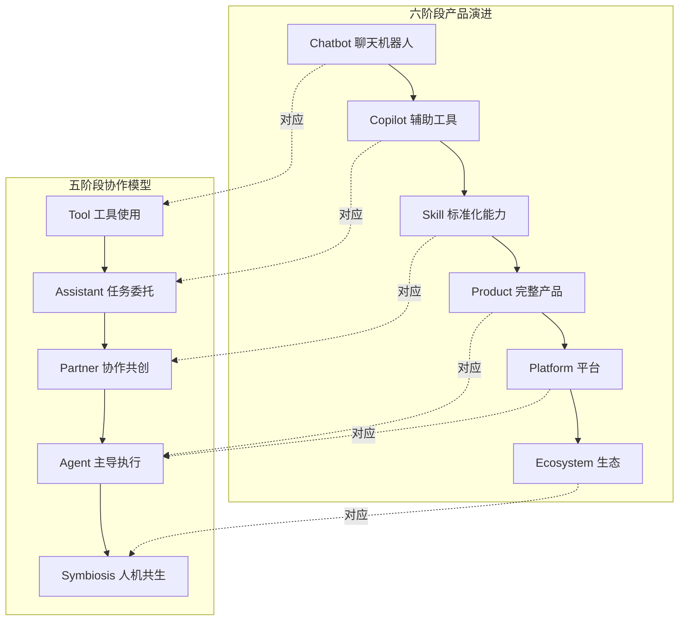

# 补充：六阶段产品演进与五阶段协作模型的整合

> [!abstract] 背景
> 本知识库的"五阶段模型"（Tool→Assistant→Partner→Agent→Symbiosis）从**人机协作深度**的角度切入。新建立的"AI应用发展阶段演进"知识库提出了"六阶段模型"（Chatbot→Copilot→Skill→Product→Platform→Ecosystem），从**产品形态演进**的角度切入。两个模型互补而非替代，本文提供整合框架。

---

## 一、两个模型的对应关系



> [!important] 关键差异
> 五阶段模型更关注**个体层面**的人机关系变化；六阶段模型更关注**产品/产业层面**的形态演进。两者在 Skill→Product→Platform 阶段出现"交叉"：同一人机协作深度（Agent）可以对应多种产品形态。

---

## 二、整合矩阵

| 六阶段 | 五阶段 | 人机关系 | 核心变化 | 2026年行业状态 |
|---|---|---|---|---|
| Chatbot | Tool | 问答关系 | 人能"问"AI | 增长见顶，ChatGPT月活环比下降 [$TRAE_REF](https://36kr.com/p/3866759935572612) |
| Copilot | Assistant | 辅助关系 | 人能"用"AI辅助工作 | 60%企业已部署 [$TRAE_REF](http://m.toutiao.com/group/7660723635006652968/) |
| Skill | Partner | 协作关系 | 人能"编排"AI能力 | SkillHub上线SkillPay，7.8万Skills [$TRAE_REF](https://www.time-weekly.com/wap-article/331153) |
| Product | Agent | 委托关系 | AI能"独立完成"任务 | AI Product爆发期，AI走出对话框 |
| Platform | Agent | 共建关系 | 多方通过AI"连接" | 平台化起步，过早平台化是最大风险 |
| Ecosystem | Symbiosis | 共生关系 | AI成"基础设施" | 少数头部玩家，全域AI生态成主流 [$TRAE_REF](https://m.sohu.com/a/1054317273_121873872/) |

---

## 三、为什么需要两个模型

### 五阶段模型的价值

- **视角**：从"人"出发，关注人的角色变化
- **适用场景**：面试回答、个人发展、HR评估
- **核心问题**：人的能力要求如何变化？

### 六阶段模型的价值

- **视角**：从"产品"出发，关注产品形态变化
- **适用场景**：产品战略、创业决策、技术选型
- **核心问题**：我的产品/能力处于什么阶段，下一步该做什么？

### 互补使用

```
面试场景：
    用五阶段模型回答"人与AI的协作关系如何变化"
    用六阶段模型补充"AI产品形态如何演进，行业发展到哪了"

产品决策场景：
    用六阶段模型判断产品处于哪个阶段、是否该跃迁
    用五阶段模型思考"跃迁后用户的人机关系会怎样变化"

组织变革场景：
    用六阶段模型看"组织在产业中的位置"
    用五阶段模型看"组织中每个人的角色变化"
```

---

## 四、与 AI Native 组织变革的关联

六阶段模型为 AI Native 组织提供了**产业背景**：

| 产品阶段 | 组织形态 | 典型特征 |
|---|---|---|
| Chatbot 时代 | 传统组织 + AI 工具 | 个别部门试点 AI |
| Copilot 时代 | 数字化组织 | 全员使用 AI 辅助工具 |
| Skill 时代 | AI 增强组织 | 非技术人员构建 AI 能力 |
| Product 时代 | AI 驱动组织 | AI 产品成为核心业务 |
| Platform 时代 | 平台型组织 | 组织成为连接者 |
| Ecosystem 时代 | AI Native 组织 | AI 是组织的操作系统 |

---

## 五、关键引用来源

- 36氪：《2026，AI正在走出对话框》——Chatbot增长见顶，Agent崛起
- Microsoft Agentic AI Adoption Maturity Model（2026年6月）——五级成熟度
- 腾讯WAIC 2026——SkillHub+SkillPay 支付体系
- CSDN：工具→平台→生态三阶段模型
- 360周鸿祎Agent五级分类
- 搜狐：2026年全域AI生态成主流

---

## 关联笔记

- [[02-AI趋势与素养/人机协作阶段演进/00_MOC_人机协作阶段演进中枢]] — 五阶段模型
- [[02-AI趋势与素养/AI应用发展阶段演进/00_MOC_AI应用发展阶段演进中枢]] — 六阶段模型
- [[02-AI趋势与素养/AI Native组织变革/01_什么是AI Native组织]] — 组织变革
- [[02-AI趋势与素养/AI时代能力要求/00_MOC_AI时代能力要求中枢]] — 能力要求