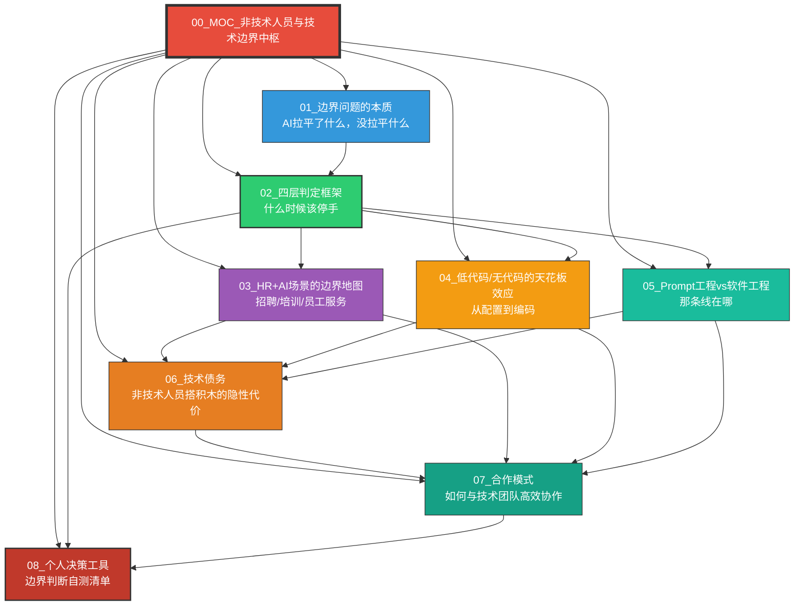
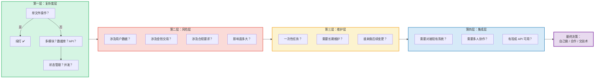
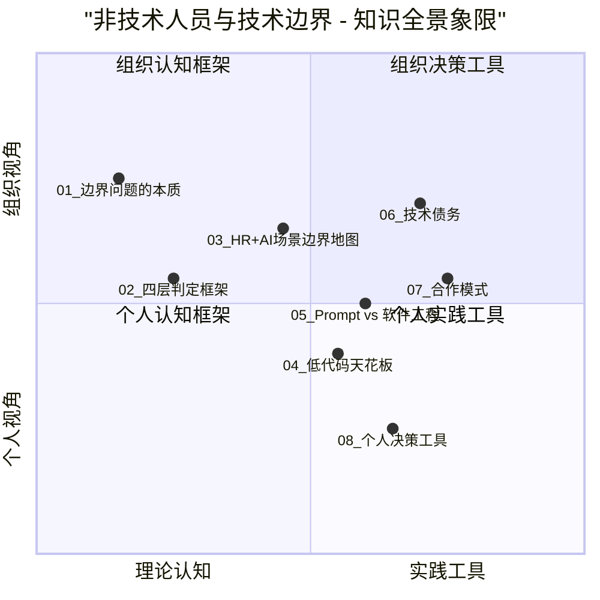
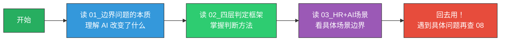
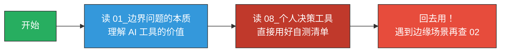
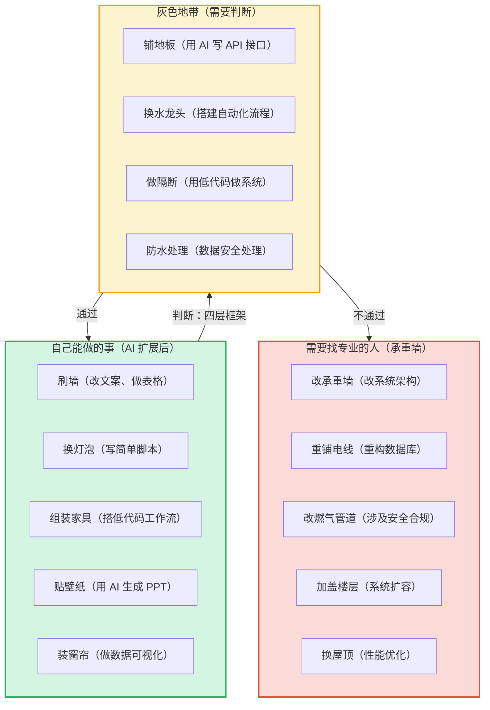
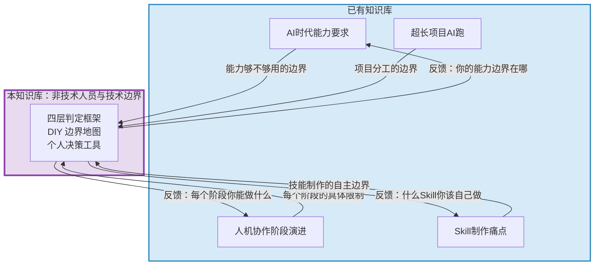

# 非技术人员与技术边界知识库 - MOC中枢

> [!note] 知识库定位
> 本知识库回答一个核心问题：**未来非技术人员（HR、业务人员、管理者）与技术人员的能力边界在哪里？**
>
> 核心隐喻：**装修房子**——你能自己刷墙、换灯泡、组装家具，但不会去改承重墙、重铺电线。AI 工具让"自己能做的事"变多了，但承重墙依然是承重墙。
>
> 差异化定位：已有知识库 [[02-AI趋势与素养/AI时代能力要求/00_MOC_AI时代能力要求中枢]] 讲的是"能力模型"，[[02-AI趋势与素养/人机协作阶段演进/00_MOC_人机协作阶段演进中枢]] 讲的是"协作阶段"，[[01-AI技术/Skill制作痛点/00_MOC_Skill制作痛点中枢]] 讲的是"技能制作"。**本知识库讲的是"DIY 边界"**——你作为一个 HR 或业务人员，用 AI 工具能走多远，什么程度该停手找技术。

---

## 一、知识库导航图

---

## 二、核心框架速览："四层判定框架"总览

本知识库的核心方法论是 **"四层判定框架"**，帮助非技术人员在遇到"我能不能自己做"的问题时，有一个系统性的判断工具。

> [!tip] 核心原则
> 每一层都有一条简单的判断线：**绿灯（放心做）、黄灯（可以做但需要检查清单）、红灯（绝对不要自己做）**。详细内容见 [[02-AI趋势与素养/非技术人员与技术边界/02_四层判定框架：什么时候该停手]]。

---

## 三、知识库全景象限

---

## 四、文档索引表

| 编号 | 文档名称 | 核心问题 | 类型 | 适合谁读 |
|------|----------|----------|------|----------|
| 01 | [[02-AI趋势与素养/非技术人员与技术边界/01_边界问题的本质：AI拉平了什么，没拉平什么]] | AI 到底改变了什么？ | 认知基础 | 所有人 |
| 02 | [[02-AI趋势与素养/非技术人员与技术边界/02_四层判定框架：什么时候该停手]] | 我怎么判断该不该自己做？ | 方法论 | 所有人 |
| 03 | [[02-AI趋势与素养/非技术人员与技术边界/03_HR+AI场景的边界地图]] | HR 具体场景里能做什么？ | 场景应用 | HR 从业者 |
| 04 | [[04_低代码/无代码的天花板效应]] | 低代码能走多远？ | 工具分析 | 业务人员 |
| 05 | [[02-AI趋势与素养/非技术人员与技术边界/05_Prompt工程vs软件工程：那条线在哪]] | Prompt 和代码的边界在哪？ | 概念辨析 | 进阶读者 |
| 06 | [[02-AI趋势与素养/非技术人员与技术边界/06_技术债务：非技术人员搭积木的隐性代价]] | 自己搭的东西会有什么后遗症？ | 风险警示 | 管理者 |
| 07 | [[02-AI趋势与素养/非技术人员与技术边界/07_合作模式：非技术人员如何与技术团队高效协作]] | 怎么跟技术团队配合？ | 协作指南 | 业务 + 技术 |
| 08 | [[02-AI趋势与素养/非技术人员与技术边界/08_个人决策工具：边界判断自测清单]] | 给我一个能直接用的工具 | 实操工具 | 所有人 |

---

## 五、三条阅读路径

### 路径一：HR 快速参考（约 45 分钟）

> [!note] 适合场景
> 你是一个 HR，今天就想知道"我能不能用 AI 自己做这个招聘数据分析工具"，读完这三篇就能做出判断。

---

### 路径二：技术管理者（约 60 分钟）

> [!note] 适合场景
> 你是一个技术管理者，团队里非技术人员总来问"这个能不能自己做"，或者自己做了之后出问题又来找你救火。读完这四篇，你能建立一套系统的边界判断规范。

---

### 路径三：个人效率提升（约 30 分钟）

> [!note] 适合场景
> 你想快速提升个人效率，不想花太多时间读理论。直接看边界本质 + 自测清单，遇到看不懂的再回头查。

---

## 六、核心隐喻：装修房子的智慧

> [!important] 这个隐喻贯穿整个知识库
> AI 工具大幅扩展了"自己能做的事"的范围（以前"换灯泡"需要找电工，现在 AI 帮你写代码），但**承重墙依然是承重墙**。关键不是"AI 能做什么"，而是"你做的这件事在系统里是什么角色"。

---

## 七、与已有知识库的关联

本知识库与以下已有知识库形成互补关系，不重复已有内容：

| 已有知识库 | 已有知识库讲什么 | 本知识库补充什么 | 关联方式 |
|-----------|---------------|---------------|---------|
| [[02-AI趋势与素养/AI时代能力要求/00_MOC_AI时代能力要求中枢]] | 能力模型重构（I 型→T 型→π 型→梳型）、硬技能软技能变化、AI 素养 | 这些能力**在什么场景下够用**、什么场景下**不够用** | 能力模型的"边界版本" |
| [[02-AI趋势与素养/人机协作阶段演进/00_MOC_人机协作阶段演进中枢]] | 从工具使用到人机共生的五个阶段 | 每个阶段**非技术人员具体能做什么**、**不能做什么** | 阶段理论的"实操版本" |
| [[01-AI技术/Skill制作痛点/00_MOC_Skill制作痛点中枢]] | Skill 的本质、设计哲学、Prompt 工程难点 | 什么样的 Skill 非技术人员**可以自己做**、什么样的**需要技术支持** | 技能制作的"边界版本" |
| [[01-AI技术/超长项目AI跑/超长项目AI跑_知识库建设方案]] | 超长项目的上下文管理、版本控制、人机协作节奏 | 超长项目中**哪些部分非技术人员可以独立完成** | 项目管理的"分工版本" |

---

## 八、关键概念词汇表

| 概念 | 定义 | 详细文档 |
|------|------|----------|
| **四层判定框架** | 复杂度→风险→维护→集成，四层递进判断"自己能不能做" | [[02-AI趋势与素养/非技术人员与技术边界/02_四层判定框架：什么时候该停手]] |
| **能力溢出** | AI 工具让非技术人员的能力"溢出"到了原本属于技术人员的领域 | [[02-AI趋势与素养/非技术人员与技术边界/01_边界问题的本质：AI拉平了什么，没拉平什么]] |
| **承重墙原则** | 任何系统都有不可轻易触碰的核心结构，AI 工具不改变这个事实 | 全库贯穿 |
| **低代码天花板** | 低代码/无代码工具在数据量、复杂逻辑、自定义 UI、性能四个维度的上限 | [[04_低代码/无代码的天花板效应]] |
| **Prompt 工程 vs 软件工程** | 用 Prompt 解决问题和用代码解决问题的根本区别 | [[02-AI趋势与素养/非技术人员与技术边界/05_Prompt工程vs软件工程：那条线在哪]] |
| **技术债务** | 非技术人员快速搭建的系统在后期产生的隐性维护成本 | [[02-AI趋势与素养/非技术人员与技术边界/06_技术债务：非技术人员搭积木的隐性代价]] |
| **原型协作模式** | 业务人员用 AI 做可交互原型，技术人员在此基础上工程化 | [[02-AI趋势与素养/非技术人员与技术边界/07_合作模式：非技术人员如何与技术团队高效协作]] |
| **边界自测清单** | 将全部方法论浓缩为可操作检查清单 | [[02-AI趋势与素养/非技术人员与技术边界/08_个人决策工具：边界判断自测清单]] |

---

## 九、使用建议

### 如果你是第一次来

1. 先花 5 分钟浏览这个 MOC 中枢，了解知识库的整体结构
2. 根据你的角色选择一条阅读路径（见第五部分）
3. 读完后，把 [[02-AI趋势与素养/非技术人员与技术边界/08_个人决策工具：边界判断自测清单]] 加入收藏，遇到实际问题时随时查阅

### 如果你已经读过一遍

- 遇到具体场景判断时，直接跳到 [[02-AI趋势与素养/非技术人员与技术边界/08_个人决策工具：边界判断自测清单]]
- 需要深入理解某个概念时，查阅第八部分的概念词汇表指向的具体文档
- 如果你是技术管理者，建议把 [[02-AI趋势与素养/非技术人员与技术边界/02_四层判定框架：什么时候该停手]] 和 [[02-AI趋势与素养/非技术人员与技术边界/07_合作模式：非技术人员如何与技术团队高效协作]] 作为团队分享材料

### 如果你来自其他知识库

- 从 [[02-AI趋势与素养/AI时代能力要求/00_MOC_AI时代能力要求中枢]] 来的：重点读 [[02-AI趋势与素养/非技术人员与技术边界/01_边界问题的本质：AI拉平了什么，没拉平什么]] 和 [[02-AI趋势与素养/非技术人员与技术边界/03_HR+AI场景的边界地图]]
- 从 [[02-AI趋势与素养/人机协作阶段演进/00_MOC_人机协作阶段演进中枢]] 来的：重点读 [[02-AI趋势与素养/非技术人员与技术边界/02_四层判定框架：什么时候该停手]] 和 [[02-AI趋势与素养/非技术人员与技术边界/07_合作模式：非技术人员如何与技术团队高效协作]]
- 从 [[01-AI技术/Skill制作痛点/00_MOC_Skill制作痛点中枢]] 来的：重点读 [[04_低代码/无代码的天花板效应]] 和 [[02-AI趋势与素养/非技术人员与技术边界/05_Prompt工程vs软件工程：那条线在哪]]

---

## 十、知识库构建原则

> [!important] 本知识库的"不重复"原则
> 1. 不讲"能力模型"——那是 [[02-AI趋势与素养/AI时代能力要求/00_MOC_AI时代能力要求中枢]] 的事
> 2. 不讲"协作阶段"——那是 [[02-AI趋势与素养/人机协作阶段演进/00_MOC_人机协作阶段演进中枢]] 的事
> 3. 不讲"如何做 Skill"——那是 [[01-AI技术/Skill制作痛点/00_MOC_Skill制作痛点中枢]] 的事
> 4. **只讲一件事：边界。DIY 的边界。自己能走多远，什么时候该停手。**

> [!tip] 更新策略
> 本知识库将随着 AI 工具能力的提升而持续更新。每当出现新的 AI 工具（如更强的代码生成、更智能的低代码平台），新增的"自己能做的事"和仍然存在的"承重墙"都会被记录和更新。

---

## 快速导航

- 想理解 AI 到底改变了什么？ -> [[02-AI趋势与素养/非技术人员与技术边界/01_边界问题的本质：AI拉平了什么，没拉平什么]]
- 想知道怎么判断该不该自己做？ -> [[02-AI趋势与素养/非技术人员与技术边界/02_四层判定框架：什么时候该停手]]
- 想看 HR 具体场景？ -> [[02-AI趋势与素养/非技术人员与技术边界/03_HR+AI场景的边界地图]]
- 想知道低代码能走多远？ -> [[04_低代码/无代码的天花板效应]]
- 想理解 Prompt 和代码的边界？ -> [[02-AI趋势与素养/非技术人员与技术边界/05_Prompt工程vs软件工程：那条线在哪]]
- 想了解自己搭积木的代价？ -> [[02-AI趋势与素养/非技术人员与技术边界/06_技术债务：非技术人员搭积木的隐性代价]]
- 想学怎么跟技术团队协作？ -> [[02-AI趋势与素养/非技术人员与技术边界/07_合作模式：非技术人员如何与技术团队高效协作]]
- 想要一个直接能用的工具？ -> [[02-AI趋势与素养/非技术人员与技术边界/08_个人决策工具：边界判断自测清单]]