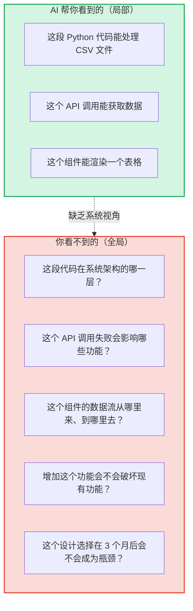
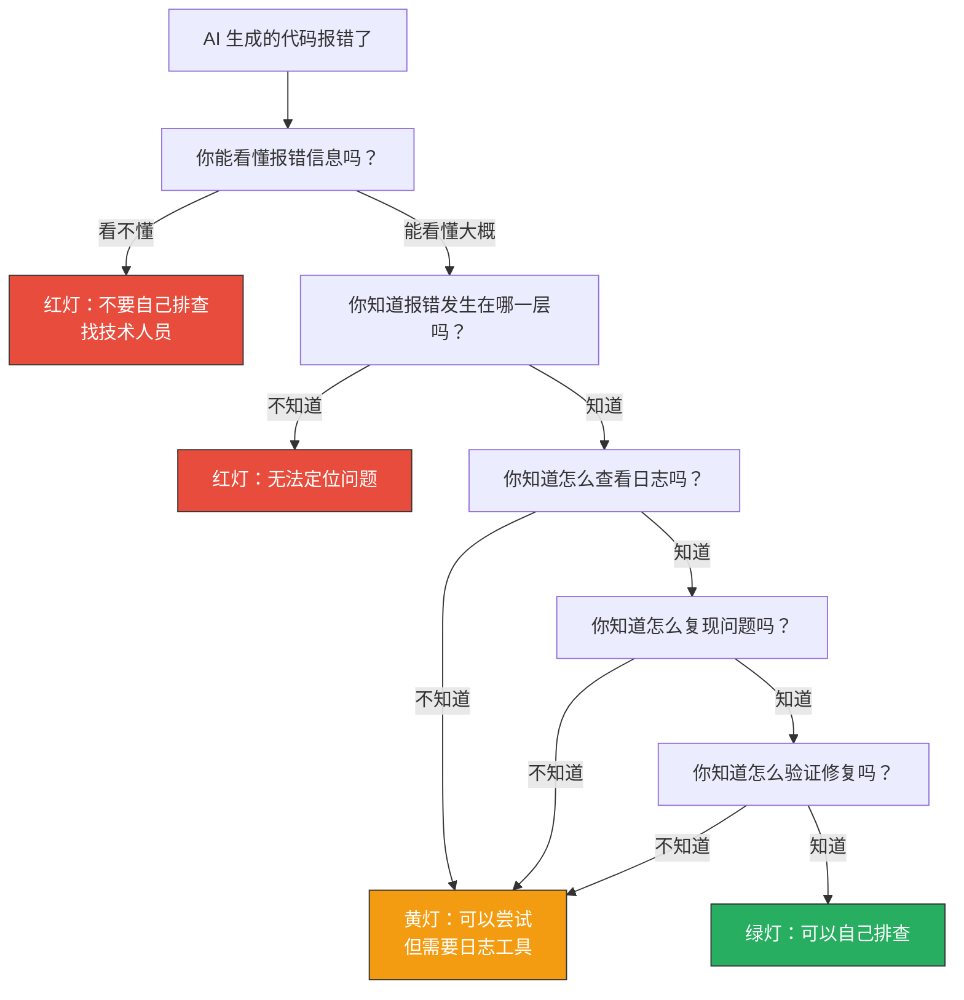
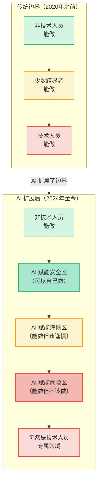
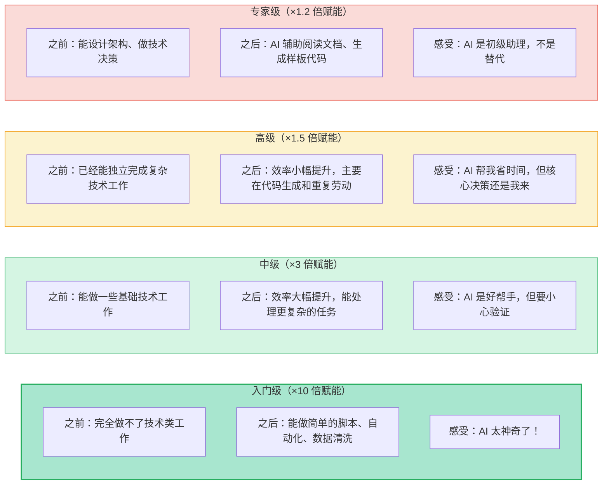

# 边界问题的本质：AI拉平了什么，没拉平什么

> [!note] 本文定位
> 本文是整个知识库的认知基础。在讨论"什么该自己做、什么该找技术"之前，必须先理解一个根本问题：**AI 到底改变了什么，又没改变什么？** 本文是理解 [[02-AI趋势与素养/非技术人员与技术边界/00_MOC_非技术人员与技术边界中枢]] 中所有后续内容的前提。

---

## 一、AI 拉平了什么：非技术人员的能力溢出

### 1.1 传统的能力边界

在 AI 工具（尤其是大语言模型 + 代码生成）普及之前，非技术人员（HR、运营、市场、产品经理）的能力边界非常清晰：

在传统模式下，灰色地带很小，只有少数"跨界人才"（比如学过 SQL 的运营、会用 Python 的分析师）能够跨越。

### 1.2 AI 扩展后的能力边界

AI 工具（Cursor、Claude、ChatGPT、扣子、Dify 等）大幅扩展了非技术人员的能力范围：

```mermaid
graph LR
    subgraph 非技术人员领域["非技术人员领域（收缩）"]
        NT1x["纯文档撰写"]
        NT2x["基础沟通"]
    end

    subgraph AI扩展区["AI 赋能扩展区（新增）"]
        EX1["数据清洗与处理"]
        EX2["自动化脚本编写"]
        EX3["简单 Web 应用搭建"]
        EX4["API 调用与集成"]
        EX5["数据可视化"]
        EX6["低代码工作流搭建"]
        EX7["Prompt 驱动的文本分析"]
        EX8["简易爬虫与数据采集"]
    end

    subgraph 仍属于技术人员["仍是技术人员领域（未变）"]
        TT1x["系统架构设计"]
        TT2x["数据库设计与优化"]
        TT3x["安全合规"]
        TT4x["性能调优"]
        TT5x["复杂业务逻辑"]
        TT6x["技术债务管理"]
        TT7x["故障排查"]
    end

    非技术人员领域 --> AI扩展区
    AI扩展区 -.->|"有些事能做但该谨慎"| 仍属于技术人员

    style 非技术人员领域 fill:#d5f5e3,stroke:#27ae60,stroke-width:2px
    style AI扩展区 fill:#fcf3cf,stroke:#f39c12,stroke-width:3px
    style 仍属于技术人员 fill:#fadbd8,stroke:#e74c3c,stroke-width:2px
```

> [!important] 关键观察
> AI 扩展区（黄色区域）是**最危险也最值得关注**的区域。这里的事情非技术人员"能做"，但"做得好不好"、"会不会出问题"是未知的。这个区域就是本知识库重点讨论的"DIY 边界"。

---

## 二、AI 没拉平的三个东西

AI 让非技术人员能做更多事，但以下三个核心能力鸿沟**没有被 AI 拉平**：

### 2.1 系统架构理解

**知道"这一段代码"怎么写，但不知道这段代码在整体系统中处于什么位置。**

> [!warning] 真实案例
> 某 HR 用 AI 写了一个自动发送面试邀请的脚本，功能正常。但三个月后，系统升级了邮件服务，所有 API 地址都变了。这位 HR 不知道脚本依赖了邮件服务、不知道邮件服务换了地址、不知道去哪里修改。最终这个脚本变成了"幽灵代码"——没人知道它还在运行，直到某天它发不出邮件了才被发现。

**类比：你学会了怎么换一个灯泡，但不知道家里的电路是怎么走的。换个灯泡没问题，但如果要加一个插座，你就不知道从哪里接电。**

### 2.2 工程化思维

**能做出来，但做出来的东西能不能维护、能不能扩展、能不能承受压力？**

工程化思维与非工程化思维的区别：

| 维度 | 非工程化思维（"能做出来"） | 工程化思维（"能做得好"） |
|------|--------------------------|------------------------|
| **代码组织** | 一个文件写完所有逻辑 | 模块化、分层、遵循设计模式 |
| **错误处理** | 假设一切正常，不处理异常 | 每个可能出错的地方都有处理逻辑 |
| **测试** | 手动跑一下，能用就行 | 单元测试、集成测试、边界测试 |
| **文档** | 没有或只有口头解释 | 接口文档、部署文档、变更记录 |
| **可扩展性** | 加新功能需要改大量代码 | 预留扩展点，新功能只需加插件 |
| **性能考量** | 100 条数据跑得动就行 | 考虑 10 万条数据、1000 并发用户 |
| **部署与运维** | 在自己电脑上能跑就行 | 容器化、CI/CD、监控告警 |

> [!danger] 真实案例
> 某业务团队用 AI 做了一个内部数据看板，SQLite 数据库 + 单文件 Python 脚本。上线前两周一切正常。第三周，数据量从 500 条增长到 50000 条，页面加载从 1 秒变成了 30 秒。没有人知道为什么慢、没有人知道怎么优化。最终技术团队花了两周重写。

**类比：你能用木板和钉子搭一个狗窝，但你不能用同样的方法盖一栋楼。材料和手艺看起来一样，但工程思维完全不同。**

### 2.3 故障排查能力

**AI 生成的代码出错了，非技术人员不知道从哪里开始排查。**

> [!warning] 故障排查的三座大山
> 1. **日志解读**：AI 生成的代码可能使用了你不熟悉的库，报错信息是英文 + 技术术语，你甚至不知道从哪里搜索
> 2. **环境差异**：在你电脑上能跑，但部署到服务器上就报错。你缺乏排查环境差异（Python 版本、依赖冲突、权限问题）的能力
> 3. **连锁反应**：一个地方的修改可能导致另一个地方崩溃。你缺乏全局视角，不知道修改的影响范围

**类比：你的车在高速上抛锚了。你能加玻璃水、换雨刮器，但引擎灯亮了，你只能叫拖车。**

---

## 三、能力溢出图：传统边界 vs AI 扩展后的边界

### 四个区域的定义

| 区域 | 定义 | 示例 | 建议 |
|------|------|------|------|
| **AI 赋能安全区** | 做的事情本身就是"内容型"或"分析型"的，不涉及系统运行 | 用 AI 写培训材料、分析简历、生成报告 | 放心做，这是 AI 的强项 |
| **AI 赋能谨慎区** | 做的事情涉及"系统操作"，但复杂度在可控范围内 | 用 AI 写自动化脚本、搭低代码工作流 | 可以做，但需要检查清单（见 [[02-AI趋势与素养/非技术人员与技术边界/02_四层判定框架：什么时候该停手]]） |
| **AI 赋能危险区** | 做的事情涉及系统核心，但 AI 让你觉得"我也能做" | 用 AI 写数据库操作代码、API 接口、用户认证 | 强烈建议不要自己做，找技术团队 |
| **技术人员专属** | 事情的本质决定了必须由技术人员来做 | 系统架构设计、安全审计、性能调优 | 不该自己做，也做不了 |

---

## 四、赋能倍率：AI 对不同技能层级的差异化影响

AI 工具对不同技能层级的人，赋能效果完全不同：

> [!important] 核心洞察：赋能倍率递减效应
> AI 对**技能水平越低的人，赋能倍率越高**。这意味着：
> - 入门级的人感受到的"AI 力量"最大，也因此最容易**高估自己的能力边界**
> - 高级和专家级的人感受到的"AI 力量"相对较小，但他们对**边界有更清晰的认知**
> - 赋能倍率最高的群体，恰恰是**最需要边界判断能力**的群体

---

## 五、赋能倍率对比表

| 技能层级 | 典型角色 | 之前能做 | 现在能做 | 赋能倍率 | 最大风险 |
|----------|----------|----------|----------|----------|----------|
| 入门级 | 纯业务 HR、行政 | 只能做 Excel 基础操作 | 写简单脚本、数据清洗、自动化 | ×10 | 分不清"能做"和"该做" |
| 初级 | 数据分析师、运营 | 会用 Excel 高级功能、SQL | 写 Python 脚本、搭工作流 | ×5 | 代码质量差、安全隐患 |
| 中级 | 技术产品经理、BI 分析师 | 能写 SQL、了解 API | 独立开发小工具、做数据管道 | ×3 | 维护性差、技术债务 |
| 高级 | 技术负责人、架构师 | 能独立开发系统 | 效率提升、代码生成 | ×1.5 | 过度依赖 AI 生成代码 |
| 专家级 | 首席架构师、技术 VP | 能设计架构、做技术决策 | AI 辅助研究、文档 | ×1.2 | 几乎无风险 |

> [!tip] 关键认知
> 如果你是一个入门级的 HR，用 AI 写了一个脚本，你的感受是"哇，我居然能做程序员做的事了"。但你的实际能力水平，可能仍然在"初级"以下。**赋能倍率不等于能力倍率。**

---

## 六、为什么"能做"不等于"该做"：三个深层原因

### 原因一：AI 给你的是"局部最优解"，不是"全局最优解"

当你问 AI "怎么写一个自动发送邮件的脚本"，AI 会给你一个能用的方案。但 AI 不知道：
- 你的公司已经有邮件服务了，你应该用那个服务而不是自己写 SMTP
- 你的邮件需要经过审批流程，不能直接发送
- 你的邮件需要记录到 CRM 系统，不是发出去就完事了

**AI 只解决你问的问题，不解决你没问的问题。**

### 原因二：AI 生成的是"一次性产物"，不是"可维护资产"

AI 生成的代码通常可以工作，但：
- 没有注释
- 没有测试
- 没有错误处理
- 没有考虑扩展性
- 没有考虑与现有系统的兼容性

这在软件开发中被称为"原型代码"——可以用来验证想法，但不能直接用于生产。

### 原因三：AI 不会为后果负责

你写的代码出了问题，客户数据泄露了，系统崩溃了，业务中断了——AI 不会为此负责。**你做的东西，你负责。**

---

## 七、与已有知识库的关联

- 本文讨论的"能力溢出"与 [[02-AI趋势与素养/AI时代能力要求/00_MOC_AI时代能力要求中枢]] 中的"能力模型重构"互补：能力模型告诉你要发展什么能力，本文告诉你这些能力**在什么场景下够用**
- 本文讨论的"AI 赋能倍率"与 [[02-AI趋势与素养/人机协作阶段演进/00_MOC_人机协作阶段演进中枢]] 中的"阶段一：工具使用"对应：在工具使用阶段，AI 对入门级用户的赋能倍率最高
- 关于"工程化思维"的缺失，可以参考 [[01-AI技术/Skill制作痛点/00_MOC_Skill制作痛点中枢]] 中关于 Skill 测试与质量保障的讨论

---

## 八、总结

> [!important] 三句话记住本文
> 1. **AI 拉平了"入门门槛"**：以前需要学半年才能做的事，现在用 AI 5 分钟就能做
> 2. **AI 没拉平"系统思维"**：知道怎么写代码，不等于知道这些代码在系统中扮演什么角色
> 3. **赋能倍率不等于能力倍率**：AI 让你感觉你会了很多，但你的实际技术能力并没有提升那么多

**下一步**：了解了"AI 没拉平什么"之后，你应该去读 [[02-AI趋势与素养/非技术人员与技术边界/02_四层判定框架：什么时候该停手]]，学习如何系统性地判断"这件事我该不该自己做"。

---

**关联文档**：
- [[02-AI趋势与素养/非技术人员与技术边界/00_MOC_非技术人员与技术边界中枢]] - 返回中枢
- [[02-AI趋势与素养/非技术人员与技术边界/02_四层判定框架：什么时候该停手]] - 下一步：学会判断
- [[02-AI趋势与素养/非技术人员与技术边界/03_HR+AI场景的边界地图]] - 看 HR 具体场景
- [[02-AI趋势与素养/非技术人员与技术边界/05_Prompt工程vs软件工程：那条线在哪]] - 深入理解 Prompt 的边界