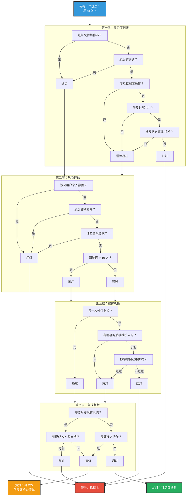
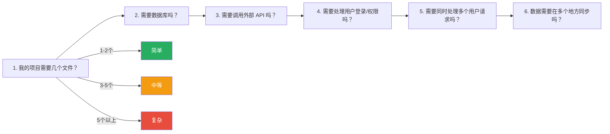
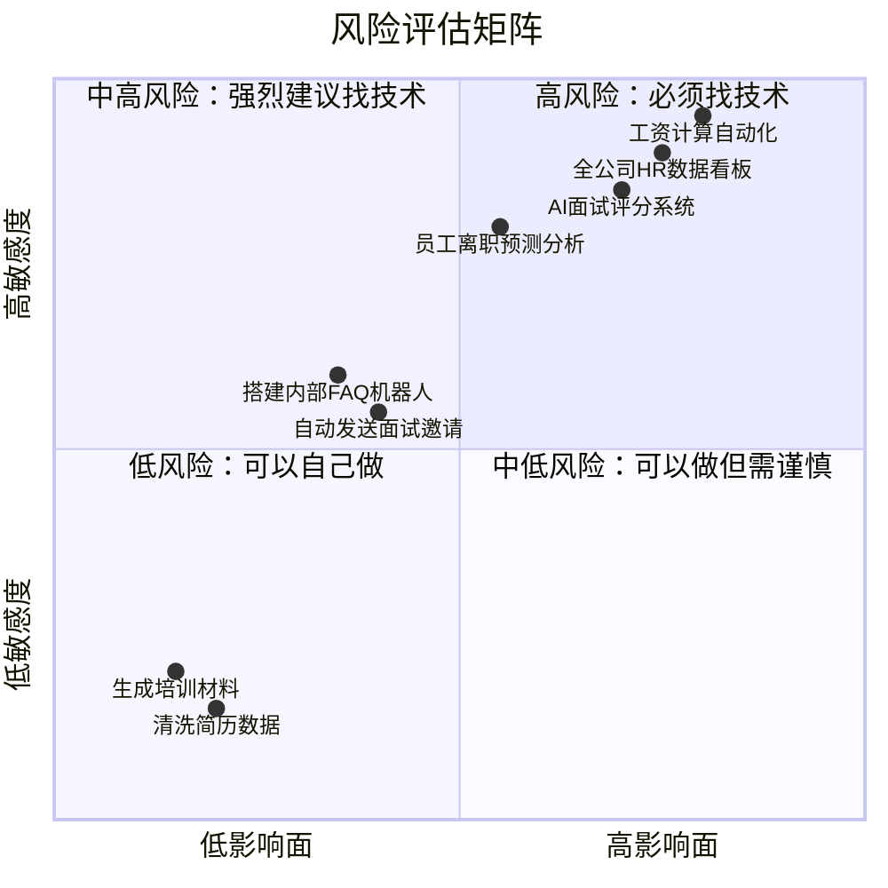
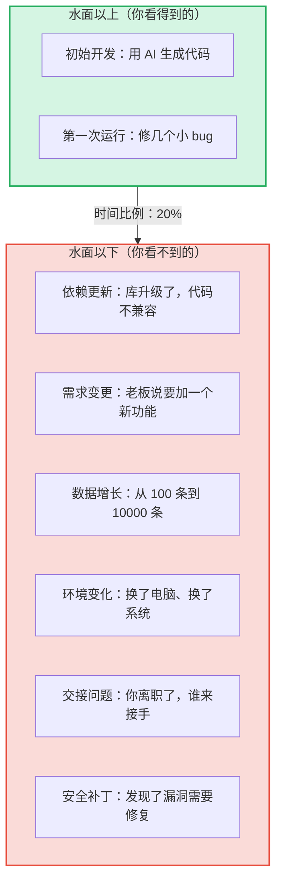
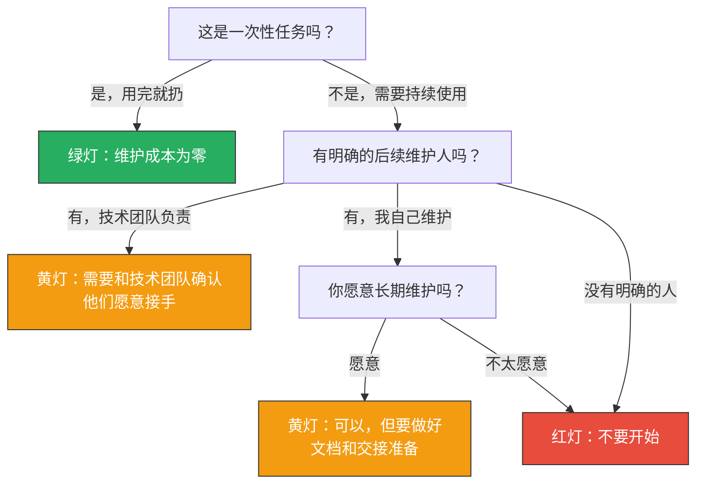
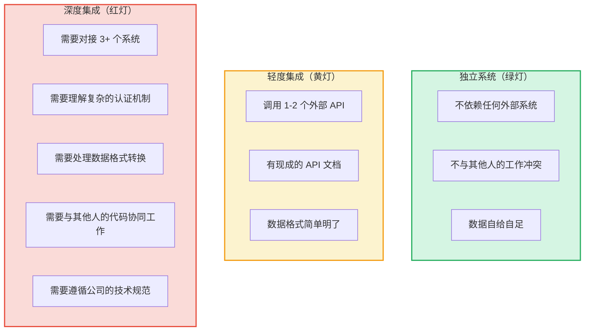
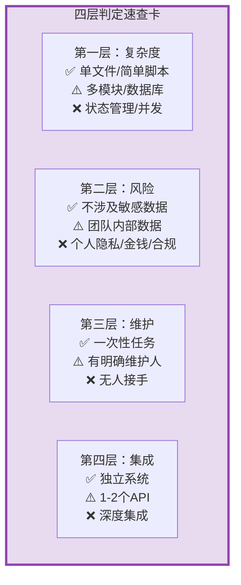

# 四层判定框架：什么时候该停手

> [!note] 本文定位
> 本文提供知识库的核心方法论——**四层判定框架**。当你面对一个"我能不能用 AI 自己做"的问题时，用这个框架逐层判断。读完本文后，你可以直接用 [[02-AI趋势与素养/非技术人员与技术边界/08_个人决策工具：边界判断自测清单]] 做实战演练。
>
> 前置阅读：[[02-AI趋势与素养/非技术人员与技术边界/01_边界问题的本质：AI拉平了什么，没拉平什么]]

---

## 一、框架总览：四层递进决策

---

## 二、第一层：复杂度判断

### 2.1 判断标准

| 复杂度等级 | 判断标准 | 信号灯 | 典型场景 |
|-----------|---------|--------|----------|
| **简单** | 单文件操作，纯文本/数据处理 | 绿灯 | 用 AI 写一份分析报告、清洗 Excel 数据 |
| **中等** | 多文件但无数据库、无外部 API | 绿灯偏黄 | 用 AI 写一个本地数据处理脚本 |
| **较复杂** | 涉及数据库操作或外部 API 调用 | 黄灯 | 用 AI 写一个从 API 拉数据存到数据库的脚本 |
| **复杂** | 涉及状态管理、并发处理、多系统交互 | 红灯 | 用 AI 写一个多用户实时协作系统 |

### 2.2 复杂度自测问题

> [!tip] 复杂度判断的核心原则
> **如果你描述你的项目时，需要用"然后"、"同时"、"并且"超过 3 次，那它很可能已经超出了你该自己做的范围。**

### 2.3 绿灯场景（可以放心做）

- 用 AI 写一个 Python 脚本，读取一个 CSV 文件，生成一个统计报告
- 用 AI 写一个 HTML 页面，展示一些静态数据
- 用 AI 生成一批培训材料的文案
- 用 AI 写一个简单的数据清洗脚本（去重、格式化、合并）

### 2.4 黄灯场景（可以做但需要检查清单）

- 用 AI 写一个从飞书 API 拉数据并存到 SQLite 的脚本
- 用 AI 搭一个低代码工作流（飞书多维表格 + 自动化）
- 用 AI 写一个带简单用户输入的表单页面
- 用 AI 做一个定时运行的自动化任务

### 2.5 红灯场景（绝对不要自己做）

- 用 AI 设计一个需要同时处理 100 个用户请求的系统
- 用 AI 搭建一个涉及支付、交易的核心业务流程
- 用 AI 做一个需要 7x24 小时稳定运行的服务
- 用 AI 开发一个需要对接公司内部 5 个以上系统的工具

---

## 三、第二层：风险评估

> [!danger] 第二层是最重要的"停手层"
> 如果第一层通过了，第二层是**最关键的决策点**。技术复杂度可以慢慢学，但风险一旦触发，后果不可逆。

### 3.1 风险评估矩阵

### 3.2 四个风险维度

| 风险维度 | 红灯条件 | 为什么不能自己做 | 如果出问题的后果 |
|----------|----------|-----------------|-----------------|
| **用户数据** | 涉及员工个人信息（手机号、身份证、薪资、绩效） | 数据泄露的法律责任，GDPR/个人信息保护法 | 公司被罚款、个人被追责、客户信任崩塌 |
| **金钱交易** | 涉及工资计算、报销、采购、付款 | 金额错误不可逆，审计追溯困难 | 员工不满、财务混乱、审计风险 |
| **合规要求** | 涉及劳动法、招聘公平性、数据出境 | 不懂法规，AI 也不懂，做出来的东西可能违法 | 法律诉讼、行政处罚、品牌声誉受损 |
| **影响面** | 影响超过 10 个人或 1 个部门的日常工作 | 出了问题影响面大，回滚困难 | 业务中断、多人工作受影响 |

### 3.3 绿灯场景（风险可控）

- 个人使用的数据分析工具，不涉及他人数据
- 内容生成类任务（文案、报告、PPT）
- 自己使用的效率工具
- 仅供内部参考的探索性分析

### 3.4 黄灯场景（需要额外注意）

- 涉及团队内部数据，但仅限于非敏感信息（如项目名称、任务状态）
- 自动发送通知/提醒，但发送对象可控
- 简单的审批流程自动化

### 3.5 红灯场景（绝对不能自己做）

- 任何涉及员工个人隐私数据（薪资、绩效、身份证号、手机号）
- 任何涉及金钱的操作（工资计算、报销审批）
- 任何涉及招聘决策（AI 面试评分、自动筛选淘汰）
- 任何涉及合规的系统（劳动法、数据保护法）

---

## 四、第三层：维护判断

### 4.1 维护成本的冰山模型

> [!important] 软件工程的铁律
> **软件的维护成本通常是初始开发成本的 3-5 倍。** 你用 AI 花 2 小时做了一个东西，未来可能需要 6-10 小时来维护它。如果你没有计划好这 6-10 小时谁来做，就不要开始那 2 小时。

### 4.2 维护判断决策树

### 4.3 维护判断的五个灵魂拷问

1. **三个月后，你还能找到这份代码吗？**（存储在哪里？有文档吗？）
2. **三个月后，你还记得怎么改吗？**（有注释吗？逻辑清晰吗？）
3. **如果换了一个人，他能看懂吗？**（有交接文档吗？）
4. **如果依赖的 API 变了，你知道怎么改吗？**（有监控吗？）
5. **如果数据量从 100 变成 10000，还跑得动吗？**（有性能测试吗？）

---

## 五、第四层：集成判断

### 5.1 集成复杂度评估

### 5.2 集成判断的核心问题

| 判断维度 | 绿灯 | 黄灯 | 红灯 |
|----------|------|------|------|
| 系统依赖 | 0 个外部系统 | 1-2 个外部 API | 3 个以上系统 |
| API 文档 | 不需要 API | 有完整文档 | 没有文档或文档过时 |
| 认证机制 | 不需要认证 | 简单的 API Key | OAuth 2.0、SSO、复杂的权限控制 |
| 数据格式 | 自己定义 | JSON / CSV | 复杂的 XML、二进制、自定义协议 |
| 协作要求 | 自己一个人用 | 小团队内部使用 | 跨部门、跨团队协作 |
| 技术规范 | 不需要遵循 | 简单的代码规范 | 公司有严格的技术标准和代码审查 |

---

## 六、完整决策演练：三个案例

### 案例一：自动生成绩效报告

| 层级 | 判断 | 结果 |
|------|------|------|
| 复杂度 | 单文件 Python 脚本，读取 Excel，生成 PDF | 绿灯 |
| 风险 | 涉及绩效数据（敏感！），影响面：整个部门 | **红灯** |
| 维护 | 每月一次，需要持续使用 | 黄灯 |
| 集成 | 不需要对接外部系统 | 绿灯 |
| **最终决策** | **风险层红灯，不能自己做。找技术团队做，确保数据安全** | |

> [!warning] 关键教训
> 这个案例看似简单（一个脚本），但因为涉及绩效数据（敏感数据），风险层直接红灯。**不要被复杂度迷惑，风险层才是最重要的决策层。**

### 案例二：搭建面试官预约系统

| 层级 | 判断 | 结果 |
|------|------|------|
| 复杂度 | 需要数据库（存储面试官和时段）、需要前端页面、需要通知功能 | 黄灯 |
| 风险 | 涉及面试官日程（非敏感信息），影响面：招聘团队 | 黄灯 |
| 维护 | 需要持续使用，你愿意维护 | 黄灯 |
| 集成 | 需要对接飞书日历、飞书消息 | 黄灯 |
| **最终决策** | **全黄灯，可以做但需要谨慎。建议：先用低代码工具搭原型，验证可行性后再找技术团队工程化** | |

### 案例三：分析员工离职预测

| 层级 | 判断 | 结果 |
|------|------|------|
| 复杂度 | 需要数据分析、机器学习模型 | 黄灯 |
| 风险 | 涉及员工绩效、薪酬、个人信息（敏感数据！），影响面：管理决策 | **红灯** |
| 维护 | 需要持续更新模型和数据 | 黄灯 |
| 集成 | 需要对接 HR 系统获取数据 | 红灯 |
| **最终决策** | **红灯。涉及敏感数据和管理决策，且需要对接 HR 系统。必须由技术团队主导，HR 提供业务逻辑** | |

---

## 七、四层框架的速查卡片

> [!tip] 使用建议
> 打印这张速查卡，贴在你的工位上。每次想做新东西之前，花 2 分钟走一遍四层框架。

---

## 八、与已有知识库的关联

- 四层框架中的"风险层"与 [[02-AI趋势与素养/AI时代能力要求/00_MOC_AI时代能力要求中枢]] 中的"AI 素养"部分互补：AI 素养教你如何安全使用 AI 工具，四层框架教你如何判断风险
- 四层框架中的"维护层"与 [[01-AI技术/Skill制作痛点/00_MOC_Skill制作痛点中枢]] 中的"Skill 的迭代与维护"对应：技术债务是 Skill 维护中最常见的痛点
- 四层框架中的"集成层"与 [[02-AI趋势与素养/人机协作阶段演进/00_MOC_人机协作阶段演进中枢]] 中的"阶段三：协作共创"对应：当系统需要深度集成时，就到了协作共创的阶段

---

**关联文档**：
- [[02-AI趋势与素养/非技术人员与技术边界/00_MOC_非技术人员与技术边界中枢]] - 返回中枢
- [[02-AI趋势与素养/非技术人员与技术边界/01_边界问题的本质：AI拉平了什么，没拉平什么]] - 前置阅读
- [[02-AI趋势与素养/非技术人员与技术边界/03_HR+AI场景的边界地图]] - 看 HR 具体场景的边界
- [[02-AI趋势与素养/非技术人员与技术边界/08_个人决策工具：边界判断自测清单]] - 用框架做实战演练