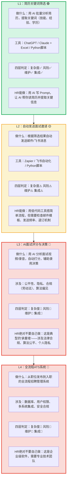
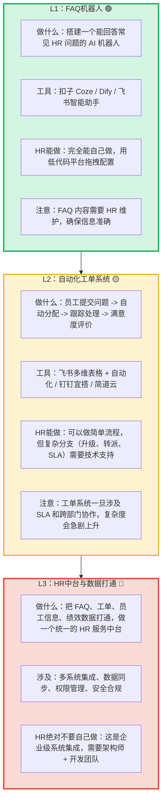
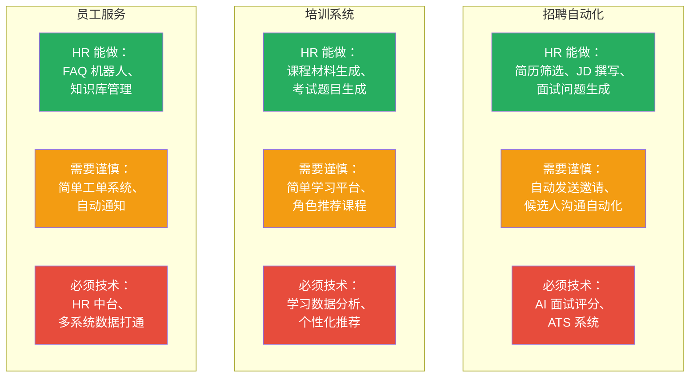

# HR+AI场景的边界地图

> [!note] 本文定位
> 本文聚焦 HR 三个核心场景——招聘自动化、培训系统、员工服务——用 [[02-AI趋势与素养/非技术人员与技术边界/02_四层判定框架：什么时候该停手]] 逐一分析"HR 自己能做什么"和"什么程度需要技术"。如果你是一个 HR 从业者，本文是你的首选参考。
>
> 前置阅读：[[02-AI趋势与素养/非技术人员与技术边界/01_边界问题的本质：AI拉平了什么，没拉平什么]]、[[02-AI趋势与素养/非技术人员与技术边界/02_四层判定框架：什么时候该停手]]

---

## 一、场景总览：HR 三场景的能力阶梯

```mermaid
graph TD
    subgraph 招聘自动化["招聘自动化"]
        R1["L1：简历关键词筛选<br/>🟢 绿灯"]
        R2["L2：自动发送面试邀请<br/>🟡 黄灯"]
        R3["L3：AI面试评分与决策<br/>🔴 红灯"]
        R4["L4：全流程ATS系统<br/>🔴 红灯"]
        R1 --> R2 --> R3 --> R4
    end

    subgraph 培训系统["培训系统"]
        T1["L1：AI生成培训材料<br/>🟢 绿灯"]
        T2["L2：搭建学习平台<br/>🟡 黄灯"]
        T3["L3：AI个性化学习路径<br/>🟡 黄灯"]
        T4["L4：学习数据分析与预测<br/>🔴 红灯"]
        T1 --> T2 --> T3 --> T4
    end

    subgraph 员工服务["员工服务"]
        S1["L1：FAQ机器人<br/>🟢 绿灯"]
        S2["L2：自动化工单系统<br/>🟡 黄灯"]
        S3["L3：HR中台与数据打通<br/>🔴 红灯"]
        S1 --> S2 --> S3
    end

    style R1 fill:#27ae60,color:#fff
    style R2 fill:#f39c12,color:#fff
    style R3 fill:#e74c3c,color:#fff
    style R4 fill:#e74c3c,color:#fff
    style T1 fill:#27ae60,color:#fff
    style T2 fill:#f39c12,color:#fff
    style T3 fill:#f39c12,color:#fff
    style T4 fill:#e74c3c,color:#fff
    style S1 fill:#27ae60,color:#fff
    style S2 fill:#f39c12,color:#fff
    style S3 fill:#e74c3c,color:#fff
```



---

## 二、场景一：招聘自动化

### 2.1 能力阶梯详解



### 2.2 真实案例

> [!success] 成功案例：HR 用 AI 做简历初筛
> 某公司 HR 团队用 Claude + Excel 做了一个简历初筛工具。流程：把所有简历 PDF 转成文本 -> 用 AI 批量提取"工作经验年限、核心技能、学历"三个字段 -> 在 Excel 中做筛选。这个工具每周帮 HR 节省约 4 小时。**为什么成功？** 因为它只做"信息提取"，不做"决策"——筛选的最终判断还是 HR 自己做。

> [!danger] 失败案例：HR 用 AI 搭了个"自动面试评分系统"
> 某 HR 用 AI 工具写了一个脚本，分析候选人的面试录音，自动打分。上线一个半月后，一位候选人投诉评分不公，HR 团队无法解释 AI 的评分依据。法务介入后发现，AI 评分模型对某些口音、语速有系统性偏差，违反了招聘公平性原则。最终该系统被紧急下线，HR 团队被问责。**为什么失败？** 涉及决策、涉及公平性、涉及合规——典型的"承重墙"。

### 2.3 招聘自动化边界速查表

| 场景 | 信号灯 | HR 能做什么 | 需要技术介入 | 关键风险 |
|------|--------|------------|-------------|---------|
| 简历关键词提取 | 绿灯 | 用 AI 批量提取，Excel 筛选 | 不需要 | 低 |
| 简历自动打分/排序 | 黄灯 | 用 AI 做初步排序 | 需要技术审核算法公平性 | 公平性偏差 |
| 自动发送面试邀请 | 黄灯 | 用低代码搭简单流程 | 需要技术处理异常情况（退信、重复发送） | 候选人体验 |
| AI 面试评估 | 红灯 | 不建议自己做 | 必须技术 + 法务 + HR 联合设计 | 法律合规、算法公平 |
| 全流程 ATS | 红灯 | 只能提需求 | 必须专业团队开发或采购成熟产品 | 数据安全、系统稳定性 |

---

## 三、场景二：培训系统

### 3.1 能力阶梯详解

```mermaid
flowchart TD
    subgraph L1T["L1：AI生成培训材料 🟢"]
        T1_A["做什么：用 AI 生成课程大纲、PPT、练习题、案例"]
        T1_B["工具：ChatGPT / Claude / Gamma"]
        T1_C["HR能做：完全能自己做，AI 是内容生成的强项"]
        T1_D["注意：AI 生成的内容需要 HR 审核，确保专业准确性"]
    end

    subgraph L2T["L2：搭建学习平台 🟡"]
        T2_A["做什么：用低代码搭一个带课程列表、学习进度、测验功能的平台"]
        T2_B["工具：飞书多维表格 + 自动化 / Notion / Airtable"]
        T2_C["HR能做：可以做简单版本，但用户多了、功能多了会撞天花板"]
        T2_D["注意：50人以下可以用低代码，100人以上建议找技术"]
    end

    subgraph L3T["L3：AI个性化学习路径 🟡"]
        T3_A["做什么：根据员工的学习数据推荐个性化课程"]
        T3_B["涉及：推荐算法、学习数据采集、效果评估"]
        T3_C["HR能做：用 Prompt 做简单的"基于角色的课程推荐"（如"新员工推荐课程清单"）"]
        T3_D["不能做：真正的个性化推荐需要算法工程，不是 Prompt 能解决的"]
    end

    subgraph L4T["L4：学习数据分析与预测 🔴"]
        T4_A["做什么：分析学习数据，预测培训效果，优化培训 ROI"]
        T4_B["涉及：数据仓库、统计分析、机器学习、数据可视化"]
        T4_C["HR绝对不要自己做：这是数据工程 + 数据科学的工作"]
    end

    L1T --> L2T --> L3T --> L4T

    style L1T fill:#d5f5e3,stroke:#27ae60,stroke-width:3px
    style L2T fill:#fcf3cf,stroke:#f39c12,stroke-width:2px
    style L3T fill:#fcf3cf,stroke:#f39c12,stroke-width:2px
    style L4T fill:#fadbd8,stroke:#e74c3c,stroke-width:3px
```

### 3.2 真实案例

> [!success] 成功案例：HR 用 AI 生成全套新员工培训材料
> 某公司 HR 用 AI 花了 3 天时间，生成了新员工入职培训的全套材料：公司介绍 PPT、部门职能说明、岗位技能清单、常见问题 FAQ、入职第一周学习计划。质量达到了之前外包给培训公司 80% 的水平，成本几乎为零。**为什么成功？** 内容生成是 AI 的绝对强项，不涉及系统、不涉及风险。

> [!warning] 失败案例：用低代码搭的学习平台撑不住了
> 某 HR 用飞书多维表格搭了一个"学习管理系统"，包含课程列表、学习记录、测验成绩。前两个月正常，第三个月数据量超过 5000 条，多维表格的筛选和统计变得非常慢。同时，业务部门要求增加"部门学习排行"、"证书管理"、"学习路径推荐"等功能，低代码平台根本无法实现。最终技术团队花了 3 周重写了一个新系统。**为什么失败？** 撞上了低代码的"数据量天花板"和"复杂逻辑天花板"（详见 [[04_低代码/无代码的天花板效应]]）。

### 3.3 培训系统边界速查表

| 场景 | 信号灯 | HR 能做什么 | 需要技术介入 | 关键风险 |
|------|--------|------------|-------------|---------|
| 生成培训材料 | 绿灯 | 完全自己做，AI 生成 + 人工审核 | 不需要 | 内容准确性 |
| 简单学习平台（<50人） | 黄灯 | 用低代码/飞书多维表格搭建 | 不需要，但要有扩展预案 | 数据量增长 |
| 学习平台（>100人） | 红灯 | 只能提需求 | 必须技术团队开发 | 性能、数据安全 |
| 个性化学习路径 | 黄灯 | 用 Prompt 做基于角色的推荐 | 真正的个性化推荐需要算法 | 推荐效果差 |
| 学习数据分析 | 红灯 | 用 Excel 做简单统计 | 数据工程 + 数据科学 | 分析质量、数据安全 |

---

## 四、场景三：员工服务

### 4.1 能力阶梯详解



### 4.2 真实案例

> [!success] 成功案例：HR 用扣子 Coze 搭了一个入职 FAQ 机器人
> 某公司 HR 用扣子 Coze 搭建了一个入职 FAQ 机器人，包含：入职流程、办公地点、IT 设备申请、社保公积金、考勤规则等 50+ 个常见问题。员工在飞书上直接问机器人，回答准确率约 85%。HR 每周花 30 分钟更新知识库。**为什么成功？** 这是典型的"内容 + 简单检索"场景，AI 和低代码工具完美胜任。

> [!danger] 失败案例：想打通三个系统，结果数据全乱了
> 某 HR 想用低代码工具把"考勤系统"、"薪酬系统"、"绩效系统"的数据打通，做一个统一看板。由于三个系统数据格式不同（有的用中文姓名，有的用工号）、更新时间不同步、权限设置复杂，结果是数据对不上、权限混乱、看板数据经常过期。最终被安全部门叫停。**为什么失败？** 数据打通是典型的"承重墙"——涉及数据一致性、权限管理、安全合规，不是低代码工具能解决的。

---

## 五、HR 三个场景的全景对比



---

## 六、HR 人员的能力自评

> [!tip] 花 2 分钟做一次自评
> 在以下每个场景中，勾选你"用 AI 能做"的程度：
>
> **招聘自动化**
> - [ ] 我能用 AI 写 JD
> - [ ] 我能用 AI 批量筛选简历
> - [ ] 我能用 AI 生成面试问题
> - [ ] 我能用 AI 写面试评估报告
> - [ ] 我在考虑用 AI 做面试评分（**到这里该停手了！**）
>
> **培训系统**
> - [ ] 我能用 AI 生成培训材料
> - [ ] 我能用 AI 出考试题
> - [ ] 我能用低代码搭学习平台
> - [ ] 我在考虑用 AI 做个性化推荐（**到这里该谨慎了！**）
>
> **员工服务**
> - [ ] 我能用 AI 搭 FAQ 机器人
> - [ ] 我能用低代码做简单工单
> - [ ] 我在考虑打通多个系统（**到这里该停手了！**）

---

## 七、HR 常见误区与警示

> [!danger] 误区一："用 AI 做面试评分，可以消除人为偏见"
> 恰恰相反。AI 面试评分可能引入**算法偏见**——对某些口音、语速、性别、年龄的候选人产生系统性偏差。而且这种偏见更难被发现，因为大家会认为"AI 是客观的"。参见 [[02-AI趋势与素养/非技术人员与技术边界/01_边界问题的本质：AI拉平了什么，没拉平什么]] 中关于"AI 不会为后果负责"的讨论。

> [!danger] 误区二："我用低代码搭的系统，数据都存在飞书多维表格里，应该很安全吧"
> 飞书多维表格默认的权限设置可能比你想象的宽松。如果你没有仔细配置权限，任何有链接的人都可能看到数据。更严重的是，多维表格的数据存在云端，你无法控制数据的具体存储位置。参见 [[02-AI趋势与素养/非技术人员与技术边界/06_技术债务：非技术人员搭积木的隐性代价]] 中的安全漏洞分析。

> [!danger] 误区三："先做着，等业务部门觉得好用，再找技术团队正式开发"
> 这是"先污染后治理"的思路。问题是：
> 1. 业务部门用上之后，数据已经开始积累了，迁移成本很高
> 2. 业务部门习惯了低代码版本的交互方式，正式版本改交互他们会不满
> 3. 低代码版本的数据可能已经存在质量问题，迁移到正式版本后问题会暴露
>
> **正确做法**：从一开始就明确"这是原型/临时方案，3 个月后会迁移到正式系统"，并让业务部门有这个预期。

> [!warning] 误区四："我是 HR，技术的事我不懂，全部交给技术团队就行"
> 完全交给技术团队也不行。因为技术团队不懂业务，做出的系统可能"技术上完美，业务上没用"。正确的做法是 [[02-AI趋势与素养/非技术人员与技术边界/07_合作模式：非技术人员如何与技术团队高效协作]] 中描述的原型协作模式——你提供业务逻辑和原型，技术团队负责工程化。

---

## 八、与已有知识库的关联

- 本文的 HR 场景与 [[02-AI趋势与素养/AI时代能力要求/00_MOC_AI时代能力要求中枢]] 中的"不同岗位的差异化影响"互补：能力要求文档讲的是"不同岗位需要什么能力"，本文讲的是"不同岗位的能力边界在哪"
- 本文的"能力阶梯"概念与 [[02-AI趋势与素养/人机协作阶段演进/00_MOC_人机协作阶段演进中枢]] 对应：L1 对应"工具使用"，L2 对应"任务委托"，L3 对应"协作共创"
- 本文中低代码工具的使用场景，可以参考 [[04_低代码/无代码的天花板效应]] 了解工具的极限

---

**关联文档**：
- [[02-AI趋势与素养/非技术人员与技术边界/00_MOC_非技术人员与技术边界中枢]] - 返回中枢
- [[02-AI趋势与素养/非技术人员与技术边界/02_四层判定框架：什么时候该停手]] - 方法论基础
- [[04_低代码/无代码的天花板效应]] - 了解低代码工具的极限
- [[02-AI趋势与素养/非技术人员与技术边界/06_技术债务：非技术人员搭积木的隐性代价]] - 避免重蹈失败案例的覆辙
- [[02-AI趋势与素养/非技术人员与技术边界/08_个人决策工具：边界判断自测清单]] - 做实战演练