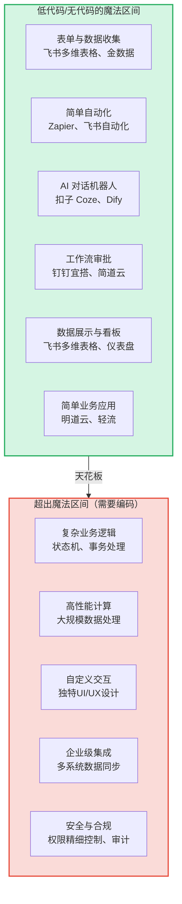
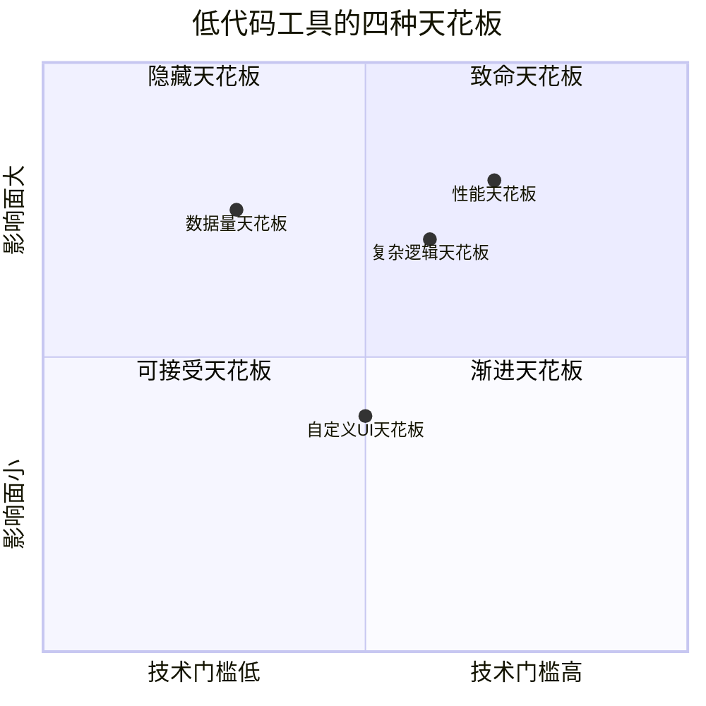
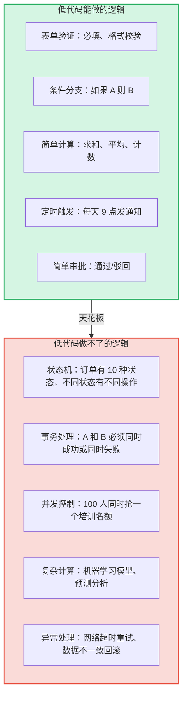
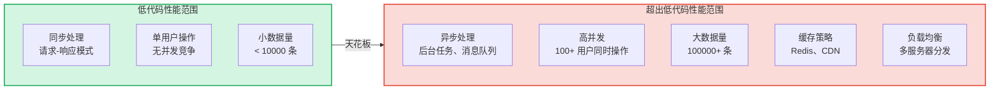
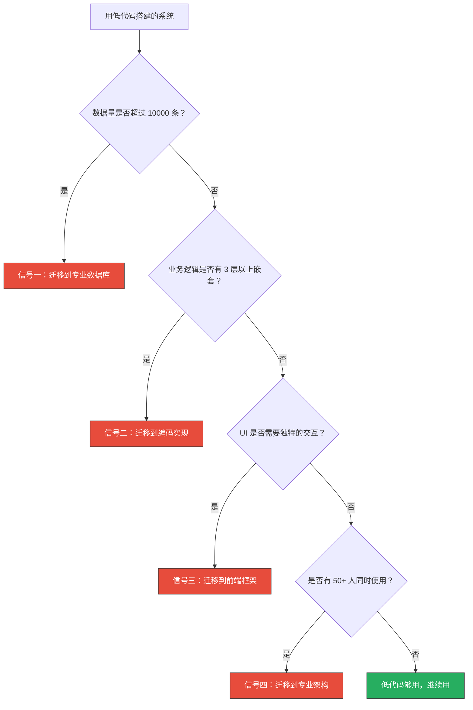

# 低代码/无代码的天花板效应

> [!note] 本文定位
> 本文分析低代码/无代码工具的"魔法区间"和"天花板"，帮助非技术人员理解：**什么时候低代码够用，什么时候必须从"配置"切换到"编码"**。本文是 [[02-AI趋势与素养/非技术人员与技术边界/02_四层判定框架：什么时候该停手]] 在工具层面的延伸。
>
> 前置阅读：[[02-AI趋势与素养/非技术人员与技术边界/01_边界问题的本质：AI拉平了什么，没拉平什么]]

---

## 一、低代码工具能做什么："魔法区间"

> [!tip] 魔法区间的定义
> 低代码/无代码的魔法区间是：**表单 + 流程 + 简单数据展示**。只要你的需求不超出这三个维度，低代码就是最佳选择。

---

## 二、四种天花板

### 2.1 天花板全景

---

### 2.2 天花板一：数据量天花板

**100 条记录 vs 10 万条记录，低代码的数据库不是真正的数据库。**

| 数据量 | 低代码表现 | 建议 |
|--------|-----------|------|
| < 1,000 条 | 流畅，完全够用 | 可以放心用低代码 |
| 1,000 - 10,000 条 | 开始出现延迟，筛选和排序变慢 | 需要关注性能，做预案 |
| 10,000 - 100,000 条 | 明显卡顿，复杂查询超时 | 强烈建议迁移到专业数据库 |
| > 100,000 条 | 基本不可用 | 必须用专业数据库 |

> [!warning] 真实案例
> 某 HR 用飞书多维表格管理公司 2000 人的培训记录。前几个月正常，当培训记录积累到 15000 条后，每次筛选"某部门某课程完成情况"需要等待 15-20 秒。更严重的是，多维表格的 API 调用有频率限制，当多个 HR 同时操作时，数据写入经常失败。

**为什么低代码的数据库不是真正的数据库？**
- 没有索引优化：复杂查询不走索引，全表扫描
- 没有查询优化器：复杂的多条件筛选效率极低
- 没有事务支持：多步操作不能保证原子性
- 没有连接池：并发操作容易超时

---

### 2.3 天花板二：复杂逻辑天花板

**if-else 能做，但状态机、事务、并发处理做不了。**

> [!important] 判断标准
> 如果你的逻辑可以用"如果……就……"描述完，低代码可以。如果需要"当……的时候，如果……而且……，那么……，否则如果……那么……"超过 3 层嵌套，低代码就不够了。

---

### 2.4 天花板三：自定义 UI 天花板

**模板够用，但独特交互、复杂表单超出能力。**

| 需求类型 | 低代码能做到 | 需要编码 |
|----------|------------|---------|
| 标准表单 | 完全够用 | 不需要 |
| 标准列表/表格 | 完全够用 | 不需要 |
| 标准看板/仪表盘 | 基本够用 | 复杂图表需要编码 |
| 自定义交互（拖拽排序、动态表单） | 一般做不了 | 需要前端开发 |
| 品牌定制 UI | 只能改颜色和 Logo | 需要前端开发 |
| 移动端适配 | 基本支持 | 复杂适配需要原生开发 |
| 无障碍访问 | 支持有限 | 需要专业开发 |

---

### 2.5 天花板四：性能天花板

**同步处理 OK，但异步、缓存、负载均衡超出范围。**

---

## 三、从"配置"到"编码"：四个迁移信号

### 3.1 迁移路径图

### 3.2 四个信号详解

| 信号 | 现象 | 根因 | 解决方案 |
|------|------|------|---------|
| **信号一：数据变慢** | 筛选、排序、统计操作明显变慢 | 低代码平台没有真正的数据库优化 | 迁移到 MySQL/PostgreSQL，由技术团队管理 |
| **信号二：逻辑纠缠** | 加了新功能后旧功能出 bug | 低代码的"可视化逻辑"复杂度上限低 | 迁移到代码实现，用编程语言管理复杂逻辑 |
| **信号三：UI 受限** | 用户频繁反馈"能不能做得像 XX 那样" | 低代码的 UI 模板无法满足个性化需求 | 迁移到 React/Vue 等前端框架 |
| **信号四：用户变多** | 多人同时操作时出现数据冲突、超时 | 低代码平台没有并发控制和负载均衡 | 迁移到专业架构，引入缓存、消息队列 |

---

## 四、低代码工具的"最佳实践区间"

> [!tip] 一句话总结
> **低代码适合做"小而美"的内部工具，不适合做"大而全"的企业系统。** 当你发现自己在低代码平台上"绕来绕去"试图实现一个复杂功能时，就是该切换的时候了。

---

## 五、常见低代码工具的天花板对比

| 工具 | 适用场景 | 数据量天花板 | 逻辑复杂度天花板 | 迁移难度 |
|------|----------|-------------|----------------|---------|
| **飞书多维表格** | 数据管理、简单自动化 | 约 10,000 条 | 低（简单条件分支） | 低（可以导出 CSV） |
| **扣子 Coze** | AI 对话机器人 | 不限（对话次数） | 中（工作流 + 知识库） | 中（可以导出配置） |
| **Dify** | AI 应用开发 | 依赖后端数据库 | 中高（支持代码节点） | 中（开源可自部署） |
| **Zapier** | 跨应用自动化 | 按套餐限制 | 低（触发-动作模式） | 低（可以迁移到代码） |
| **简道云** | 企业流程管理 | 约 50,000 条 | 中（支持公式和脚本） | 高（数据格式专有） |
| **明道云** | 业务应用搭建 | 约 100,000 条 | 中高（支持工作流） | 高（数据格式专有） |

> [!important] 选择建议
> 优先选择数据可导出、逻辑可迁移的低代码工具。避免被"数据格式专有"的工具锁定，否则将来迁移成本极高。

---

## 六、与 [[02-AI趋势与素养/非技术人员与技术边界/02_四层判定框架：什么时候该停手]] 的结合

低代码工具的天花板恰好对应四层框架中的"复杂度层"：

| 四层框架 | 低代码能应对 | 低代码不能应对 |
|----------|------------|--------------|
| 复杂度层 | 单文件、简单逻辑 | 多模块、数据库、API、状态管理、并发 |
| 风险层 | 非敏感数据 | 个人隐私、金钱、合规 |
| 维护层 | 一次性任务 | 长期维护、多人协作 |
| 集成层 | 独立系统 | 多系统集成、深度对接 |

---

## 七、迁移策略：从低代码到专业开发的实操指南

### 7.1 迁移时机决策树

当你决定从低代码迁移到专业开发时，你需要回答三个问题：

> [!important] 问题一：数据迁移
> 你的低代码平台是否支持数据导出？导出格式是否标准（CSV/JSON/SQL）？数据量多大？
>
> 如果可以导出为标准格式，迁移成本可控。如果是专有格式，可能需要手动导出甚至重新录入。

> [!important] 问题二：逻辑迁移
> 你的低代码平台上的业务逻辑是否有文档记录？接手的技术团队能否理解？
>
> 低代码平台上的"可视化逻辑"对技术人员来说往往难以理解。建议在迁移时，用自然语言描述业务规则，而不是让技术人员去"翻译"可视化逻辑。

> [!important] 问题三：用户迁移
> 用户是否已经习惯了低代码版本的界面和交互？迁移后是否需要重新培训？
>
> 如果用户已经深度使用低代码版本，迁移到新系统时需要考虑用户体验的连续性。建议在迁移初期保持界面相似，逐步优化。

### 7.2 迁移的四个阶段

### 7.3 真实案例：从飞书多维表格到专业系统的迁移

某公司 HR 团队用飞书多维表格搭建了员工培训管理系统，使用一年后，数据量达到 50,000+ 条，性能严重下降。迁移过程：

1. **冻结阶段**（1 周）：通知所有用户，不再新增功能，只做数据维护
2. **导出阶段**（1 周）：导出所有数据到 CSV，整理业务规则文档
3. **并行阶段**（3 周）：新系统上线，与旧系统同时运行，逐步切换用户
4. **切换阶段**（1 周）：关闭旧系统，完成迁移

总耗时 6 周，技术团队投入 2 人。如果一开始就用专业开发，这个系统只需要 4 周开发 + 1 周上线。**迁移成本 = 开发成本 + 额外 50%。**

---

## 八、与已有知识库的关联

- 低代码的"天花板效应"与 [[01-AI技术/Skill制作痛点/00_MOC_Skill制作痛点中枢]] 中的"工具调用与编排的痛点"互补：Skill 制作中经常遇到低代码工具的编排能力不足的问题
- 低代码的"数据量天花板"与 [[02-AI趋势与素养/非技术人员与技术边界/06_技术债务：非技术人员搭积木的隐性代价]] 中的数据孤岛问题对应
- 低代码的"最佳实践区间"与 [[02-AI趋势与素养/人机协作阶段演进/00_MOC_人机协作阶段演进中枢]] 中的"阶段一：工具使用"和"阶段二：任务委托"对应

---

**关联文档**：
- [[02-AI趋势与素养/非技术人员与技术边界/00_MOC_非技术人员与技术边界中枢]] - 返回中枢
- [[02-AI趋势与素养/非技术人员与技术边界/02_四层判定框架：什么时候该停手]] - 方法论基础
- [[02-AI趋势与素养/非技术人员与技术边界/03_HR+AI场景的边界地图]] - 看 HR 场景中的低代码实践
- [[02-AI趋势与素养/非技术人员与技术边界/05_Prompt工程vs软件工程：那条线在哪]] - 更深层的工具边界
- [[02-AI趋势与素养/非技术人员与技术边界/06_技术债务：非技术人员搭积木的隐性代价]] - 天花板的代价
- [[02-AI趋势与素养/非技术人员与技术边界/08_个人决策工具：边界判断自测清单]] - 在具体场景中验证你的判断