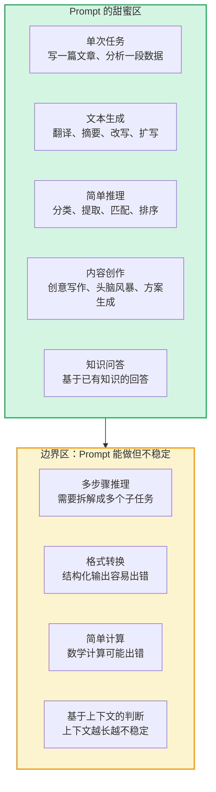
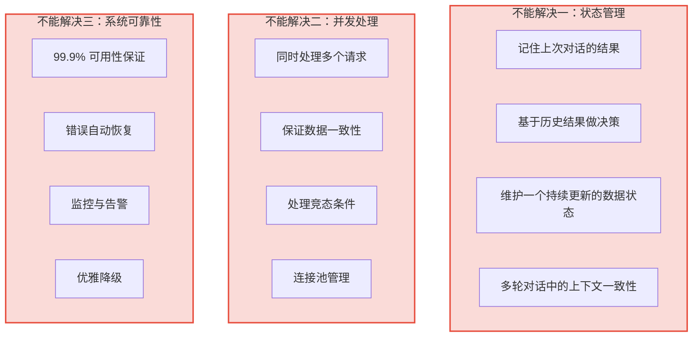
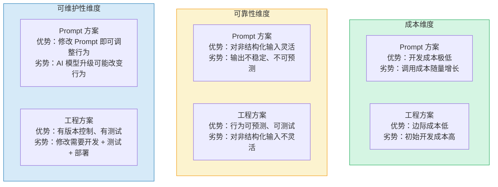
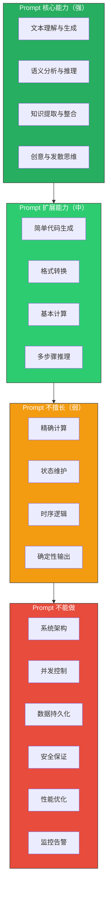
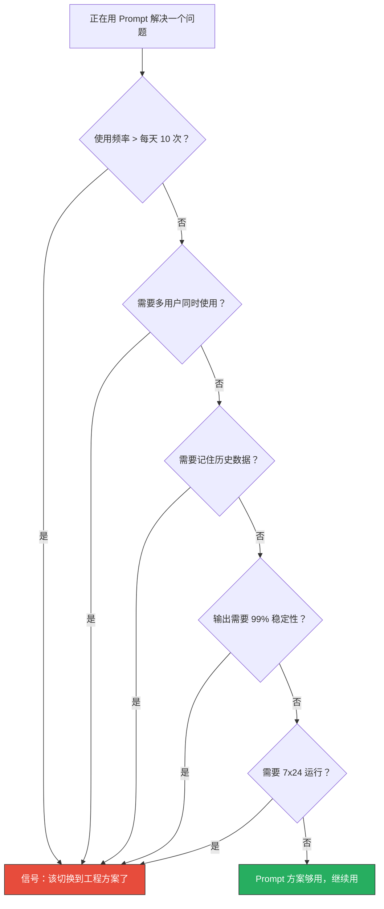
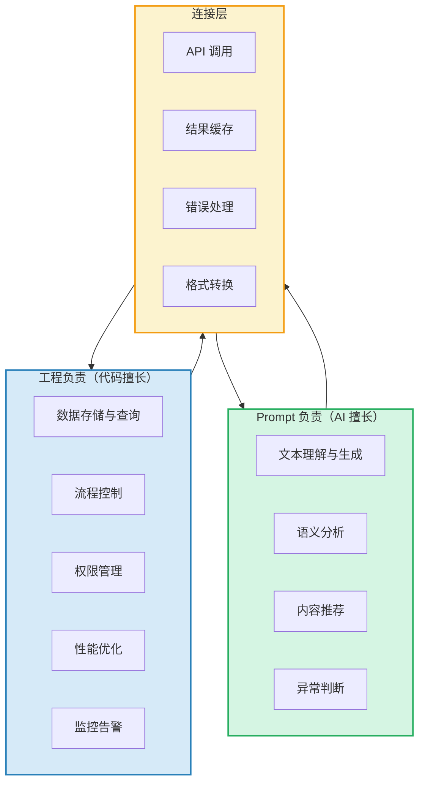

# Prompt工程vs软件工程：那条线在哪

> [!note] 本文定位
> 这是最容易被混淆的边界。很多人认为"写 Prompt 就是编程"，但实际上 Prompt 工程和软件工程解决的是**完全不同类型的问题**。本文帮你理清：**Prompt 能解决什么，不能解决什么，以及什么时候必须从 Prompt 切换到代码。**
>
> 前置阅读：[[02-AI趋势与素养/非技术人员与技术边界/01_边界问题的本质：AI拉平了什么，没拉平什么]]、[[02-AI趋势与素养/非技术人员与技术边界/02_四层判定框架：什么时候该停手]]

---

## 一、Prompt 能解决什么

### 1.1 Prompt 的"甜区"

> [!tip] Prompt 的黄金法则
> **Prompt 擅长的是"输入文本 → 输出文本"的单次转换。** 任何超出这个模式的需求，都需要重新审视。

---

### 1.2 Prompt 能做什么：典型案例

| 场景 | Prompt 方案 | 效果 | 可靠性 |
|------|------------|------|--------|
| 简历筛选 | 输入简历文本，让 AI 提取关键信息 | 好 | 85-90% |
| 培训材料生成 | 输入主题，让 AI 生成课程大纲和内容 | 很好 | 90-95% |
| 员工反馈分析 | 输入反馈文本，让 AI 做情感分析和分类 | 好 | 80-85% |
| 面试问题生成 | 输入岗位要求，让 AI 生成面试题 | 很好 | 90-95% |
| 数据清洗 | 让 AI 格式化、去重、纠错非结构化数据 | 中 | 70-80% |
| 报告撰写 | 输入数据，让 AI 生成分析报告 | 好 | 85-90% |

---

## 二、Prompt 不能解决什么

### 2.1 Prompt 的"三不"

### 2.2 详细解释

#### 不能解决一：状态管理

> [!warning] 为什么 Prompt 不能管理状态
> 每次 Prompt 调用都是**无状态的**——AI 不会记住你上次说了什么，除非你每次都把历史对话全部传回去。但上下文窗口有限，历史对话越长，成本越高、效果越差。
>
> **举例**：你想让 AI 帮你管理一个"员工技能数据库"。第一次你告诉 AI "张三会 Python"，第二次你问"谁会 Python"，AI 只记得当前对话的内容。如果你不把"张三会 Python"再传一遍，AI 就会"忘记"。

**什么需要代码**：任何需要"记住"和"更新"数据的场景，都需要数据库 + 应用逻辑，不是 Prompt 能解决的。

#### 不能解决二：并发处理

> [!danger] 为什么 Prompt 不能处理并发
> Prompt 是**单次请求-响应**模式，没有并发控制机制。当 10 个 HR 同时用你的 AI 工具处理简历时，你需要确保：
> - 数据不会互相覆盖
> - 每个人的结果不会互相干扰
> - 系统不会因为并发而崩溃
>
> 这些是典型的**软件工程问题**，不是 Prompt 工程问题。

**什么需要代码**：任何需要同时服务多个用户、保证数据一致性的场景。

#### 不能解决三：系统可靠性

> [!important] 为什么 Prompt 不能保证可靠性
> Prompt 调用的可靠性取决于：
> - AI 服务商的可用性（他们宕机了你也宕机）
> - 网络稳定性（网络断了你也断了）
> - AI 输出的不确定性（同样的 Prompt 可能得到不同的结果）
>
> 软件工程可以通过**重试机制、熔断器、监控告警、缓存、降级策略**来保证系统可靠性。这些都不是 Prompt 能做的。

**什么需要代码**：任何需要 7x24 小时稳定运行、需要 SLA 保障的场景。

---

## 三、同一需求：Prompt 方案 vs 工程方案

### 3.1 对比表

| 需求 | Prompt 方案 | 工程方案 | 哪个更好？ |
|------|------------|---------|-----------|
| **简历筛选** | 用 AI 逐份分析简历，提取关键信息 | 写代码做关键词匹配 + 规则筛选 | Prompt 方案更好（灵活、准确） |
| **自动发送面试邀请** | 用 AI 生成邀请邮件文本 | 写代码调用邮件 API + 模板引擎 | 工程方案更好（可靠、可追踪） |
| **员工 FAQ 机器人** | 用 AI 知识库 + Prompt 回答 | 写代码做关键词匹配 + 规则引擎 | Prompt 方案更好（灵活、自然） |
| **培训课程推荐** | 用 AI 根据员工角色推荐课程 | 写代码做基于规则的推荐系统 | 取决于规模：小规模 Prompt 好，大规模工程好 |
| **绩效报告生成** | 用 AI 根据数据生成报告 | 写代码做模板填充 + 数据可视化 | 混合：AI 写文字 + 工程做图表 |
| **数据看板** | 用 AI 生成数据描述 | 写代码做实时数据查询 + 可视化 | 工程方案更好（实时、可靠） |

### 3.2 三个维度的对比

### 3.3 决策矩阵

| 需求特征 | 倾向 Prompt 方案 | 倾向工程方案 |
|----------|-----------------|-------------|
| 任务类型 | 文本生成、内容分析、推理 | 数据处理、流程控制、系统集成 |
| 使用频率 | 偶尔使用（每天 < 10 次） | 高频使用（每天 > 100 次） |
| 精度要求 | 85% 准确率可以接受 | 需要 99%+ 准确率 |
| 可预测性 | 接受一定的不确定性 | 需要确定性的行为 |
| 用户规模 | 1-5 人使用 | 50+ 人使用 |
| 长期维护 | 一次性任务 | 需要持续运行和迭代 |

---

## 四、Prompt 能力边界图

---

## 五、实战案例：从 Prompt 到工程的真实路径

### 案例：HR 数据分析助手

**阶段一：纯 Prompt 方案**
- 需求：HR 把 Excel 数据粘贴给 AI，AI 分析并生成报告
- 实现：ChatGPT + 复制粘贴
- 问题：每次都要复制粘贴，数据量大时 AI 拒绝处理

**阶段二：Prompt + 简单脚本**
- 需求：自动化数据输入，AI 分析
- 实现：Python 脚本读取 Excel + 调用 AI API + 生成报告
- 问题：报告格式不统一，有时 AI 输出格式错误导致脚本崩溃

**阶段三：工程方案**
- 需求：稳定的、可配置的、多人可用的数据看板
- 实现：后端 API + 数据库 + 前端数据可视化 + AI 辅助文字分析
- 结果：稳定可靠，支持多人使用，数据实时更新

> [!tip] 教训
> 这是一个典型的"从 Prompt 到工程"的演进路径。**Prompt 方案适合验证想法，工程方案适合规模化落地。**

---

## 六、什么时候该从 Prompt 切换到工程

---

## 七、Prompt 工程的进阶思考：混合架构

### 7.1 混合架构：Prompt + 工程的最优解

在实际应用中，最好的方案往往是**混合架构**：用 Prompt 处理"非结构化"的部分，用工程处理"结构化"的部分。

### 7.2 混合架构的典型案例

| 场景 | Prompt 部分 | 工程部分 | 连接方式 |
|------|-----------|---------|---------|
| 智能简历筛选 | 分析简历内容，提取关键信息 | 数据库存储、搜索、排序、权限 | API 调用 |
| 培训内容推荐 | 根据员工画像推荐课程 | 课程数据库、用户画像管理 | API 调用 + 缓存 |
| 员工服务机器人 | 理解用户问题，生成回答 | 知识库管理、对话历史、权限 | API 调用 |
| 绩效报告生成 | 生成分析文字和评价 | 数据查询、图表生成、报告模板 | API 调用 + 模板引擎 |

> [!tip] 混合架构的黄金法则
> **AI 负责"理解"和"生成"，工程负责"存储"和"控制"。** 不要让 AI 做它不擅长的事（精确计算、状态管理），不要让工程做它不擅长的事（语义理解、内容生成）。

### 7.3 非技术人员在混合架构中的角色

非技术人员最擅长的是**Prompt 部分**——设计 Prompt、测试 AI 输出、优化内容质量。工程部分仍然需要技术人员。但非技术人员可以：
- 参与 Prompt 的设计和迭代
- 提供业务场景和测试数据
- 验证 AI 输出的质量和准确性
- 维护知识库和内容库

---

## 八、与已有知识库的关联

- Prompt 工程的局限性与 [[01-AI技术/Skill制作痛点/00_MOC_Skill制作痛点中枢]] 中的"Prompt 工程在 Skill 中的难点"直接相关：Skill 制作中的很多痛点，本质上就是 Prompt 能力和软件工程能力之间的鸿沟
- Prompt 和工程的边界与 [[04_低代码/无代码的天花板效应]] 中的"配置 vs 编码"边界类似：都是"简单场景够用，复杂场景需要工程化"
- Prompt 的"无状态"特性与 [[02-AI趋势与素养/人机协作阶段演进/00_MOC_人机协作阶段演进中枢]] 中的"阶段二：任务委托"对应：在任务委托阶段，每个任务都是独立的，不需要维护状态

---

**关联文档**：
- [[02-AI趋势与素养/非技术人员与技术边界/00_MOC_非技术人员与技术边界中枢]] - 返回中枢
- [[02-AI趋势与素养/非技术人员与技术边界/01_边界问题的本质：AI拉平了什么，没拉平什么]] - 前置阅读
- [[02-AI趋势与素养/非技术人员与技术边界/02_四层判定框架：什么时候该停手]] - 方法论基础
- [[04_低代码/无代码的天花板效应]] - 类似的工具边界分析
- [[02-AI趋势与素养/非技术人员与技术边界/06_技术债务：非技术人员搭积木的隐性代价]] - Prompt 方案可能产生的技术债务