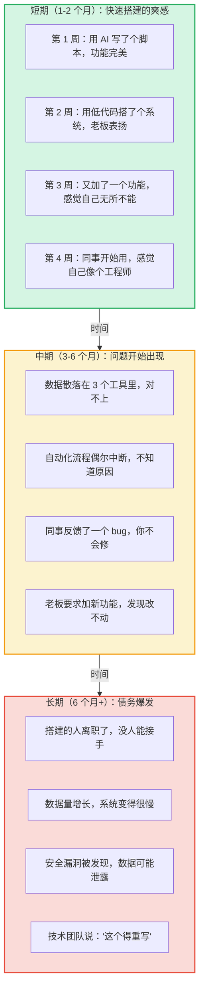
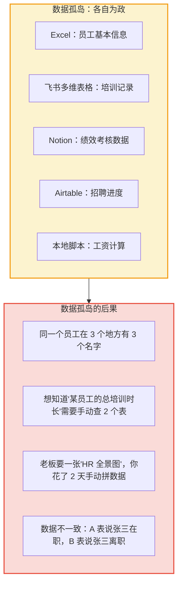
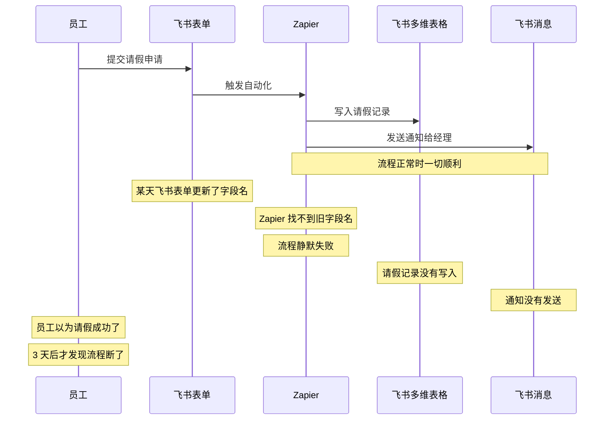
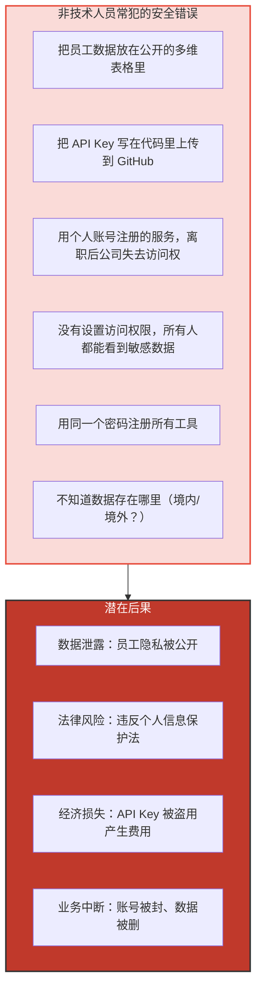
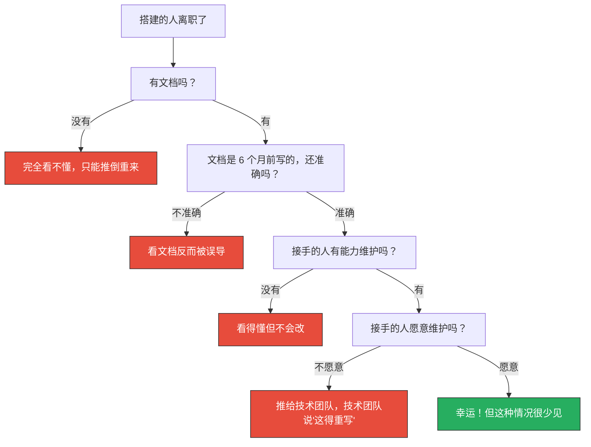

# 技术债务：非技术人员搭积木的隐性代价

> [!note] 本文定位
> 本文揭示非技术人员用 AI 和低代码工具快速搭建系统后，**在 3-6 个月后**会出现的隐性代价。这些代价在搭建时完全看不到，但会在后期以指数级增长。本文是 [[02-AI趋势与素养/非技术人员与技术边界/02_四层判定框架：什么时候该停手]] 中"维护层"的深度展开。
>
> 前置阅读：[[02-AI趋势与素养/非技术人员与技术边界/01_边界问题的本质：AI拉平了什么，没拉平什么]]、[[04_低代码/无代码的天花板效应]]

---

## 一、技术债务积累曲线：短期爽 vs 长期痛

> [!danger] 核心规律
> **技术债务的积累速度是指数级的。** 前 2 个月你可能感觉不到任何问题，但第 3 个月开始，问题会像雪崩一样涌来。

---

## 二、四大隐性代价

### 2.1 代价一：数据孤岛

**Excel + 飞书多维表格 + Notion + Airtable，数据散落各处，互不相通。**

> [!warning] 真实案例
> 某公司 HR 团队用 Excel 管员工信息、用飞书多维表格管培训、用 Notion 管绩效。年底老板要求做"人才盘点"，需要把三个数据源合并。结果发现：
> - 员工姓名不统一（有的写"张三"，有的写"张三（技术部）"）
> - 工号不统一（有的有，有的没有）
> - 数据更新时间不一致（有的表是 3 月更新的，有的是 9 月）
>
> HR 花了 3 天手动对齐数据，最终还是有很多对不上。

**数据孤岛的形成原因**：
1. 每个工具都是独立选择的，没有统一的数据标准
2. 非技术人员不知道"数据建模"的重要性，不会设计统一的数据结构
3. 每个工具都有自己的一套字段、格式、权限体系

---

### 2.2 代价二：流程断裂

**A 工具触发 B 工具，但中间某个环节没人维护，整个流程就断了。**

> [!danger] 流程断裂的典型场景
> 1. **字段名变更**：某个工具更新了字段名，自动化流程找不到字段，静默失败
> 2. **API 限流**：工具 A 调用工具 B 的 API 太频繁，被限流，数据丢失
> 3. **认证过期**：Zapier 连接飞书的 Token 过期了，所有自动化都停了
> 4. **无人监控**：没有人知道流程断了，直到有人投诉

**流程断裂的根因**：
- 非技术人员搭建流程时，**不会考虑异常情况**（只设想了"正常流程"）
- 没有监控和告警机制（没人知道流程什么时候断了）
- 没有错误恢复机制（断了就只能手动补数据）

---

### 2.3 代价三：安全漏洞

**用户数据存在公开表格里、API key 暴露在前端代码中。**

> [!danger] 真实案例
> 某 HR 用 AI 写了一个脚本，把员工薪资数据从 Excel 导入到飞书多维表格。脚本中包含了飞书 API Key。HR 把这个脚本上传到了公开的 GitHub 仓库，API Key 直接暴露在代码中。几天后，飞书账号出现异常登录，幸好被安全团队及时发现。
>
> **教训**：API Key 就像你家的钥匙。不把它放在代码里，就像不把钥匙挂在门外。

---

### 2.4 代价四：无人接手

**搭建的人离职了，后来的人看不懂。**

> [!warning] 真实案例
> 某公司的"自动化培训系统"是由一位 HR 在 2024 年用 Python + AI 搭建的。2025 年这位 HR 离职了。系统包括：
> - 3 个 Python 脚本（无注释）
> - 2 个飞书多维表格
> - 1 个 Zapier 自动化流程
> - 没有文档
>
> 新来的 HR 完全看不懂。技术团队花了 2 周阅读代码、梳理流程，最终结论是：**重写比维护更划算。**

---

## 三、"搭建前就该想好维护"的五条原则

> [!important] 原则一：可替代性原则
> **你搭建的任何东西，都必须假设有一天你会离开。** 问自己：如果明天我离职了，接手的人能在 1 小时内理解这个东西吗？
>
> 检查清单：
> - [ ] 有文档说明这个东西是做什么的
> - [ ] 有文档说明怎么修改/维护
> - [ ] 所有账号和密钥有交接清单
> - [ ] 至少有一个同事知道这个东西的存在

> [!important] 原则二：数据标准化原则
> **所有数据源必须使用统一的数据标准。** 不要出现"A 表用姓名，B 表用工号"的情况。
>
> 检查清单：
> - [ ] 所有数据源使用统一的员工标识（工号或邮箱）
> - [ ] 所有数据源的字段名保持一致
> - [ ] 数据更新频率和时间有明确记录
> - [ ] 有数据字典（每个字段是什么意思）

> [!important] 原则三：异常处理原则
> **不要只设计"正常流程"，要设计"异常流程"。** 每一条"如果……就……"的自动化，都要有对应的"如果出错了，就……"。
>
> 检查清单：
> - [ ] 每个自动化流程有错误通知机制
> - [ ] 关键流程有手动备份方案
> - [ ] 定期检查流程是否正常运行
> - [ ] 错误日志有记录和查看方式

> [!important] 原则四：访问控制原则
> **最小权限原则：只给需要的人最小的权限。** 不要把员工数据放在公开表格里，不要把 API Key 写在代码里。
>
> 检查清单：
> - [ ] 敏感数据设置了访问权限
> - [ ] API Key 和密码没有暴露在代码中
> - [ ] 使用了公司统一账号（而非个人账号）
> - [ ] 了解数据存储位置（境内/境外）

> [!important] 原则五：升级路径原则
> **从第一天起就规划好"从低代码到编码"的升级路径。** 不要等到系统崩溃了才想"怎么办"。
>
> 检查清单：
> - [ ] 数据格式可以导出（不要被专有格式锁定）
> - [ ] 有明确的"需要找技术团队"的触发条件
> - [ ] 与技术团队建立了沟通渠道
> - [ ] 知道技术团队评估"接手难度"的标准

---

## 四、技术债务的"健康检查"清单

每季度花 30 分钟做一次技术债务健康检查：

| 检查项 | 健康 | 警告 | 危险 |
|--------|------|------|------|
| 数据源数量 | 1-2 个 | 3-4 个 | 5 个以上 |
| 数据是否一致 | 完全一致 | 偶尔不一致 | 经常对不上 |
| 自动化流程是否正常 | 全部正常 | 偶尔中断 | 经常中断或已不知道状态 |
| 是否有文档 | 有完整文档 | 有简单文档 | 完全没有文档 |
| 是否有接手人 | 有明确接手人 | 有人知道但不会维护 | 只有你一个人知道 |
| 数据量增长速度 | 稳定 | 缓慢增长 | 快速增长 |
| 是否有安全风险 | 已做安全审查 | 不确定 | 确定有安全漏洞 |

---

## 五、真实案例复盘：三个技术债务的典型故事

### 案例一："幽灵脚本"的故事

某 HR 在 2024 年用 AI 写了一个自动发送生日祝福的 Python 脚本。脚本从 Excel 读取员工生日，通过飞书机器人发送祝福。2025 年这位 HR 离职，脚本留在了她的电脑上。2026 年她的电脑被回收，脚本彻底消失。直到有员工问"为什么今年没有生日祝福了"，大家才发现这个脚本已经不存在了。

**债务类型**：无人接手 + 无文档
**教训**：任何自动化流程，都必须有文档、有备份、有接手人。

### 案例二："数据爆炸"的故事

某 HR 用飞书多维表格搭建了招聘管理系统，从职位发布到 Offer 发放全流程。第一年数据量 2000 条，一切正常。第二年校招季，数据量在一周内从 2000 条飙升到 50000 条，多维表格几乎无法使用。筛选一个岗位的候选人需要 30 秒，HR 团队投诉不断。

**债务类型**：数据量天花板
**教训**：选择工具时，必须考虑数据量增长预期。校招季的数据量是平时的 10-20 倍。

### 案例三："权限泄露"的故事

某 HR 用 Airtable 搭建了一个员工信息数据库，包含员工姓名、部门、手机号、入职日期。为了方便分享，他把 Airtable 的链接发到了部门群。链接是"知道链接的人都能查看"权限。一个离职员工保留了链接，在离职后仍然可以查看所有员工信息。直到被安全部门发现，这个链接已经存在了 6 个月。

**债务类型**：安全漏洞
**教训**：涉及员工隐私数据，绝对不能用低代码工具的默认权限设置。必须做权限审查。

---

## 六、如何与技术团队沟通"技术债务"

当你意识到自己搭建的系统出现了技术债务，需要找技术团队帮忙时，可以用以下方式沟通：

> [!tip] 沟通模板
> "嗨，我之前用 [工具名] 搭了一个 [功能描述]，[用了多久]，现在遇到了一些问题：
> 1. [具体问题一]
> 2. [具体问题二]
> 3. [具体问题三]
>
> 我知道这是一个技术债务，之前没有找你们是因为 [原因]。现在我希望我们能一起制定一个方案，把这个系统迁移到正式的开发流程中。数据的导出格式是 [格式]，业务逻辑我已经整理成了文档。"

**技术团队最欣赏的沟通方式**：
- 诚实承认这是技术债务，不要掩饰
- 提供具体的业务逻辑文档，而不是让技术团队去"猜"
- 提供数据导出方案，而不是让技术团队去"爬"数据
- 接受"可能需要重写"的现实，不要坚持"在现有基础上改"

---

## 七、与已有知识库的关联

- 技术债务中的"数据孤岛"问题与 [[04_低代码/无代码的天花板效应]] 中的"数据量天花板"直接相关
- 技术债务中的"流程断裂"问题与 [[01-AI技术/Skill制作痛点/00_MOC_Skill制作痛点中枢]] 中的"Skill 的迭代与维护"对应：都是"搭建容易维护难"
- 技术债务中的"无人接手"问题与 [[02-AI趋势与素养/非技术人员与技术边界/03_HR+AI场景的边界地图]] 中的失败案例重叠：很多失败案例的根本原因就是技术债务
- 技术债务的五条原则与 [[02-AI趋势与素养/非技术人员与技术边界/02_四层判定框架：什么时候该停手]] 中的"维护层"互补

---

**关联文档**：
- [[02-AI趋势与素养/非技术人员与技术边界/00_MOC_非技术人员与技术边界中枢]] - 返回中枢
- [[02-AI趋势与素养/非技术人员与技术边界/02_四层判定框架：什么时候该停手]] - 维护层的深度展开
- [[04_低代码/无代码的天花板效应]] - 低代码工具的技术债务
- [[02-AI趋势与素养/非技术人员与技术边界/07_合作模式：非技术人员如何与技术团队高效协作]] - 如何与技术团队合作避免技术债务