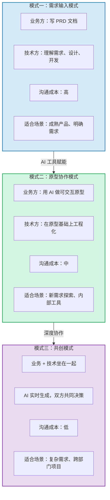
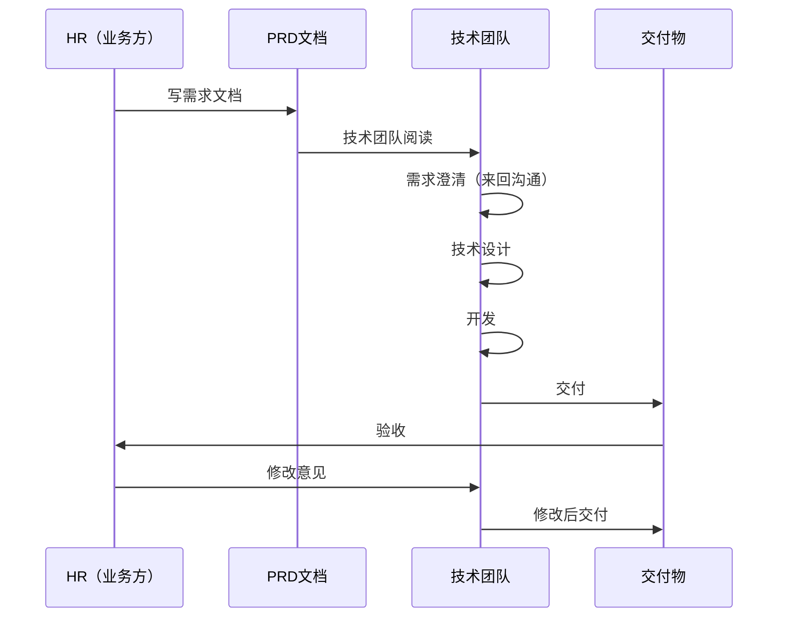
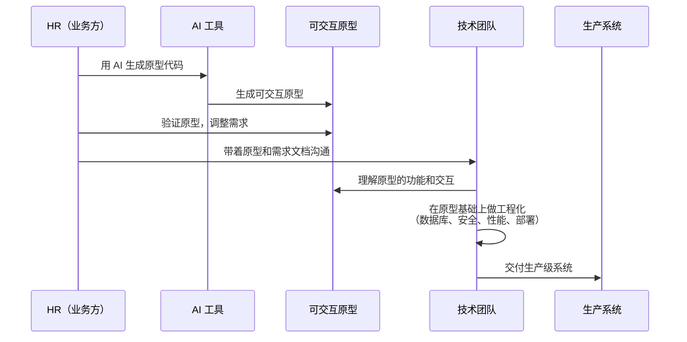
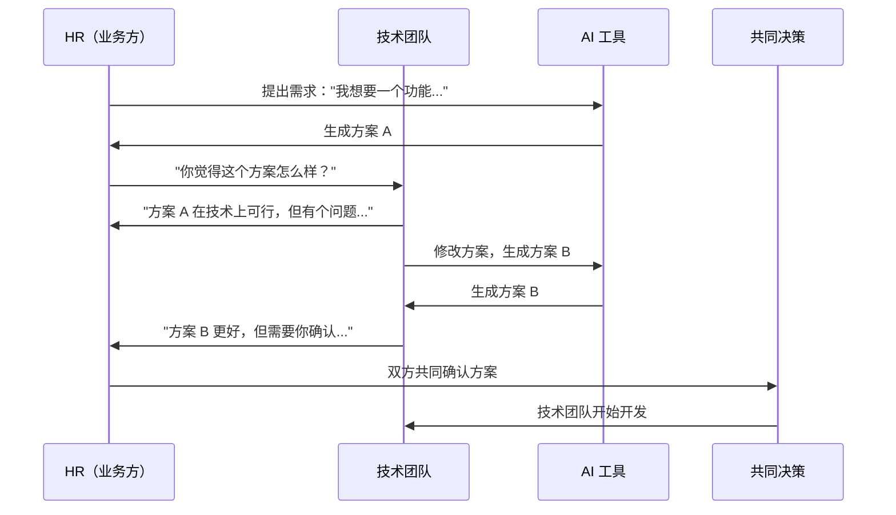
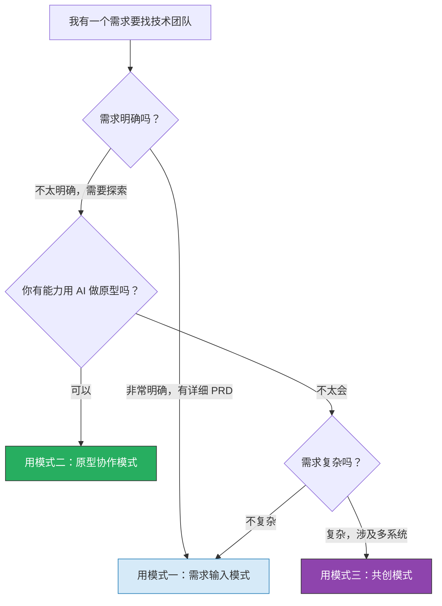

# 合作模式：非技术人员如何与技术团队高效协作

> [!note] 本文定位
> 本文回答一个实际问题：**当你判断"这件事该找技术团队做"之后，怎么跟他们高效协作？** 不是传统的"扔需求给技术"，而是"带着 AI 生成的半成品去沟通"。本文是 [[02-AI趋势与素养/非技术人员与技术边界/02_四层判定框架：什么时候该停手]] 中"红灯"场景的后续行动指南。
>
> 前置阅读：[[02-AI趋势与素养/非技术人员与技术边界/02_四层判定框架：什么时候该停手]]、[[02-AI趋势与素养/非技术人员与技术边界/03_HR+AI场景的边界地图]]

---

## 一、三种协作模式



---

### 1.1 模式一：需求输入模式（传统）

**业务方写 PRD -> 技术方理解 -> 开发 -> 交付**



> [!warning] 模式一的痛点
> - HR 写 PRD 时不知道技术能做什么，需求要么太模糊要么太具体
> - 技术团队读 PRD 时理解偏差，做出来的和 HR 想的不一样
> - 来回沟通成本高，一个需求从提出到交付可能需要 2-4 周

---

### 1.2 模式二：原型协作模式（推荐）

**业务方用 AI 做可交互原型 -> 技术方在原型基础上工程化**



> [!tip] 模式二的优势
> 1. **需求可视化**：HR 不再是用文字描述需求，而是拿一个能点、能用的原型来沟通
> 2. **减少误解**：技术团队看到原型后，对需求的理解准确度大幅提升
> 3. **加速对齐**：原型可以快速迭代，HR 和技术可以在原型上直接讨论
> 4. **降低技术门槛**：HR 不需要懂技术，只需要用 AI 生成原型

> [!important] 模式二的关键：原型不是产品
> HR 用 AI 做的原型是**功能演示**，不是**可上线产品**。技术团队的工作是把原型"工程化"——加上数据库、权限控制、安全防护、性能优化、部署运维。原型是"看起来能用"，工程化之后才是"真的能用"。

---

### 1.3 模式三：共创模式（深度协作）

**业务 + 技术坐在一起，AI 实时生成，双方共同决策**



> [!tip] 共创模式的使用场景
> - 复杂需求，技术方案和业务需求需要反复权衡
> - 跨部门项目，需要多方参与决策
> - 创新型项目，没有现成的参考方案
> - 时间紧，需要快速对齐和决策

---

## 二、给技术团队看的 PRD 怎么写

### 2.1 传统 PRD vs AI 辅助 PRD

| 维度 | 传统 PRD | AI 辅助 PRD |
|------|---------|------------|
| **内容来源** | HR 自己写 | HR 写核心需求 + AI 扩展细节 |
| **需求描述** | 纯文字 + 简单线框图 | 文字 + 可交互原型 + 截图 |
| **边界条件** | 经常遗漏 | AI 帮助补充边界条件 |
| **技术可行性** | 不确定 | 包含 AI 给出的技术建议（需标注"未经验证"） |
| **交付周期** | 1-2 周 | 1-2 天 |

### 2.2 AI 辅助 PRD 的结构模板

```markdown
# [项目名称] PRD

## 1. 业务背景（为什么做）
- 当前痛点：[用业务语言描述]
- 期望目标：[量化指标]
- 影响范围：[涉及多少人/部门]

## 2. 核心功能（做什么）
- 功能一：[描述]
- 功能二：[描述]
- ...

## 3. 用户流程（怎么做）
- [附上 AI 生成的可交互原型链接]
- [附上关键页面的截图]
- [附上用户操作流程图]

## 4. 边界条件（什么不能做 / 什么情况特殊处理）
- 正常流程：[描述]
- 异常流程：[描述]（AI 辅助生成）
- 权限要求：[哪些人能看到/操作什么]

## 5. 数据要求
- 需要哪些数据：[列表]
- 数据来源：[从哪里获取]
- 数据更新频率：[实时/每日/每周]

## 6. 非功能需求
- 性能要求：[多少人同时使用]
- 安全要求：[数据敏感度]
- 合规要求：[涉及的法规]

## 7. 技术建议（AI 生成，未经验证，仅供参考）
- [AI 建议的技术方案]
- [AI 建议的注意事项]
- ⚠️ 以上技术建议由 AI 生成，请技术团队评估可行性

## 8. 验收标准
- 功能验收：[具体标准]
- 性能验收：[具体标准]
- 安全验收：[具体标准]
```

> [!tip] 关键技巧
> 在 PRD 中**明确标注哪些是 AI 生成的内容**，让技术团队知道"这部分需要验证"。这既是诚实，也是效率——技术团队知道哪些是 HR 确认过的需求，哪些是 AI 的猜测。

---

## 三、技术团队对"AI 辅助 PRD"的常见误解与应对

### 3.1 误解一："这原型太简陋了，没用"

**技术团队的看法**：你用 AI 生成的东西太粗糙了，我们还是要从头设计。

**正确的理解**：原型的目的不是"可以直接用"，而是"让需求可视化"。原型告诉技术团队"我想要这样的交互"，即使技术实现完全不同，需求理解也准确了 10 倍。

**应对**：在展示原型时明确说"这不是最终产品，这是我想让你看到的功能和交互方式。技术实现你说了算。"

### 3.2 误解二："AI 的建议不可靠，全盘否定"

**技术团队的看法**：PRD 里 AI 写的技术建议不可信，全部忽略。

**正确的理解**：AI 的技术建议确实不可靠，但它提供了"需求方对技术实现的理解程度"——技术团队可以据此判断"HR 对这个需求的技术理解在哪一层"。

**应对**：在 PRD 中明确标注"AI 生成，未经验证，仅供参考"，并邀请技术团队"请评估可行性，提出更好的方案"。

### 3.3 误解三："HR 自己做了原型，是不是不需要我们了"

**技术团队的看法**：HR 都能自己做原型了，我们是不是要被替代了？

**正确的理解**：原型是原型，产品是产品。HR 做的是"毛坯房"，技术团队做的是"精装修"。原型只是降低了沟通成本，没有降低技术价值。

**应对**：明确表达"这个原型只是为了让需求更清晰，工程化必须你们来做。数据库、安全、性能、部署这些我完全不懂，全靠你们。"

---

## 四、高效协作的五个动作

> [!important] 动作一：用原型代替文字描述
> 不要说"我想要一个能筛选简历的工具"，而是打开原型说"点这个按钮，输入关键词，这里显示筛选结果"。

> [!important] 动作二：区分"必须做"和"最好做"
> 在 PRD 中明确标注优先级：P0（必须做）、P1（最好做）、P2（以后做）。技术团队需要知道什么可以砍、什么不能砍。

> [!important] 动作三：提前告知数据量和用户量
> 技术团队最怕听到的一句话是"我以为只有 10 个人用，没想到全公司 500 人都要用了"。提前告知预估的数据量和用户量。

> [!important] 动作四：明确"谁负责什么"
> 业务方负责：需求正确性、数据内容、用户沟通
> 技术方负责：技术方案、代码质量、系统稳定性
> 共同负责：交付时间、验收标准

> [!important] 动作五：建立定期同步机制
> 不要等交付了才发现做错了。每周 15 分钟同步会，看技术团队的最新进展，确认方向正确。

---

## 五、协作模式选择指南



---

## 六、常见协作陷阱与应对

> [!danger] 陷阱一：需求不完整
> HR 给技术团队的需求往往是"主干需求"，缺少边界条件和异常处理。比如"自动发送面试邀请"——HR 只想到了"正常发送"，没想到"候选人邮箱错误怎么办"、"同一候选人收到重复邀请怎么办"、"面试官临时取消怎么办"。
>
> **应对**：在写 PRD 时，用 AI 帮你补充"边界条件"——告诉 AI "请帮我列出这个需求的 10 个边界条件和异常情况"，AI 会帮你想到很多你没想到的。

> [!danger] 陷阱二：数据量预估不足
> HR 说"这个系统只有我们部门用"，技术团队按 10 人设计。结果上线后，隔壁部门也想要，一个月后变成了 100 人用。系统开始出现性能问题，技术团队需要紧急扩容。
>
> **应对**：做需求时，预估数据量要乘以 3-5 倍。因为"只有我们部门用"往往会变成"全公司都在用"。

> [!danger] 陷阱三：需求变更无节制
> 技术团队开发到一半，HR 说"对了，再加一个功能，很简单的"。然而在技术团队看来，"简单"的功能可能意味着"改数据库结构"、"改 API 接口"、"改前端页面"。一次"简单"的变更，可能导致 2-3 天的额外开发。
>
> **应对**：把需求分为 P0/P1/P2，P0 是核心需求不能变，P1 可以在开发过程中调整，P2 是下一期再做。用 [[02-AI趋势与素养/非技术人员与技术边界/02_四层判定框架：什么时候该停手]] 中的"复杂度层"判断"简单"到底有多简单。

> [!warning] 陷阱四：把原型当产品
> HR 用 AI 做了一个原型，技术团队说"这个原型的问题在于……"，HR 的反应是"但原型已经能用了啊，为什么还要改？"这个误解会导致严重的沟通障碍。
>
> **应对**：从一开始就区分"原型"和"产品"。原型是"看起来能用"，产品是"真的能用"。参考 [[02-AI趋势与素养/非技术人员与技术边界/05_Prompt工程vs软件工程：那条线在哪]] 中关于原型和工程的区别。

---

## 七、协作成功案例：一个最佳实践

> [!success] 最佳实践：HR+技术团队的"3+1"协作模式
>
> 某公司 HR 团队和技术团队建立了一套高效的协作机制，称为"3+1"模式：
>
> **3 个定期同步**：
> 1. **周一 15 分钟对齐会**：HR 同步本周业务优先级，技术团队同步本周技术计划
> 2. **周三 15 分钟 Demo 会**：技术团队展示本周进展，HR 现场反馈
> 3. **周五 15 分钟回顾会**：回顾本周交付，确认下周计划
>
> **1 个协作工具**：
> - 共享文档（飞书文档）：HR 维护需求，技术团队维护技术方案
> - 文档中标注：P0/P1/P2 优先级、AI 生成内容 vs 人工确认内容
> - 文档中附上原型链接和截图
>
> **效果**：
> - 需求理解偏差从 40% 降低到 10%
> - 需求变更率从 30% 降低到 10%
> - HR 满意度从 6/10 提升到 9/10
> - 技术团队对 HR 需求的"惊喜感"（没想到 HR 这么懂）从 0 提升到 8/10

---

## 八、与已有知识库的关联

- 三种协作模式与 [[02-AI趋势与素养/人机协作阶段演进/00_MOC_人机协作阶段演进中枢]] 中的五个阶段对应：模式一对应"阶段二：任务委托"，模式二对应"阶段三：协作共创"，模式三对应"阶段四：AI 主导执行"
- 原型协作模式与 [[04_低代码/无代码的天花板效应]] 中的"低代码做原型验证"互补
- PRD 的 AI 辅助写法与 [[02-AI趋势与素养/非技术人员与技术边界/05_Prompt工程vs软件工程：那条线在哪]] 中的"Prompt 的甜区"相关
- 协作模式与 [[02-AI趋势与素养/非技术人员与技术边界/06_技术债务：非技术人员搭积木的隐性代价]] 中的"无人接手"问题对应：好的协作模式可以避免技术债务

---

**关联文档**：
- [[02-AI趋势与素养/非技术人员与技术边界/00_MOC_非技术人员与技术边界中枢]] - 返回中枢
- [[02-AI趋势与素养/非技术人员与技术边界/02_四层判定框架：什么时候该停手]] - 判断"该找技术"之后做什么
- [[02-AI趋势与素养/非技术人员与技术边界/03_HR+AI场景的边界地图]] - HR 场景中如何应用协作模式
- [[02-AI趋势与素养/非技术人员与技术边界/06_技术债务：非技术人员搭积木的隐性代价]] - 协作模式如何避免技术债务
- [[02-AI趋势与素养/非技术人员与技术边界/08_个人决策工具：边界判断自测清单]] - 判断之后的选择