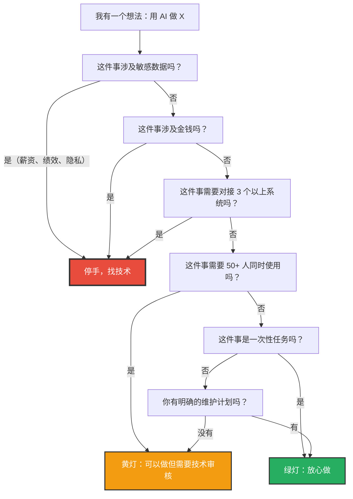
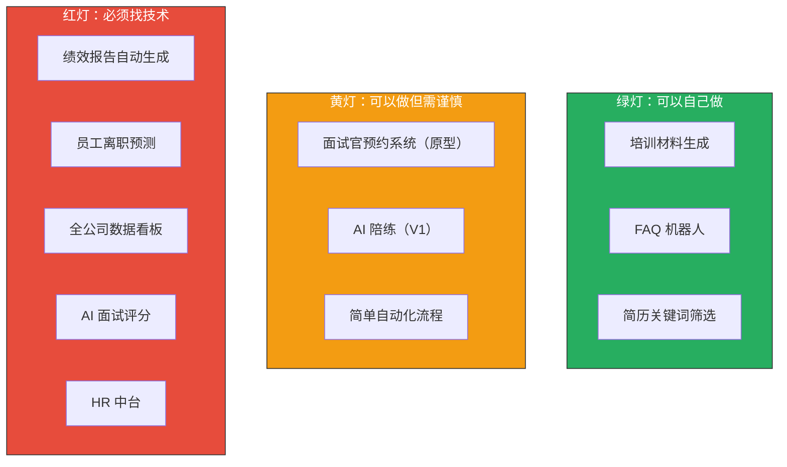

# 个人决策工具：边界判断自测清单

> [!note] 本文定位
> 本文把前 7 篇文档的方法论浓缩成一个**可操作的检查清单**。包含：场景分类、风险评级、自制/外包决策、所需技能、推荐工具。最后附 5 个真实场景的决策演练。**建议收藏本文，每次想做新东西之前花 5 分钟过一遍。**
>
> 前置阅读：建议先读 [[02-AI趋势与素养/非技术人员与技术边界/02_四层判定框架：什么时候该停手]]，再用本文做实战演练。

---

## 一、快速决策流程图



---

## 二、场景分类与决策矩阵

| 场景类型 | 风险评级 | 自制/外包 | 所需技能 | 推荐工具 | 文档参考 |
|----------|----------|----------|----------|----------|----------|
| 内容生成（文案、报告、PPT） | 低 | 自己做 | Prompt 工程 | ChatGPT / Claude / Gamma | [[02-AI趋势与素养/非技术人员与技术边界/01_边界问题的本质：AI拉平了什么，没拉平什么]] |
| 数据清洗与分析 | 低-中 | 自己做 | Prompt + 基础 Python | AI + Python 脚本 | [[02-AI趋势与素养/非技术人员与技术边界/01_边界问题的本质：AI拉平了什么，没拉平什么]] |
| 简单自动化（定时提醒、通知） | 中 | 自己做 | 低代码平台 | 飞书自动化 / Zapier | [[04_低代码/无代码的天花板效应]] |
| FAQ 机器人 | 中 | 自己做 | 低代码 AI 平台 | 扣子 Coze / Dify | [[02-AI趋势与素养/非技术人员与技术边界/03_HR+AI场景的边界地图]] |
| 简单工单系统 | 中 | 谨慎自己做 | 低代码平台 | 飞书多维表格 / 简道云 | [[02-AI趋势与素养/非技术人员与技术边界/03_HR+AI场景的边界地图]] |
| 数据看板（<50人） | 中 | 谨慎自己做 | 低代码 + 数据可视化 | 飞书多维表格 / 仪表盘 | [[04_低代码/无代码的天花板效应]] |
| 数据看板（>50人） | 高 | 找技术 | 前后端开发 | 专业 BI 工具 | [[04_低代码/无代码的天花板效应]] |
| 涉及员工隐私数据 | 高 | 找技术 | 安全开发 | 需要技术团队评估 | [[02-AI趋势与素养/非技术人员与技术边界/02_四层判定框架：什么时候该停手]] |
| 涉及金钱/合规 | 极高 | 必须找技术 | 安全 + 合规 | 需要技术 + 法务 | [[02-AI趋势与素养/非技术人员与技术边界/02_四层判定框架：什么时候该停手]] |
| 多系统集成 | 高 | 找技术 | 系统集成 | 需要技术团队 | [[02-AI趋势与素养/非技术人员与技术边界/02_四层判定框架：什么时候该停手]] |

---

## 三、场景决策演练

### 场景一：自动生成绩效报告

> [!question] 场景描述
> "我想做一个机器人，每月自动从 HR 系统拉取绩效数据，用 AI 分析并生成每个人的绩效报告，发送给部门经理。"

**四层判定**：

| 层级 | 判断 | 结果 |
|------|------|------|
| 复杂度 | 需要对接 HR 系统、调用 AI API、生成报告、发送邮件 | 黄灯 |
| 风险 | **涉及绩效数据（敏感数据！）**，涉及自动发送（如果发错人后果严重） | **红灯** |
| 维护 | 需要每月运行，长期维护 | 黄灯 |
| 集成 | 需要对接 HR 系统 | 红灯 |

**决策结果**：**红灯，找技术团队做。**

**理由**：
1. 绩效数据是敏感数据，数据泄露后果严重
2. 自动发送报告如果出错（发错人、数据错误），影响面大且不可逆
3. 需要对接 HR 系统，涉及系统集成

**HR 能做什么**：
- 用 AI 写一份绩效报告的模板和 Prompt
- 用 AI 生成报告的评价描述文字
- 与技术团队协作，提供业务逻辑（参见 [[02-AI趋势与素养/非技术人员与技术边界/07_合作模式：非技术人员如何与技术团队高效协作]]）

---

### 场景二：面试官预约系统

> [!question] 场景描述
> "我想搭一个系统，让面试官可以标记自己的空闲时间，HR 根据候选人的时间自动匹配面试官并发送邀请。"

**四层判定**：

| 层级 | 判断 | 结果 |
|------|------|------|
| 复杂度 | 需要数据库、前端页面、通知功能 | 黄灯 |
| 风险 | 涉及面试官日程（非敏感），但涉及候选人信息（需注意隐私） | 黄灯 |
| 维护 | 需要长期使用，你是维护人 | 黄灯 |
| 集成 | 需要对接飞书日历和消息 | 黄灯 |

**决策结果**：**黄灯，可以先用低代码做原型，再找技术团队工程化。**

**理由**：
1. 不涉及敏感数据，风险可控
2. 复杂度中等，低代码工具可以做一个 MVP
3. 但面试官体验很重要，原型验证后应找技术团队做正式版本

**HR 能做什么**：
- 用飞书多维表格 + 自动化做 V1 版本（面试官填表格，HR 手动匹配）
- 用 AI 写自动发送邀请的脚本
- 验证流程可行性后，带着原型找技术团队（原型协作模式）

---

### 场景三：员工离职预测

> [!question] 场景描述
> "我想分析公司员工的离职数据，找出哪些因素与离职最相关，做一个预测模型，提前预警高离职风险员工。"

**四层判定**：

| 层级 | 判断 | 结果 |
|------|------|------|
| 复杂度 | 需要机器学习模型、数据分析 | 黄灯 |
| 风险 | **涉及员工绩效、薪酬、个人信息（敏感数据！）**，影响管理决策 | **红灯** |
| 维护 | 需要持续更新模型和数据 | 黄灯 |
| 集成 | 需要对接 HR 系统获取多维数据 | 红灯 |

**决策结果**：**红灯，必须由技术团队 + 数据分析师主导。**

**理由**：
1. 涉及敏感数据（绩效、薪酬、个人信息）
2. 预测模型影响管理决策，如果模型有偏差，可能导致不公正的决策
3. 离职预测涉及算法公平性和伦理问题

**HR 能做什么**：
- 提供业务逻辑：哪些因素可能与离职相关
- 用 AI 做一些探索性分析（脱敏后的小样本数据）
- 作为业务方参与模型设计和验证

---

### 场景四：培训课程 AI 陪练

> [!question] 场景描述
> "我想做一个 AI 陪练，员工上完培训课后，AI 可以模拟真实场景，跟员工进行对话练习，并给出反馈。"

**四层判定**：

| 层级 | 判断 | 结果 |
|------|------|------|
| 复杂度 | 涉及多轮对话、场景模拟、反馈评估 | 黄灯 |
| 风险 | 不涉及敏感数据，但培训内容需要准确 | 绿灯偏黄 |
| 维护 | 需要持续更新培训内容和场景 | 黄灯 |
| 集成 | 独立系统，不需要深度集成 | 绿灯 |

**决策结果**：**黄灯，可以用 AI 平台（扣子/Dify）做 V1 版本，但需要培训专家审核内容。**

**理由**：
1. 不涉及敏感数据，风险可控
2. AI 对话和场景模拟是 AI 的强项
3. 但培训内容需要专业审核，AI 陪练的反馈质量需要持续优化

**HR 能做什么**：
- 用扣子 Coze 或 Dify 搭建 AI 陪练的对话流程
- 设计培训场景和对话脚本
- 邀请业务专家审核 AI 陪练的内容和反馈质量
- 如果效果好，再找技术团队做更专业的版本

---

### 场景五：全公司 HR 数据看板

> [!question] 场景描述
> "我想做一个全公司的 HR 数据看板，包含人员结构、招聘漏斗、培训完成率、离职率、绩效分布等，实时更新。"

**四层判定**：

| 层级 | 判断 | 结果 |
|------|------|------|
| 复杂度 | 需要多数据源、实时更新、数据可视化 | 红灯 |
| 风险 | **涉及全公司员工数据（敏感！）**，影响面：全公司 | **红灯** |
| 维护 | 需要长期维护，数据源变化需要持续适配 | 红灯 |
| 集成 | 需要对接多个 HR 系统 | 红灯 |

**决策结果**：**红灯，必须由技术团队开发。**

**理由**：
1. 全公司员工数据，数据安全是首要问题
2. 多数据源集成，数据一致性和实时性要求高
3. 影响面大，如果数据错误会影响管理决策
4. 这是典型的"企业级系统"，不是非技术人员能做的

**HR 能做什么**：
- 用 Excel 或飞书多维表格做一个**静态版**的数据看板（手动更新数据）
- 明确看板需要哪些指标、哪些维度
- 作为业务方参与技术团队的需求讨论
- 参见 [[02-AI趋势与素养/非技术人员与技术边界/03_HR+AI场景的边界地图]] 中的员工服务场景

---

## 四、五个场景的决策总结



---

## 五、自测清单（打印版）

> [!tip] 建议打印贴在工位上
> 每次想做新东西之前，花 2 分钟填写这张清单：

```
=== 边界判断自测清单 ===

项目名称：____________________
日期：____________________

一、复杂度自测
□ 单文件操作（+0分）
□ 多文件/多模块（+1分）
□ 需要数据库（+2分）
□ 需要外部 API（+2分）
□ 需要状态管理/并发（+3分）
复杂度得分：____

二、风险自测
□ 不涉及敏感数据（+0分）
□ 涉及团队内部数据（+1分）
□ 涉及员工个人隐私（+5分，直接红灯）
□ 涉及金钱交易（+5分，直接红灯）
□ 涉及合规要求（+5分，直接红灯）
□ 影响 < 10人（+0分）
□ 影响 10-50人（+1分）
□ 影响 > 50人（+3分）
风险得分：____

三、维护自测
□ 一次性任务（+0分）
□ 需要持续使用，有明确维护人（+1分）
□ 需要持续使用，没有维护人（+3分）
维护得分：____

四、集成自测
□ 独立系统（+0分）
□ 需要 1-2 个 API（+1分）
□ 需要对接 3+ 个系统（+3分）
集成得分：____

总分：____

决策：
□ 0-4 分：绿灯，可以自己做
□ 5-8 分：黄灯，可以做但需要谨慎，建议找技术审核
□ 9+ 分 或 任何单项 5 分：红灯，必须找技术团队

行动：
□ 自己做，工具：__________
□ 先做原型，再找技术
□ 直接找技术团队，联系人：__________
```

---

## 六、常见误区

> [!danger] 误区一："AI 能做，所以我能做"
> AI 能生成代码，不代表你具备软件开发的能力。就像你能用翻译软件翻译一段英文，不代表你具备英语沟通能力。

> [!danger] 误区二："这个很简单，不需要技术"
> 很多 HR 认为"简单"的东西，在技术团队看来并不简单。比如"自动发送面试邀请"，技术上涉及：邮件服务配置、邮件模板、发送频率控制、退信处理、邮件追踪。不是"一个脚本"能解决的。

> [!danger] 误区三："先做着，出问题了再说"
> 这是最危险的心态。有些问题（数据泄露、合规违规）一旦发生，不是"再说"能解决的。参见 [[02-AI趋势与素养/非技术人员与技术边界/06_技术债务：非技术人员搭积木的隐性代价]]。

> [!danger] 误区四："技术团队太慢了，我自己做更快"
> 自己做确实快（2 小时 vs 2 周），但技术团队慢是因为他们在做工程化：数据库设计、安全审查、测试、部署。你做的快是因为你跳过了所有这些步骤。参见 [[02-AI趋势与素养/非技术人员与技术边界/05_Prompt工程vs软件工程：那条线在哪]]。

---

## 七、进阶：从"判断"到"成长"

本自测清单不只是"判断工具"，也是"成长地图"。每次做决策时，记录下：

```markdown
- 日期：2026-07-27
- 项目：培训课程 AI 陪练
- 决策：黄灯，自己做 V1
- 结果：用了 3 天，用扣子 Coze 搭建完成，覆盖 5 个培训场景，员工反馈不错
- 学到什么：AI 对话场景设计比想象中复杂，需要反复调整 Prompt
- 下次怎么做：先设计好对话脚本再开始搭建，避免边做边改
```

**三个月后回看这些记录，你会发现自己的"边界感"越来越清晰。**

---

## 八、与已有知识库的关联

- 自测清单中的五个场景与 [[02-AI趋势与素养/非技术人员与技术边界/03_HR+AI场景的边界地图]] 中的三个场景互补
- 自测清单的决策逻辑来自 [[02-AI趋势与素养/非技术人员与技术边界/02_四层判定框架：什么时候该停手]] 的四层框架
- 自测清单中的"误区"部分与 [[02-AI趋势与素养/非技术人员与技术边界/01_边界问题的本质：AI拉平了什么，没拉平什么]] 中的"赋能倍率不等于能力倍率"呼应
- 自测清单的"成长"部分与 [[02-AI趋势与素养/AI时代能力要求/00_MOC_AI时代能力要求中枢]] 中的"个人发展建议"互补

---

**关联文档**：
- [[02-AI趋势与素养/非技术人员与技术边界/00_MOC_非技术人员与技术边界中枢]] - 返回中枢
- [[02-AI趋势与素养/非技术人员与技术边界/02_四层判定框架：什么时候该停手]] - 方法论基础
- [[02-AI趋势与素养/非技术人员与技术边界/03_HR+AI场景的边界地图]] - 更多真实场景
- [[02-AI趋势与素养/非技术人员与技术边界/06_技术债务：非技术人员搭积木的隐性代价]] - 决策失误的代价
- [[02-AI趋势与素养/非技术人员与技术边界/07_合作模式：非技术人员如何与技术团队高效协作]] - 红灯后的行动指南