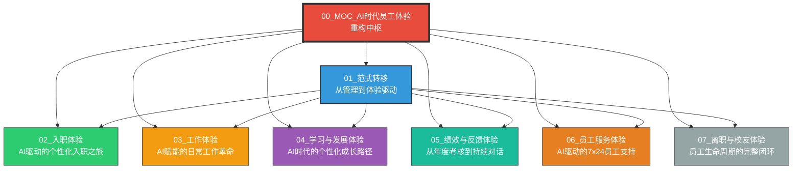
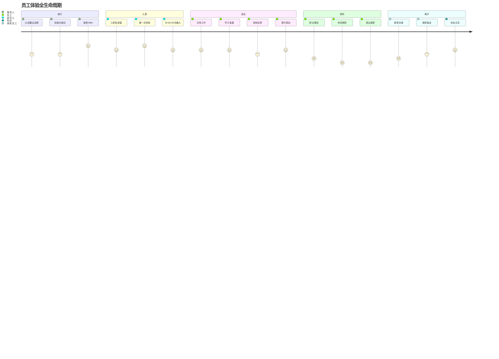
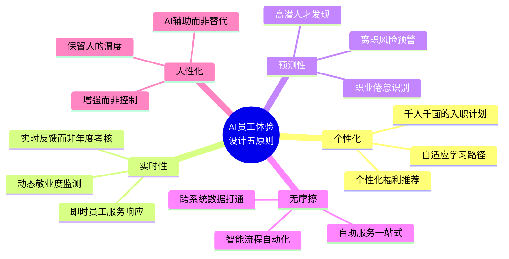
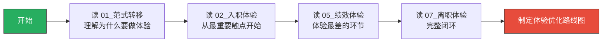
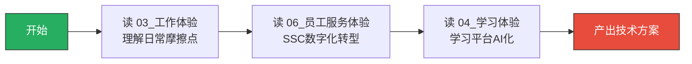
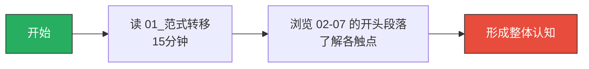

# AI时代员工体验重构 - MOC中枢

> [!note] 知识库定位
> 本知识库回答一个核心问题：**AI 如何重塑员工体验，从入职到离职的每一个关键触点？**
>
> 核心洞察：传统 HR 体系以"管理"为中心设计流程，员工体验（Employee Experience, EX）更像是副产品。AI 时代让"以员工为中心"的体验设计成为可能——个性化、实时、预测性的员工体验不再是口号。
>
> 差异化定位：已有知识库 [[03-HR人事/培训与人才发展/培训与人才发展_知识库建设方案]] 讲的是培训方法论，[[03-HR人事/绩效管理/00_MOC_绩效管理中枢]] 讲的是考核工具，[[03-HR人事/薪酬与激励/00_MOC_薪酬与激励中枢]] 讲的是薪酬设计，[[03-HR人事/HR三支柱与组织设计/00_MOC_HR三支柱与组织设计中枢]] 讲的是 HR 组织架构。**本知识库讲的是"员工的主观体验"**——从员工视角看，在 AI 时代工作是什么感受。

---

## 一、知识库导航图

---

## 二、员工体验全生命周期模型

---

## 三、核心框架：AI驱动的员工体验设计五原则

---

## 四、文档索引表

| 编号 | 文档名称 | 核心问题 | 关键词 | 适合谁读 |
|------|----------|----------|--------|----------|
| 01 | [[03-HR人事/AI时代员工体验重构/01_范式转移：从管理到体验驱动]] | 为什么员工体验从"Nice to have"变成"Must have"？ | EX定义、设计思维、JTBD、旅程地图 | 所有人 |
| 02 | [[03-HR人事/AI时代员工体验重构/02_入职体验：AI驱动的个性化入职之旅]] | AI如何让入职从"填表"变成"体验"？ | 预入职、智能引导、AI Buddy、30-60-90 | HRBP、HRIS |
| 03 | [[03-HR人事/AI时代员工体验重构/03_工作体验：AI赋能的日常工作革命]] | 日常工作流中AI如何消除摩擦？ | 任务优先级、会议管理、知识检索、决策支持 | 所有人 |
| 04 | [[03-HR人事/AI时代员工体验重构/04_学习与发展体验：AI时代的个性化成长路径]] | 学习如何从"推送"变成"按需"？ | 技能图谱、自适应学习、AI导师、职业导航 | TD、L&D |
| 05 | [[03-HR人事/AI时代员工体验重构/05_绩效与反馈体验：从年度考核到持续对话]] | 绩效管理的体验如何从"恐惧"变成"成长"？ | 持续反馈、OKR、偏见检测、发展对话 | HRBP、管理者 |
| 06 | [[03-HR人事/AI时代员工体验重构/06_员工服务体验：AI驱动的7x24员工支持]] | HR服务如何达到消费级体验？ | 智能工单、HR Chatbot、自助门户、SSC | SSC、HRIS |
| 07 | [[03-HR人事/AI时代员工体验重构/07_离职与校友体验：员工生命周期的完整闭环]] | 离职不该是终点，如何做好"最后一公里"？ | 离职面谈分析、校友网络、回旋镖员工 | HRBP、ER |

---

## 五、三条阅读路径

### 路径一：HR 管理者（约 90 分钟）

> [!note] 适合场景
> 你是一个 HR 负责人，需要制定 AI 时代的员工体验战略。先理解范式转移，再聚焦关键触点。

---

### 路径二：HRIS / 数字化负责人（约 75 分钟）

> [!note] 适合场景
> 你负责 HR 数字化系统建设，需要知道 AI 在哪些体验触点可以落地、怎么落地。

---

### 路径三：快速了解（约 30 分钟）

---

## 六、与已有知识库的关联

本知识库与以下已有知识库形成互补，不重复已有内容：

| 已有知识库 | 已有知识库讲什么 | 本知识库补充什么 |
|-----------|---------------|---------------|
| [[03-HR人事/培训与人才发展/培训与人才发展_知识库建设方案]] | 培训方法论、ADDIE、70-20-10 | 学习体验的"主观感受"——员工怎么感觉学习这件事 |
| [[03-HR人事/绩效管理/00_MOC_绩效管理中枢]] | KPI、OKR、BSC 工具与方法 | 绩效管理的"体验维度"——考核为什么让人焦虑，AI 怎么改变 |
| [[03-HR人事/薪酬与激励/00_MOC_薪酬与激励中枢]] | 薪酬结构、3P1M、长期激励 | 薪酬的"体验透明度"——员工如何感知公平性 |
| [[03-HR人事/HR三支柱与组织设计/00_MOC_HR三支柱与组织设计中枢]] | COE/HRBP/SSC 架构 | SSC 的"体验升级"——从服务交付到体验设计 |
| [[02-AI趋势与素养/AI Native组织变革/00_MOC_AI Native组织变革中枢]] | 组织架构变革、决策机制 | 组织变革中"员工的主观感受"——变革中的人的温度 |
| [[02-AI趋势与素养/AI时代能力要求/00_MOC_AI时代能力要求中枢]] | 能力模型重构、硬技能软技能 | 员工在 AI 时代的"成长感受"——能力焦虑与成长路径 |
| [[02-AI趋势与素养/人机协作阶段演进/00_MOC_人机协作阶段演进中枢]] | 从工具到共生的五个阶段 | 各阶段下"员工的实际工作体验" |

---

## 七、关键概念词汇表

| 概念 | 定义 | 详细文档 |
|------|------|----------|
| **员工体验（EX）** | 员工在整个生命周期中与组织所有互动的总和 | [[03-HR人事/AI时代员工体验重构/01_范式转移：从管理到体验驱动]] |
| ** Moments that Matter** | 员工旅程中情感强度最高的关键触点 | [[03-HR人事/AI时代员工体验重构/01_范式转移：从管理到体验驱动]] |
| **AI Buddy** | AI 驱动的虚拟伙伴，陪伴新员工完成入职融入 | [[03-HR人事/AI时代员工体验重构/02_入职体验：AI驱动的个性化入职之旅]] |
| **个性化入职** | 基于岗位、部门、背景、学习风格定制的入职计划 | [[03-HR人事/AI时代员工体验重构/02_入职体验：AI驱动的个性化入职之旅]] |
| **无摩擦工作流** | 消除日常工作中信息检索、流程审批、跨系统操作等摩擦 | [[03-HR人事/AI时代员工体验重构/03_工作体验：AI赋能的日常工作革命]] |
| **自适应学习** | 根据员工能力水平、学习偏好、职业目标动态调整的学习内容 | [[03-HR人事/AI时代员工体验重构/04_学习与发展体验：AI时代的个性化成长路径]] |
| **持续对话** | 以实时反馈替代年度考核的管理模式 | [[03-HR人事/AI时代员工体验重构/05_绩效与反馈体验：从年度考核到持续对话]] |
| **消费级HR服务** | 对标互联网消费产品体验的员工服务标准 | [[03-HR人事/AI时代员工体验重构/06_员工服务体验：AI驱动的7x24员工支持]] |
| **校友体验** | 离职后员工与组织保持联系、持续互动的整体感受 | [[03-HR人事/AI时代员工体验重构/07_离职与校友体验：员工生命周期的完整闭环]] |

---

## 八、使用建议

### 如果你是第一次来

1. 花 5 分钟浏览 MOC 中枢，建立整体认知
2. 选一条阅读路径，按顺序阅读
3. 重点关注你所在组织体验最薄弱的环节

### 如果你已经读过一遍

- 每个触点文档末尾都有"三个可以立即落地的行动"，可以直接作为项目启动参考
- 建议将 01_范式转移 作为团队共识材料，先拉齐认知再讨论具体方案

---

## 快速导航

- 想理解"为什么员工体验现在这么重要"？ -> [[03-HR人事/AI时代员工体验重构/01_范式转移：从管理到体验驱动]]
- 想做"入职体验"优化？ -> [[03-HR人事/AI时代员工体验重构/02_入职体验：AI驱动的个性化入职之旅]]
- 想提升"日常工作体验"？ -> [[03-HR人事/AI时代员工体验重构/03_工作体验：AI赋能的日常工作革命]]
- 想变革"学习发展体验"？ -> [[03-HR人事/AI时代员工体验重构/04_学习与发展体验：AI时代的个性化成长路径]]
- 想优化"绩效反馈体验"？ -> [[03-HR人事/AI时代员工体验重构/05_绩效与反馈体验：从年度考核到持续对话]]
- 想升级"员工服务体验"？ -> [[03-HR人事/AI时代员工体验重构/06_员工服务体验：AI驱动的7x24员工支持]]
- 想做好"离职与校友体验"？ -> [[03-HR人事/AI时代员工体验重构/07_离职与校友体验：员工生命周期的完整闭环]]