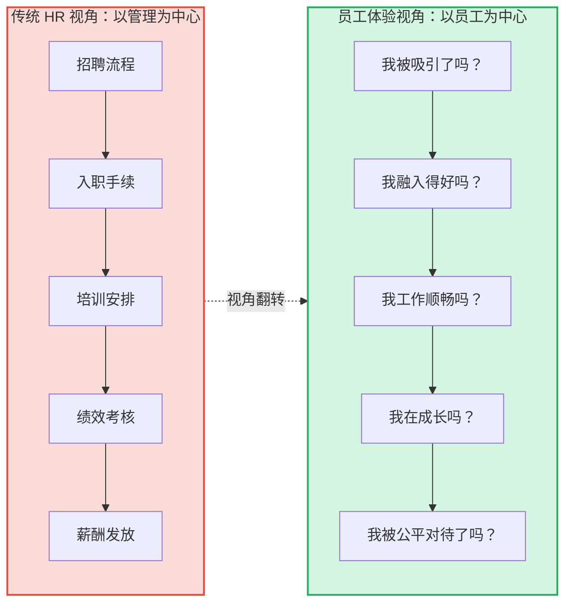
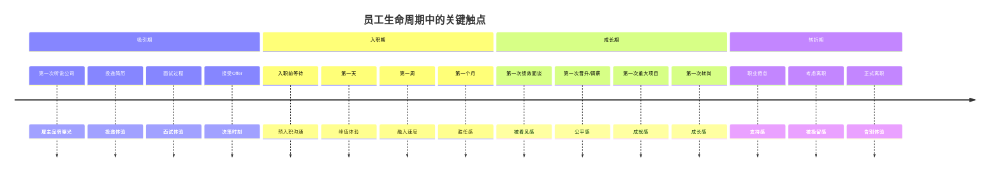
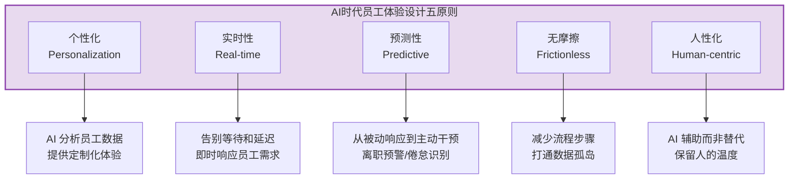
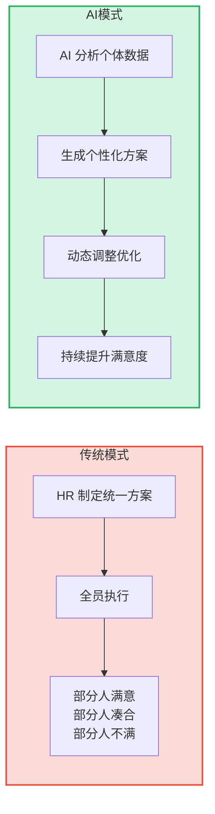

# 01 | 范式转移：从"管理"到"体验驱动"

> [!abstract] 一句话总结
> 传统 HR 以"管理"为中心设计流程，员工体验是副产品；AI 时代以"员工"为中心设计体验，管理效率是副产品。这不是技术的升级，而是思维的翻转。

---

## 一、什么是员工体验（EX）？

员工体验（Employee Experience, EX）是员工在整个生命周期中与组织所有互动的总和。它不是"员工满意度"的升级版，而是一个全新的视角。

> [!important] 关键区别
> 传统 HR 问的是"我们的流程对不对？"，员工体验问的是"员工的感受好不好？"。同一个入职流程，前者关注"表格填完了没"，后者关注"新员工第一天有没有归属感"。

---

## 二、为什么现在才谈"员工体验"？

员工体验不是新概念，但 AI 时代让它从"Nice to have"变成了"Must have"。原因有三：

### 1. 技术使能：个性化从"不可能"到"可规模化"

| 维度 | 传统时代 | AI 时代 |
|------|---------|---------|
| 入职计划 | 统一模板，全员一致 | 千人千面，依据岗位/背景/学习风格 |
| 学习推荐 | 培训部门统一排课 | 基于技能图谱的个性化推荐 |
| 绩效反馈 | 一年一次，几页纸 | 持续实时，多维数据支撑 |
| 员工服务 | 提工单，等2-3天 | 7x24 智能响应，秒级 |
| 福利选择 | 固定套餐 | 弹性福利，AI 推荐最优组合 |

### 2. 代际变化：新一代员工不再接受"流程优先于人"

- 95后/00后员工在消费端习惯了极致个性化体验（抖音、美团、淘宝）
- 对工作场景的体验期待自然提升——"为什么点外卖比提报销简单？"
- 员工体验成为**雇主品牌的核心差异化要素**

### 3. 竞争压力：体验 = 留存 = 生产力

- 良好的员工体验直接关联敬业度、留存率、生产力
- 替换一名员工的成本约为其年薪的 50%-200%
- 在 AI 时代，**优秀人才的选择权更大**，体验差的雇主将被淘汰

---

## 三、员工体验设计的核心框架

### 3.1 Moments that Matter（关键触点）

不是所有触点同等重要。员工体验设计的第一步是识别"Moments that Matter"——那些情感强度最高、对员工印象影响最大的时刻。

### 3.2 员工体验设计五原则

> [!tip] 面试可以这样说
> "员工体验的核心不是技术多先进，而是视角的翻转——从'我们怎么管理员工'变成'员工怎么感受工作'。AI 的价值在于让个性化体验规模化，这在以前是做不到的。"

---

## 四、AI 如何改变员工体验的底层逻辑

### 4.1 从"一刀切"到"千人千面"

### 4.2 从"被动响应"到"主动预测"

- **离职预警**：AI 分析行为数据（会议减少、请假增多、学习停滞），在员工提出离职前预警
- **倦怠识别**：通过工作节奏、邮件时间、加班模式等数据，识别潜在倦怠信号
- **高潜发现**：不只依赖经理提名，从多维数据中识别有潜力但未被发现的员工

### 4.3 从"流程驱动"到"数据驱动"

| 传统 EX 度量 | AI 时代 EX 度量 |
|-------------|---------------|
| 年度敬业度调查（1次/年） | 持续脉搏调查（每周/每月） |
| 离职面谈（事后） | 离职风险预警（事前） |
| 满意度评分（主观） | 行为数据 + 情感分析（多维） |
| 统一报告（静态） | 实时仪表盘（动态） |
| HR 部门分析 | 管理者自助分析 |

---

## 五、范式转移的三大障碍

### 障碍一：HR 的"流程思维"惯性

> [!warning] 常见误区
> "我们先优化流程，体验自然会好。"——但你优化的是"填表流程"还是"归属感体验"？后者无法通过流程优化实现。

**对策**：用设计思维（Design Thinking）替代流程思维，从员工旅程地图出发，而非从 HR 职能模块出发。

### 障碍二：数据孤岛与隐私边界

AI 驱动的个性化体验需要多维数据，但员工数据分散在不同系统（HRIS、OA、学习平台、绩效系统），且涉及隐私边界。

**对策**：优先打通"低敏感度、高体验价值"的数据（如学习偏好、工作风格），逐步推进。

### 障碍三：AI 的"温度"问题

> [!warning] 核心矛盾
> 越个性化越需要数据，越多数据越让员工觉得被监控。个性化体验和隐私保护之间的张力是 EX 设计的核心挑战。

**对策**：透明原则——让员工知道什么数据被收集、用于什么目的、带来什么好处。给员工选择权。

---

## 六、三个可以立即落地的行动

1. **绘制员工旅程地图**：选一个关键触点（建议从入职开始），用员工视角画出从"投递简历"到"入职第90天"的所有触点，标注每个触点的情感曲线（高/低）
2. **做一次"体验审计"**：随机访谈 5-10 名不同入职年限的员工，问一个问题："在公司的体验中，哪个环节让你最想吐槽？"
3. **建立 EX 衡量基线**：哪怕只用 NPS 一个问题（"你多大程度上愿意推荐朋友来公司工作？"），先有数据才能谈改善

---

## 关联笔记

- [[03-HR人事/AI时代员工体验重构/02_入职体验：AI驱动的个性化入职之旅]] — 从最重要的触点开始
- [[03-HR人事/培训与人才发展/00_MOC_培训与人才发展中枢]] — 学习体验的底层方法论
- [[03-HR人事/绩效管理/00_MOC_绩效管理中枢]] — 绩效体验的底层方法论
- [[02-AI趋势与素养/AI Native组织变革/00_MOC_AI Native组织变革中枢]] — 组织变革中员工体验的角色