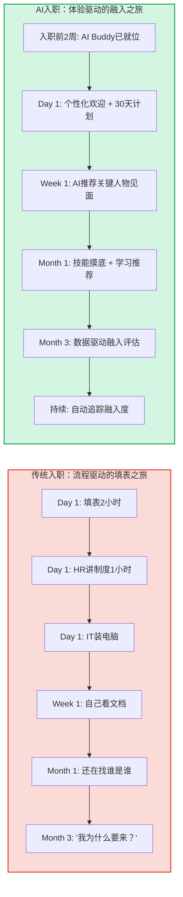
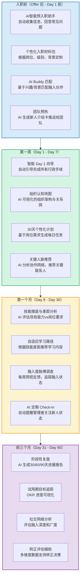
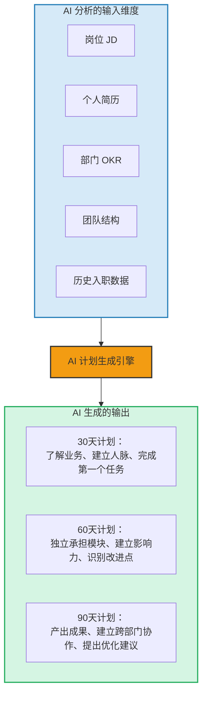
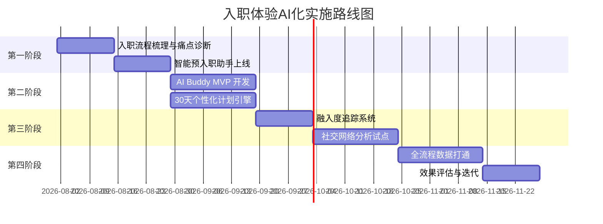

# 02 | 入职体验：AI驱动的个性化入职之旅

> [!abstract] 一句话总结
> 传统入职 = 填表 + 培训 + 放养。AI 时代的入职 = 个性化引导 + 智能陪伴 + 数据驱动的融入加速。新员工的前90天，决定了未来900天的归属感。

---

## 一、入职体验为什么是"一号触点"？

入职体验是员工旅程中**情感强度最高、记忆最深刻**的环节。第一天的体验会在员工心中形成"锚定效应"——后续所有体验都会与第一天对比。

> [!important] 数据说话
> - 良好的入职体验可使新员工留存率提高 82%，生产力提升 70% 以上
> - 约 20% 的员工流失发生在前 45 天
> - 新员工在前 90 天的体验直接决定其 3 年内的敬业度水平

---

## 二、AI 入职体验全景图

---

## 三、核心场景深度解析

### 场景一：AI Buddy —— 新员工的"数字导师"

AI Buddy 不是冷冰冰的聊天机器人，而是一个**有温度、有上下文的融入伙伴**。

| 维度 | 传统做法 | AI Buddy 做法 |
|------|---------|-------------|
| 问题解答 | 问 HR 或同事，不好意思反复问 | 随时问，不怕重复，回答一致 |
| 信息获取 | 翻 Wiki/文档，找不到或过时了 | 自然语言提问，实时检索最新信息 |
| 人脉推荐 | 靠 TL 介绍，覆盖面有限 | 基于协作网络分析，推荐跨部门关键联系人 |
| 进度追踪 | 靠 TL 自己记得，容易遗漏 | 自动提醒关键节点，追踪完成情况 |
| 情感支持 | 靠运气碰到好 TL | 定期情绪检测，发现异常提醒管理者 |

> [!tip] 设计要点
> AI Buddy 的关键不是"能回答多少问题"，而是"让新人敢于问问题"。很多新人不敢问"这个缩写是什么意思"，AI Buddy 解决了这个"不好意思问"的尴尬。

### 场景二：个性化 30-60-90 天计划

AI 根据以下维度自动生成个性化融入计划：
- 岗位类型（技术/产品/销售/职能）
- 级别（校招/社招/管理岗）
- 部门特性（大团队/小团队，成熟业务/创新业务）
- 个人背景（行业经验、公司规模经验、技能匹配度）

### 场景三：社交网络融入追踪

入职不仅仅是"做事"，更重要的是"融入"。AI 可以通过以下维度追踪新员工的社交融入度：

- **会议参与度**：被邀请参加哪些会议？主动发起哪些会议？
- **沟通网络**：与多少同事建立了沟通关系？跨部门沟通比例？
- **协作频次**：参与了多少项目协作？文档协作频次？
- **社交活动**：参与了哪些非正式活动？

> [!warning] 隐私边界提示
> 社交网络分析涉及隐私，需要透明告知员工、获得同意，且只用于支持融入而非监控。数据应聚合呈现趋势，而非追踪个人具体行为。

---

## 四、入职体验的衡量指标

| 指标 | 定义 | 目标值参考 |
|------|------|-----------|
| 入职 NPS | "你多大程度愿意推荐朋友来公司？"（入职第30天/90天） | > 50 |
| 30天胜任感 | 新员工自评"我感觉能胜任工作"的比例 | > 80% |
| 90天留存率 | 入职90天内未离职的比例 | > 95% |
| 行政手续完成率 | Day 1 所有行政手续自动完成的比例 | > 90% |
| 关键人脉建立率 | 入职30天内与至少5名关键联系人建立联系的比例 | > 80% |
| 入职计划完成率 | 个性化30天计划的任务完成率 | > 85% |

---

## 五、实施路线图

---

## 六、三个可以立即落地的行动

1. **做一次"入职体验神秘客"**：以新员工身份走一遍入职流程，记录每个触点的实际感受和耗时，找出最痛的三个环节
2. **建立入职 NPS 基线**：对近3个月入职的员工做一次 NPS 调研，建立改善前的基线数据
3. **设计一个 AI Buddy MVP**：不需要技术开发，先用现有工具（企业微信机器人 + 知识库）搭一个"新人问答机器人"，验证"AI Buddy"概念的需求真实性

---

## 关联笔记

- [[03-HR人事/AI时代员工体验重构/01_范式转移：从管理到体验驱动]] — 入职体验的底层逻辑
- [[03-HR人事/AI时代员工体验重构/03_工作体验：AI赋能的日常工作革命]] — 入职后的日常体验
- [[03-HR人事/AI时代员工体验重构/04_学习与发展体验：AI时代的个性化成长路径]] — 入职后的学习路径
- [[03-HR人事/培训与人才发展/02-核心理论/05_70-20-10法则]] — 入职融入的 70-20-10 应用