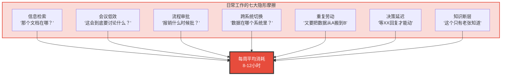
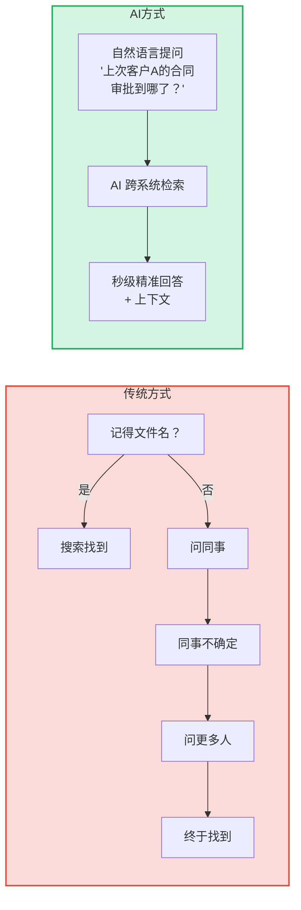
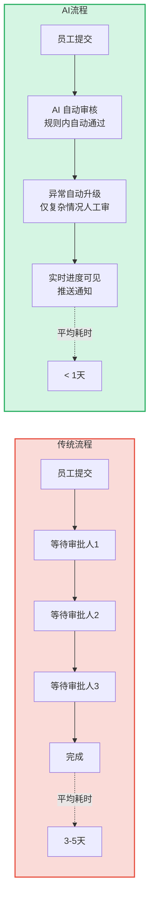
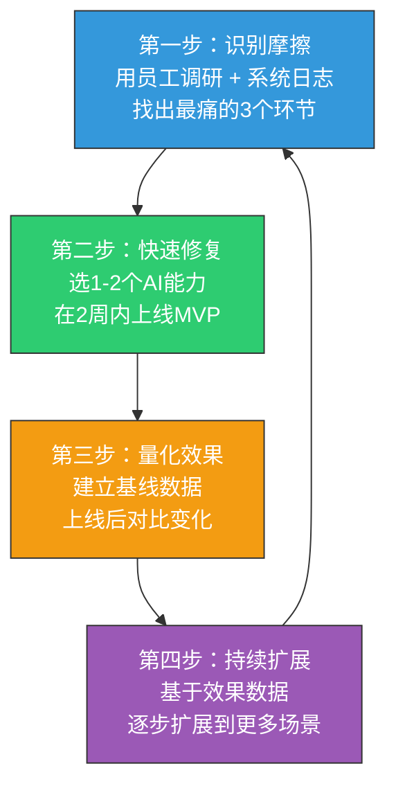

# 03 | 工作体验：AI赋能的日常工作革命

> [!abstract] 一句话总结
> 员工每天最深的体验不是年终奖发多少，而是"找文件花了20分钟"、"会议讨论又跑题了"、"报销流程走了3天"。AI 赋能日常工作的核心，是消除这些微小但累积的摩擦。

---

## 一、日常工作的"隐形摩擦"

员工对工作的体验，80% 来自日常琐事，而非宏大战略。这些"隐形摩擦"单个很小，但累积起来严重消耗精力和敬业度。

> [!important] 关键洞察
> 消除隐形摩擦不是"让员工更忙"，而是"让员工能把精力花在真正重要的事上"。这比任何团建活动都更能提升日常幸福感。

---

## 二、AI 赋能日常工作的六大场景

### 场景一：智能知识检索

**痛点**：员工每天花 20-30% 的时间找信息。"那个文档在哪？""上次会议纪要发了吗？""这个流程谁负责？"

**AI 解法**：企业级 AI 知识助手，连通所有文档、邮件、聊天记录，支持自然语言检索。

### 场景二：智能会议管理

**痛点**：平均每天 2-3 小时在会议上，其中 30% 的时间是无效的。

**AI 解法**：

| AI 能力 | 解决什么问题 | 效果 |
|---------|------------|------|
| 自动会议纪要 | 不用边听边记，会后有完整记录 | 会议参与度提升 40% |
| 待办事项自动提取 | 不会漏掉会议中的 Action Items | 任务完成率提升 30% |
| 会议效率分析 | 识别"这个会该不该开、该谁来" | 无效会议减少 25% |
| 智能日程安排 | 自动找所有人的空闲时间 | 排会时间减少 80% |
| 会前资料自动汇总 | 参会者提前了解议题背景 | 会议效率提升 35% |

### 场景三：智能流程自动化

**痛点**：报销、请假、采购、合同审批等流程繁琐且不透明。

**AI 解法**：

### 场景四：智能写作辅助

**痛点**：写周报、邮件、方案、PPT 占用了大量时间。

**AI 解法**：
- **周报/日报自动生成**：基于日历、邮件、文档活动自动生成初稿
- **邮件智能撰写**：理解上下文，辅助撰写专业邮件
- **方案初稿生成**：给定大纲和要点，AI 生成初稿供修改
- **PPT 智能排版**：从文档自动生成演示文稿

### 场景五：智能决策支持

**痛点**：做决策时不知道有没有遗漏信息，等关键人回复拖延进程。

**AI 解法**：
- **决策信息汇总**：输入决策问题，AI 自动汇总相关数据、历史决策、风险提示
- **数据自助分析**：自然语言问"上个月华南区销售额同比变化"，AI 自动生成图表
- **智能提醒**：关键节点无人响应时，AI 自动升级或提醒

### 场景六：个性化工作流

**痛点**：每个人工作习惯不同，但系统是统一的。

**AI 解法**：
- AI 学习个人工作节奏（什么时间专注力最强、什么时间适合开会）
- 自动推荐"专注时间块"，保护深度工作时间
- 根据个人偏好定制通知频率和方式

---

## 三、工作体验的衡量指标

| 指标 | 定义 | 测量方式 |
|------|------|---------|
| 信息检索时间 | 查找工作所需信息的平均耗时 | 系统日志 + 问卷 |
| 工具切换次数 | 日均在不同系统间切换的次数 | 系统日志 |
| 流程完成时间 | 报销/请假/采购等流程的平均耗时 | 系统日志 |
| 会议效率评分 | 员工对会议效率的自评分数 | 每周脉搏调查 |
| 深度工作时间 | 日均不被中断的连续工作时间 | 日历分析 + 自评 |
| 工作摩擦指数 | 综合以上维度的复合指标 | 系统数据 + 员工调研 |

---

## 四、实施建议：从"最痛的摩擦"开始

> [!tip] 关键原则
> 不要试图一次性解决所有摩擦。聚焦"高频 + 高痛"的环节——比如信息检索（每个员工每天都遇到），先把它做到极致，再扩展。

---

## 五、三个可以立即落地的行动

1. **做一次"工作摩擦审计"**：让团队记录一周内"让我停下来找不到东西或等人的时刻"，统计最频繁的摩擦类型
2. **引入 AI 会议纪要工具**：这是最易落地且效果立竿见影的 AI 场景——可用飞书妙记、腾讯会议 AI 纪要等现成工具
3. **搭建企业知识库 MVP**：用飞书知识库/语雀/Notion 等工具，先集中沉淀高频提问的答案，后期再接入 AI 检索

---

## 关联笔记

- [[03-HR人事/AI时代员工体验重构/01_范式转移：从管理到体验驱动]] — 日常体验的底层逻辑
- [[03-HR人事/AI时代员工体验重构/02_入职体验：AI驱动的个性化入职之旅]] — 入职后的日常延续
- [[03-HR人事/AI时代员工体验重构/06_员工服务体验：AI驱动的7x24员工支持]] — 流程审批与员工服务
- [[02-AI趋势与素养/非技术人员与技术边界/03_HR+AI场景的边界地图]] — 哪些日常工作场景适合 AI 化