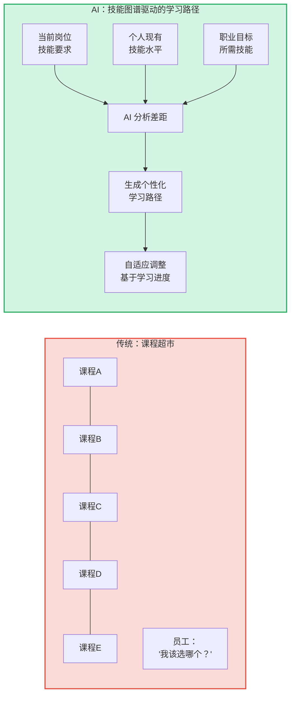
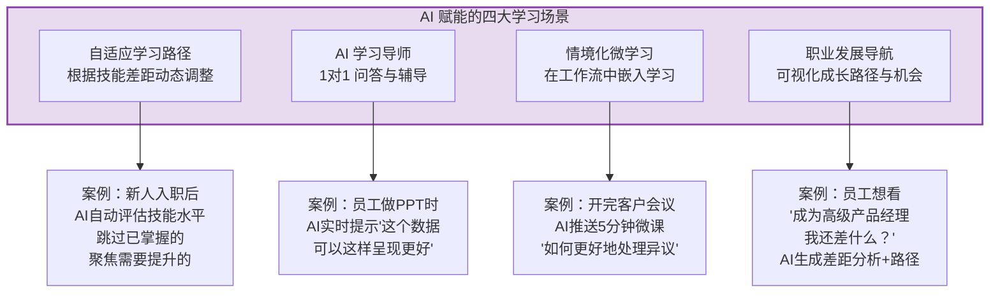
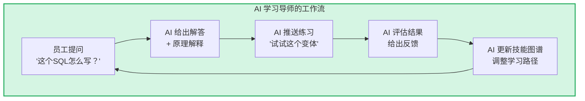
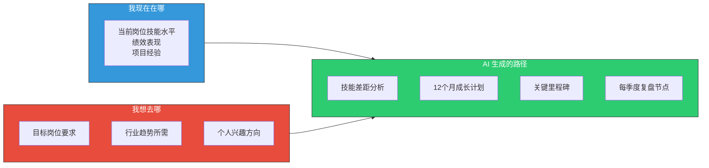

# 04 | 学习与发展体验：AI时代的个性化成长路径

> [!abstract] 一句话总结
> 传统学习 = "培训部门安排什么，你学什么"。AI 时代的学习 = "你需要什么，系统就推荐什么"。从"推送"到"按需"，从"课程"到"旅程"。

---

## 一、传统学习体验的三大痛点

```mermaid
graph TD
    subgraph 痛点1["痛点一：一刀切"]
        P1A["培训部门统一排课"] --> P1B["300人听同一门课"]
        P1B --> P1C["30%的人已经会了<br/>40%的人刚好需要<br/>30%的人听不懂"]
    end

    subgraph 痛点2["痛点二：与工作脱节"]
        P2A["培训是"单独的一件事""] --> P2B["上课时觉得有用"]
        P2B --> P2C["回到工位全忘了"]
        P2C --> P2D["培训 ROI 难以衡量"]
    end

    subgraph 痛点3["痛点三：成长路径不清晰"]
        P3A["员工问：'我下一步该学什么？'"] --> P3B["HR：'看你的 IDP'"]
        P3B --> P3C["IDP 是年初填的<br/>半年没更新了"]
        P3C --> P3D["员工迷茫，HR 焦虑"]
    end

    style 痛点1 fill:#fadbd8,stroke:#e74c3c,stroke-width:2px
    style 痛点2 fill:#fcf3cf,stroke:#f39c12,stroke-width:2px
    style 痛点3 fill:#d6eaf8,stroke:#2980b9,stroke-width:2px
```

> [!important] 核心矛盾
> 传统培训体系的本质是"供给驱动"：培训部门有什么资源，就提供什么课程。员工体验的本质应该是"需求驱动"：员工需要什么能力，就有什么学习路径。

---

## 二、AI 驱动的学习体验新范式

### 2.1 从"课程超市"到"技能图谱"

### 2.2 四大 AI 学习场景

---

## 三、核心场景深度解析

### 场景一：自适应学习路径

AI 驱动的自适应学习与传统学习路径的核心区别：

| 维度 | 传统学习路径 | AI 自适应学习路径 |
|------|------------|-----------------|
| 路径设计者 | 培训部门统一设计 | AI 基于个人数据动态生成 |
| 内容适配 | 所有人类似 | 千人千面，基于技能差距 |
| 节奏控制 | 固定课表 | 按个人学习速度自适应 |
| 内容跳过 | 不支持 | 已掌握的内容自动跳过 |
| 难度调节 | 固定难度 | 根据学习表现动态调整 |
| 内容形式 | 统一格式 | 根据学习风格推荐（视频/文字/实操） |
| 更新频率 | 季度/年度 | 实时 |

> [!tip] 面试可以这样说
> "自适应学习不是把课程推荐做得更准，而是把'学习'这件事从'HR 安排'变成'员工需要'。核心是建立技能图谱，让 AI 能实时判断'这个人现在缺什么'和'下一步该学什么'。"

### 场景二：AI 学习导师

AI 学习导师（AI Learning Coach）是员工身边的"1对1 学习伙伴"：

- **即时答疑**：工作中遇到问题，AI 即时给出解释和建议
- **技能练习**：AI 出题、批改、给出反馈（如编程练习、外语对话、销售话术演练）
- **学习督促**：根据学习计划，温和地提醒和鼓励
- **学习复盘**：定期总结学习进展，调整学习策略

### 场景三：情境化微学习

最关键的理念转变：**学习不是"单独的一件事"，而是工作流的一部分**。

| 情境 | 触发时机 | AI 推送内容 |
|------|---------|-----------|
| 会议前 | 日程中有"跨部门沟通"相关会议 | 5分钟微课："跨部门沟通的三个关键" |
| 会议后 | 刚结束客户会议 | 基于会议纪要的改进建议 |
| 任务前 | 即将开始一个新类型的任务 | 该任务的最佳实践和常见坑 |
| 犯错后 | 工作产出中检测到错误 | 相关知识点的复习内容 |
| 晋升前 | 进入晋升窗口期 | 晋升所需能力的差距分析 |

### 场景四：职业发展导航

AI 驱动的职业发展导航，让员工对自己的成长路径"看得见"：

---

## 四、学习体验的衡量指标

| 指标 | 传统衡量 | AI 时代衡量 |
|------|---------|-----------|
| 学习覆盖率 | 参训人数/总人数 | 个性化学习路径完成率 |
| 学习满意度 | 课程评分（4.5/5） | 学习 NPS + 行为改变率 |
| 学习转化 | 难以衡量 | 学后行为数据变化（如：学完SQL后，实际写SQL的次数） |
| 技能提升 | 培训前后测试 | 持续技能图谱更新 |
| ROI | 模糊估算 | 技能提升→绩效变化→业务结果的数据链路 |

---

## 五、与培训和人才发展知识库的关系

> [!note] 避免重复的边界
> 本知识库聚焦**学习体验的主观感受**——员工怎么感觉学习这件事、学习的摩擦在哪、AI 如何消除这些摩擦。
>
> [[03-HR人事/培训与人才发展/培训与人才发展_知识库建设方案]] 知识库聚焦**学习的方法论**——ADDIE、70-20-10、柯氏评估、TNA 等。两者互补：
> - 本知识库回答"学习体验好不好"（主观维度）
> - 培训与人才发展回答"培训体系对不对"（客观维度）

---

## 六、三个可以立即落地的行动

1. **建立技能图谱 MVP**：选一个核心岗位（如产品经理），梳理该岗位的 10-15 项关键技能，标注每项技能从 L1 到 L5 的行为描述，作为 AI 自适应学习的基础
2. **引入 AI 学习问答功能**：在现有学习平台或企业微信中接入 AI 问答，让员工可以"用自然语言提问学习相关的问题"，验证需求
3. **做一次"学习体验审计"**：访谈 10 名不同岗位的员工，问"你最近一次学习新技能是什么时候？是怎么学的？遇到什么困难？"——了解实际学习行为与培训部门认知的差距

---

## 关联笔记

- [[03-HR人事/AI时代员工体验重构/01_范式转移：从管理到体验驱动]] — 学习体验的底层逻辑
- [[03-HR人事/培训与人才发展/00_MOC_培训与人才发展中枢]] — 培训体系方法论
- [[02-AI趋势与素养/AI时代能力要求/00_MOC_AI时代能力要求中枢]] — 技能图谱与能力模型
- [[03-HR人事/AI时代员工体验重构/02_入职体验：AI驱动的个性化入职之旅]] — 入职后的学习路径起点