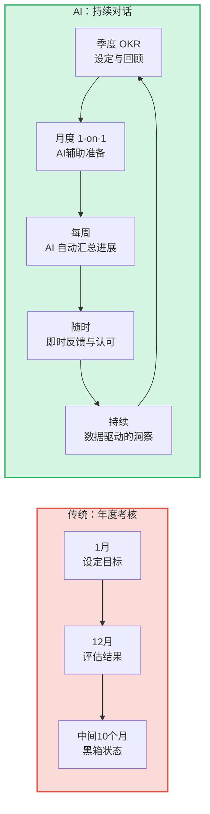
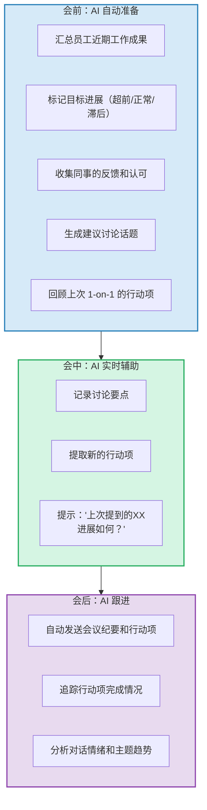

# 05 | 绩效与反馈体验：从年度考核到持续对话

> [!abstract] 一句话总结
> 传统绩效管理是员工体验的"至暗时刻"——一年一次、焦虑等待、数字定生死。AI 时代让绩效管理从"审判"变成"对话"，从"算账"变成"成长"。

---

## 一、传统绩效管理的"体验灾难"

```mermaid
graph TD
    subgraph 员工体验["员工视角：年度绩效评估的痛苦旅程"]
        E1["年初：写下可能<br/>完不成的目标"] --> E2["年中：没人提起<br/>那些目标了"]
        E2 --> E3["年底：突击回忆<br/>这一年做了什么"]
        E3 --> E4["面谈前：焦虑<br/>'会是什么结果？'"]
        E4 --> E5["面谈中：被动接受<br/>一个数字和几句评语"]
        E5 --> E6["面谈后：'所以<br/>我到底该怎么提升？'"]
    end

    subgraph 管理者体验["管理者视角：同样痛苦"]
        M1["年初：给10个人<br/>设定目标"] --> M2["年中：太忙了<br/>没时间追踪"]
        M2 --> M3["年底：强制分布<br/>必须有人得低分"]
        M3 --> M4["面谈：不知道<br/>怎么给反馈"]
        M4 --> M5["面谈后：员工<br/>士气下降"]
    end

    style 员工体验 fill:#fadbd8,stroke:#e74c3c,stroke-width:2px
    style 管理者体验 fill:#fcf3cf,stroke:#f39c12,stroke-width:2px
```

> [!important] 核心问题
> 传统绩效管理是"回顾过去"（你去年做了什么），而非"面向未来"（你接下来怎么成长）。这让绩效面谈变成了"算账会"而非"发展对话"。

---

## 二、AI 驱动的绩效与反馈新范式

### 2.1 从"年度考核"到"持续对话"

### 2.2 五大 AI 赋能的绩效体验场景

| 场景 | 痛点 | AI 解法 | 体验提升 |
|------|------|---------|---------|
| 目标设定 | 目标不合理、不对齐 | AI 基于历史数据和团队 OKR 推荐目标 | 目标更合理，减少"拍脑袋" |
| 进展追踪 | 管理者不知道员工在做什么 | AI 自动汇总工作成果，生成进展报告 | 管理者省时，员工不被"催命" |
| 反馈质量 | 反馈泛泛、不具体 | AI 基于工作数据提供具体行为事例 | 反馈更有用，不再"挺好的" |
| 偏见检测 | 评分受近因效应、光环效应影响 | AI 分析评分模式，标记潜在偏见 | 更公平，减少"感觉打分" |
| 发展建议 | 面谈完不知道下一步 | AI 生成个性化发展建议和资源推荐 | 从"被评价"变成"被赋能" |

---

## 三、核心场景深度解析

### 场景一：AI 辅助的 1-on-1 对话

1-on-1（一对一沟通）是绩效体验的核心触点，但大多数管理者做不好。AI 可以大幅提升 1-on-1 的质量：

### 场景二：公平性——AI 偏见检测

绩效评估中的偏见是员工体验最差的来源之一。AI 可以检测以下偏见类型：

| 偏见类型 | 表现 | AI 如何检测 |
|---------|------|-----------|
| 近因效应 | 只记得最近2个月的表现 | 对比全年数据分布 |
| 光环效应 | 一个亮点掩盖所有不足 | 多维度独立评分对比 |
| 相似性偏见 | 对"像自己"的人打分更高 | 分析评分者与被评者的相似度 |
| 集中趋势 | 所有人都打3分（满分5分） | 评分分布分析 |
| 严苛/宽松偏差 | 有些管理者永远给低分/高分 | 跨团队评分校准 |
| 性别/年龄偏见 | 特定群体系统性偏低 | 分组统计对比 |

> [!warning] 重要提醒
> AI 偏见检测本身也要防止偏见——检测算法可能带有训练数据中的偏见。需要保持"AI 标记 + 人工复核"的双重机制。

### 场景三：即时反馈与认可

绩效体验的另一个关键转变：从"年底才知道自己好不好"到"随时知道自己的贡献被看见"。

- **AI 自动识别贡献**：从工作数据中识别值得认可的行为（如"帮助新人解决问题"、"主动承担棘手任务"）
- **智能推荐认可**：AI 提示管理者"XX 上周完成了XX，值得认可"
- **公开认可墙**：自动汇总团队认可，形成可视化的"贡献地图"
- **认可与绩效关联**：认可数据作为绩效评估的参考维度之一

---

## 四、绩效体验的衡量指标

| 指标 | 传统衡量 | AI 时代衡量 |
|------|---------|-----------|
| 绩效管理满意度 | 年度问卷"你对绩效体系满意吗" | 持续脉搏调查："上次面谈对你有帮助吗？" |
| 反馈质量 | 难以衡量 | 反馈具体性评分（AI 自动评估） |
| 目标透明度 | 无法衡量 | 目标对齐度、目标更新频率 |
| 公平感知 | 年度问卷 | 评分分布分析 + 员工公平感知调研 |
| 发展导向 | 面谈后有无发展计划 | 发展计划完成率 + 行为变化追踪 |

---

## 五、与绩效管理知识库的关系

> [!note] 避免重复的边界
> 本知识库聚焦**绩效管理的体验维度**——考核为什么让人焦虑、如何让反馈变成"被赋能"的感觉、AI 如何消除偏见。
>
> [[03-HR人事/绩效管理/00_MOC_绩效管理中枢]] 知识库聚焦**绩效管理的工具方法**——KPI、OKR、BSC、绩效循环、强制分布等。两者互补：
> - 本知识库回答"绩效体验好不好"（主观感受）
> - 绩效管理回答"绩效工具对不对"（客观方法）

---

## 六、三个可以立即落地的行动

1. **做一次"绩效体验审计"**：匿名访谈 10 名员工，问"上次绩效面谈你最大的感受是什么？用一个词形容"。如果"焦虑"、"走过场"、"不公平"是高频词，就找到了改进起点
2. **引入 AI 会议纪要工具辅助 1-on-1**：先用飞书妙记/腾讯会议 AI 纪要等工具记录 1-on-1 对话，自动提取行动项，让管理者专注于"对话"而非"记录"
3. **建立"即时认可"文化**：在团队协作工具中建立一个 #shoutout 频道，鼓励大家随时公开认可同事的贡献——这是成本最低、体验提升最明显的绩效体验改进

---

## 关联笔记

- [[03-HR人事/AI时代员工体验重构/01_范式转移：从管理到体验驱动]] — 绩效体验的底层逻辑
- [[03-HR人事/绩效管理/00_MOC_绩效管理中枢]] — 绩效管理工具方法论
- [[03-HR人事/AI时代员工体验重构/03_工作体验：AI赋能的日常工作革命]] — 日常工作与绩效的关联
- [[02-AI趋势与素养/AI时代能力要求/00_MOC_AI时代能力要求中枢]] — 绩效反馈中的能力发展