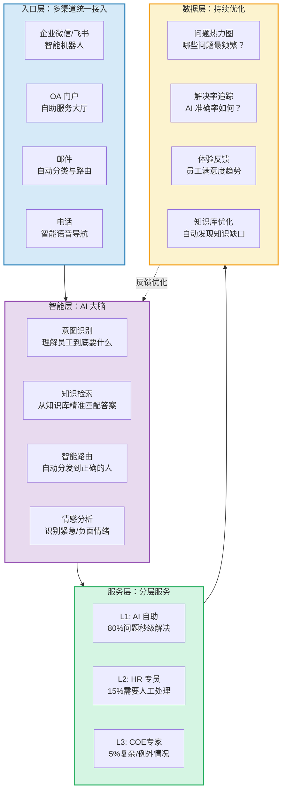
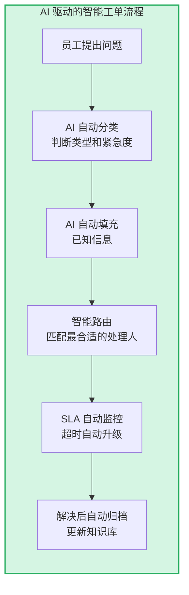
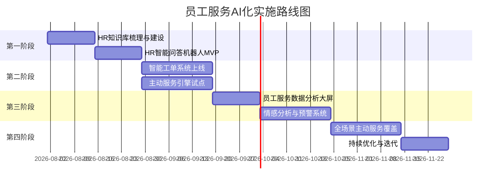

# 06 | 员工服务体验：AI驱动的7x24员工支持

> [!abstract] 一句话总结
> "为什么点外卖只需要3步，提报销需要7个审批？"——员工服务体验的终极目标，是让 HR 服务达到"消费级体验"的标准。AI 让这件事从"不可能"变成"可以逐步实现"。

---

## 一、传统员工服务的"体验瓶颈"

```mermaid
graph TD
    subgraph 员工视角["员工视角：一个简单问题的痛苦之旅"]
        E1["有问题要问 HR"] --> E2["打开 OA/企业微信<br/>不知道找谁"]
        E2 --> E3["找到 HR 联系人<br/>发消息"]
        E3 --> E4["等了半天<br/>HR 回复：'这个要找XX'"]
        E4 --> E5["转给另一个人<br/>重新描述问题"]
        E5 --> E6["等了2天<br/>终于解决"]
        E6 --> E7["下次类似问题<br/>重复以上流程"]
    end

    subgraph HR视角["HR 视角：同样痛苦"]
        H1["每天收到大量<br/>重复问题"] --> H2["'年假怎么算？'<br/>回答了100遍"]
        H2 --> H3["花60%时间在<br/>事务性工作上"]
        H3 --> H4["没时间做<br/>战略性工作"]
        H4 --> H5["员工不满意<br/>HR 也委屈"]
    end

    style 员工视角 fill:#fadbd8,stroke:#e74c3c,stroke-width:2px
    style HR视角 fill:#fcf3cf,stroke:#f39c12,stroke-width:2px
```

> [!important] 核心矛盾
> HR 想提供"战略价值"，但被事务性工作淹没。员工想要"即时响应"，但得到的是一层层转接。AI 解决的核心矛盾是：**让高频重复问题自动化，让 HR 释放精力做真正需要人的事**。

---

## 二、AI 员工服务全景图

---

## 三、核心场景深度解析

### 场景一：HR 智能问答机器人

这是员工服务体验最直观的 AI 应用，也是落地最快的。

| 维度 | 传统 HR 服务 | AI 智能问答 |
|------|------------|-----------|
| 响应时间 | 数小时到数天 | 秒级 |
| 服务时间 | 工作日 9:00-18:00 | 7x24 |
| 答案一致性 | 不同 HR 可能给出不同答案 | 统一标准答案 |
| 问题覆盖面 | 受限于 HR 个人知识 | 全量知识库覆盖 |
| 问题追溯 | 聊天记录分散 | 全量记录可追溯 |
| 持续优化 | 依赖 HR 个人复盘 | 数据驱动的自动优化 |

**典型问答场景**：
- 政策类：年假怎么算？婚假多少天？报销标准是什么？
- 流程类：转正流程怎么走？离职需要什么手续？
- 证明类：收入证明怎么开？在职证明去哪办？
- 福利类：公积金怎么提取？补充医疗怎么报销？

### 场景二：智能工单系统

对于 AI 无法解决的复杂问题，自动生成工单并智能路由：

### 场景三：主动式员工服务

AI 让员工服务从"被动响应"走向"主动服务"：

| 主动服务场景 | 触发条件 | AI 动作 |
|------------|---------|---------|
| 入职服务 | 新员工入职日期临近 | 自动推送入职准备清单、IT 设备申请、首日安排 |
| 生育服务 | 员工申报怀孕 | 自动推送产假政策、生育津贴申请流程、哺乳假权益 |
| 周年提醒 | 入职周年日 | 自动推送福利更新、年假余额、晋升窗口提醒 |
| 政策变更 | 新政策发布 | 推送"与你相关的变化"（而非全员统一通知） |
| 合同到期 | 合同到期前60天 | 自动提醒管理者和员工，推送续签流程 |
| 转正提醒 | 试用期到期前30天 | 提醒管理者准备转正评估材料 |

### 场景四：员工服务数据分析

AI 将员工服务数据转化为洞察：

- **问题热力图**：哪些问题最频繁？哪个部门问得最多？什么时间咨询高峰？
- **服务缺口分析**：哪些问题 AI 解决率低？说明知识库需要补充
- **员工情绪趋势**：从沟通语气中识别负面情绪上升趋势
- **流程优化建议**：如果"报销流程"咨询量持续高，说明流程本身需要优化

---

## 四、员工服务体验的衡量指标

| 指标 | 定义 | 目标值参考 |
|------|------|-----------|
| 首次解决率（FCR） | 员工第一次接触就解决问题的比例 | > 80% |
| AI 自助解决率 | 无需人工介入，AI 独立解决的比例 | > 60% |
| 平均响应时间 | 从提问到首次回复的时间 | < 1分钟（AI）/< 4小时（人工） |
| 平均解决时间 | 从提问到问题关闭的时间 | < 24小时 |
| 员工服务 NPS | "你对HR服务的体验满意吗？" | > 50 |
| 重复问题率 | 同一问题被反复提问的比例 | 持续下降 |

---

## 五、与 HR 三支柱知识库的关系

> [!note] 避免重复的边界
> 本知识库聚焦**员工服务的主观体验**——员工办事的便利性、响应的即时性、服务的温度。
>
> [[03-HR人事/HR三支柱与组织设计/00_MOC_HR三支柱与组织设计中枢]] 知识库聚焦**SSC 的组织架构和运营模式**——SSC 的定位、分层服务模型、服务标准等。两者互补：
> - 本知识库回答"员工办事体验好不好"（主观感受）
> - HR三支柱回答"SSC 架构对不对"（组织设计）

---

## 六、实施路线图

---

## 七、三个可以立即落地的行动

1. **做一次"HR服务体验审计"**：以一个普通员工的身份，尝试完成5个常见HR服务（查年假余额、提交报销、问公积金政策、申请在职证明、了解转正流程），记录每个操作的耗时、步骤数和感受
2. **搭建 HR 常见问题知识库**：收集过去3个月 HR 收到的所有问题，分类整理，写出标准答案——这是 HR 智能问答机器人的基础。哪怕没有 AI，有一个好的 FAQ 页面也是巨大的体验提升
3. **引入企业微信/飞书机器人**：用现有平台（企业微信机器人、飞书机器人）搭建一个 MVP 版 HR 问答，先覆盖 Top 20 高频问题，验证需求

---

## 关联笔记

- [[03-HR人事/AI时代员工体验重构/01_范式转移：从管理到体验驱动]] — 员工服务的底层逻辑
- [[03-HR人事/HR三支柱与组织设计/00_MOC_HR三支柱与组织设计中枢]] — SSC 组织架构
- [[03-HR人事/AI时代员工体验重构/03_工作体验：AI赋能的日常工作革命]] — 流程审批与日常体验
- [[02-AI趋势与素养/非技术人员与技术边界/03_HR+AI场景的边界地图]] — HR 服务场景的 AI 化边界