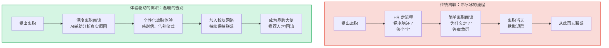
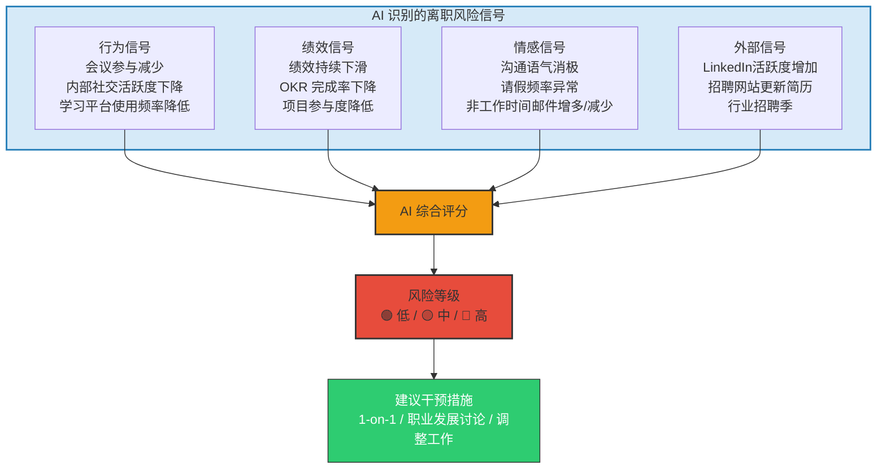
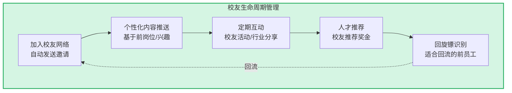
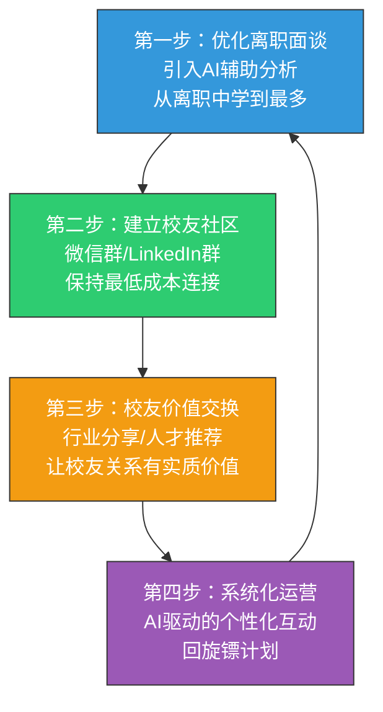

# 07 | 离职与校友体验：员工生命周期的完整闭环

> [!abstract] 一句话总结
> 离职不是员工体验的终点，而是下一个阶段的起点。99% 的公司把离职当"手续"，1% 的公司把离职当"关系升级"。AI 让后者从"有心无力"变成"可以系统化运营"。

---

## 一、离职体验：为什么"最后一公里"最重要？

> [!important] 关键数据
> - 离职员工的推荐意愿直接影响雇主品牌——一个糟糕的离职体验可能产生 10+ 个负面口碑
> - 约 15% 的员工会在未来 5 年内"回旋镖"（Boomerang）——回到原公司
> - 校友网络是最被低估的招聘渠道之一——校友推荐的人才质量通常高于平均水平

---

## 二、AI 赋能的离职与校友体验全景

### 2.1 离职前：AI 离职风险预警

在员工提出离职之前，AI 可以通过多维数据预警：

> [!warning] 伦理与隐私边界
> 离职预警是最敏感的员工数据分析场景之一。需要遵循：透明告知（员工知道哪些数据被分析）、聚合使用（不针对个人做"标签化"）、以人为本（预警的目的是支持而非控制）。

### 2.2 离职中：AI 辅助的深度离职面谈

| 维度 | 传统离职面谈 | AI 辅助离职面谈 |
|------|------------|---------------|
| 面谈准备 | HR 凭感觉问 | AI 基于员工数据生成个性化问题清单 |
| 真实原因挖掘 | 靠 HR 经验判断 | AI 分析回答模式，标记"可能不是真实原因" |
| 面谈质量 | 因 HR 能力而异 | AI 实时提示追问方向 |
| 数据分析 | 手工统计，无法聚类 | AI 自动聚类，发现共性离职原因 |
| 行动建议 | 面谈完就完了 | AI 自动生成改进建议，推送给相关部门 |

**AI 离职面谈辅助示例**：
- 员工说"个人原因" → AI 提示："该员工近3个月绩效下降20%，且与TL的1-on-1频率从每周降为每月，建议追问工作体验"
- 员工说"薪资问题" → AI 提示："该员工薪资处于同级别P75分位，可能不是真实原因，建议追问成长空间"
- 员工说"想换个方向" → AI 提示："内部是否有转岗机会可以匹配？近3个月内部活水岗位有X个相关"

### 2.3 离职后：AI 驱动的校友网络

离职不是终点，而是关系的升级。AI 让校友网络运营从"有心无力"变成"系统化可执行"：

**AI 校友运营的关键能力**：
- **个性化内容推荐**：基于前员工的行业、岗位、兴趣，推送相关的内容（行业报告、公司新闻、校友动态）
- **智能活动推荐**：AI 分析校友的活跃度和兴趣，推荐合适的线上/线下活动
- **回旋镖识别**：AI 追踪前员工的发展轨迹，识别"适合回流的时机"（如：新公司不如预期、技能已大幅提升）
- **推荐激励管理**：自动追踪校友推荐的人才，管理推荐奖金

### 2.4 离职数据的价值挖掘

AI 将离职数据从"沉睡的档案"变成"战略洞察"：

| 分析维度 | 传统方式 | AI 方式 |
|---------|---------|---------|
| 离职原因分析 | 手工归类，主观判断 | NLP 自动聚类，发现隐藏模式 |
| 离职人群画像 | 简单统计（年龄/司龄/部门） | 多维交叉分析，发现"高风险人群"特征 |
| 离职趋势预测 | 凭经验判断 | 基于历史数据训练预测模型 |
| 离职成本计算 | 粗略估算 | 精确计算每个离职的显性和隐性成本 |
| 改进建议生成 | 依赖 HR 手动总结 | AI 自动生成分部门的改进建议 |

---

## 三、离职体验的衡量指标

| 指标 | 定义 | 目标值参考 |
|------|------|-----------|
| 离职面谈完成率 | 完成深度离职面谈的离职员工比例 | > 90% |
| 离职体验 NPS | "你会推荐朋友来公司工作吗？"（离职时问） | 不低于入职时 NPS |
| 校友网络活跃率 | 加入校友网络后，6个月内至少互动一次的比例 | > 40% |
| 回旋镖率 | 回流员工占新招聘员工的比例 | > 5% |
| 校友推荐率 | 通过校友推荐入职的员工比例 | > 10% |
| 离职预警准确率 | AI 预警的高风险名单中，实际离职的比例 | > 60% |

---

## 四、实施建议：从"走好"到"回来"

> [!tip] 关键原则
> 离职体验优化的 ROI 不是"多留了几个人"，而是"减少了多少负面口碑+增加了多少校友推荐+回流了多少优秀人才"。这是一个长期投资，短期很难用"留任率"衡量。

---

## 五、三个可以立即落地的行动

1. **升级离职面谈流程**：不要只问"为什么走"，增加"如果可以改变一件事，你希望是什么？""你会在什么情况下考虑回来？""你愿意推荐谁接替你的岗位？"——这些问题比"为什么走"更有价值
2. **建立校友微信群/LinkedIn群**：创建一个离职员工专属的社群，不需要复杂运营，只需要一个保持连接的空间。定期分享公司动态、行业洞察、招聘信息
3. **做一次离职数据复盘**：汇总过去12个月的离职数据，不只是统计人数，而是尝试回答"哪些团队/岗位/司龄段的离职率最高？""离职面谈中出现最多的关键词是什么？"——这些洞察是改进员工体验的起点

---

## 关联笔记

- [[03-HR人事/AI时代员工体验重构/01_范式转移：从管理到体验驱动]] — 员工体验的完整闭环
- [[03-HR人事/AI时代员工体验重构/02_入职体验：AI驱动的个性化入职之旅]] — 体验的起点
- [[03-HR人事/AI时代员工体验重构/05_绩效与反馈体验：从年度考核到持续对话]] — 离职前的预警信号
- [[03-HR人事/招聘与面试体系/00_MOC_招聘与面试体系中枢]] — 校友推荐与招聘