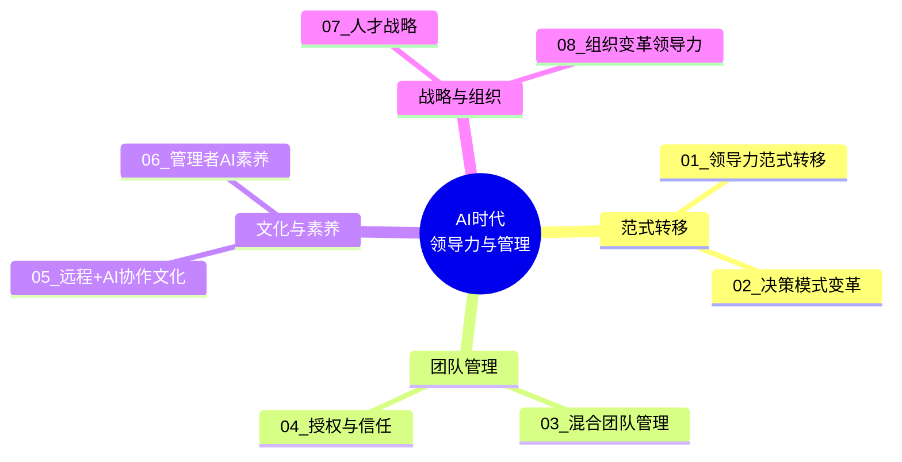
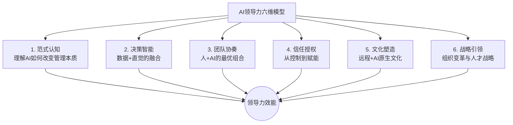
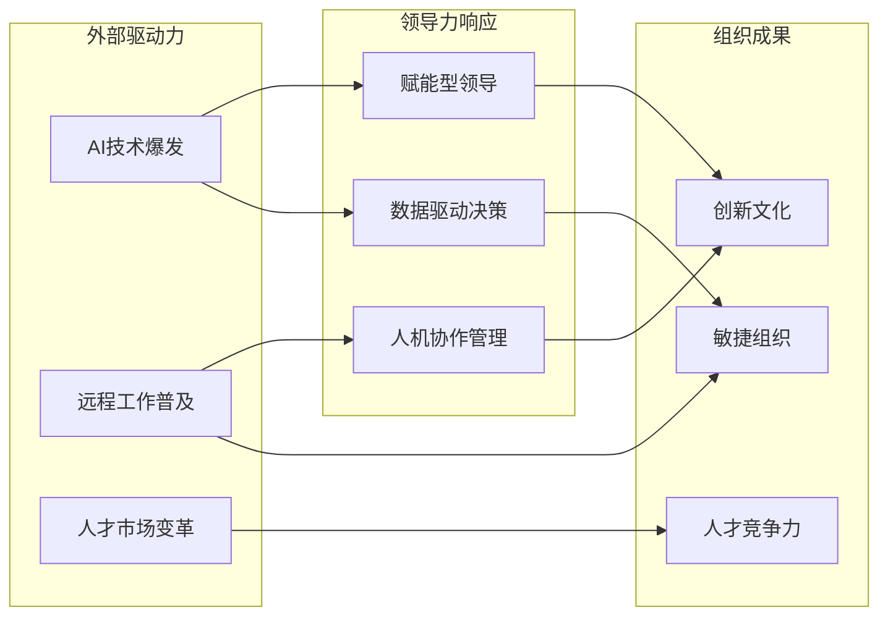

# AI时代领导力与管理中枢 — 全景导航图

> [!key] 核心命题
> AI时代，领导力不再是人管理人，而是人+AI共同创造价值的能力。本知识库系统阐述了从传统管理到AI赋能领导的范式转移，涵盖决策、团队、文化、素养、人才和组织变革六大维度。

---

## 知识库全景图

---

## 文档索引

| 编号 | 文档标题 | 核心主题 | 难度 |
|------|---------|---------|------|
| 01 | [[03-HR人事/AI时代领导力与管理/01_领导力范式转移：从管理到赋能]] | 领导力本质的转变 | 入门 |
| 02 | [[03-HR人事/AI时代领导力与管理/02_决策模式变革：数据驱动与人性判断的平衡]] | AI辅助决策框架 | 进阶 |
| 03 | [[03-HR人事/AI时代领导力与管理/03_混合团队管理：如何带领人+AI的团队]] | 人机协作团队管理 | 核心 |
| 04 | [[03-HR人事/AI时代领导力与管理/04_AI时代的授权与信任：从控制到信任]] | 授权模式变革 | 进阶 |
| 05 | [[03-HR人事/AI时代领导力与管理/05_远程+AI协作文化]] | 分布式文化建设 | 核心 |
| 06 | [[03-HR人事/AI时代领导力与管理/06_管理者AI素养：从会用到善用]] | 管理者能力模型 | 入门 |
| 07 | [[03-HR人事/AI时代领导力与管理/07_人才战略：AI时代如何招聘、培养和留住人才]] | HR与人才战略 | 战略 |
| 08 | [[03-HR人事/AI时代领导力与管理/08_组织变革领导力：引领AI转型的路线图]] | 变革管理 | 战略 |

---

## 核心框架：AI领导力六维模型

---

## 关键概念关系图

---

## 跨知识库链接

本知识库与以下知识库深度关联：

- **[[05-产品与开发/独立开发者生存指南/00_MOC_独立开发者生存指南中枢]]** — 独立开发者同样需要AI领导力，特别是 [[03-HR人事/AI时代领导力与管理/06_管理者AI素养：从会用到善用]] 中的AI素养框架
- **[[01-AI技术/Prompt Engineering深度/00_MOC_Prompt Engineering深度中枢]]** — 管理者需要理解 [[01-AI技术/Prompt Engineering深度/01_Prompt的本质与设计原则]] 才能有效与AI协作
- **[[05-产品与开发/独立开发者生存指南/08_财务与合规：从银行开户到税务申报]]** — 组织变革中的合规考量

---

## 使用指南

> [!tip] 阅读路径建议
> - **新手路径**: 01 → 06 → 03 → 05 → 04 → 02 → 07 → 08
> - **管理者速成**: 06 → 03 → 02 → 08
> - **战略视角**: 08 → 07 → 01 → 04

> [!warning] 重要提醒
> 本知识库的所有内容基于2025-2026年的AI发展态势。AI技术迭代极快，建议每季度回顾一次框架的有效性，特别是 [[03-HR人事/AI时代领导力与管理/02_决策模式变革：数据驱动与人性判断的平衡]] 中的工具与方法论。

---

*最后更新: 2026-07-31*