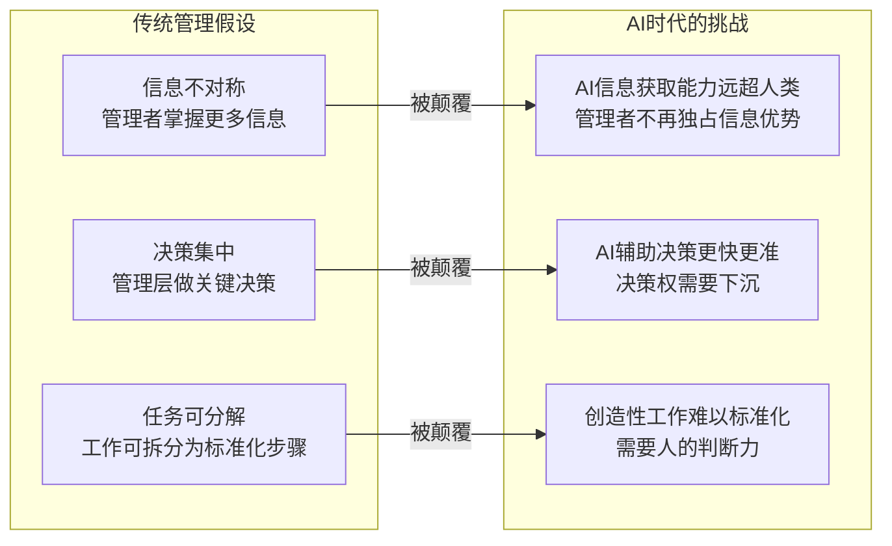
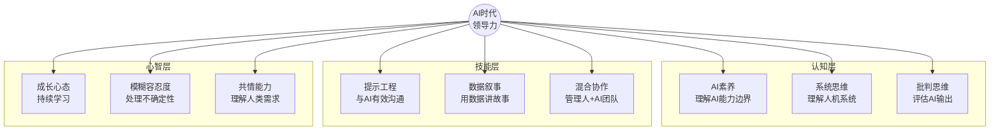

# 领导力范式转移：从管理到赋能

## 为什么AI时代需要不同的领导力？

> [!key] 核心洞察
> 工业时代的管理是"控制论"的产物——管理者掌握信息，通过层级结构下达指令。AI时代，信息不再稀缺，AI可以比任何人类管理者更快、更准确地处理数据。管理者的价值从"知道答案"转向"提出正确的问题"。

传统管理建立在三个假设之上，而这些假设在AI时代正在被逐一瓦解：

---

## 赋能型领导的五个转变

### 1. 从指令到提问

传统管理者习惯于给出答案。赋能型管理者则善于提问——因为AI可以高效执行，但需要人类指明方向。

> [!example] 提问式管理实践
> - 不要说"用数据分析一下用户流失原因"，而要说"我们需要从哪三个维度理解用户流失？你觉得AI能帮我们做什么？"
> - 不要直接分配任务，而是问"基于AI的分析结果，你认为最优的下一步是什么？"

### 2. 从监督到信任

AI可以实时追踪工作进度和产出质量，管理者不再需要"盯着"团队成员。信任成为核心管理资产，参见 [[03-HR人事/AI时代领导力与管理/04_AI时代的授权与信任：从控制到信任]]。

### 3. 从统一到定制

AI让大规模个性化成为可能——包括对员工的成长路径、工作方式和激励手段的个性化设计。管理者需要像[[01-AI技术/Prompt Engineering深度/02_角色扮演：让AI成为特定专家的艺术]]那样，为每个团队成员设计不同的"角色设定"。

### 4. 从稳定到敏捷

AI时代的变化速度要求组织具备高度适应性。管理者需要从"建立流程"转向"建立适应能力"。

### 5. 从权威到连接

管理者的权威不再来自职位，而来自他们连接资源、人和AI的能力。这要求管理者理解[[03-HR人事/AI时代领导力与管理/05_远程+AI协作文化]]中的协作原则。

---

## AI时代领导力的能力模型

> [!tip] 自测清单
> 以下问题可以帮助你评估自己的领导力范式转移程度：
> - 我最近一次向团队提问，而不是给出答案，是什么时候？
> - 我是否清楚AI能做什么、不能做什么？
> - 我的团队是否在自主使用AI工具，还是需要我推动？
> - 我是否建立了允许失败、鼓励实验的文化？

---

## 赋能型领导的日常实践

### 每日三问

赋能型领导每天问自己三个问题：

1. **今天有什么是我可以不做，而让AI或团队做的？**
2. **今天团队中谁需要我的支持，而不是我的指令？**
3. **今天我学到了什么关于AI的新能力？**

### 周度节奏

| 时间 | 活动 | 目的 |
|------|------|------|
| 周一 | AI工具分享会 | 团队成员分享AI使用心得 |
| 周三 | 一对一赋能对话 | 关注成长而非进度汇报 |
| 周五 | 实验回顾 | 复盘本周的AI实验和失败 |

---

## 与现有管理理论的融合

赋能型领导并非完全抛弃传统管理理论，而是在其基础上进化：

- **情境领导力**：在AI时代，情境判断更加重要——何时让AI做决定，何时由人类干预
- **变革型领导**：AI放大了变革型领导的影响力，因为AI可以放大愿景沟通的触达范围
- **服务型领导**：赋能本质上就是服务——为团队提供AI工具、培训和资源

> [!warning] 常见误区
> 赋能不等于放任不管。赋能型领导在以下方面需要更严格：
> - AI输出的质量和安全性审核
> - 团队成员的AI使用伦理
> - 人机协作的边界设定

---

## 与相关知识的联动

- [[03-HR人事/AI时代领导力与管理/06_管理者AI素养：从会用到善用]] 详细阐述了管理者需要掌握的具体AI技能
- [[03-HR人事/AI时代领导力与管理/03_混合团队管理：如何带领人+AI的团队]] 探讨了如何在实际工作中管理人+AI团队
- [[05-产品与开发/独立开发者生存指南/01_独立开发者的心智模型：从副业到主业的转型]] 中关于成长心态的讨论与本篇的赋能理念一脉相承

---

*最后更新: 2026-07-31*