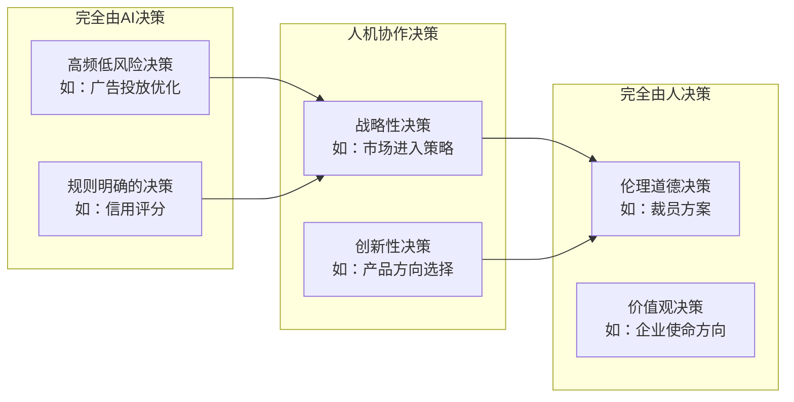
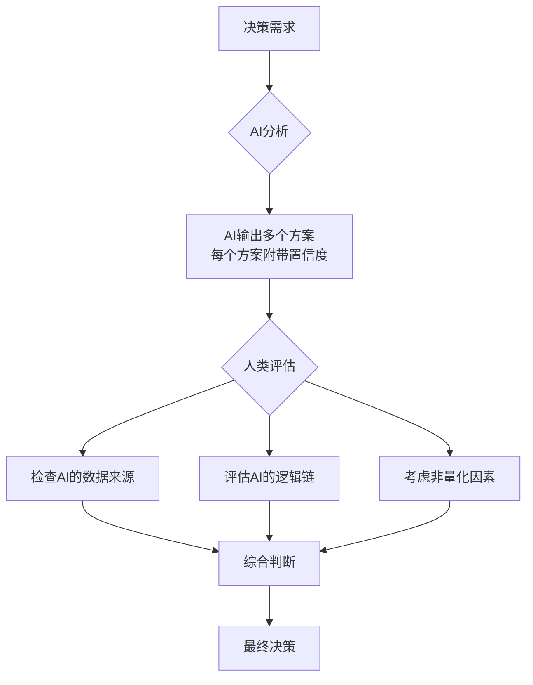
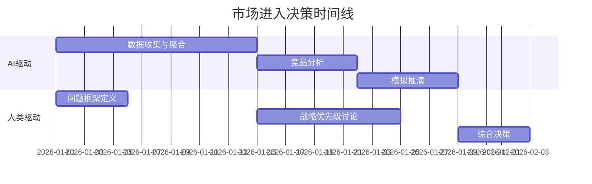

# 决策模式变革：数据驱动与人性判断的平衡

## AI时代的决策困境

> [!key] 核心洞察
> AI可以处理海量数据、发现隐藏模式、预测未来趋势，但它无法回答"什么是对的"——这是价值判断的领域。AI时代优秀决策者的核心能力，是在数据洞察和人性判断之间找到最佳平衡点。

### 决策光谱



---

## AI辅助决策的RAPID框架（升级版）

传统的RAPID决策框架在AI时代需要升级：

| 角色 | 传统含义 | AI时代升级 |
|------|---------|-----------|
| **R**ecommend | 建议者提供分析 | AI+人类共同生成建议 |
| **A**gree | 审批者同意 | AI模拟不同方案后果 |
| **P**erform | 执行者行动 | AI自动化执行或辅助 |
| **I**nput | 输入信息 | AI实时数据聚合 |
| **D**ecide | 决策者拍板 | **人类保留最终决策权** |

> [!tip] 决策分级原则
> 对于不同类型的决策，AI的参与程度应有所不同：
> - **Level 1**：AI建议，人决定（战略决策）
> - **Level 2**：AI决定，人监督（运营决策）
> - **Level 3**：AI自动执行（标准化决策）

---

## 数据驱动决策的陷阱

### 1. 数据幻觉

AI生成的分析可能看起来非常合理，但本质上是概率性输出。管理者需要具备[[01-AI技术/Prompt Engineering深度/01_Prompt的本质与设计原则]]中提到的批判性思维。

### 2. 过度优化

AI可能优化局部指标而牺牲整体目标。例如，AI推荐的最优定价策略可能短期提升利润但损害品牌价值。

### 3. 确认偏差放大

如果管理者有偏好，他们可能会用AI来"验证"自己的偏见，而不是真正探索真理。



---

## 人机协作决策四步法

### 第一步：问题框架化

在向AI求助之前，先自己定义问题框架。这需要管理者运用[[03-HR人事/AI时代领导力与管理/01_领导力范式转移：从管理到赋能]]中提到的提问能力。

> [!example] 问题框架模板
> ```
> 问题背景：...
> 决策目标：...
> 约束条件：...
> 需要AI提供：...
> 人类将负责：...
> ```

### 第二步：多视角分析

利用AI从不同角度分析问题，就像[[01-AI技术/Prompt Engineering深度/02_角色扮演：让AI成为特定专家的艺术]]中让AI扮演不同角色。

### 第三步：批判性评估

对AI的输出进行系统性质疑：
- 数据来源是否可靠？
- 分析逻辑是否存在漏洞？
- 是否有被忽略的变量？
- 结果是否违背常识？

### 第四步：综合决策

将AI的分析与人类判断结合，做出最终决策。

---

## 实战案例：市场进入决策

> [!example] 案例场景
> 一家中型SaaS公司考虑进入东南亚市场。CEO使用AI辅助决策框架进行分析。

**AI贡献的部分：**
- 市场规模数据聚合与分析
- 竞品格局的自动监控
- 定价策略的模拟推演
- 进入路径的风险评估

**人类贡献的部分：**
- 确定公司的战略优先级（增长vs盈利）
- 判断当地文化的适配性
- 选择合作伙伴的直觉判断
- 最终进入时间点的决策



---

## 决策质量评估框架

| 维度 | 评估标准 | AI能做的 | 人类必须做的 |
|------|---------|---------|------------|
| 准确性 | 决策结果是否达到预期 | 预测和模拟 | 定义"好"的标准 |
| 速度 | 决策耗时 | 快速生成方案 | 把握节奏，避免冲动 |
| 包容性 | 是否考虑了多元视角 | 扩展分析维度 | 确保价值观一致 |
| 可解释性 | 决策逻辑是否清晰 | 提供推理过程 | 向利益相关者沟通 |
| 可逆性 | 决策能否撤销 | 评估风险敞口 | 决定风险承受度 |

> [!warning] 风险提示
> 过度依赖AI决策可能导致"决策肌肉萎缩"——管理者的直觉和判断力会因缺乏使用而退化。建议定期进行"无AI决策演练"，保持人类的决策敏锐度。

---

## 跨知识库关联

- [[01-AI技术/Prompt Engineering深度/03_思维链与推理引导：引导AI思考的进阶技巧]] 提供了让AI进行更深入推理的方法
- [[05-产品与开发/独立开发者生存指南/02_Idea筛选与验证：做什么比怎么做更重要]] 中的验证框架与本篇的决策方法互补
- [[03-HR人事/AI时代领导力与管理/08_组织变革领导力：引领AI转型的路线图]] 中的变革决策场景

---

*最后更新: 2026-07-31*