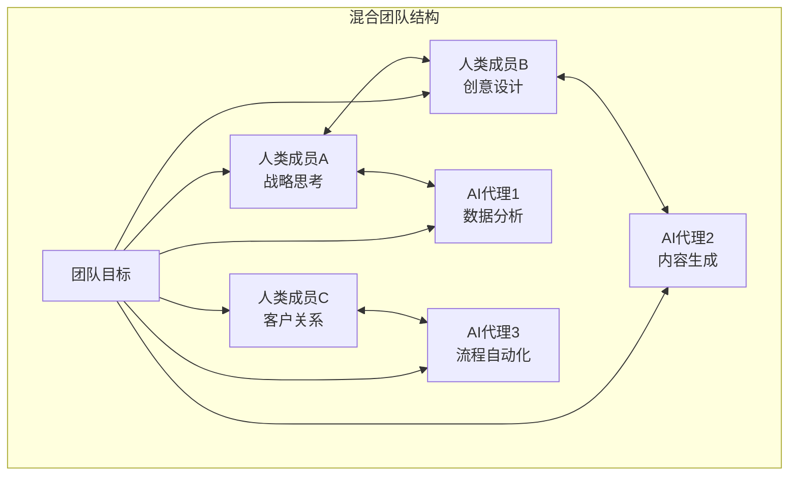
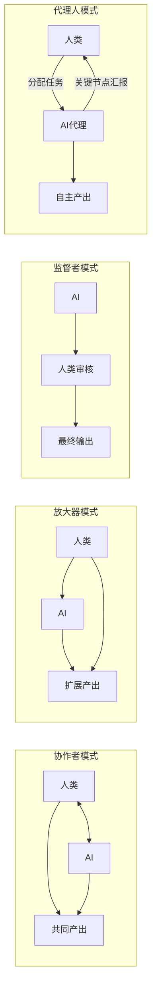
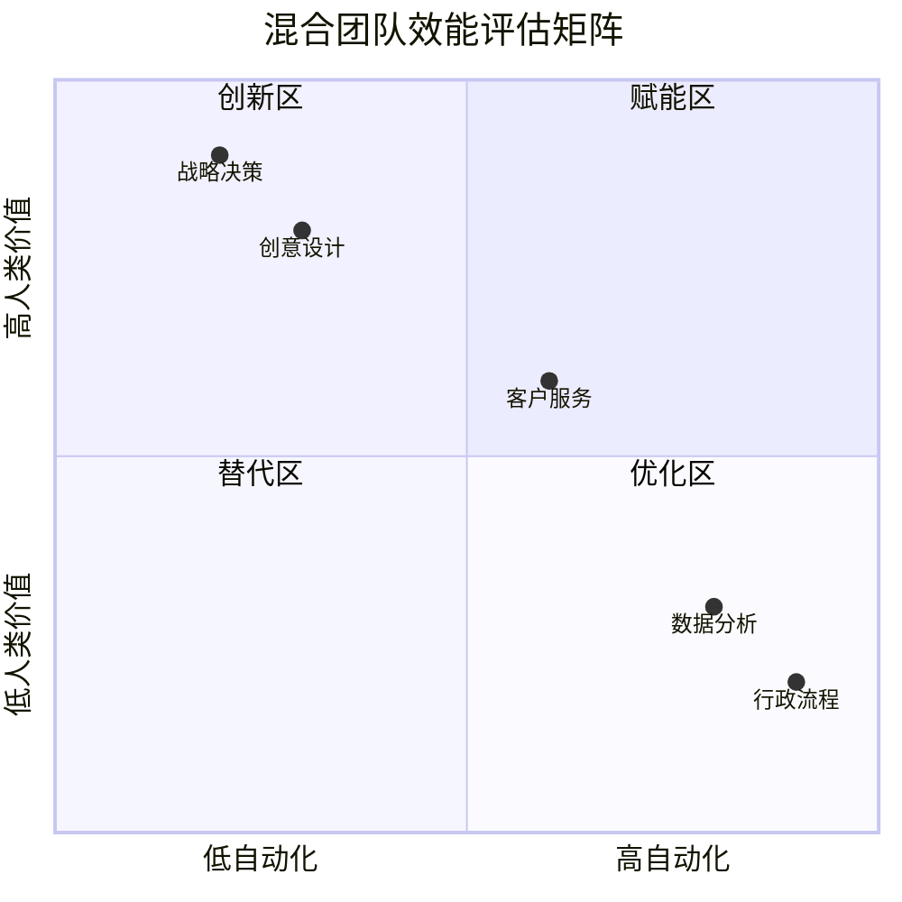

# 混合团队管理：如何带领人+AI的团队

## 什么是混合团队？

> [!key] 核心洞察
> 混合团队（Hybrid Team）是指由人类成员和AI代理（AI Agent）共同组成的协作单元。到2026年，超过60%的知识工作者团队至少包含一个AI成员。管理者面临的挑战不再是"要不要用AI"，而是"如何让人类和AI协同工作"。

---

## 混合团队的四种工作模式

### 1. 协作者模式（Collaborator）

AI作为平等的协作者，与人类共同完成任务。这种模式适用于创意性工作，如产品设计、策略制定。

### 2. 放大器模式（Amplifier）

AI扩展人类的能力边界，让一个人能完成过去需要多人完成的工作。这种模式在[[05-产品与开发/独立开发者生存指南/00_MOC_独立开发者生存指南中枢]]中有广泛讨论。

### 3. 监督者模式（Supervisor）

人类扮演"人在回路中"的角色，监督AI的工作质量。适用于需要高可靠性的场景。

### 4. 代理人模式（Delegate）

人类分配任务给AI代理，AI代理自主完成并在关键节点汇报。适用于标准化流程。

---

## 混合团队管理的核心原则

### 原则1：明确角色边界

每个团队成员（人类和AI）都需要清晰的职责边界。

> [!tip] 角色定义模板
> 对于每个AI代理，定义：
> - **职责范围**：它能做什么，不能做什么
> - **决策权限**：哪些决策可以自主，哪些需要人类确认
> - **汇报机制**：何时、如何向人类汇报
> - **失败预案**：AI出错时怎么办

### 原则2：设计交接协议

人机之间的任务交接是混合团队最脆弱的环节。需要建立清晰的交接协议，就像[[03-HR人事/AI时代领导力与管理/05_远程+AI协作文化]]中提到的异步协作协议。

### 原则3：管理"AI偏见"

AI有它自己的"偏见"——训练数据的偏差、模型架构的限制。管理者需要了解这些偏见，并像[[03-HR人事/AI时代领导力与管理/02_决策模式变革：数据驱动与人性判断的平衡]]中讨论的那样，用人类判断来平衡。

### 原则4：建立共同语言

人类和AI需要有效的沟通方式。这要求团队成员掌握[[01-AI技术/Prompt Engineering深度/01_Prompt的本质与设计原则]]中的提示工程技能。

---

## 混合团队效能评估

---

## 实战管理技巧

### 1. 为AI成员设定"个性"

就像[[01-AI技术/Prompt Engineering深度/02_角色扮演：让AI成为特定专家的艺术]]中讨论的，为团队中的AI代理设定明确的角色和"个性"，让团队成员清楚如何与它们互动。

### 2. 定期"人机回顾"

在团队回顾会议中，特别加入"人机协作效率"的议题：
- AI这次做得好的是什么？做得不好的呢？
- 人类对AI的信任度如何？
- 交接过程中有什么摩擦？

### 3. 建立AI使用文化

> [!example] 文化实践
> - **AI周报**：每个成员分享本周AI使用心得
> - **AI失败墙**：鼓励分享AI出错案例，帮助团队学习
> - **AI技能交换**：团队成员互相教授AI使用技巧

### 4. 冲突管理

混合团队中的冲突可能发生在：
- 人类之间：对AI的依赖程度不同
- 人机之间：AI输出与人类预期不符
- 角色竞争：人类担心被AI取代

> [!warning] 冲突信号
> 当团队成员开始"绕过"AI代理、频繁修改AI输出、或拒绝使用AI工具时，说明混合团队的健康度出现了问题。参见 [[03-HR人事/AI时代领导力与管理/04_AI时代的授权与信任：从控制到信任]] 中的信任重建策略。

---

## 混合团队演进路径

| 阶段 | 特征 | 管理者角色 | 典型挑战 |
|------|------|-----------|---------|
| 探索期 | 个别成员尝试使用AI | 鼓励者 | 使用不平等 |
| 整合期 | AI工具正式纳入流程 | 设计师 | 流程冲突 |
| 优化期 | AI代理开始自主工作 | 教练 | 信任建立 |
| 共生期 | 人机无缝协作 | 愿景家 | 创新停滞 |

---

## 跨知识库联动

- [[03-HR人事/AI时代领导力与管理/04_AI时代的授权与信任：从控制到信任]] 深入探讨了在混合团队中如何建立信任
- [[03-HR人事/AI时代领导力与管理/05_远程+AI协作文化]] 讨论了混合团队与远程工作的交集
- [[05-产品与开发/独立开发者生存指南/03_MVP开发策略：最小可行产品的最优路径]] 中的敏捷方法可以应用于混合团队的工作流程

---

*最后更新: 2026-07-31*