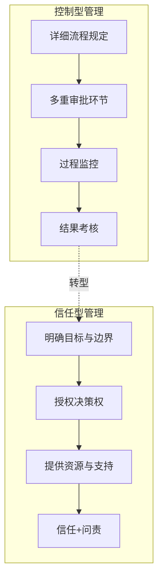
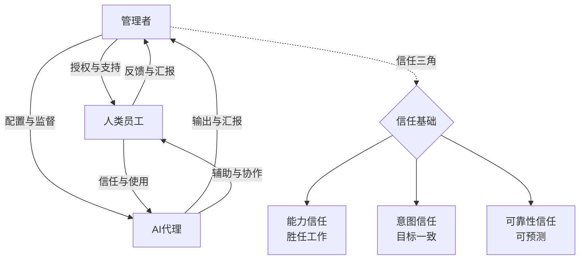
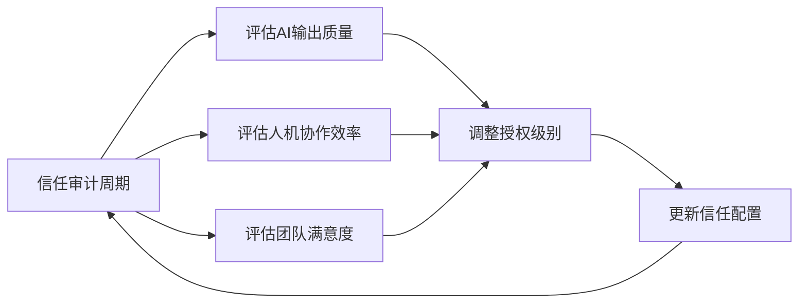

# AI时代的授权与信任：从控制到信任

## 控制型管理的终结

> [!key] 核心洞察
> 传统管理建立在"控制"之上——管理者通过流程、审批、监督来确保结果。但AI时代的三个特性使控制型管理失效：**信息不对称反转**（AI比管理者更了解工作细节）、**速度要求**（层层审批过于缓慢）、**创造力需求**（控制扼杀创新）。管理者必须从"控制系统"转向"建立信任"。

---

## AI时代的信任框架

### 信任三角模型

在AI时代，信任关系从"管理者-员工"的二元关系，扩展为"管理者-员工-AI"的三角关系：

### 三级授权体系

| 授权级别 | 适用场景 | AI的自主权 | 人类监督频率 | 典型示例 |
|---------|---------|-----------|------------|---------|
| **L1: 完全透明** | 高风险/创新任务 | 仅提供建议 | 实时 | 战略决策支持 |
| **L2: 定期校准** | 中等复杂度任务 | 自主执行+定期汇报 | 每日/每周 | 数据分析报告 |
| **L3: 完全授权** | 低风险/标准化任务 | 完全自主 | 按例外管理 | 自动回复邮件 |

> [!tip] 授权原则
> 授权不是"全有或全无"的决定。应该从L1开始，随着信任建立逐步升级到L3。同时建立"降级机制"——当AI表现不稳定时，自动降级到更低授权级别。

---

## 建立对AI的信任

### 信任的四个支柱

让人类团队成员信任AI代理，需要系统性地建立以下四个支柱：

**1. 透明度（Transparency）**
AI代理的工作方式需要可理解。如果团队成员不理解AI为什么得出某个结论，他们就不会信任它。

> [!example] 透明度实践
> - AI的输出附带"推理链"（类似[[01-AI技术/Prompt Engineering深度/03_思维链与推理引导：引导AI思考的进阶技巧]]中的CoT技术）
> - 定期组织"AI决策复盘"——让AI展示其决策逻辑
> - 建立AI能力的"已知边界"文档

**2. 可靠性（Reliability）**
AI的输出需要一致可预测。随机表现是信任的杀手。

**3. 可纠正性（Correctability）**
当AI出错时，团队成员需要能够轻松纠正它，并且看到AI从错误中学习。

**4. 价值对齐（Value Alignment）**
AI的行为需要与团队价值观一致。这需要管理者在配置AI时明确价值观约束。

---

## 建立对人类的信任（在AI辅助下）

有趣的是，AI也可以帮助管理者更好地信任团队成员：

### 1. 数据驱动的信任

AI可以提供客观的绩效数据，减少管理者主观判断的偏见。当管理者看到基于数据的表现时，更容易建立基于事实的信任。

### 2. 早期预警系统

AI可以提前发现团队成员的"倦怠信号"或"脱轨信号"，让管理者在问题恶化前主动介入。

### 3. 个性化支持

AI可以帮助管理者了解每个成员的工作风格和偏好，从而提供更精准的授权——对有些人需要更多指导，对有些人需要更多自主权。

---

## 信任的边界：何时不该信任

> [!warning] 信任的警示信号
> 以下情况表明信任需要被重新评估：
> - AI代理在关键决策上的错误率超过阈值
> - 团队成员开始系统性绕过AI工具
> - AI输出存在显著偏见或安全问题
> - 人类成员利用AI信任体系逃避责任

### 建立"信任审计"机制

---

## 从控制到信任的转型路线图

### 第一阶段：透明化（1-2个月）

- 记录所有AI代理的决策过程
- 建立AI能力目录
- 培训团队理解AI的工作原理

### 第二阶段：实验性授权（2-4个月）

- 选择低风险任务进行L3授权实验
- 建立"快速降级"的安全机制
- 收集信任数据

### 第三阶段：系统化信任（4-6个月）

- 建立完整的授权体系
- 将信任机制融入绩效管理
- 推广最佳实践

### 第四阶段：信任文化（6个月+）

- 信任成为组织文化的一部分
- 新成员快速融入信任体系
- 持续优化信任模型

---

## 案例：从审批制到信任制

> [!example] 转型案例
> 某科技公司的市场部传统上需要3层审批才能发布内容。引入AI辅助后：
> 1. **第一阶段**：AI生成内容草案，人类审核
> 2. **第二阶段**：AI自主发布日常内容，仅战略性内容需要审批
> 3. **第三阶段**：AI负责80%的内容发布，人类专注于策略和创意
> 
> **结果**：内容产量提升3倍，发布周期从3天缩短到2小时，团队满意度提升40%。

---

## 跨知识库链接

- [[03-HR人事/AI时代领导力与管理/03_混合团队管理：如何带领人+AI的团队]] 讨论了信任在混合团队中的具体应用
- [[03-HR人事/AI时代领导力与管理/05_远程+AI协作文化]] 探讨了远程环境下如何建立信任
- [[05-产品与开发/独立开发者生存指南/04_定价与商业模式：独立开发者如何赚钱]] 中的自主决策理念与本篇的授权原则一致

---

*最后更新: 2026-07-31*